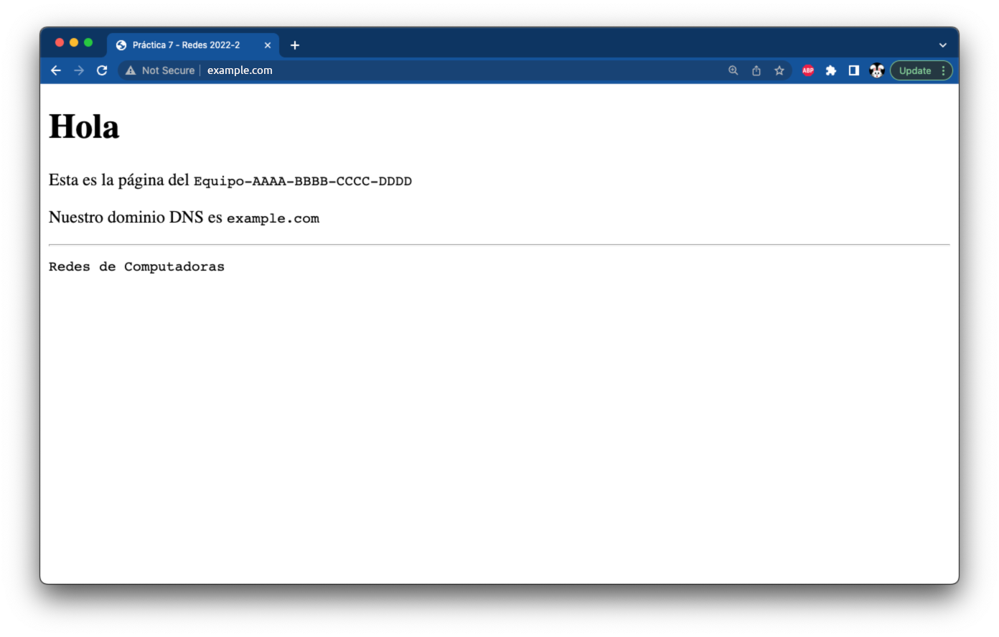

# Instalación y configuración de Apache HTTPD

## Instalación de Apache HTTPD

Instala el paquete `apache2` en el equipo

```
root@example:~# apt -qy update
root@example:~# apt -qy install apache2
```

Revisa el estado del servicio

```
root@example:~# systemctl status apache2
● apache2.service - The Apache HTTP Server
     Loaded: loaded (/lib/systemd/system/apache2.service; enabled; vendor preset: enabled)
     Active: active (running) since Sun 2022-05-29 02:03:39 CDT; 12s ago
       Docs: https://httpd.apache.org/docs/2.4/
    Process: 16384 ExecStart=/usr/sbin/apachectl start (code=exited, status=0/SUCCESS)
   Main PID: 16385 (apache2)
      Tasks: 55 (limit: 1074)
     Memory: 9.9M
        CPU: 28ms
     CGroup: /system.slice/apache2.service
             ├─16385 /usr/sbin/apache2 -k start
             ├─16386 /usr/sbin/apache2 -k start
             └─16387 /usr/sbin/apache2 -k start

May 29 02:03:39 Debian-Redes systemd[1]: Starting The Apache HTTP Server...
May 29 02:03:39 Debian-Redes systemd[1]: Started The Apache HTTP Server.
```

Revisa que Apache escuche en el puerto `80`

```
root@example:~# netstat -ntulp | grep apache2
tcp6	0	0	:::80	:::*	LISTEN	16384/apache2

root@example:~# apachectl -S
VirtualHost configuration:
*:80                   example.com (/etc/apache2/sites-enabled/000-default.conf:1)
	...
```

!!! note
    - Puede que aparezca `127.0.0.1` o el nombre DNS inverso del equipo en lugar de `example.com`  en la salida de `apachectl -S`

## Configuración de `ServerName`

Configura la directiva `ServerName` en `/etc/apache2/conf-available/servername.conf`

```
ServerName  example.com
```

Habilita la configuración extra y recarga el servicio

```
root@example:~# a2enconf servername

root@example:~# apachectl -t
Syntax OK

root@example:~# systemctl reload apache2
```

## Página de índice para el **VirtualHost** predeterminado

- Crea la página de inicio del **VirtualHost** `_default_` para HTTP y HTTPS con el siguiente contenido en el archivo `/var/www/html/index.html`

!!! note
    - Reemplaza `Equipo-AAAA-BBBB-CCCC-DDDD` con el identificador de tu equipo
    - Reemplaza `example.com` con el nombre de dominio

```html
<!DOCTYPE HTML>
<html>
  <head>
    <meta charset="UTF-8">
    <title>Práctica 7 - Redes 2022-2</title>
    <link href="data:image/x-icon;base64," rel="icon" type="image/x-icon" />
  </head>
  <body>
    <h1>Hola</h1>
    <div>
      <p>Esta es la página del <code>Equipo-AAAA-BBBB-CCCC-DDDD</code></p>
      <p>Nuestro dominio DNS es <code>example.com</code></p>
    </div>
    <hr/>
    <code>Redes de Computadoras</code>
  </body>
</html>
```

!!! note
    - Puedes poner otra página `index.html` siempre y cuando muestre la información solicitada

Revisa con un navegador web que el servidor responda con la dirección IP y el nombre de dominio

- `http://20.213.120.169/`
- `http://example.com/`
- `http://www.example.com/`

| VirtualHost predeterminado para el servidor
|:-------------------------------------------:|
| 

--------------------------------------------------------------------------------

## Configuración de seguridad para Apache HTTPD

Edita el archivo de configuración para configurar las directivas básicas de seguridad

```
root@example:~# cd /etc/apache2

root@example:/etc/apache2# vim conf-available/security.conf
```

Ubica estas directivas y realiza los cambios pertinentes

```
ServerTokens ProductOnly
ServerSignature Off
TraceEnable Off
```

!!! warning
    - Explica en [tu reporte](../#entregables) por qué se recomienda establecer esos valores en las directivas

```
<DirectoryMatch "/\.git">
   Require all denied
</DirectoryMatch>
```

!!! warning
    - Explica en [tu reporte](../#entregables) qué es lo que hace este bloque `DirectoryMatch`

!!! note
    Te invitamos a leer la [documentación de Apache HTTPD][apache-docs]

Habilita la configuración, revisa la sintaxis y recarga el servicio

```
root@example:/etc/apache2# a2enconf security

root@example:/etc/apache2# apachectl -t
Syntax OK

root@example:/etc/apache2# systemctl reload apache2

root@example:/etc/apache2# apachectl -S
*:80                   is a NameVirtualHost
         default server example.com (/etc/apache2/sites-enabled/000-default.conf:1)
	...
```

--------------------------------------------------------------------------------

## Verifica la configuración

Reinicia el equipo para verificar que los cambios sean persistentes

```
root@example:~# reboot
```

!!! danger
    - Verifica que **TODAS** las configuraciones que hiciste estén presentes respués de reiniciar la máquina antes de continuar con la siguiente sección

!!! note
    - Continúa en [la siguiente página](../ssl-lets-encrypt) si Apache HTTPD ya está instalado y realizaste la configuración básica

--------------------------------------------------------------------------------

[apache-docs]: https://httpd.apache.org/docs/2.4/
