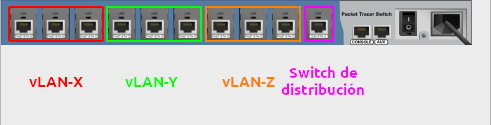
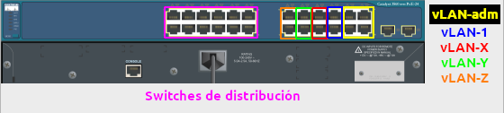

# Práctica 2: Configuración de VLAN en switches administrables

--------------------------------------------------------------------------------

## Objetivo

- El alumno configurará diferentes vLAN en los switches administrables para dividir los dominios de broadcast de la infraestructura red de un edificio completo.

## Elementos de apoyo

- [Video de la teoría de vLAN 802.1q 📼][video-vlan-802.1q]
- [Video de configuración de vLAN 802.1q en Packet Tracer 📼][video-configuracion-vlan]

## Restricciones

- La fecha límite de entrega es el **lunes 19 de septiembre de 2022** a las 23:59 horas
- Esta actividad debe ser entregada **en equipo** de acuerdo al [flujo de trabajo para la entrega de tareas y prácticas][flujo-de-trabajo]
    - Utilizar el escenario de Packet Tracer creado para la [práctica 1](../practica-1)
    - Utilizar la carpeta `docs/practicas/practica-2/Equipo-ABCD-EFGH-IJKL-MNOP` para entregar la práctica
        - Donde `Equipo-ABCD-EFGH-IJKL-MNOP` representa el nombre del equipo que debió anotarse previamente en la [lista del grupo][lista-redes]
    - Crear un _merge request_ en el [repositorio de tareas][repo-tareas] para entregar la actividad

## Procedimiento

- Decidir los equipos cliente que estarán en cada vLAN (PC, laptop, servidor, impresora)
- Agregar las vLAN en la base de datos interna de cada switch
- Utilizar la vLAN 1 para los access points y los clientes de la red inalámbrica
- Configurar los puertos de cada switch como troncales o puertos de accceso según sea el caso
- Configurar cada switch de acceso para que maneje 3 diferentes vLAN (ver diagrama)
- Configurar cada switch de acceso de tal manera que tenga 3 puertos en una misma vLAN (ver diagrama)

| Puertos del switch de acceso con diferentes vLAN |
|:--------------------------------------:|
| 

- Utilizar una vLAN para la administración de todos los equipos de red, esta vLAN no debe ser configurada en los puertos de los switches de acceso, pero si debe ser configurada en el switch multicapa

- Configurar un switch multicapa con la opción de _inter-vLAN routing_ para comunicar las diferentes vLAN a nivel de capa 3
- Configurar un _pool_ de DHCP para cada vLAN en el switch multicapa para que los clientes obtengan su dirección IP de manera automática
- Configurar una dirección IP estática para cada interfaz vLAN en cada switch

| Puertos del switch multitcapa con diferentes vLAN |
|:-------------------------------------------------:|
| 

- Utilizar el segmento de red privada `192.168.X.Y/24` (máscara de subred `255.255.255.0`), asignar `X` al número de la vLAN para que sea más fácil identificar a los equipos
- Verificar la conectividad de los equipos de red de una misma vLAN y que el ruteo entre vLAN esté habilitado

!!! note
    Esta práctica únicamente contempla la conectividad entre las diferentes VLAN, por lo que no es necesario agregar ningún ruteador.

## Entregables

- Archivo `README.md`
    - Explicación de la topología de red utilizada.
        - Utilizar los equipos de red de tipo "Packet Tracer" (Switch-PT, AccessPoint-PT)
        - Utilizar el equipo `3560-24PS` o `3650-24PS` para el switch multicapa
        - Utilizar PC, laptops, impresoras y servidores como clientes conectados por cable
        - Utilizar tablets y smartphones como clientes conectados de manera inalámbrica
    - Crear una tabla que especifique cuales equipos (o grupos de equipos) están en que vLAN
    - Crear la tabla de conexión de cada switch utilizando la salida del comando `show cdp neighbors`
    - Obtener la lista de direcciones IP de cada equipo con el comando `show ip interface brief`
    - Obtener la tabla de ruteo del switch multicapa con el comando `show ip route`
    - Listar las imágenes con su respectiva descripción
    - Incluir las tablas arriba mencionadas y pruebas de conectividad con `PING` **en el texto** del archivo `README.md`

- Carpeta `img`
    - Imagen de la topología de red implementada donde se resalten las diferentes vLAN que se configuraron

- Carpeta `files`
    - Archivo de la actividad en formato `PKT` (Packet Tracer)
    - Configuración de cada switch administrable
        - Crear una carpeta para cada tipo de switch (`Switches-Acceso`, `Switches-Distribucion`, `Switch-Core`)
        - Hacer que la configuración sea persistente con el comando
            - `copy  running-config  startup-config`
        - Guardar la salida del comando `show startup-config` a un archivo de texto (ej. `Switch-1.txt`)
        - Repetir para cada switch administrable

## Extra

Elaboren un video donde expliquen qué edificio se eligió, la topología de red utilizada y se realicen las pruebas de conectividad.

- Subir el video a YouTube
- Agregar la referencia de este video al archivo `README.md`

```text
- [Video de la topología de red utilizada 📼](https://youtu.be/0123456789ABCDEF)
```

--------------------------------------------------------------------------------

[flujo-de-trabajo]: https://redes-ciencias-unam.gitlab.io/2023-1/tareas-redes/workflow/
[repo-tareas]: https://gitlab.com/Redes-Ciencias-UNAM/2023-1/tareas-redes/-/merge_requests

[lista-redes]: https://tinyurl.com/Lista-Redes-2023-1

[video-vlan-802.1q]: https://www.youtube.com/watch?v=WspQ7R6Xk1M
[video-configuracion-vlan]: https://www.youtube.com/watch?v=1dqTDqt92pY
