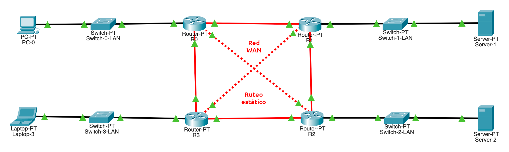

# Práctica 3: Configuración de _routers_

--------------------------------------------------------------------------------

## Objetivo

El alumno creará un escenario de red y configurará rutas estáticas para simular la interacción entre varias redes.

## Elementos de apoyo

- [Video de la creación de una red en Packet Tracer 📼][video-packet-tracer]
- [Cálculo de subredes con `ipcalc`][video-ipcalc]
- [Configuración de ruteo estático 📝][ruteo-estatico]
- [Prácticas de Packet Tracer 📖][practicas-cisco]
    - **Lab 4-5**: _Performing Initial Router Startup_ (_p19_)
    - **Lab 4-6**: _Performing Initial Router Configuration_ (_p22_)
    - **Lab 4-7**: _Enhancing the Security of Initial Router Configuration_ (_p24_)

## Restricciones

- La fecha límite de entrega es el **miércoles 28 de septiembre de 2022** a las 23:59 horas
- Esta actividad debe ser entregada **en equipo** de acuerdo al [flujo de trabajo para la entrega de tareas y prácticas][flujo-de-trabajo]
    - Utilizar la carpeta `docs/practicas/practica-3/Equipo-ABCD-EFGH-IJKL-MNOP` para entregar la práctica
        - Donde `Equipo-ABCD-EFGH-IJKL-MNOP` representa el nombre del equipo que debió anotarse previamente en la [lista del grupo][lista-redes]
    - Hacer un _merge request_ a la rama `practica-3` del [repositorio de tareas][repo-tareas] para entregar la actividad

## Procedimiento

- Crea un escenario donde se conecten varias redes de distintas dependencias de la UNAM
- Conecta 4 routers para simular varias dependencias universitarias
- Establece una topología (punto a punto, anillo, malla, etc.) para conectar las distintas redes y justifica por qué la implementaste

- **Establece rutas estáticas entre los ruteadores de cada red**
- Utiliza interfaces **GigabitEthernet** para las redes **WAN** (<span style="color: red; font-weight: bold;">rojo</span>)
- Utiliza interfaces **FastEthernet** para las redes **LAN** (<span style="color: black; font-weight: bold;">negro</span>)

- Configura una contraseña para entrar al modo privilegiado `exec`
- Configura la administración por SSH en cada router
- Deshabilita `telnet` y la consola web

- Elige algún segmento de red [**TEST-NET**][ipv4-reserved-addresses] (`192.0.2.0/24`, `198.51.100.0/24` o `203.0.113.0/24`) para las redes **WAN** (<span style="color: red; font-weight: bold;">rojo</span>) y subdividelo de tal manera que puedas hacer conexiones punto a punto con máscara de red `/30` o `/31` entre los ruteadores
    - Puedes utilizar [el comando `ipcalc`][man-ipcalc] para calcular las subredes
        - Dirección de la red
        - Máscara de subred
        - Rango de hosts

- Configura direcciones IP estáticas para la red **LAN** (<span style="color: black; font-weight: bold;">negro</span>)

- Configura **rutas estáticas** para interconectar las redes **WAN** (<span style="color: red; font-weight: bold;">rojo</span>)

- Conecta un switch y una laptop en la red **LAN** (<span style="color: black; font-weight: bold;">negro</span>), utiliza el direccionamiento `192.168.X.0/24`
    - Donde `X` varía entre cada una de las redes **LAN** (<span style="color: black; font-weight: bold;">negro</span>) de cada dependencia universitaria

- Configura los switches de la red **LAN** (<span style="color: black; font-weight: bold;">negro</span>)
    - Interfaces de red
    - Dirección IP de administración (estática)
    - Establece el gateway con la dirección IP del ruteador para ese segmento de red
<!--
    - Utiliza la vLAN predeterminada (vLAN 1) para conectar a todos los equipos de las redes **LAN** (<span style="color: black; font-weight: bold;">negro</span>) y **WAN** (<span style="color: red; font-weight: bold;">rojo</span>)
-->

### Diagrama de red

| Diagrama de red en Packet Tracer |
|:-----------------------------:|
| 
| Redes: <span style="color: red; font-weight: bold;">WAN: rojo</span> , <span style="color: black; font-weight: bold;">LAN: negro</span>
| Conecta <u>3 o más redes</u> para simular varias dependencias universitarias
| Las <span style="color: red; font-weight: bold;">líneas rojas</span> dependen de la topología que elija el equipo para interconectar los routers
<!-- -->

!!! note
    No se contempla el uso de vLAN `802.1q` ni vLAN anidadas `802.1ad` (_Q-in-Q_) por lo que no se deben de configurar puertos troncales (trunk)

### Pruebas de conectividad

Contemplar las siguientes consideraciones para las pruebas de conectividad:

- Todos los clientes de todas las redes **LAN** (<span style="color: black; font-weight: bold;">negro</span>) pueden comunicarse entre sí
- Todos los clientes pueden alcanzar a todos los ruteadores y switches sin importar la red donde se encuentren

## Entregables

- Archivo `README.md`
    - Tabla donde se listen los equipos, nombre de host, dirección IP de administración y la conexión con otros switches y ruteadores
        - Considera utilizar los siguientes comandos y pegar la salida en lugar de hacer las tablas a mano
        - `show cdp neighbors`
        - `show ip arp`
        - `show ip interface brief`
        - `show ip route`
        - `show ip route summary`
        - `show ip dhcp` (si se elabora la sección extra)
    - Listar las imágenes con su respectiva descripción
    - Crear ligas hacia los archivos en la carpeta `files` cuando sean mencionados
    - Salida de las pruebas de conectividad entre los equipos **en texto**
    - Explicación de la topología de red utilizada.
        - La simulación de la red **LAN** (<span style="color: black; font-weight: bold;">negro</span>) es una versión simplificada de la red interna de una dependencia universitaria para fines ilustrativos

- Carpeta `img`
    - Imagen de la topología de red implementada
    - Demás imágenes que se consideren necesarias para el reporte

- Carpeta `files`
    - Archivo de la actividad en formato `PKT` (Packet Tracer)
    - Configuración de cada switch y ruteador
        - Hacer que la configuración sea persistente con el comando
            - `copy  running-config  startup-config`
        - Guardar la salida del comando `show startup-config` a un archivo de texto (ej. `Router-1.txt` o `Switch-LAN-1.txt`)
        - Repetir para cada equipo de red (switches y ruteadores)

## Extra

- Habilita el servicio de DHCP en el ruteador para la red **LAN** (<span style="color: black; font-weight: bold;">negro</span>) de tal manera que los clientes obtengan su dirección IP utilizando este mecanismo
    - Recuerda que los switches tienen **direccionamiento estático**
    - El servicio de DHCP debe proporcionar a los clientes la dirección IP del ruteador de la red **LAN** (<span style="color: black; font-weight: bold;">negro</span>) como _gateway_ para establecer la ruta predeterminada

<!--
- Configura el servicio de NAT en el ruteador para la red **LAN** (<span style="color: black; font-weight: bold;">negro</span>)
-->

- Elabora un video donde expliquen qué edificio se eligió, la topología de red utilizada y las pruebas de conectividad.

    - Subir el video a YouTube
    - Agregar la referencia de este video al archivo `README.md`

```text
- [Video de la topología de red utilizada 📼](https://youtu.be/0123456789ABCDEF)
```

--------------------------------------------------------------------------------

[flujo-de-trabajo]: https://redes-ciencias-unam.gitlab.io/2023-1/tareas-redes/workflow/
[repo-tareas]: https://gitlab.com/Redes-Ciencias-UNAM/2023-1/tareas-redes/-/merge_requests

[lista-redes]: https://tinyurl.com/Lista-Redes-2023-1

[packet-tracer-install]: ./install
[video-packet-tracer]: https://www.youtube.com/watch?v=zixHIQvI79k
[video-ipcalc]: https://www.youtube.com/watch?v=7mGfU_ZxCcM

[practicas-cisco]: https://tinyurl.com/Redes-FC-UNAM-Practicas-Cisco
[instaladores-packet-tracer]: https://tinyurl.com/Redes-FC-UNAM-Cisco-PT

[ruteo-estatico]: ../../temas/routing-static

[ipv4-reserved-addresses]: https://en.wikipedia.org/wiki/Reserved_IP_addresses

[man-ipcalc]: https://linux.die.net/man/1/ipcalc
