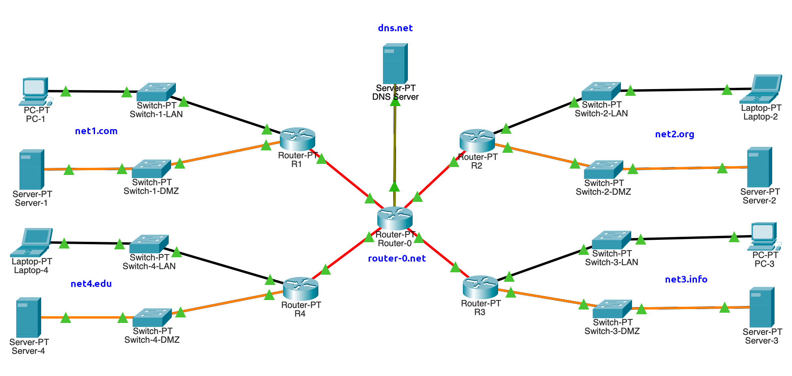
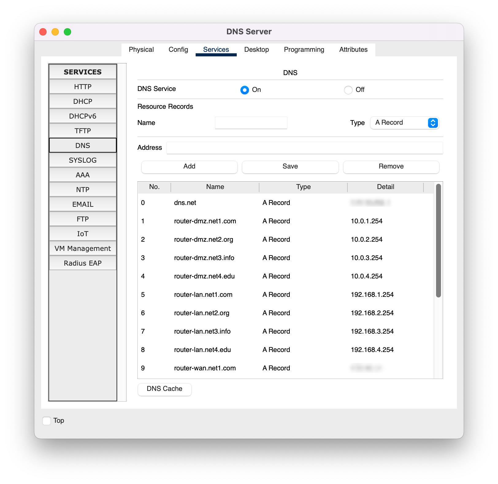

# Práctica 5: Configuración de algoritmos de ruteo

--------------------------------------------------------------------------------

## Objetivo

El alumno configurará una infraestructura de red que que conecta varias redes mediante el protocolo RIPv2, también implementará traducción de direcciones por medio de NAT y una red DMZ para hospedar servicios de red.

## Elementos de apoyo

- [Video de la creación de una red en Packet Tracer 📼][video-packet-tracer]
- [Configuración de ruteo RIPv2 en Packet Tracer 📝][ruteo-rip]
- [Configuración de NAT en Packet Tracer 📝][packet-tracer-nat]

## Restricciones

- La fecha límite de entrega es el **miércoles 25 de mayo de 2022** a las 23:59 horas
- Esta actividad debe ser entregada **en equipo** de acuerdo al [flujo de trabajo para la entrega de tareas y prácticas][flujo-de-trabajo]
    - Utilizar la carpeta `docs/practicas/practica-5/Equipo-ABCD-EFGH-IJKL-MNOP` para entregar la práctica
        - Donde `Equipo-ABCD-EFGH-IJKL-MNOP` representa el nombre del equipo que debió anotarse previamente en la [lista del grupo][lista-redes]
    - Hacer un _merge request_ a la rama `practica-5` del [repositorio de tareas][repo-tareas] para entregar la actividad

--------------------------------------------------------------------------------

## Procedimiento

- Copia el escenario que se entregó en la [práctica 4][practica-4] a la carpeta `files` de la práctica 5 y modificalo
    - Conecta <u>todos los ruteadores</u> a un _router_ central en la red <span style="font-weight: bold; color: red;">WAN: rojo</span>
    - Conecta un <span style="font-weight: bold; color: olive;">servidor DNS</span> al _router_ central
    - Agrega la red <span style="font-weight: bold; color: orange;">DMZ: naranja</span>

<!-- -->
<a id="diagrama" name="diagrama"></a>

| Diagrama de red en Packet Tracer |
|:--------------------------------:|
| 
| Redes: <span style="font-weight: bold; color: red;">WAN: rojo</span> , <span style="font-weight: bold; color: black;">LAN: negro</span> , <span style="font-weight: bold; color: orange;">DMZ: naranja</span>
| Redes <span style="font-weight: bold; color: red;">WAN</span>: <u>Segmento de red elegido</u> (`A.B.X.Y`) de [**TEST-NET**][ipv4-reserved-addresses] subdividido para 4 subredes
| Redes <span style="font-weight: bold; color: black;">LAN</span>: `192.168.X.0/24` y "NAT `overload`" para salir a otras redes
| Redes <span style="font-weight: bold; color: orange;">DMZ</span>: `10.0.X.0/24` y "NAT `estático`" para exponer el servidor WEB
<!-- -->

!!! note
    No se contempla el uso de vLAN `802.1q` ni vLAN anidadas `802.1ad` (_Q-in-Q_) por lo que no se deben de configurar puertos troncales (trunk)

<!-- WAN -->

### Redes <span style="font-weight: bold; color: red;">WAN</span>

- Utiliza interfaces **GigabitEthernet** para las redes **WAN** (<span style="font-weight: bold; color: red;">rojo</span>)
- Elige uno de los segmentos de red `/24` de [**TEST-NET**][ipv4-reserved-addresses] (`192.0.2.0/24`, `198.51.100.0/24` o `203.0.113.0/24`) y subdivídelo para tener 4 subredes **WAN**
- Configura rutas con el protocolo **RIPv2** para interconectar las redes **WAN**
    - Todos los routers tienen configurado el protocolo RIP v2 y publican las redes WAN (`A.B.X.0`)
    - El `Router-0` tiene todas las redes **WAN** <u>directamente conectadas</u>, mientras que los demás _routers_ descubren las otras redes utilizando el protocolo RIP v2.
- Los ruteadores tienen la dirección `A.B.X.N` en la interfaz de red **WAN**
- La red **WAN** se considera que está en la región **EXTERNA** del NAT

<!-- LAN -->

### Redes <span style="font-weight: bold; color: black;">LAN</span>

- Utiliza interfaces **FastEthernet** para las redes **LAN** (<span style="font-weight: bold; color: black;">negro</span>)
- Conecta un switch y una laptop en la red **LAN**, utiliza el direccionamiento `192.168.X.0/24`
- Habilita el servicio de DHCP en el ruteador para las redes **LAN**
- Configura el servicio de "NAT `overload`" en el ruteador para las redes **LAN** para permitir que la IP de la PC (`192.168.X.Y`) se traduzca a la IP del router **WAN** (`A.B.X.1`) cuando salga a otras redes
    - La red **LAN** se considera que está en la región **INTERNA** del NAT
    - Los equipos en la red **LAN** no son directamente accesibles desde ninguna de las redes **WAN** porque están "atrás del NAT"
- Configura los switches de las redes **LAN**
    - Dirección IP de administración (estática) en la interfaz de red `vlan 1`
    - Establece el _gateway_ con la dirección IP del ruteador para ese segmento de red

<!-- DMZ -->

### Redes <span style="font-weight: bold; color: orange;">DMZ</span>

- Utiliza interfaces **FastEthernet** para las redes **DMZ** (<span style="font-weight: bold; color: orange;">naranja</span>)
- Conecta un switch y un servidor en la red **DMZ**, utiliza el direccionamiento `10.0.X.0/24`
- Configuración de direcciones IP estáticas para cada red DMZ
- Configura el servicio de "NAT `estático`" en el ruteador para las redes **DMZ** para exponer el servidor de la DMZ en la dirección `A.B.X.N+1`
    - La red **DMZ** se considera que está en la región **INTERNA** del NAT
    - Los servidores de la DMZ tienen el servicio de HTTP. Poner una página `index.html` que diga a cual servidor se conectó
    - Cualquier equipo podrá acceder a la dirección `http://A.B.X.N+1/` para ver el sitio web, o bien utilizar el nombre de dominio asignado en el servidor DNS
- Configura los switches de las redes **DMZ**
    - Dirección IP de administración (estática) en la interfaz de red `vlan 1`
    - Establece el _gateway_ con la dirección IP del ruteador para ese segmento de red

<!-- DNS -->

### Servidor <span style="font-weight: bold; color: olive;">DNS</span>

- Todos los equipos tienen configurado el servidor DNS
- Cada red tiene su propio nombre de dominio (<span style="font-weight: bold; color: blue;">azul</span>)
- El servidor DNS tiene un registro A para cada ruteador, servidor expuesto a través del NAT "estático" y un registro A para el mismo servidor DNS

<a id="registros-dns" name="registros-dns"></a>

| Registros en el servidor DNS |
|:----------------------------:|
| 

--------------------------------------------------------------------------------

## Entregables

- Archivo `README.md`
    - Tabla donde se listen los equipos, nombre de host, dirección IP de administración y la conexión con otros switches y ruteadores
    - Listar las imágenes con su respectiva descripción
    - Crear ligas hacia los archivos en la carpeta `files` cuando sean mencionados
    - Salida de las pruebas de conectividad entre los equipos **en texto**
    - Explicación de la topología de red utilizada.
        - La simulación de la red **LAN** es una versión simplificada de la red interna de una dependencia universitaria para fines ilustrativos
    - Tabla de rutas de cada equipo
    - Estadísticas de NAT y tabla de traducciones de cada ruteador
        - Obtener la tabla después de hacer ping de la laptop de la red **LAN** a un equipo en la red **WAN**

- Carpeta `img`
    - Imagen de la topología de red implementada
    - Captura de pantalla de los registros del servidor **DNS**
    - Demás imágenes que se consideren necesarias para el reporte

- Carpeta `files`
    - Archivo de la actividad en formato `PKT` (Packet Tracer)
    - Configuración de cada switch y ruteador
        - Hacer que la configuración sea persistente con el comando
            - `copy  running-config  startup-config`
        - Guardar la salida del comando `show startup-config` a un archivo de texto (ej. `Router-1.txt` o `Switch-LAN-1.txt`)
        - Repetir para cada equipo de red
    - Código fuente de la página `index.html` de alguno de los servidores de la red `DMZ`

## Extra

Elaboren un video donde expliquen qué edificio se eligió, la topología de red utilizada y las pruebas de conectividad.

- Subir el video a YouTube
- Agregar la referencia de este video al archivo `README.md`

```text
- [Video de la topología de red utilizada 📼](https://youtu.be/0123456789ABCDEF)
```

--------------------------------------------------------------------------------

[flujo-de-trabajo]: https://redes-ciencias-unam.gitlab.io/2022-2/tareas-redes/workflow/
[repo-tareas]: https://gitlab.com/Redes-Ciencias-UNAM/2022-2/tareas-redes/-/merge_requests

[lista-redes]: https://tinyurl.com/Lista-Redes-2022-2

[video-packet-tracer]: https://www.youtube.com/watch?v=zixHIQvI79k&list=PLN1TFzSBXi3QWbHwBEV3p4LxV5KceXu8d&index=19
[packet-tracer-install]: ./install

[practicas-cisco]: https://tinyurl.com/Redes-FC-UNAM-Practicas-Cisco
[instaladores-packet-tracer]: https://tinyurl.com/Redes-FC-UNAM-Cisco-PT

[practica-4]: ../practica-4/

[ruteo-rip]: ../../temas/routing-rip
[packet-tracer-nat]: ../../temas/packet-tracer/nat.md

[ipv4-reserved-addresses]: https://en.wikipedia.org/wiki/Reserved_IP_addresses
