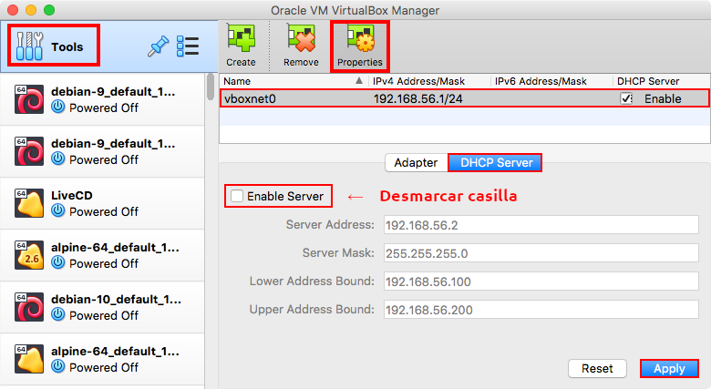

# Configuración de NAT en GNU/Linux

!!! note
    - Realiza esta configuración en la máquina **Debian**

## Configuración en VirtualBox

Deshabilitar el servicio de DHCP en la interfaz host only.

- Abre VirtualBox y dar clic en el menú de herramientas
- Aparecerá la lista de interfaces host-only dar clic en la primera
- Ve a la pestaña del servidor de DHCP y **desmarcar** la casilla para deshabilitarlo
- Da clic en aplicar cambios

| Deshabilitar DHCP de `vboxnet` |
|:------------------------------:|
| 
| Deshabilitar el servicio de DHCP en la red host-only de VirtualBox

## Instalación de software

Instala las utilerias de red

```
root@debian:~# apt -q update
root@debian:~# apt -qy install net-tools
```

## Configuración de dirección IP estática

Configura una dirección IP estática en la **interfaz host-only** `192.168.56.254`.

!!! warning
    - Verifica el tipo, nombre, dirección MAC e IP de tus interfaces de red.

!!! note
    - Anexa el archivo `/etc/network/interfaces` a tu reporte de la práctica.

## Configuración de `sysctl`

Habilita de manera persistente la funcionalidad de _IP forward_ en el kernel para que no se descarten paquetes que no sean destinados a otra máquina.

- Edita el archivo `/etc/sysctl.conf` y descomentar la linea.

```
net.ipv4.ip_forward = 1
```

- Recarga la configuración de `sysctl`.

```
root@debian:~# sysctl -p
	...
```

!!! note
    - Agrega la salida de este comando al reporte de tu práctica.

    - Anexa el archivo `/etc/sysctl.conf` a tu reporte de la práctica.

## Configuración de `iptables`

Instala `iptables-persistent` para cargar las reglas de iptables en el inicio del sistema.

```
root@debian:~# apt install iptables-persistent
```

Revisa que no haya reglas existentes en `iptables`.

```
root@debian:~# iptables -n -L
```

Habilita la regla en la tabla de NAT de `iptables`.

```
root@debian:~# iptables -t nat -A POSTROUTING -o eth1 -j MASQUERADE
```

Indica a `iptables` que se el tráfico puede entrada por *host-only* (`eth0`) y salir por la NAT (`eth1`) y viceversa.

```
root@debian:~# iptables -A FORWARD -i eth0 -o eth1 -j ACCEPT
root@debian:~# iptables -A FORWARD -i eth1 -o eth0 -m state --state ESTABLISHED,RELATED -j ACCEPT
```

!!! warning
    - Verifica el tipo, nombre, dirección MAC e IP de tus interfaces de red.

Verifica las reglas de firewall que tienes configuradas

```
root@debian:~# iptables-save
	...
```

!!! note
    - Agrega la salida de este comando al reporte de tu práctica.

Guarda las reglas de manera persistente.

```
root@debian:~# service netfilter-persistent save
```

!!! note
    - Anexa el archivo `/etc/iptables/rules.v4` a tu reporte de la práctica.

## Verificar configuración

Reinicia el equipo para verificar que los cambios sean persistentes.

```
root@debian:~# reboot
```

!!! danger
    - Verifica que **TODAS** las configuraciones que hiciste estén presentes respués de reiniciar la máquina antes de seguir con la demás configuración.

--------------------------------------------------------------------------------

Continúa con la [configuración del servidor _forwarder_ DNS en GNU/Linux][config-dns-linux]

[config-dns-linux]: configuracion-dns-linux.md
