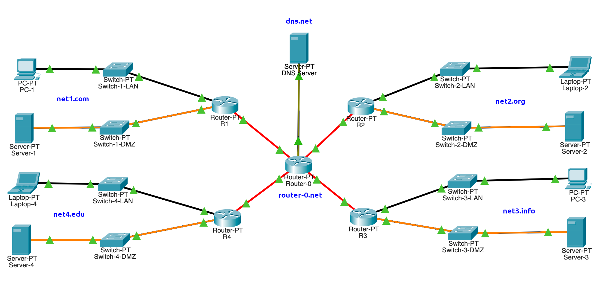

# Práctica 5: Configuración de servicios DHCP, NAT y DNS

--------------------------------------------------------------------------------

## Objetivo

El alumno realizará la configuración de una máquina virtual GNU/Linux con los servicios de red NAT, DHCP y _forwarder_ DNS para permitir que otras máquinas tengan salida a Internet.

## Elementos de apoyo

Esta practica guiada esta basada en los videos de la clase que se muestran a continuación:

- [Protocolo ARP 📼][video-protocolo-arp]
- [Protocolo DHCP 📼][video-protocolo-dhcp]
- [Protocolo DNS 📼][video-protocolo-dns]

- [Configuración manual de direcciones IP en GNU/Linux 📼][video-ip-manual]
- [Configuración persistente de direcciones IP en GNU/Linux 📼][video-ip-persistente]
- [Configuración de iptables en GNU/Linux 📼][video-iptables]
- [Configuración de NAT, DHCP y Forwarder de DNS en GNU/Linux 📼][video-nat-dhcp-dns]

## Restricciones

- La fecha límite de entrega es el **lunes 17 de octubre de 2022** a las 23:59 horas
- Esta actividad debe ser entregada **en equipo** de acuerdo al [flujo de trabajo para la entrega de tareas y prácticas][flujo-de-trabajo]
- Crear una nueva rama llamada `practica-5`
- Utilizar la carpeta `docs/practicas/practica-5/Equipo-ABCD-EFGH-IJKL-MNOP` para entregar la práctica
    - Donde `Equipo-ABCD-EFGH-IJKL-MNOP` representa el nombre del equipo que debió anotarse previamente en la [lista del grupo][lista-redes]
- Crear un _merge request_ en el [repositorio de tareas][repo-tareas] para entregar la actividad

## Entregables

- Archivo `README.md`
    - Explicación de la topología de red utilizada
    - Procedimiento de configuración de NAT, _forwarder_ DNS y servidor DHCP
    - Procedimiento para reservar una dirección IP en el servidor DHCP
    - Explicar el contenido del archivo leases del servidor y cliente DHCP
    - Explicar detalladamente cómo es que el cliente obtiene una dirección IP del servidor DHCP
    - Qué ventajas y desventajas existen al tener un _forwarder_ DNS en la red local
    - Explicar detalladamente cómo es que una petición se envía desde el cliente hasta su destino fuera de la red host-only
    - [Conclusiones](#conclusiones) sobre las capturas de tráfico de red

- Carpeta `files`
    - Capturas de tráfico de red en formato `PCAP`
    - Configuración de las redes de VirtualBox
        - Salida de `VBoxManage list hostonlyifs`
    - Configuración de todas las máquinas virtuales
        - Salida de `VBoxManage showvminfo "<NAME>|<UUID>" --machinereadable`
    - Servidor DHCP (Debian)
        - Salida de los comandos para verificar las interfaces de red
        - Archivo `/etc/network/interfaces`
        - Archivo `/etc/sysctl.conf`
        - Salida del comando `iptables-save` cuando ya se tengan las reglas del firewall para NAT
        - Archivo `/etc/iptables/rules.v4`
        - Archivo `/etc/dhcp/dhcpd.conf`
        - Archivo `/etc/default/isc-dhcp-server`
        - Archivo `/var/lib/dhcp/dhcpd.leases`
        - Archivo `/etc/dnsmasq.conf`
        - Archivo `/etc/resolv-upstream.conf`
        - Archivo `/etc/resolv.conf`
    - Cliente DHCP (CentOS)
        - Tabla ARP
        - Tabla de rutas
        - Salida de los comandos de configuración de red
        - Salida de los comandos con las pruebas de conectividad local
        - Salida de los comandos con las pruebas de resolución DNS
        - Salida de los comandos con las pruebas de conectividad externa
        - Archivo `/var/lib/dhcp/dhcp.leases`
        - Archivo `/etc/resolv.conf`
    - Cliente DHCP (Alpine)
        - Tabla ARP
        - Tabla de rutas
        - Salida de los comandos con las pruebas de conectividad local
        - Salida de los comandos con las pruebas de resolución DNS
        - Salida de los comandos con las pruebas de conectividad externa

--------------------------------------------------------------------------------

## Procedimiento

Se presentan los pasos para elaborar la configuración de un NAT, _forwarder_ de DNS y DHCP utilizando VirtualBox con base en la topología de red que se muestra a continuación:

| Diagrama de red en VirtualBox |
|:-----------------------------:|
| 

El procedimiento se lista las siguientes páginas:

1. [Configuración de NAT en GNU/Linux][config-nat-linux]
2. [Configuración de servidor _forwarder_ DNS en GNU/Linux][config-dns-linux]
3. [Configuración de servidor DHCP en GNU/Linux][config-dhcp-linux]
4. [Pruebas de conectividad en el cliente][pruebas-conectividad]
5. [Reservar dirección IP en DHCP][reservar-ip-dhcp]

[config-nat-linux]: configuracion-nat-linux.md
[config-dhcp-linux]: configuracion-dhcp-linux.md
[config-dns-linux]: configuracion-dns-linux.md
[pruebas-conectividad]: pruebas-conectividad.md
[reservar-ip-dhcp]: reservar-ip-dhcp.md

Al finalizar la configuración realiza una captura en formato PCAP para analizar el tráfico de red.

### Captura de tráfico

Realiza una captura de tráfico para los servicios ARP, DHCP, DNS e ICMP utilizando `tcpdump` o `WireShark`.

- **Debian**: Todas las interfaces de red
- **CentOS**: Interfaz _host-only_

!!! warning
    - Verifica el tipo, nombre, dirección MAC e IP de tus interfaces de red.

- Tráfico DNS en todas las interfaces de red.
    - `${IFACE}` es el nombre de la interfaz de red (`eth0`, `eth1`, etc.)

```
# tcpdump -veni ${IFACE} -o captura.pcap 'arp or icmp or port (53 or 67 or 68)'
```

Ejecuta las siguientes acciones mientras la captura de tráfico está activa:

- Limpia la tabla ARP de las máqinas **Debian**, **CentOS** y **Alpine**.

- Pide una nueva dirección IP en las máqinas **CentOS** y **Alpine**.

- Haz pruebas de conectividad al dominio `example.com` en las máqinas **CentOS** y **Alpine**.

#### Conclusiones

Compara las capturas de tráfico y escribe tus conclusiones.

- ¿Hay alguna diferencia en el tráfico de las capturas de red?
- ¿Qué parte de tráfico de DHCP es _broadcast_ y _unicast_?
- ¿Cómo es que funciona ARP?
- ¿Cómo es que llega una petición y respuesta de `PING` desde la máquina **CentOS** hasta un servidor en Internet?

```
$ ping -c 4 8.8.8.8
$ ping6 -c 6 example.com.
```

--------------------------------------------------------------------------------

[flujo-de-trabajo]: https://redes-ciencias-unam.gitlab.io/2023-1/tareas-redes/workflow/
[repo-tareas]: https://gitlab.com/Redes-Ciencias-UNAM/2023-1/tareas-redes/-/merge_requests

[lista-redes]: https://tinyurl.com/Lista-Redes-2023-1

[video-protocolo-arp]: https://www.youtube.com/watch?v=bqNLVQDqmLk&list=PLN1TFzSBXi3QWbHwBEV3p4LxV5KceXu8d&index=38
[video-protocolo-dhcp]: https://www.youtube.com/watch?v=6l4WQJfD7o0&list=PLN1TFzSBXi3QWbHwBEV3p4LxV5KceXu8d&index=39
[video-protocolo-dns]: https://www.youtube.com/watch?v=r4PntflJs9E&list=PLN1TFzSBXi3QWbHwBEV3p4LxV5KceXu8d&index=40

[video-ip-manual]: https://www.youtube.com/watch?v=H74s4_oJNYY&list=PLN1TFzSBXi3QWbHwBEV3p4LxV5KceXu8d&index=41
[video-ip-persistente]: https://www.youtube.com/watch?v=UErZ4i9XmLM&list=PLN1TFzSBXi3QWbHwBEV3p4LxV5KceXu8d&index=42
[video-iptables]: https://www.youtube.com/watch?v=6lYnadL60Cs&list=PLN1TFzSBXi3QWbHwBEV3p4LxV5KceXu8d&index=43
[video-nat-dhcp-dns]: https://www.youtube.com/watch?v=BzL3MQkHjwg&list=PLN1TFzSBXi3QWbHwBEV3p4LxV5KceXu8d&index=44

[cisco-modeling-labs]: https://developer.cisco.com/docs/modeling-labs/

[alpine-linux-iso]: https://dl-cdn.alpinelinux.org/alpine/v3.15/releases/x86_64/alpine-virt-3.15.4-x86_64.iso

[tinycore-linux-iso]: http://tinycorelinux.net/13.x/x86/release/Core-13.0.iso
[tinycore-linux-x64-iso]: http://tinycorelinux.net/13.x/x86_64/release/CorePure64-13.0.iso
