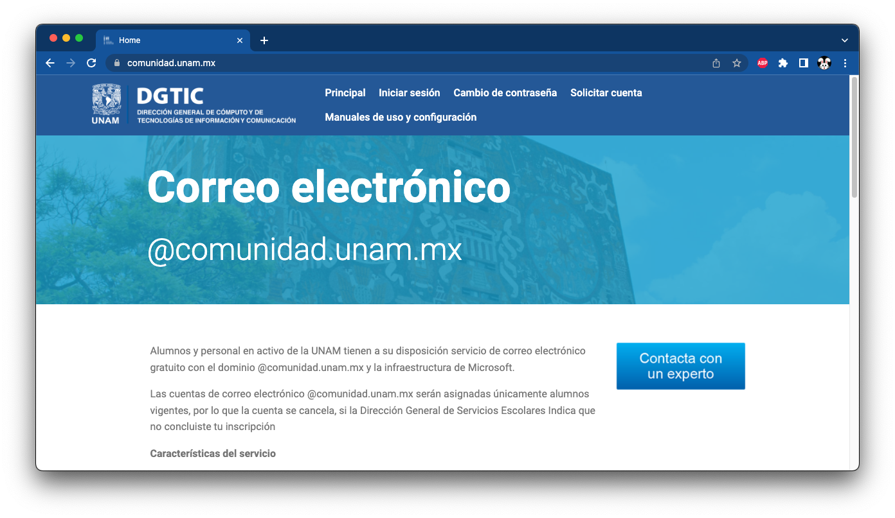

# Crear una cuenta de correo en Comunidad UNAM

Tramitar un correo de estudiante `@comunidad.unam.mx` en el portal de servicios de DGTIC.

!!! note
    Las cuentas de correo electrónico `@comunidad.unam.mx` serán asignadas únicamente <u>alumnos vigentes</u>, por lo que la cuenta se cancela si la **Dirección General de Servicios Escolares** indica que no concluiste tu inscripción

Es necesario ponerse en contacto con el Centro de Atención a Usuarios (CAU) y verificar los requisitos que piden para que un integrante del equipo haga el trámite de la dirección de correo electrónico.

| Página de Comunidad UNAM
|:---------------------------:|
| 

| **CAU**: Centro de atención a usuarios
|:-----------------------------------|
| <soporte@comunidad.unam.mx>
| **Atención telefónica**: 9:00 a 20:00 hrs.
| Número local: [55-5622-8099](tel:55-5622-8099) ext 46190 a la 46194 <!-- 55-5665-1966 -->
| Larga distancia nacional sin costo: [800-900-8626](tel:800-900-8626)
| **Atención en ventanilla**: 10:00 am a 14:30 hrs y de 17:00 pm a 18:40 hrs
| [Edificio DGTIC, planta principal, lado izquierdo][mapa-dgtic]

<iframe 
  style="border: 0px; width: 99%; height: 30em;"
  allowfullscreen=""
  loading="lazy"
  referrerpolicy="no-referrer-when-downgrade"
  src="https://www.google.com/maps/embed?pb=!1m18!1m12!1m3!1d3765.081766333429!2d-99.18677418537364!3d19.322257886947096!2m3!1f0!2f0!3f0!3m2!1i1024!2i768!4f13.1!3m3!1m2!1s0x85ce000f32b9fce9%3A0xf9a879c9ac1ca88c!2sDGTIC!5e0!3m2!1sen!2smx!4v1653443193021!5m2!1sen!2smx">
</iframe>

--------------------------------------------------------------------------------

!!! note
    - Si ya tienes tu correo `@comunidad.unam.mx`, continúa en [la siguiente página](../cuenta-azure-student)

--------------------------------------------------------------------------------

[mapa-dgtic]: https://goo.gl/maps/kWZ6PZk3M1SSVwVq8
[cau-ayuda-telecom]: https://ayuda.telecom.unam.mx/hd/index.ssp
[vpn-unam]: http://www.vpnuniversitaria.unam.mx/
[comunidad-unam]: https://www.comunidad.unam.mx/
[comunidad-unam-chat]: https://www.chat.unam.mx/chats/mibew/chat?locale=es&group=4
[comunidad-unam-solicitar-cuenta]: http://serviciosdgtic.unam.mx:8080/bonita/portal/homepage?ui=form&locale=es&autologin=Cuentas+Comunidad--4.0#form=Cuentas+Comunidad--4.0$entry&process=7971577481770744609&mode=app
