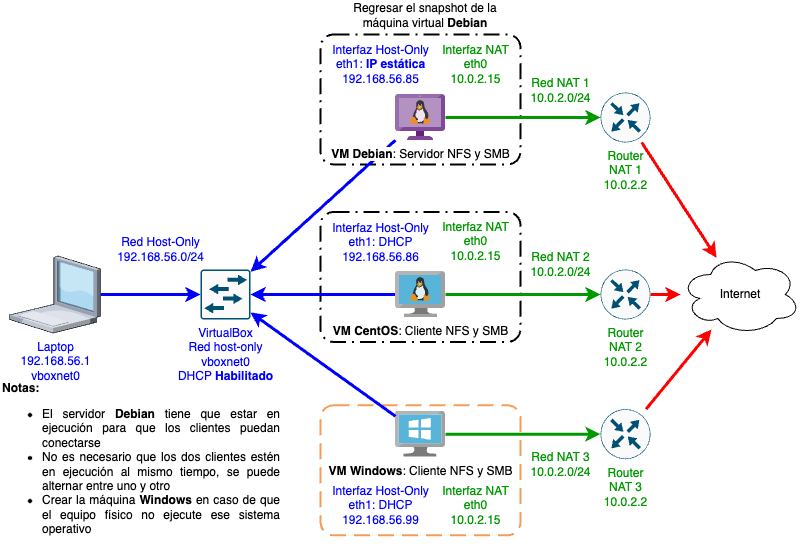

# Práctica 6: Implementación de un servidor de archivos con NFS y Samba

--------------------------------------------------------------------------------

## Objetivo

El alumno realizará la configuración de un servidor de archivos que comparte un directorio a los demás equipos de la red utilizando los protocolos NFS y SMB.

## Elementos de apoyo

Esta practica guiada está basada en los videos y material de clase que se muestran a continuación:

- [Cómo compactar y exportar una máquina virtual de VirtualBox 📝][virtualbox-compact-export-vm]

- [Protocolo ARP 📼][video-protocolo-arp]
- [Protocolo DHCP 📼][video-protocolo-dhcp]
- [Protocolo DNS 📼][video-protocolo-dns]

- [Configuración manual de direcciones IP en GNU/Linux 📼][video-ip-manual]
- [Configuración persistente de direcciones IP en GNU/Linux 📼][video-ip-persistente]
- [Configuración de iptables en GNU/Linux 📼][video-iptables]

- [Configuración de NFS en GNU/Linux 📼][video-linux-nfs]
- [Configuración de SAMBA en GNU/Linux 📼][video-linux-samba]
- [Conexión de un cliente Windows a NFS y SAMBA 📼][video-windows-nfs-samba]

--------------------------------------------------------------------------------

#### Otros sistemas operativos

Se puede descargar un ISO de instalación de la _versión de evaluación_ de **Windows** en caso de ser necesario:

??? details "![][logo-windows]{style='width:auto;height:1.5em;'} Windows"

    - [Máquina virtual de evaluación de Windows 7][modernie-vms] **†**
    - [Máquina virtual de evaluación de Windows 10][windows-10-evaluation]
    - [Máquina virtual de evaluación de Windows 11][windows-vms]

    !!! danger
        **†**: Recuerda que [Windows 7 dejó de tener soporte][windows-7-eos] el [**14 de enero de 2020**][windows-7-eol]

Se puede utilizar **Zentyal** o **ClearOS** si el equipo decide utilizar un servidor _appliance_ para elaborar la práctica en lugar de hacer la configuración en la máquina virtual **Debian**:

??? details "![][logo-zentyal]{style='width:auto;height:1.5em;'} Zentyal Server Community"

    - [Sitio de Zentyal Server Community 🌐][zentyal-linux]
    - [Imagen ISO de Zentyal Server Community 💽][zentyal-linux-iso]
    - [Documentación de Zentyal Server Community 📚][zentyal-documentation]
    - [Instalar Zentyal en Ubuntu 🖥️][zentyal-linux-ubuntu]

??? details "![][logo-clearos]{style='width:auto;height:1.5em;'} ClearOS Community Edition"

    - [Sitio de ClearOS 🌐][clearos-linux]
    - [Imagen ISO de ClearOS Community Edition 💽][clearos-linux-iso]
    - [Documentación de ClearOS Community Edition 📚][clearos-documentation]
    - [Convertir una instalación de CentOS a ClearOS 🖥️][clearos-linux-centos]

## Restricciones

- La fecha límite de entrega es el **viernes 04 de noviembre de 2022** a las 23:59 horas `ⁱ`
- Esta actividad debe ser entregada **en equipo** de acuerdo al [flujo de trabajo para la entrega de tareas y prácticas][flujo-de-trabajo]
- Crear una nueva rama llamada `practica-6`
- Utilizar la carpeta `docs/practicas/practica-6/Equipo-ABCD-EFGH-IJKL-MNOP` para entregar la práctica
    - Donde `Equipo-ABCD-EFGH-IJKL-MNOP` representa el nombre del equipo que debió anotarse previamente en la [lista del grupo][lista-redes]
- Crear un _merge request_ en el [repositorio de tareas][repo-tareas] para entregar la actividad

!!! note
    `ⁱ`: Se ajustó la fecha de entrega para tomar en cuenta los días de asueto.

## Entregables

- Archivo `README.md`
    - Explicación de la topología de red utilizada
    - Procedimiento de configuración de NFS y Samba en el servidor
        - Explicar como hacer la base de usuarios Samba y por qué no se puede utilizar `/etc/passwd` y `/etc/shadow`
    - Procedimiento de configuración de los clientes GNU/Linux y Windwows para utilizar NFS y Samba de manera **persistente**
    - [Conclusiones](#conclusiones) sobre el uso de los protocolos NFS y Samba

- Carpeta `img`
    - Imagenes ilustrativas del proceso, mismas que deben estar referenciadas en el archivo `README.md`

- Carpeta `files`
    - Archivos de configuración para el servidor NFS y Samba
    - Bitácoras de conexión de NFS y Samba
    - Configuración de las redes de VirtualBox
        - Salida de `VBoxManage list hostonlyifs`
    - Configuración de todas las máquinas virtuales
        - Salida de `VBoxManage showvminfo "<NAME>|<UUID>" --machinereadable`
    - Salida de los comandos `showmount` y `smbclient` para listar los recursos compartidos (Desde el servidor y desde los clientes)
    - Diagnósticos de conexión a los servicios NFS y Samba
    - Archivo `/etc/fstab` con la configuración de montaje persistente de NFS y Samba (Cliente CentOS GNU/Linux)

--------------------------------------------------------------------------------

## Procedimiento

| Diagrama de red en VirtualBox |
|:-----------------------------:|
| 

!!! warning
    - Restaura el [snapshot de la máquina virtual **Debian** que tomaste en la práctica anterior][snapshot-anterior] <u>antes</u> de realizar la configuración de los servicios de red.

<!-- 
    - [Crea un _snapshot_ de la máquina virtual **Debian**][snapshot-virtualbox] <u>antes</u> de realizar la configuración de los servicios de red.
-->

[snapshot-anterior]: ../practica-5/#snapshot

### Dirección IP del servidor

- Configurar una dirección IP estática en la máquina virtual **Debian** para que los demás clientes puedan conectarse a los servicios de red

### NFS

#### Servidor NFS

- Instalar las utilerías de soporte para el servicio `nfs-kernel-server` en la máquina **Debian**

- Exportar el directorio `/srv` vía NFS para el segmento de red de la interaz _host-only_

- Establecer las opciones adecuadas para el directorio en el [archivo `/etc/exports`][man-exports].

- Verificar que el directorio esté _exportado_ en el servidor utilizando el [comando `showmount -e`][man-showmount]

#### Clientes NFS

- Todos los clientes NFS deben _montar_ el directorio exportado en el servidor en modalidad de lectura-escitura en cada inicio del sistema.

#####  Cliente **CentOS GNU/Linux**

- Instalar las utilerías de cliente NFS

- Verificar que el sistema de archivos esté exportado con el comando `showmount -e <IP-del-servidor>`

- Montar manualmente el sistema de archivos para verificar que funcione y después reiniciar el equipo

- Configurar el punto de montaje en `/etc/fstab` especificando las [opciones adecuadas para NFS][man-nfs]

- Reiniciar el equipo para verificar que el sistema de archivos se monta correctamente de manera automática al iniciar el sistema

#####  Cliente **Windows**

- Habilitar el las siguientes características opcionales de Windows y reiniciar el equipo

    - Servicios de NFS
    - Herramientas Administrativas
    - Cliente de NFS

- Verificar que el sistema de archivos esté exportado con el comando `showmount -e <IP-del-servidor>`

- Utilizar el [comando `mount`][windows-mount-nfs] para instalar el punto de montaje del sistema de archivos compartido `mount <opciones> <IP-del-servidor>:/<RUTA> *`.
    - El último parámetro es para que el sistema asigne una letra de unidad al sistema de archivos.

- Otra opción es _montar_ el sistema de archivos compartido desde la interfaz gráfica del explorador de Windows y marcar la casilla que indica que esta configuración se aplicará de manera persistente.

- Reiniciar el equipo para verificar que el sistema de archivos se monta correctamente de manera automática al iniciar el sistema

### SAMBA

#### Servidor SAMBA

- Instalar las herramientas del servicio Samba en la máquina **Debian**

- Compartir el directorio `/srv` via SMB para el segmento de red de la interfaz _host-only_

- Establecer las opciones adecuadas para el recurso compartido en el [archivo `smb.conf`][man-samba]

- El servicio Samba debe <u>permitir únicamente el acceso a clientes que se autentiquen con usuario y contraseña</u>, utilizar [el programa `smbpasswd`][man-smbpasswd] para manipular la base de datos de usuarios Samba.

- Verificar que el servidor tenga el _recurso compartido_ utilizando el [comando `smbclient -L`][man-smbclient]

#### Clientes SAMBA

- Todos los clientes Samba deben _montar_ el recurso compartido del servidor en modalidad de lectura-escitura en cada inicio del sistema utilizando el usuario y contraseña.
##### Cliente **CentOS GNU/Linux**

- Instalar las utilerías de cliente Samba

- Verificar que el sistema de archivos esté exportado con el comando `smbclient -L <IP-del-servidor>`

- Montar manualmente el sistema de archivos para verificar que funcione y después reiniciar el equipo

- Configurar el punto de montaje en `/etc/fstab` especificando las [opciones adecuadas para Samba][man-cifs]

- Reiniciar el equipo para verificar que el sistema de archivos se monta correctamente de manera automática al iniciar el sistema

##### Cliente **Windows**

- Verificar que el cliente Windows tenga instalado y habilitado el soporte de Samba (normalmente viene instalado y habilitado de manera predeterminada)

- Verificar que el servidor tenga el _recurso compartido_ utilizando la línea de comandos y el Explorador de Windows

- Utilizar el comando `net use` para _montar_ el recurso compartido de manera persistente

- Otra opción es _montar_ el recurso compartido desde el Explorador de Windows y marcar la casilla que indica que esta configuración se aplicará de manera persistente.

- Reiniciar el equipo para verificar que el sistema de archivos se monta correctamente de manera automática al iniciar el sistema

## Conclusiones

- Comparar las ventajas y desventajas de utilizar NFS y Samba en equipos con diferente sistema operativo (GNU/Linux y Windows)

- Copiar un archivo de 1GB almacenado en el servidor a cada uno de los clientes utilizando NFS y Samba

    - ¿Hay alguna diferencia en la velocidad de transferencia utilizando NFS y Samba?

- Utilizar cada cliente para crear una serie de archivos y directorios en el servidor utilizando NFS y Samba

    - Revisar los nombres de usuario, grupos asociados y permisos de los archivos y directorios
    - ¿Hay alguna diferencia en los usuarios, grupos y permisos que tienen los archivos y directorios entre un protocolo y otro?

- Escribir cuales casos de uso se cubren mejor utilizando NFS y cuales utilizando Samba

--------------------------------------------------------------------------------

[flujo-de-trabajo]: https://redes-ciencias-unam.gitlab.io/2023-1/tareas-redes/workflow/
[repo-tareas]: https://gitlab.com/Redes-Ciencias-UNAM/2023-1/tareas-redes/-/merge_requests

[lista-redes]: https://tinyurl.com/Lista-Redes-2023-1

[video-protocolo-arp]: https://www.youtube.com/watch?v=bqNLVQDqmLk
[video-protocolo-dhcp]: https://www.youtube.com/watch?v=6l4WQJfD7o0
[video-protocolo-dns]: https://www.youtube.com/watch?v=r4PntflJs9E

[video-ip-manual]: https://www.youtube.com/watch?v=H74s4_oJNYY
[video-ip-persistente]: https://www.youtube.com/watch?v=UErZ4i9XmLM
[video-iptables]: https://www.youtube.com/watch?v=6lYnadL60Cs
[video-nat-dhcp-dns]: https://www.youtube.com/watch?v=BzL3MQkHjwg

[video-linux-nfs]: https://www.youtube.com/watch?v=AcKG6UsAO-Y
[video-linux-samba]: https://www.youtube.com/watch?v=hl0sC5gPdzw
[video-windows-nfs-samba]: https://www.youtube.com/watch?v=Cbq-FxLNfxc

[snapshot-virtualbox]: https://www.virtualbox.org/manual/UserManual.html#snapshots
[virtualbox-compact-export-vm]: ../../temas/virtualbox-compact-export-vm/

<!--
The Windows and Office 365 Deployment Lab Kit is designed to help you plan, test, and validate modern desktops running Windows Enterprise and Microsoft 365 Enterprise apps. 

- **Windows 7 Professional**: Utilities and SDK for Subsystem for UNIX-based Applications (SUA)
- **Windows 7 Ultimate/Enterprise**: Install "Services for NFS" optional feature, then 'Administrative Tools->Services for NFS' or `nfsadmin`
-->
[logo-windows]: https://www.microsoft.com/favicon.ico
[modernie-vms]: https://developer.microsoft.com/en-us/microsoft-edge/tools/vms/
[windows-vms]: https://developer.microsoft.com/en-us/windows/downloads/virtual-machines/
[windows-10-evaluation]: https://www.microsoft.com/en-us/evalcenter/evaluate-windows-10-enterprise
[windows-10-download]: https://www.microsoft.com/en-us/evalcenter/download-windows-10-enterprise
[windows-11-evaluation]: https://www.microsoft.com/en-us/evalcenter/evaluate-windows-11-enterprise
[windows-11-download]: https://www.microsoft.com/en-us/evalcenter/download-windows-11-enterprise
[office-365-lab-kit]: https://www.microsoft.com/en-us/evalcenter/evaluate-windows-11-office-365-lab-kit
[windows-lab-kit]: https://www.microsoft.com/en-us/evalcenter/evaluate-lab-kit
[windows-7-eol]: https://support.microsoft.com/en-us/windows/windows-7-support-ended-on-january-14-2020-b75d4580-2cc7-895a-2c9c-1466d9a53962
[windows-end-of-support]: https://www.microsoft.com/en-us/windows/end-of-support#windows-7
[windows-7-eos]: https://learn.microsoft.com/en-us/troubleshoot/windows-client/windows-7-eos-faq/windows-7-end-support-faq-general
[windows-7-end-of-support]: https://www.microsoft.com/microsoft-365/windows/end-of-windows-7-support

[logo-zentyal]: https://zentyal.com/wp-content/uploads/2019/05/zentyal-logo-rgb-lema1-100x100.png
[zentyal-linux]: https://zentyal.com/community/
[zentyal-linux-iso]: https://download02.public.zentyal.com/zentyal-7.0-development-amd64.iso
[zentyal-documentation]: https://doc.zentyal.org/en/installation.html
[zentyal-linux-ubuntu]: https://doc.zentyal.org/en/installation.html#installation-on-top-of-ubuntu-20-04-lts-server-or-desktop

[logo-clearos]: https://www.clearos.com/templates/cleartheme/favicon.ico
[clearos-linux]: https://www.clearos.com/products/purchase/clearos-downloads
[clearos-linux-iso]: http://mirror.clearos.com/clearos/7/iso/x86_64/ClearOS-DVD-x86_64.iso
[clearos-documentation]: https://documentation.clearos.com/index:userguide7#installation
[clearos-linux-centos]: https://documentation.clearos.com/content:en_us:kb_convert_centos_to_clearos

[man-exports]: https://linux.die.net/man/5/exports
[man-showmount]: https://linux.die.net/man/8/showmount
[man-nfs]: https://linux.die.net/man/5/nfs
[man-smbpasswd]: https://linux.die.net/man/8/smbpasswd
[man-samba]: https://linux.die.net/man/5/smb.conf
[man-smbclient]: https://linux.die.net/man/1/smbclient
[man-cifs]: https://linux.die.net/man/8/mount.cifs
[linux-mount-nfs]: https://linux.die.net/man/5/nfs
[windows-mount-nfs]: https://learn.microsoft.com/en-us/windows-server/administration/windows-commands/mount
[windows-nfs-overview]: https://learn.microsoft.com/en-us/windows-server/storage/nfs/nfs-overview
[windows-nfs-client-opensource-umich]: http://www.citi.umich.edu/projects/nfsv4/windows/readme.html
