# Crear recursos en Azure

<!--
#### Crear una llave SSH

Ir al [Portal de Azure][azure-portal] e iniciar sesión

| Portal de Azure
|:-----------------------------:|
| 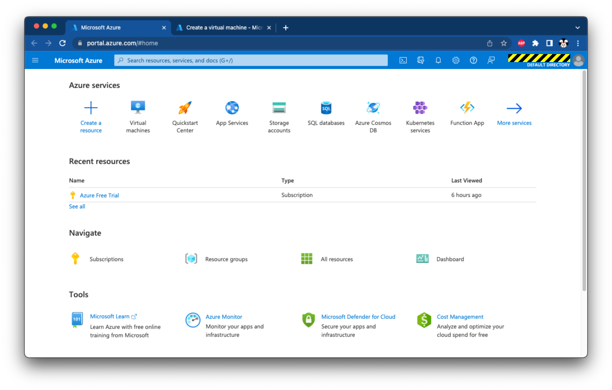

Dar clic en la barra de búsqueda, escribir `SSH key` y seleccionar el servicio **SSH keys**

| Portal de Azure - `SSH key`
|:-------------------------------------:|
| 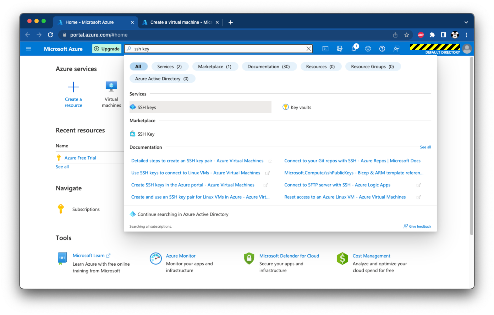

Dar clic en **Create SSH key** en la pantalla de administración de llaves SSH

| Portal de Azure - Administración de llaves SSH
|:----------------------------------------------:|
| 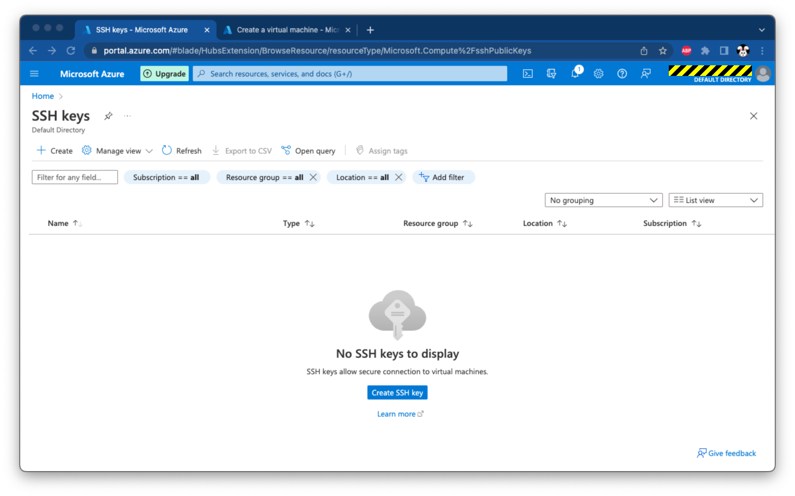

Llenar la información del proyecto:

- Buscar el cuadro del grupo de recursos (_resource group_) y dar clic en **Create new**.
- Escribir `Recursos-Redes` en el nombre y dar clic en **OK**.

| Portal de Azure - Crear llave SSH - Información del proyecto
|:------------------------------------------------------------:|
| 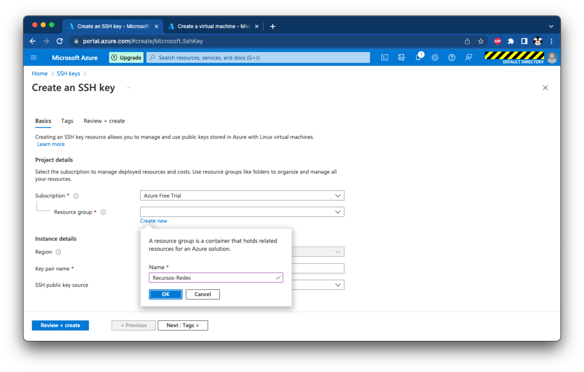

Llenar la información de la instancia:

- Seleccionar la región `(Asia Pacific) Australia East`
- Escribir `redes_azure` en el nombre de llave
- Seleccionar la opción `Generate new keypair`

| Portal de Azure - Crear llave SSH - Detalles de la instancia
|:------------------------------------------------------------:|
| 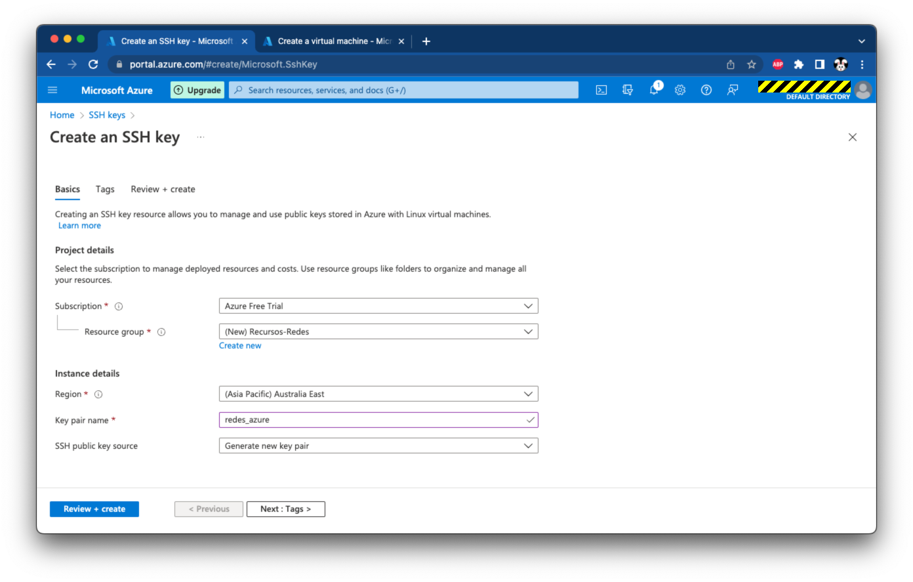

Establecer las etiquetas para los recursos

- Agregar las siguientes etiquetas

| Nombre  | Valor
|:-------:|:--------------------------:|
| Materia | Redes 2022-2
| Equipo  | Equipo-AAAA-BBBB-CCCC-DDDD

| Portal de Azure - Crear llave SSH - Etiquetas
|:-------------------------------------------------:|
| 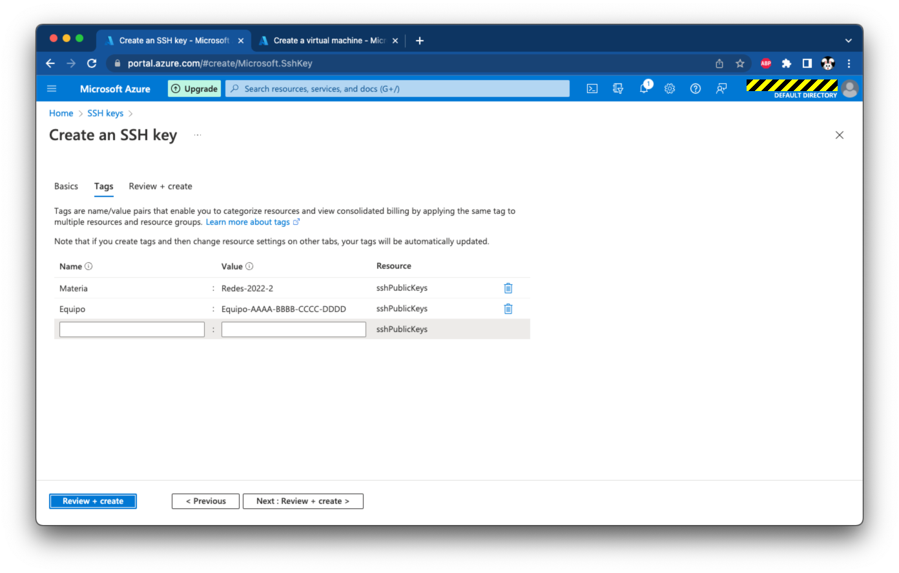

Generar la llave SSH

- Dar clic en el botón `Download private key and create resource`

!!! danger
    Es **indispensable** conservar este archivo para poder acceder a la máquina virtual vía SSH

| Portal de Azure - Crear llave SSH - Etiquetas
|:-----------------------------------------------------:|
-->

#### Crear una máquina virtual en Azure

Ir al [Portal de Azure][azure-portal] y dar clic en **Virtual Machines**

| Portal de Azure
|:-----------------------------:|
| 

Dar clic en el botón **Create** y después en **Azure Virtual Machine**

| Portal de Azure - Crear máquina virtual
|:---------------------------------------:|
| 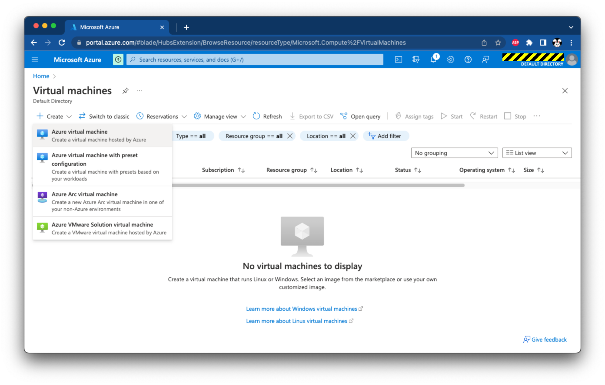

Llenar la información del proyecto:

- Seleccionar el grupo de recursos llamado `Recursos-Redes`

| Portal de Azure - Crear máquina virtual - Información del proyecto
|:------------------------------------------------------------------:|
| 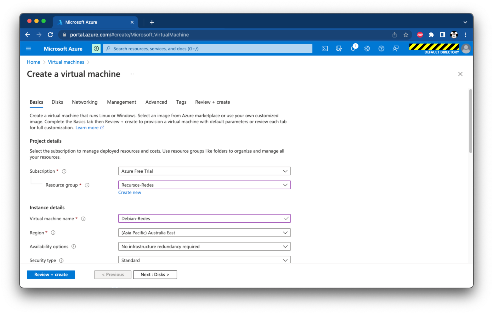

Llenar la información de la instancia:

- Seleccionar la región `(Asia Pacific) Australia East`
- Seleccionar la imagen `Debian 11 Bullseye - Gen 2` (_free services elegible_)
- [ ] Azure spot instance (dejar la casilla **desmarcada**)
- Seleccionar `Standard_B1s` en el tamaño de la máquina virtual

| Portal de Azure - Crear máquina virtual - Detalles de la instancia
|:------------------------------------------------------------------:|
| 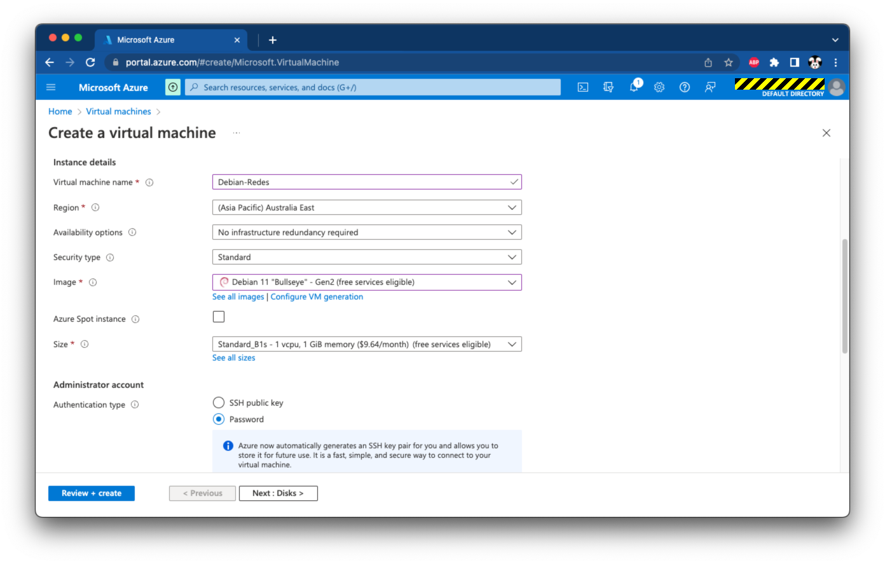

Establecer el mecanismo de acceso

- Seleccionar `Password`
- Establecer `redes` como nombre de usuario
- Anotar una contraseña fuerte

!!! danger
    La contraseña **DEBE** ser fuerte porque es con la que se va a autenticar el usuario adminsitrador de esta máquina virtual

| Portal de Azure - Crear máquina virtual - Cuenta de administrador
|:-----------------------------------------------------------------:|
| 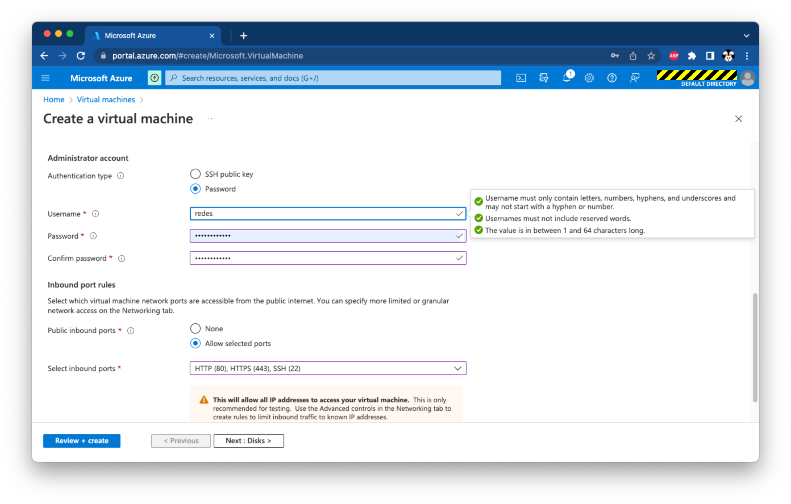

Establecer las reglas de acceso

- Seleccionar **Allow selected ports**
- Establecer los puertos `22`, `80` y `443` para las conexiones entrantes

| Portal de Azure - Crear máquina virtual - Reglas de acceso
|:----------------------------------------------------------:|
| 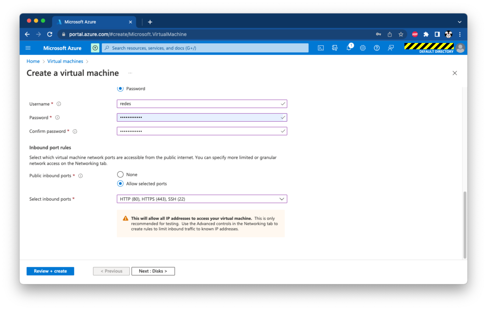

Asignar los discos de la máquina virtual

- Establecer el tipo de disco `Standard SSD`
- Dejar todas las demas opciones en su valor predeterminado

| Portal de Azure - Crear máquina virtual - Opciones de disco
|:-----------------------------------------------------------:|
| 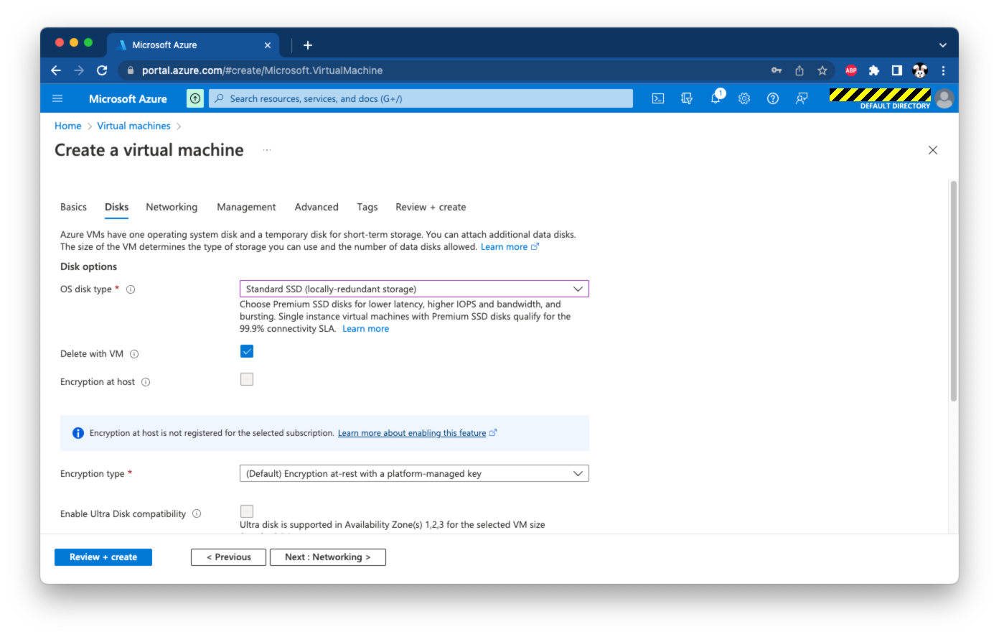

Asignar las opciones de conectividad

- Dar clic en **Create new** en la sección **Public IP**
- Establecer el nombre `Debian-Redes-IP-Publica` (sin acentos)
- Dar clic en **OK**

| Portal de Azure - Crear máquina virtual - Interfaz de red
|:---------------------------------------------------------:|
| 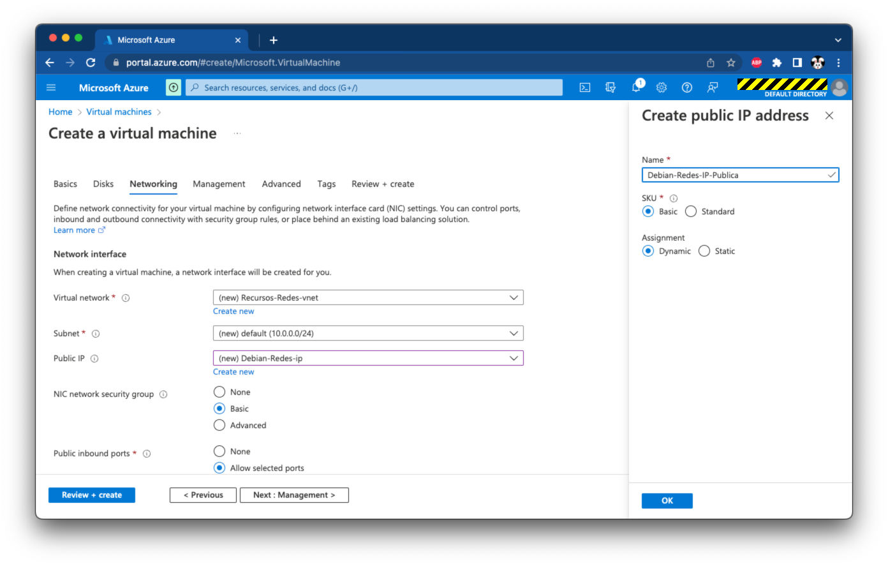

- Asegurarse de que se permite el acceso en los puertos `22`, `80` y `443`
- **Marcar la casilla** `[x]` _Delete public IP and NIC when VM is deleted_
- Dar clic en **Next**

| Portal de Azure - Crear máquina virtual - Reglas de acceso
|:---------------------------------------------------------:|
| 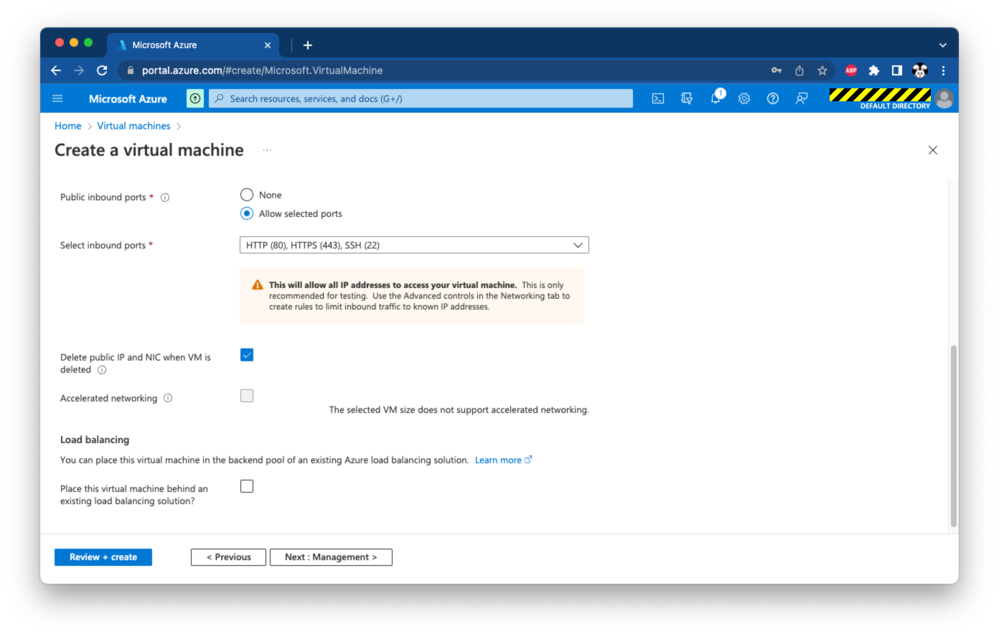

Establecer las opciones de administración

- **Dejar desmarcada la casilla** `[ ]` _Enable basic plan for free_

Seleccionar una cuenta personalizada de diagnóstico

- **Seleccionar la opción** `(*)` _Enable with custom storage account_
- Seleccionar **Create new** en la opción _Diagnostics storage account_
- Anotar `redesdiag01` en el nombre
- Seleccionar `Storage (general purpose v1)` en el tipo de cuenta
- Seleccionar `Standard` en la opción de rendimiento
- Seleccionar `Locally Redundant Storage (LRS)` en la opción de replicación
- Dejar todas las demás opciones en su valor predeterminado
- Dar clic en **Next**

| Portal de Azure - Crear máquina virtual - Administración
|:--------------------------------------------------------:|
| 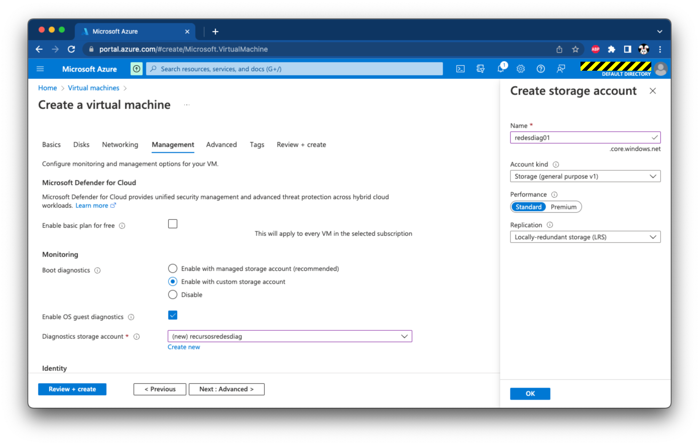

Dejar **TODAS** las opciones del panel **avanzado** en su valor predeterminado y dar clic en **Next**

| Portal de Azure - Crear máquina virtual - Avanzado
|:--------------------------------------------------:|
| 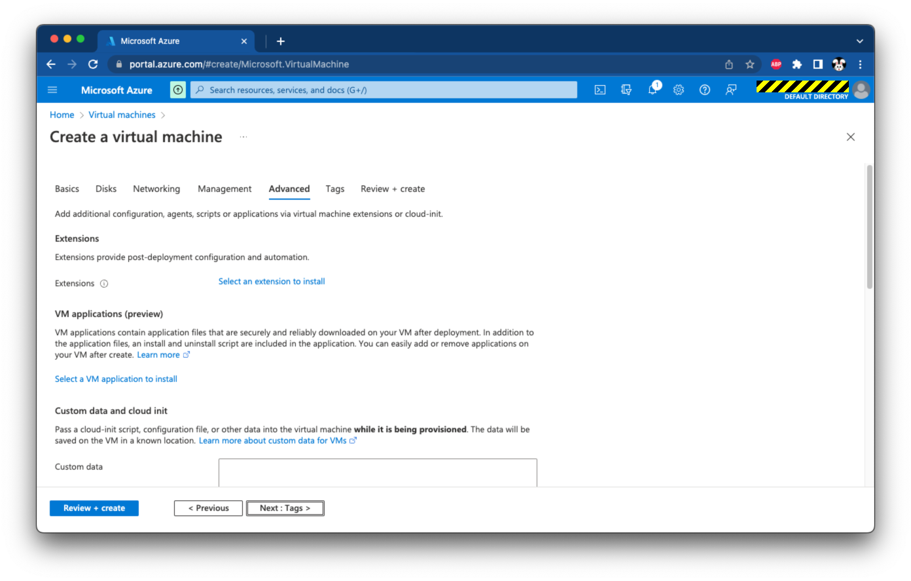

Establecer las etiquetas para los recursos

- Agregar las siguientes etiquetas
- Dar clic en **Next**

| Nombre      | Valor                      |
|:-----------:|:--------------------------:|
| **Materia** | `Redes 2022-2`
| **Equipo**  | `Equipo-AAAA-BBBB-CCCC-DDDD`

| Portal de Azure - Crear máquina virtual - Etiquetas
|:---------------------------------------------------:|
| 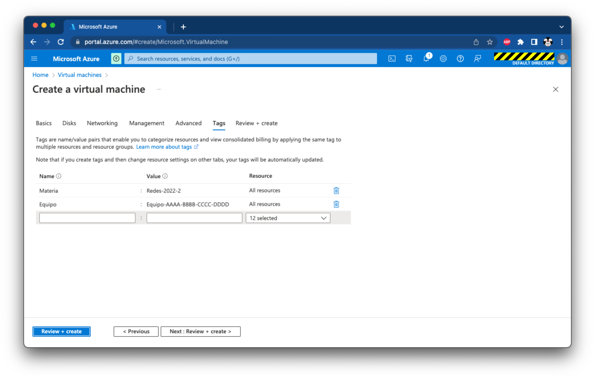

Revisar la configuración y dar clic en **Create**

!!! note
    En algunas cuentas se pide adicionalmente el **nombre**, **correo electrónico** y **teléfono**

| Portal de Azure - Crear máquina virtual - Confirmación
|:------------------------------------------------------:|
| 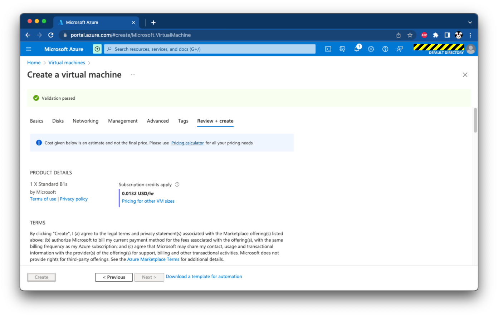

#### Crear reglas de acceso

Esperar a que el despliegue de la máquina virtual termine

| Portal de Azure - Desplegar máquina virtual
|:------------------------------------------------:|
| 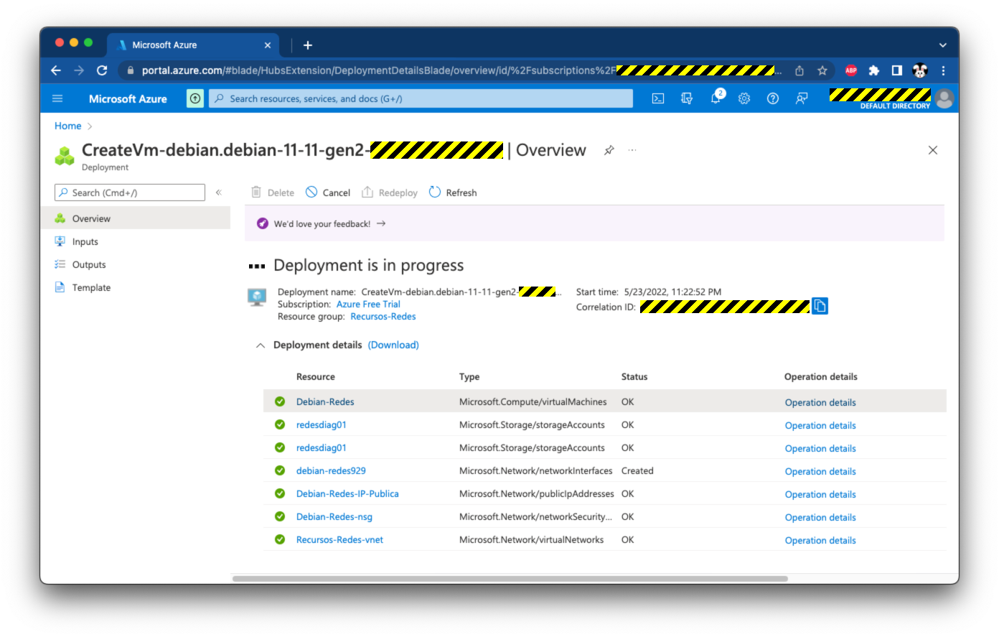

Abrir en una nueva pestaña el **grupo de seguridad** `Debian-Redes-nsg`

- Ir a la sección **Inbound security rules**
- Verificar que existan reglas para las conexiones **SSH**, **HTTP** y **HTTPS**
- Agregar las reglas en caso de que no estén presentes
- Cerrar la pestaña

| Portal de Azure - Máquina virtual - Reglas de seguridad
|:-------------------------------------------------------:|
| 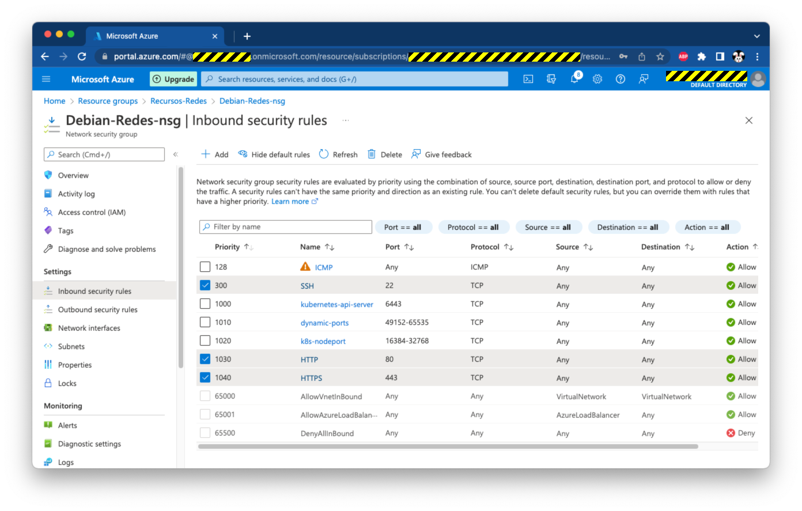

Abrir en una nueva pestaña la **máquina virtual** `Debian-Redes`

- Obtener la dirección IP pública asociada a esta máquina virtual

| Portal de Azure - Máquina virtual - IP pública
|:------------------------------------------------:|
| 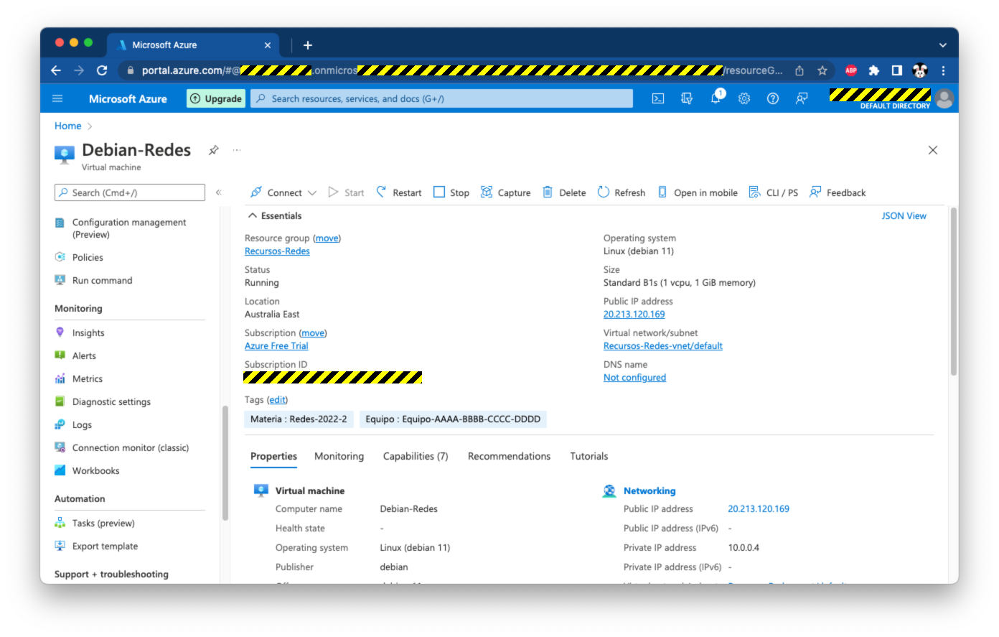

--------------------------------------------------------------------------------

!!! note
    - Si ya creaste tu máquina virtual, continúa en [la siguiente página](../nombre-de-dominio)

--------------------------------------------------------------------------------

[azure-portal]: https://portal.azure.com/
