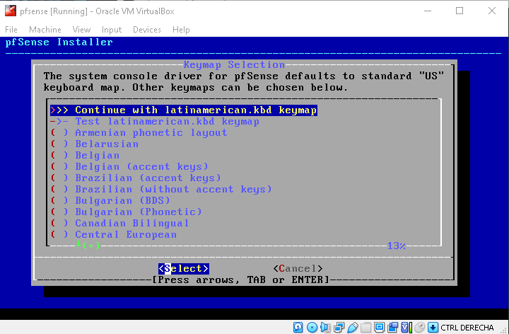
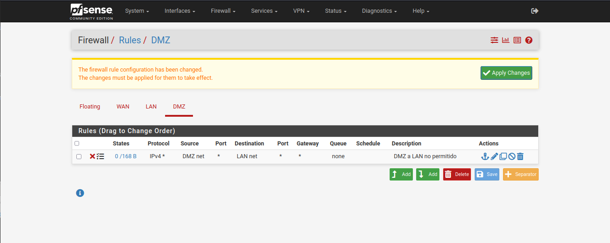

# Práctica 7: Configuración de un firewall de red con pfSense

--------------------------------------------------------------------------------

## Objetivo

El alumno realizará la instalación y configuración de una máquina virtual pfSense con los servicios de red NAT, DHCP, DMZ y Port Forwarding para permitir que otras máquinas tengan salida a Internet, así como que otros dispositivos de Internet tengan acceso a servicios en la DMZ.

## Elementos de apoyo

- [Imagen ISO de pfSense 💽][pfsense-iso]
- [Imagen ISO de Alpine Linux 💽][alpine-linux-iso]

- [Cómo compactar y exportar una máquina virtual de VirtualBox 📝][virtualbox-compact-export-vm]

- [Protocolo ARP 📼][video-protocolo-arp]
- [Protocolo DHCP 📼][video-protocolo-dhcp]
- [Protocolo DNS 📼][video-protocolo-dns]

- [Configuración manual de direcciones IP en GNU/Linux 📼][video-ip-manual]
- [Configuración persistente de direcciones IP en GNU/Linux 📼][video-ip-persistente]

- [Guía de instalación de pfSense 📚][pfsense-docs-install]
- [Guía de configuración de pfSense 📚][pfsense-docs-config]
- [Guía de configuración de interfaces de pfSense 📚][pfsense-docs-interfaces]
- [Guía de configuración de _firewall_ de pfSense 📚][pfsense-docs-firewall]
- [Guía de configuración de NAT de pfSense 📚][pfsense-docs-nat]
- [Guía de configuración de ruteo de pfSense 📚][pfsense-docs-routing]
- [Guía de configuración de DHCP de pfSense 📚][pfsense-docs-dhcp]
- [Guía de configuración de DNS de pfSense 📚][pfsense-docs-dns]
- [Guía de diagnóstico de pfSense 📚][pfsense-docs-diagnostics]
- [Guía de resolución de problemas de pfSense 📚][pfsense-docs-troubleshooting]
- [Guía de respaldo de pfSense 📚][pfsense-docs-backup]

## Restricciones

- La fecha límite de entrega es el **viernes 11 de noviembre de 2022** a las 23:59 horas `*`
- Esta actividad debe ser entregada **en equipo** de acuerdo al [flujo de trabajo para la entrega de tareas y prácticas][flujo-de-trabajo]
- Crear una nueva rama llamada `practica-7`
- Utilizar la carpeta `docs/practicas/practica-7/Equipo-ABCD-EFGH-IJKL-MNOP` para entregar la práctica
    - Donde `Equipo-ABCD-EFGH-IJKL-MNOP` representa el nombre del equipo que debió anotarse previamente en la [lista del grupo][lista-redes]
- Crear un _merge request_ en el [repositorio de tareas][repo-tareas] para entregar la actividad

## Entregables

- Archivo `README.md`
    - Explicación de la topología de red utilizada
    - Procedimiento de configuración de NAT, Port Forwarding, servidor DHCP y DMZ
    - Procedimiento para reservar una dirección IP en el servidor DHCP
    - Explicación de las bitácoras generadas
    - Explicación de las reglas
    - Procedimiento básica de seguridad del pfsense
        - Nombre del host: debe ser el del equipo
        - Visualización del nombre completo
        - Acceso a consola solicitando credenciales de seguridad (agregar las nuevas credenciales)
        - Configuración segura del servicio SSH
        - Limitación de acceso a la WEB de administración, solo desde la DMZ
    - Visualizar la configuración de pfSense al conectarse via SSH:
        - Reglas PF (`pfctl -sr`)
        - Tablas (`pfctl -s Tables`)
        - Estados de NAT (`pfctl -ss`)
        - Reglas de NAT (`pfctl -s NAT`)
    - [Conclusiones](#conclusiones) sobre las capturas de tráfico de red

- Carpeta `files`
    - Archivo de configuración `config.xml` del pfSense
    - Cliente DHCP (CentOS, Debian o Alpine/otro)
        - Tabla ARP
        - Tabla de rutas
        - Salida de los comandos de configuración de red
        - Salida de los comandos con las pruebas de conectividad local
        - Salida de los comandos con las pruebas de conectividad externa
            - Salida (imágenes) de las consultas mediante los navegadores del cliente WAN a servicios de la DMZ **HTTP**, **HTTPS** y de acceso al servicio **SSH**
            - Estados del pfsense donde se indiquen las conexiones de NAT

--------------------------------------------------------------------------------

## Introducción 

PfSense versión Community Edition es una plataforma de la compañía Netgate, desarrollada en el sistema FreeBSD UNIX con licencia de código libre, que proporciona servicios como firewall, router, red privada virtual (VPN por sus siglas en inglés),sistema de prevención/detección de Intrusos (IPS/IDS). DNS entre otros.

## Procedimiento

Se presentan los pasos para elaborar la configuración de un NAT, forwarder de DNS, DHCP y DMZ  utilizando la plataforma pfSense con base en la topología de red que se muestra a continuación:

<!--  -->
| Diagrama de Red
|:----:|
| 
<!--  -->

| Diagrama de interfaces de red en VirtualBox
|:----:|
| 

Para la red WAN, crear una NatNetwork, donde se debe conectar la interfaz em0 del pfSense y cliente Alpine/etc (eth0).

| Adaptador de red NAT Network
|:----:|
| 

!!! warning
    - Crear un _snapshot_ de la máquina virtual **pfSense** <u>antes</u> de realizar la configuración de los servicios de red.

### pfSense

#### Instalación
1. Descargar el sistema operativo pfSense, estableciendo el parametro _DVD Image_ (ISO) y l arquitectura _AMD64_, posteriormente descomprimir el archivo.

| Descarga pfSense
|:----:|
| 

2. Crear una máquina virtual en Virtualbox con 3 interfaces de red:

| Propiedades MV pfSense
|:----:|
| 

| Arranque del ISO
|:----:|
| 

| Términos y condiciones de la Política de uso
|:----:|
| 

| Instalación del sistema
|:----:|
| 

| Distribución de teclado
|:----:|
| 

| Sistema de archivos
|:----:|
| 

| Resumen de las opciones de instalación
|:----:|
| 

| Instalación
|:----:|
| 

| Solicitud de reinicio
|:----:|
| 

#### Configuración inicial

1. Ingresar a la consola y establecer las direcciones IP de acuerdo a los parámetros indicados a continuación:

| Interfaz        | Red                       | Tipo     | Dirección IP   | DHCP VirtualBox
|:---------------:|:-------------------------:|:--------:|:--------------:|:---------------:|
| `em0` - **WAN** | NAT Network               | DHCP     | 10.0.2.Y       | _No aplica_
| `em1` - **LAN** | Host-Only (`vboxnet0`)`¹` | Estática | 192.168.56.254 | **Deshabilitado**
| `em2` - **DMZ** | Host-Only (`vboxnet1`)`²` | Estática | 172.16.1.254   | **Deshabilitado**

!!! warning
    - `¹`: La red `vboxnet0` ya debería estar creada
    - `²`: Crear la red `vboxnet1` con el direccionamiento adecuado

2. Seleccionar del menú la opción 1, para asignar las interfaces.
3. Establecer que no se necesitan VLANs
4. Definir interfaz **WAN**: `em0`
5. Definir interfaz **LAN**: `em1`
6. Definir interfaz **OPT1**: `em2`
7. Aceptar los cambios
8. Seleccionar del menú la opción 2, establecer las direcciones IP a cada interfaz.
9. Seleccionar la interfaz 1 (WAN)
10. Establecer dirección IP estática, máscara de red y gateway.
11. No permitir el DHCP v6
12. No permitir revertir al protocolo http.
13. Finalizar
14. Repetir pasos del 2 al 13 para las interfaces LAN.
15. Establecer en la interfaz LAN el servidor DHCP y un rango de 10 IPs
16. Repetir pasos del 2 al 13 para las interfaces OPT1 (DMZ).
17. Cambiar nombre a la interfaz OPT1 

| Consola pfSense
|:----:|
| 

| Asignación de interfaces de red
|:----:|
| 

| Estado final de las interfaces de red
|:----:|
| 

18. Configurar los clientes disponibles CentOS, Debian, etc., a la interfaz LAN para obtener una dirección IP mediante el DHCP:

| Servidor CentOS (Red DMZ)
|:----:|
| 

| Cliente Debian (Red LAN)
|:----:|
| 

| Cliente Alpine (Red LAN)
|:----:|
| 

19. Abrir un navegador WEB en el cliente de su elección e ingresar a la interfaz WEB de administración
    - Las credenciales de acceso por defecto son `admin`/`pfsense`:

| Administración web
|:----:|
| 

| Configuración inicial
|:----:|
| 

| Información general
|:----:|
| 

| Cambio de contraseña
|:----:|
| 

| Finalizar configuración
|:----:|
| 

| Terminos y condiciones
|:----:|
| 

| _Dashboard_ principal
|:----:|
| 

#### Configuración de las reglas para la DMZ 

20. Generar regla de bloqueo de tráfico de la DMZ a la LAN, en la interfaz DMZ.
    - Firewall->Rules->DMZ.
    - Hacer clic en el botón _add_ para agregar nuevas reglas, considerar los siguientes parámetros :
        - Action: Block
        - Interface: DMZ.
        - Address Family: IPv4
        - Protocol: Any.
        - Source : DMZ Net.
        - Destination : LAN net.
    - Al finalizar hacer clic en el botón _save_, posteriormente aplicar cambios con el botón _apply Changes_.

| Regla DMZ parámetros
|:----:|
| 

| Reglas DMZ
|:----:|
| 

21. Generar Alias para los puertos de acceso de internet al servidor WEB y conexión remota segura
    - Firewall -> Alias->Ports.
    - Hacer clic en el botón _add_ para agregar alias, considerar los siguientes parámetros :
        - Name: WEB_SSH.
        - Description : Acceso servidor WEB y SSH.
        - Puertos y descripcion: _http, https, DNS y SSH_
        - Click en el botón _add ports_.
    - Al finalizar hacer clic en el botón _save_, posteriormente aplicar cambios con el botón _apply Changes_.

| Alias Puertos
|:----:|
| 

22. Generar Alias para los servidores WEB que tendrán acceso desde Internet
    - Firewall -> Alias->IP.
    - Hacer clic en el botón _add_ para agregar alias, considerar los siguientes parámetros :
        - Name: DMZ_WEB_ACCESO
        - Description : Dispositivos DMZ Acceso.
        - Host: dirección IP y descripción
    - Al finalizar hacer clic en el botón _save_, posteriormente aplicar cambios con el botón _apply Changes_.

| Alias IP
|:----:|
| 

23. Generar regla de acceso de internet al servidor WEB
    - Firewall->Rules->DMZ.
    - Hacer clic en el botón _add_ para agregar nuevas reglas, considerar los siguientes parámetros :
        - Action: Pass
        - Interface: DMZ.
        - Address Family: IPv4
        - Protocol: TCP/UDP
        - Source : DMZ Net.
        - Destination : Any.
    - Al finalizar hacer clic en el botón _save_, posteriormente aplicar cambios con el botón _apply Changes_.

| Regla Acceso Internet
|:----:|
| 

24. Configuración de Port forwarding para acceso a la DMZ
    - Firewall->NAT->Port Forward
    - Hacer clic en el botón _add_ para agregar nuevas reglas, considerar los siguientes parámetros :
        - Interface: WAN.
        - Address Family: IPv4
        - Protocol: TCP
        - Destination : WAN address
        - Destination port range: http
        - Redirect target IP: 172.16.1.101
        - Redirect target port: http
        - Description: Port forwarding DMZ Web Server
    - Al finalizar hacer clic en el botón _save_, posteriormente aplicar cambios con el botón _apply Changes_.
    - Replicar configuración de Port Forwarding para los servicios _https_ y _ssh_.

| Port Forwarding servicio http
|:----:|
| 

| Regla en interfaz WAN para Port Forwarding http
|:----:|
| 

25. Pruebas de conectividad desde la WAN a los servicios de la DMZ

| Conexión desde cliente WAN al servicio http
|:----:|
| 

| Conexión desde cliente WAN al servicio https
|:----:|
| 

| Conexión desde cliente WAN al servicio SSH
|:----:|
| 

| Estados de conexión en el pfSense
|:----:|
| 

#### Configuración de DHCP Reservado

26. Identificar la dirección MAC del cliente en la red LAN.

| Dirección MAC del Cliente Debian
|:----:|
| 

26. Ingresar al pfsense Services>DHCP Server> LAN
27. En el apartado del final _DHCP Static Mappings for this Interface_, hacer clic en el botón _add_.
28. Llenar los siguientes parámetros:
    - MAC Address
    - IP Address
    - Hostname 
    - Descripción: un nombre descriptivo
    - Seleccionar la casilla _Create an ARP Table Static_ para enlazar la IP y MAC.
    - Al finalizar hacer clic en el botón _save_, posteriormente aplicar cambios con el botón _apply Changes_.

|DHCP Static Mapping parámetros 
|:----:|
| 

|DHCP Static Mapping Verificación
|:----:|
| 

|Estado del servicio DHCP
|:----:|
| 

|Validar dirección IP en virtual.
|:----:|
| 

--------------------------------------------------------------------------------

### Conclusiones

- Comparar las ventajas y desventajas de utilizar pfSense contra realizar la configuración manual en GNU/Linux
    - Comparar la configuración de un _appliance_ de firewall como pfSense utilizando la consola web contra hacer la configuración de cada servicio a mano en un sistema operativo GNU/Linux de propósito general (router con `sysctl`, NAT con `iptables`, DNS forwarder, servidor DHCP) y mencionar las ventajas y desventajas de cada opción
- Al analizar las reglas de pfSense, ¿Cuándo se usa reject o block?
- ¿Qué tipo de política se usa en la práctica: permisiva o restrictiva? Justifica la respuesta
    - ¿Cúal se considera mejor?

## Extra

- Elabora un video donde expliquen la topología de red utilizada y realicen las pruebas de conectividad.

    - Subir el video a YouTube y agregar la referencia de este video al archivo `README.md`

```text
- [Video de la topología de red utilizada 📼](https://youtu.be/0123456789ABCDEF)
```

- Agregar el servicio de VPN:
    
    - Conectar un cliente desde la red WAN a la VPN de tal manera que pueda acceder a los dispositivos de la red LAN por SSH, HTTP y HTTPS.

--------------------------------------------------------------------------------

[flujo-de-trabajo]: https://redes-ciencias-unam.gitlab.io/2023-1/tareas-redes/workflow/
[repo-tareas]: https://gitlab.com/Redes-Ciencias-UNAM/2023-1/tareas-redes/-/merge_requests

[lista-redes]: https://tinyurl.com/Lista-Redes-2023-1

[video-protocolo-arp]: https://www.youtube.com/watch?v=bqNLVQDqmLk
[video-protocolo-dhcp]: https://www.youtube.com/watch?v=6l4WQJfD7o0
[video-protocolo-dns]: https://www.youtube.com/watch?v=r4PntflJs9E

[video-ip-manual]: https://www.youtube.com/watch?v=H74s4_oJNYY
[video-ip-persistente]: https://www.youtube.com/watch?v=UErZ4i9XmLM

[alpine-linux-iso]: https://dl-cdn.alpinelinux.org/alpine/v3.16/releases/x86_64/alpine-virt-3.16.2-x86_64.iso

[pfsense-iso]: https://atxfiles.netgate.com/mirror/downloads/pfSense-CE-2.6.0-RELEASE-amd64.iso.gz

[pfsense-docs-start]: https://www.pfsense.org/getting-started/
[pfsense-docs-install]: https://docs.netgate.com/pfsense/en/latest/install/index.html
[pfsense-docs-config]: https://docs.netgate.com/pfsense/en/latest/config/index.html
[pfsense-docs-interfaces]: https://docs.netgate.com/pfsense/en/latest/interfaces/index.html
[pfsense-docs-firewall]: https://docs.netgate.com/pfsense/en/latest/firewall/index.html
[pfsense-docs-nat]: https://docs.netgate.com/pfsense/en/latest/nat/index.html
[pfsense-docs-routing]: https://docs.netgate.com/pfsense/en/latest/routing/index.html
[pfsense-docs-dhcp]: https://docs.netgate.com/pfsense/en/latest/services/dhcp/index.html
[pfsense-docs-dns]: https://docs.netgate.com/pfsense/en/latest/services/dns/index.html
[pfsense-docs-diagnostics]: https://docs.netgate.com/pfsense/en/latest/diagnostics/index.html
[pfsense-docs-troubleshooting]: https://docs.netgate.com/pfsense/en/latest/troubleshooting/index.html
[pfsense-docs-backup]: https://docs.netgate.com/pfsense/en/latest/backup/index.html

[virtualbox-compact-export-vm]: ../../temas/virtualbox-compact-export-vm/
