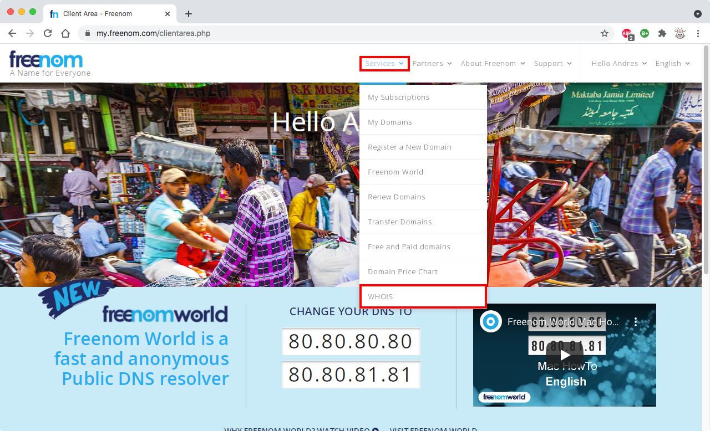

# Nombre de dominio y zona DNS

## Registrar nombre de dominio en FreeNom

<!--
| Página de inicio de FreeNom
|:---------------------------:|
| 

| Inicio de sesión en FreeNom
|:---------------------------:|
| 
-->

Ir a la página de FreeNom, dar clic en **Services** y después en **Register a new domain**

| Menú de registro de dominio
|:---------------------------:|
| 

Escribir el nombre de dominio deseado en el cuadro de búsqueda y dar clic en **Check availability**.

- Los TLD gratuitos son `cf.`, `tk.`, `ml.`, etc.

| Búsqueda del nombre de dominio
|:------------------------------:|
| 

Si el nombre está disponible se mostrará una sección para elegirlo.
Dar clic en el botón **Checkout** para ir a la siguiente sección

| Disponibilidad del nombre de dominio
|:------------------------------------:|
| 

Seleccionar los campos para completar el formulario

- **12 Months @ FREE** como duración del registro
- <span style="color: green;">**Use DNS**</span> para tener administración completa del nombre de dominio
- **Use FreeNom DNS servers**, esto se cambiará más adelante
- Llenar un registro de prueba, esto se cambiará más adelante:
    - **Hostname**: `redes`
    - **IP Address**: `127.0.0.1`
- Dar clic en **Continue**

<!-- FIXME -->
| Ajustes de duración y servidores NS
|:-----------------------------------:|
| 

El sitio pedirá crear una cuenta de usuario

- Utilizar la **dirección de correo** `@ciencias.unam.mx` o `@comunidad.unam.mx`
- <span style="color: red;">No utilizar _Google Account_ o _FaceBook_</span>

Completar el pedido

- Verificar que el total sea **$0.00 USD**
- Marcar la casilla `[*]` <i>**I have read and agree to the terms and conditions**</i>
- Dar clic en **Complete Order**

!!! warning
    Debes completar la validación de tu cuenta de usuario vía correo electrónico con las instrucciones que te da FreeNom

| Completar pedido
|:------------------------:|
| 

Esperar a recibir el correo de confirmación de FreeNom

| Confirmación de la orden
|:------------------------:|
| 

--------------------------------------------------------------------------------

## Crear zona DNS en Azure

Ir al portal de Azure, dar clic en la barra de búsqueda y escribir `DNS`.
Seleccionar **DNS Zones**

| Portal de Azure
|:------------------------:|
| 

Se abrirá el panel de administración de las zonas DNS, d ar clic en **Create DNS Zone**

| Panel de administración de zonas DNS
|:------------------------:|
| 

Llenar el formulario

- Seleccionar el grupo de recursos `Recursos-Redes` que se utilizó en la máquina virtual
- Escribir el nombre de dominio que se registró en FreeNom
- Dar clic en **Next**

| Crear zona DNS - Detalles
|:------------------------:|
| 

Establecer las etiquetas para los recursos

- Agregar las siguientes etiquetas
- Dar clic en **Next**

| Nombre      | Valor                      |
|:-----------:|:--------------------------:|
| **Materia** | `Redes 2022-2`
| **Equipo**  | `Equipo-AAAA-BBBB-CCCC-DDDD`

| Crear zona DNS - Etiquetas
|:---------------------------------------------------:|
| 

Revisar la configuración y dar clic en **Create**

| Crear zona DNS - Confirmar
|:------------------------:|
| 

Esperar a que termine el despliegue de la zona DNS

- Dar clic en **Deployment details**
- Dar clic en el nombre de dominio para abrir el panel de administración de la zona DNS

| Crear zona DNS - Despliegue completo
|:------------------------:|
| 

--------------------------------------------------------------------------------

## Asociar la zona DNS con el nombre de dominio

El panel de administración muestra los servidores NS para la zona DNS en la sección derecha

| Zona DNS - Servidores NS
|:------------------------:|
| 

Abrir en otra pestaña la página inicial de FreeNom, dar clic en **Services** y después en **My Domains**

| Menú de dominios registrados
|:----------------------------:|
| 

Dar clic en **Manage Domain** para acceder a las opciones de administración

| Administrar dominio
|:------------------------:|
| 

Cambiar los servidores NS autoritativos asociados al dominio

- Dar clic en **Management Tools**
- Dar clic en **Nameservers**

| Editar servidores NS
|:------------------------:|
| <!--  -->
| 

Establecer los nuevos servidores NS para el dominio

- Seleccionar la casilla `(*)` **Use custom nameservers**
- Copiar uno a uno los nombres de los servidores NS autoritativos para la zona
- Dar clic en **Change Nameservers** para continuar

| 
|:------------------------:|
| <!--  -->
| 

--------------------------------------------------------------------------------

## Crear registros en la zona DNS

Ir al panel administrativo de la zona DNS y dar clic en **Record Set** para crear el registro `A` principal para este dominio

- Escribir `@` en el nombre del registro para que sea el registro principal de este dominio
- Seleccionar el tipo `A` para asociarlo a una dirección IPv4
- Seleccionar la opción `No` para **Alias record set**
- Establecer el **TTL** con un valor de `5 minutos`
- Anotar la **dirección IP pública** de la máquina virtual

| Zona DNS - Crear registro `A` principal
|:------------------------:|
| 

Dar clic en **Record Set** para crear un nuevo registro `CNAME` _wildcard_ para este dominio

- Escribir `*` en el nombre del registro para que responda a cualquier nombre bajo el dominio DNS
- Seleccionar el tipo `CNAME` para apuntarlo a otro registro DNS
- Seleccionar la opción `No` para **Alias record set**
- Establecer el **TTL** con un valor de `5 minutos`
- Anotar el nombre de dominio principal (ej. `example.com`) como valor del registro CNAME

| Zona DNS - Crear registro `CNAME` _wildcard_
|:------------------------:|
| 

<!--
!!! note
    Después se crearán otros registros para validar el dominio con Let's Encrypt
-->

--------------------------------------------------------------------------------

## WHOIS

<details open>
  <summary>
    El servicio WHOIS de FreeNom presenta fallas y actualmente no se puede utilizar para verificar si un nombre de dominio está registrado
  </summary>

```text
usuario@laptop ~ % whois tonejito.cf.
% IANA WHOIS server
% for more information on IANA, visit http://www.iana.org
% This query returned 1 object

refer:        whois.dot.cf

domain:       CF

	...

# whois.dot.cf

Invalid query or domain name not known in the Dot CF Domain Registry

```

</details>

| Menú `WHOIS`
|:------------------------:|
| 

| Búsqueda WHOIS
|:------------------------:|
| 

| Resultados `WHOIS`
|:------------------------:|
| 

--------------------------------------------------------------------------------

## Búsquedas DNS

### Registro `SOA` 

- _Start of Authority_

```text
usuario@laptop ~ % dig SOA tonejito.cf.

; <<>> DiG 9.10.6 <<>> SOA tonejito.cf.
;; global options: +cmd
;; Got answer:
;; ->>HEADER<<- opcode: QUERY, status: NOERROR, id: 29086
;; flags: qr rd ra; QUERY: 1, ANSWER: 1, AUTHORITY: 0, ADDITIONAL: 0

;; QUESTION SECTION:
;tonejito.cf.			IN	SOA

;; ANSWER SECTION:
tonejito.cf.		3600	IN	SOA	ns1-36.azure-dns.com. azuredns-hostmaster.microsoft.com. 1 3600 300 2419200 300

;; Query time: 46 msec
;; SERVER: 1.1.1.1#53(1.1.1.1)
;; WHEN: Wed May 25 00:59:51 CDT 2022
;; MSG SIZE  rcvd: 115
```

### Registros `NS`

- _NameServers_

```text
usuario@laptop ~ % dig NS tonejito.cf. 

; <<>> DiG 9.10.6 <<>> NS tonejito.cf.
;; global options: +cmd
;; Got answer:
;; ->>HEADER<<- opcode: QUERY, status: NOERROR, id: 34515
;; flags: qr rd ra; QUERY: 1, ANSWER: 4, AUTHORITY: 0, ADDITIONAL: 8

;; QUESTION SECTION:
;tonejito.cf.			IN	NS

;; ANSWER SECTION:
tonejito.cf.		172763	IN	NS	ns3-36.azure-dns.org.
tonejito.cf.		172763	IN	NS	ns4-36.azure-dns.info.
tonejito.cf.		172763	IN	NS	ns1-36.azure-dns.com.
tonejito.cf.		172763	IN	NS	ns2-36.azure-dns.net.

;; ADDITIONAL SECTION:
ns1-36.azure-dns.com.	1794	IN	A		150.171.10.36
ns1-36.azure-dns.com.	3152	IN	AAAA	2603:1061:0:10::24
ns2-36.azure-dns.net.	2891	IN	A		150.171.16.36
ns2-36.azure-dns.net.	3009	IN	AAAA	2620:1ec:8ec:10::24
ns3-36.azure-dns.org.	3213	IN	A		13.107.222.36
ns3-36.azure-dns.org.	3269	IN	AAAA	2a01:111:4000:10::24
ns4-36.azure-dns.info.	723		IN	A		13.107.206.36
ns4-36.azure-dns.info.	3563	IN	AAAA	2620:1ec:bda:10::24

;; Query time: 23 msec
;; SERVER: 1.1.1.1#53(1.1.1.1)
;; WHEN: Wed May 25 01:00:05 CDT 2022
;; MSG SIZE  rcvd: 342
```

### Registro `A` principal

```text
usuario@laptop ~ % dig A tonejito.cf.

; <<>> DiG 9.10.6 <<>> A tonejito.cf.
;; global options: +cmd
;; Got answer:
;; ->>HEADER<<- opcode: QUERY, status: NOERROR, id: 8526
;; flags: qr rd ra; QUERY: 1, ANSWER: 1, AUTHORITY: 0, ADDITIONAL: 0

;; QUESTION SECTION:
;tonejito.cf.			IN	A

;; ANSWER SECTION:
tonejito.cf.		300	IN	A	20.211.162.108

;; Query time: 86 msec
;; SERVER: 1.1.1.1#53(1.1.1.1)
;; WHEN: Wed May 25 01:28:15 CDT 2022
;; MSG SIZE  rcvd: 45
```

### Registro `CNAME` _wildcard_

El registro `azure.tonejito.cf.` coincide con el **CNAME** `*.tonejito.cf.`

```text
usuario@laptop ~ % dig A azure.tonejito.cf.

; <<>> DiG 9.10.6 <<>> A azure.tonejito.cf.
;; global options: +cmd
;; Got answer:
;; ->>HEADER<<- opcode: QUERY, status: NOERROR, id: 7161
;; flags: qr rd ra; QUERY: 1, ANSWER: 2, AUTHORITY: 0, ADDITIONAL: 0

;; QUESTION SECTION:
;azure.tonejito.cf.		IN	A

;; ANSWER SECTION:
azure.tonejito.cf.	300	IN	CNAME	tonejito.cf.
tonejito.cf.		295	IN	A	20.211.162.108

;; Query time: 53 msec
;; SERVER: 1.1.1.1#53(1.1.1.1)
;; WHEN: Wed May 25 01:28:20 CDT 2022
;; MSG SIZE  rcvd: 65
```

--------------------------------------------------------------------------------

!!! note
    - Si ya registraste tu nombre de dominio, configuraste tu zona DNS y creaste los registros, continúa en [la siguiente página](../maquina-virtual-linux)

--------------------------------------------------------------------------------
