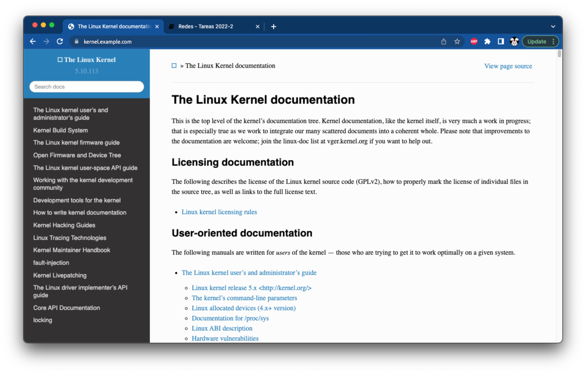
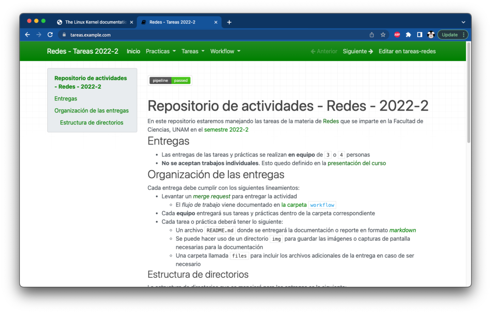

# Configuración de VirtualHosts para HTTP y HTTPS

## VirtualHosts en Apache HTTPD

--------------------------------------------------------------------------------

### VirtualHosts para documentación del _kernel_ Linux

Crea dos registros de tipo `A` apuntando a la dirección IP de tu máquina virtual

| Nombre                  | Tipo    | Valor                |
|------------------------:|:-------:|---------------------:|
|     `docs.example.com.` | `A`     |     `20.213.120.169` |
|   `kernel.example.com.` | `A`     |     `20.213.120.169` |

!!! note
    Reemplaza `example.com` con tu nombre de dominio

Revisa que existan los siguientes registros utilizando el comando `dig` o `nslookup`

  - `docs.example.com.`
  - `kernel.example.com.`

Instala el paquete `linux-doc`:

```
root@example:~# apt -qy install linux-doc
```

Revisa que la ruta `/usr/share/doc/linux-doc` sea una _liga simbólica_ hacia la documentación de la versión del kernel

```
root@example:~# ls -lA /usr/share/doc/linux-doc
lrwxrwxrwx 1 root root 14 Apr 29 04:36 /usr/share/doc/linux-doc -> linux-doc-5.10

root@example:~# ls -lA /usr/share/doc/linux-doc/
total 656
drwxr-xr-x 80 root root   4096 May 29 02:34 Documentation
drwxr-xr-x 78 root root   4096 May 29 02:34 html
-rw-r--r--  1 root root  44728 Apr 27 06:53 CREDITS.gz
-rw-r--r--  1 root root 140415 Apr 27 06:53 MAINTAINERS.gz
-rw-r--r--  1 root root    727 Apr 27 06:53 README
-rw-r--r--  1 root root 450658 Apr 29 04:36 changelog.Debian.gz
-rw-r--r--  1 root root  13518 Apr 29 01:48 copyright
```

Crea el archivo `/etc/apache2/sites-available/docs.conf` con el siguiente contenido:

- Un VirtualHost que responda a `docs.example.com` y `kernel.example.com`

    - Incluye el VirtualHost de HTTP y HTTPS en el mismo archivo para facilitar la configuración

- La raíz del sitio está en la carpeta `/usr/share/doc/linux-doc/html`

- Estos VirtualHosts deben escribir sus bitácoras en la ruta `/var/log/apache2/docs_access.log` y `/var/log/apache2/docs_error.log`

- Puedes poner la directiva `LogLevel` con el valor `info ssl:warn`

- Recuerda que se debe agregar la directiva `<Directory>` correspondiente puesto que este contenido está fuera de `/var/www`

- Recuerda agregar la configuración de `mod_rewrite` que tienes presente en `/etc/apache2/sites-enabled/000-default.conf` en el VirtualHost de HTTP para redirigir las peticiones hacia HTTPS

    - Esta configuración tiene que estar **dentro** del bloque de `<VirtualHost>`

```
RewriteEngine on
RewriteCond %{SERVER_NAME} =docs.example.com [OR]
RewriteCond %{SERVER_NAME} =kernel.example.com
RewriteRule ^ https://%{SERVER_NAME}%{REQUEST_URI} [END,NE,R=permanent]
```

Habilita el VirtualHost para los dominios `docs.example.com` y `kernel.example.com`

```
root@example:~# a2ensite docs.conf

root@example:~# ls -la /etc/apache2/sites-available/docs.conf  /etc/apache2/sites-enabled/docs.conf
-rw-r--r-- 1 root root 1626 Aug  5 06:04 /etc/apache2/sites-available/docs.conf
lrwxrwxrwx 1 root root   28 Aug  5 06:04 /etc/apache2/sites-enabled/docs.conf -> ../sites-available/docs.conf
```

Verifica la configuración de Apache HTTPD y recarga el servicio

```
root@example:~# apachectl -t
Syntax OK

root@example:~# apachectl -S
VirtualHost configuration:
*:80                   is a NameVirtualHost
         default server example.com (/etc/apache2/sites-enabled/000-default.conf:1)
         port 80 namevhost example.com (/etc/apache2/sites-enabled/000-default.conf:1)
         port 80 namevhost docs.example.com (/etc/apache2/sites-enabled/docs.conf:1)
                 alias kernel.example.com
*:443                  is a NameVirtualHost
         default server example.com (/etc/apache2/sites-enabled/default-ssl.conf:2)
         port 443 namevhost example.com (/etc/apache2/sites-enabled/default-ssl.conf:2)
         port 443 namevhost docs.example.com (/etc/apache2/sites-enabled/docs.conf:24)
                 alias kernel.example.com


root@example:~# systemctl reload apache2
	...
```

Revisa con un navegador web que los dos VirtualHosts que acabas de crear respondan correctamente

- `https://docs.example.com/`
- `https://kernel.example.com/`

| VirtualHost de documentación del kernel
|:---------------------------------------:|
| 

--------------------------------------------------------------------------------

### VirtualHosts para el _repositorio de tareas_

Crea dos registros de tipo `CNAME` con los siguientes valores

| Nombre                | Tipo    | Valor                |
|----------------------:|:-------:|---------------------:|
|  `sitio.example.com.` | `CNAME` |       `example.com.` |
| `tareas.example.com.` | `CNAME` | `sitio.example.com.` |

!!! note
    Reemplaza `example.com` con tu nombre de dominio

Revisa que existan los siguientes registros utilizando el comando `dig` o `nslookup`

- `sitio.example.com.`
- `tareas.example.com.`

Instala los paquetes en el sistema operativo

```
root@example:~# apt install git mkdocs python3 python3-pip
```

Crea el archivo `/etc/apache2/sites-available/sitio.conf` con el siguiente contenido:

- Un VirtualHost que responda a `sitio.example.com` y `tareas.example.com`

- La raíz del sitio está en la carpeta `/srv/repositorio/public`

- Estos VirtualHosts deben escribir sus bitácoras en la ruta `/var/log/apache2/sitio_access.log` y `/var/log/apache2/sitio_error.log`

- Puedes poner la directiva `LogLevel` con el valor `info ssl:warn`

- Recuerda que se debe agregar la directiva `<Directory>` correspondiente puesto que este contenido está fuera de `/var/www`

- Recuerda agregar la configuración de `mod_rewrite` que tienes presente en `/etc/apache2/sites-enabled/000-default.conf` en el VirtualHost de HTTP para redirigir las peticiones hacia HTTPS

    - Esta configuración tiene que estar **dentro** del bloque de `<VirtualHost>`

```
RewriteEngine on
RewriteCond %{SERVER_NAME} =sitio.example.com [OR]
RewriteCond %{SERVER_NAME} =tareas.example.com
RewriteRule ^ https://%{SERVER_NAME}%{REQUEST_URI} [END,NE,R=permanent]
```

Cambia los permisos al directorio `/srv` para permitir que el usuario `redes` pueda crear archivos y carpetas

```
root@example:~# chown -c root:redes /srv
changed ownership of '/srv' from root:root to root:redes

root@example:~# chmod -c 0775 /srv
mode of '/srv' changed from 0755 (rwxr-xr-x) to 0775 (rwxrwxr-x)

root@example:~# ls -lAd /srv
drwxrwxr-x 2 root redes 4096 Jul 21 04:22 /srv
```

Ubica la rama donde estas entregando tus tareas en el repositorio

- `https://gitlab.com/USUARIO/tareas-redes.git`

Clona el repositorio de tareas del equipo utilizando el usuario `redes` y cambia a la **RAMA** que obtuviste en el paso anterior

```
redes@example:~$ git clone https://gitlab.com/USUARIO/tareas-redes.git /srv/repositorio

redes@example:~$ cd /srv/repositorio

redes@example:/srv/repositorio$ git checkout RAMA
```

Instala las dependencias de Python en la cuenta del usuario `redes`

```
redes@example:/srv/repositorio$ pip3 install --user --requirement requirements.txt 
	...
```

Convierte los archivos Markdown a HTML para el sitio estático utilizando `mkdocs`

```
redes@example:/srv/repositorio$ mkdocs build --strict --verbose 2>&1 | egrep -v '^DEBUG' | tee salida-mkdocs.log
	...
```

!!! warning
    - Revisa si hay alguna advertencia y corrige los errores
    - Incluye el archivo `salida-mkdocs.log` en la carpeta `files` de tu reporte

Lista el contenido del directorio `/srv/repositorio/public` y revisa que exista el archivo `index.html`

```
redes@example:/srv/repositorio$ ls -lA public
total 64
drwxr-xr-x  4 redes staff   128 Aug  3 02:54 css
drwxr-xr-x  7 redes staff   224 Aug  3 02:54 entrega
drwxr-xr-x  9 redes staff   288 Aug  3 02:54 fonts
drwxr-xr-x  3 redes staff    96 Aug  3 02:54 img
drwxr-xr-x  5 redes staff   160 Aug  3 02:54 js
drwxr-xr-x  6 redes staff   192 Aug  3 02:54 search
drwxr-xr-x  5 redes staff   160 Aug  3 02:54 workflow
-rw-r--r--  1 redes staff 16246 Aug  3 02:54 404.html
-rw-r--r--  1 redes staff 20338 Aug  3 02:54 index.html
-rw-r--r--  1 redes staff 15651 Aug  3 02:54 search.html
-rw-r--r--  1 redes staff  7860 Aug  3 02:54 sitemap.xml
-rw-r--r--  1 redes staff   625 Aug  3 02:54 sitemap.xml.gz
```

Habilita el VirtualHost para los dominios `sitio.example.com` y `tareas.example.com`

```
root@example:~# a2ensite sitio.example.com

root@example:~# ls -la /etc/apache2/sites-available/sitio.conf /etc/apache2/sites-enabled/sitio.conf
-rw-r--r-- 1 root root 1619 Aug  5 06:04 /etc/apache2/sites-available/sitio.conf
lrwxrwxrwx 1 root root   29 Aug  5 06:04 /etc/apache2/sites-enabled/sitio.conf -> ../sites-available/sitio.conf
```

Verifica la configuración de Apache HTTPD y recarga el servicio

```
root@example:~# apachectl -t
Syntax OK

root@example:~# apachectl -S
VirtualHost configuration:
*:80                   is a NameVirtualHost
         default server example.com (/etc/apache2/sites-enabled/000-default.conf:1)
         port 80 namevhost example.com (/etc/apache2/sites-enabled/000-default.conf:1)
         port 80 namevhost docs.example.com (/etc/apache2/sites-enabled/docs.conf:1)
                 alias kernel.example.com
         port 80 namevhost sitio.example.com (/etc/apache2/sites-enabled/sitio.conf:1)
                 alias tareas.example.com
*:443                  is a NameVirtualHost
         default server example.com (/etc/apache2/sites-enabled/default-ssl.conf:2)
         port 443 namevhost example.com (/etc/apache2/sites-enabled/default-ssl.conf:2)
         port 443 namevhost docs.example.com (/etc/apache2/sites-enabled/docs.conf:24)
                 alias kernel.example.com
         port 443 namevhost sitio.example.com (/etc/apache2/sites-enabled/sitio.conf:24)
                 alias tareas.example.com

root@example:~# systemctl reload apache2
```

Revisa con un navegador web que los dos VirtualHosts que acabas de crear respondan correctamente

- `https://sitio.example.com/`
- `https://tareas.example.com/`

| VirtualHost del sitio de tareas
|:---------------------------------------:|
| 

--------------------------------------------------------------------------------

## Revisión de la redirección de HTTP a HTTPS

Revisa que `curl` te redirija desde el sitio de HTTP a su versión con HTTPS

- El código de estado de HTTP debe ser `301` o `302`
- La cabecera `Location` debe estar presente y su valor apunta a la versión HTTPS del sitio
- El contenido de la página muestra que el documento fue movido a una nueva ubicación

```
redes@example:~$ curl -v "http://example.com/"
*   Trying 20.213.120.169...
* TCP_NODELAY set
* Connected to example.com (20.213.120.169) port 80 (#0)
> GET / HTTP/1.1
> Host: example.com
> User-Agent: curl/7.54.0
> Accept: */*
>
< HTTP/1.1 301 Moved Permanently
< Date: Tue, 03 Aug 2021 12:40:05 GMT
< Server: Apache
< Location: https://example.com/
< Content-Length: 317
< Content-Type: text/html; charset=iso-8859-1
<
<!DOCTYPE HTML PUBLIC "-//IETF//DTD HTML 2.0//EN">
<html><head>
<title>301 Moved Permanently</title>
</head><body>
<h1>Moved Permanently</h1>
<p>The document has moved <a href="https://example.com/">here</a>.</p>
<hr>
<address>Apache Server at example.com Port 80</address>
</body></html>
* Connection #0 to host example.com left intact
```

Repite este paso para todos los dominios configurados en tus VirtualHosts

- `http://20.213.120.169/`
- `http://example.com/`
- `http://docs.example.com/`
- `http://kernel.example.com/`
- `http://sitio.example.com/`
- `http://tareas.example.com/`

--------------------------------------------------------------------------------

## Validación de VirtualHosts

Visita los dominios con un navegador web para comprobar que el `VirtualHost` esté configurado correctamente

| Dominio                       | Sitio                                      |
|------------------------------:|:-------------------------------------------|
|     `https://20.213.120.169/` | Página genérica                            |
|        `https://example.com/` | Página genérica                            |
|   `https://docs.example.com/` | Documentación del _kernel_ Linux           |
| `https://kernel.example.com/` | Documentación del _kernel_ Linux           |
|  `https://sitio.example.com/` | Sitio estático del _repositorio de tareas_ |
| `https://tareas.example.com/` | Sitio estático del _repositorio de tareas_ |

!!! note
    - Se recomienda utilizar una **ventana de incógnito** en el navegador para evitar problemas de caché

--------------------------------------------------------------------------------

## Verificar configuración

Reinicia el equipo para verificar que los cambios sean persistentes

```
root@example:~# reboot
```

!!! danger
    - Verifica que **TODAS** las configuraciones que hiciste estén presentes respués de reiniciar la máquina antes de continuar con la siguiente sección

!!! note
    - Regresa a [la página principal y elabora tu reporte](../#entregables) cuando hayas terminado de configurar los VirtualHosts, tengas el contenido de los sitios web y hayas validado todas las configuraciones

--------------------------------------------------------------------------------
