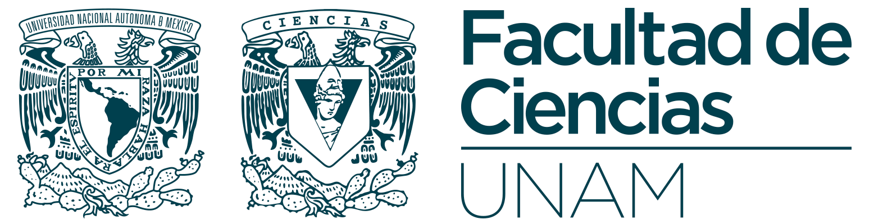

---
# https://www.mkdocs.org/user-guide/writing-your-docs/#meta-data
title: Recursos gratuitos para el desarrollo de proyectos estudiantiles 
authors:
- Paulo Santiago de Jesús Contreras Flores
---

  

# Recursos gratuitos para el desarrollo de proyectos estudiantiles 

--------------------------------------------------------------------------------

## Guía para adherirse al GitHub Student Developer Pack

El Github Student Developer Pack es un programa dirigido a estudiantes, que provee de forma gratuita diversas herramientas y servicios con el fin de apoyarlos en su carrera como desarrolladores de software.
Algunas de las categorías son Cloud, Developer tools, Domains, Game development, entre otras.

En las propias palabras de GitHub sobre este programa:

> Learn to ship software like a pro.
> There's no substitute for hands-on experience.
> But for most students, real world tools can be cost-prohibitive.
> That's why we created the GitHub Student Developer Pack with some of our partners and friends: to give students free access to the best developer tools in one place so they can learn by doing.

Seguir las siguientes instrucciones para acceder a los beneficios.

1.  Acceder al sitio <https://education.github.com> y dar clic en el botón *GitHub Student Developer Pack*, para acceder a los beneficios del programa.
    

2.  En la siguiente pantalla se pueden revisar todos los servicios y herramientas que ofrece el programa. Para continuar con el registro, dar clic en el botón *Get your pack*.

3.  A continuación se muestran los beneficios del programa tanto para estudiantes como para profesores. Dar clic en el botón *Get student benefits*.
    

4.  Para el siguiente paso es necesario ingresar usando una cuenta de GitHub, si ya se tiene una bastará con ingresar los datos de acceso que se solicitan; en caso de que no se tenga una cuenta, entonces dar clic en el enlace de *Create an account*, y completar con los datos que se soliciten.
    Es necesario que el correo electrónico usado sea de un dominio `@unam.mx`, como por ejemplo, las cuentas de correo `@ciencias.unam.mx`, o `@comunidad.unam.mx`.

5.  Una vez que se ha ingresado con una cuenta de GitHub, completar el formulario de solicitud de ingreso al programa Github Student Developer Pack, se sugiere usar los datos que se muestran en la siguiente imagen.
    Si la cuenta de GitHub se creó con una cuenta que no es del dominio `@unam.mx`, entonces será necesario agregar una dirección extra de correo electrónico de dicho dominio, para tener mayor probabilidad de ser aceptados en el programa, ésto se hace a través del botón *Add an email address*.
    Una vez que se envían los datos, éstos no pueden ser modificados.

6.  Una vez que se ha llenado y enviado la solicitud, verificar el correo electrónico que indica que ha sido aprobada la solicitud.

7. Para acceder a los recursos del programa, ingresar a <https://education.github.com/pack/offers>, se deberá de estar autenticado.
   Aquí se encontrarán los detalles sobre la forma de obtener los recursos de cada herramienta o servicio. Esta lista se actualiza constantemente.

--------------------------------------------------------------------------------

## Guía para adherirse al Programa AWS Educate

La Facultad de Ciencias en conjunto con Amazon Web Services, pone a la disposición de sus estudiantes el programa AWS Educate, con el cual podrán obtener una cuenta educativa que les permitirá acceder a los recursos necesarios para su formación académica en tecnologías en la nube.

En las propias palabras de AWS, este programa es:

> AWS Educate es una iniciativa global de Amazon cuyo objetivo es proveer a los estudiantes recursos integrales para desarrollar habilidades vinculadas con la nube.
> Es un programa sin costo que brinda acceso a contenido, formación técnica, métodos, servicios de AWS y el panel de trabajo de AWS Educate con oportunidades de empleo.

1.  Para consultar el manual para adherirse a este programa ingresar a <https://computo.fciencias.unam.mx/guias_utilidad.html>, y dar clic en _Manual AWS Educate para estudiantes_

