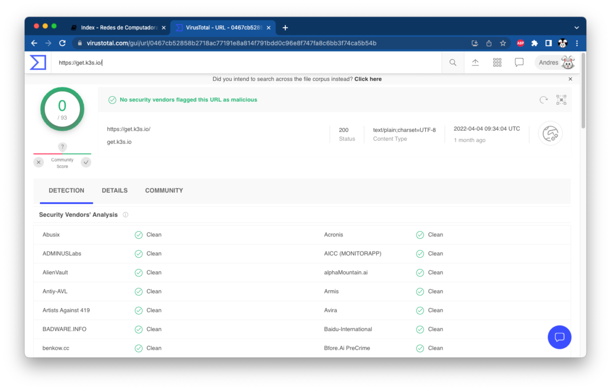

# Instalación de `k3s` en Debian 11

--------------------------------------------------------------------------------

## Verificar el _script_ de instalación de `k3s`

Abrir la página de [VirusTotal para escanear una URL][virustotal-scan-url], pegar la liga `https://get.k3s.io/` y presionar `<ENTER>` para validar el script de instalación

[virustotal-scan-url]: https://www.virustotal.com/gui/home/url

- <https://www.virustotal.com/gui/home/url>

!!! warning
    - **NUNCA** se deben ejecutar _scripts_ aleatorios de internet sin antes verificar su autenticidad utilizando funciones _hash_, firmas criptográficas o un escaneo de antivirus

    | VirusTotal - get.k3s.io
    |:----------------------------------:|
    | 

## Descargar el _script_ de instalación de `k3s`

Guardar el _script_ de instalación y dar permisos de ejecución

```
root@example:~# wget -c -nv -O ~/get-k3s-io.sh https://get.k3s.io/
2022-05-24 11:27:32 URL:https://get.k3s.io/ [27501/27501] -> "/root/get-k3s-io.sh" [1]

root@example:~# chmod -c +x ./get-k3s-io.sh
mode of './get-k3s-io.sh' changed from 0644 (rw-r--r--) to 0755 (rwxr-xr-x)
```

## Ejecutar el _script_ de instalación de `k3s`

Se utilizan las siguientes variables de entorno para personalizar la instalación de `k3s` en el sistema operativo:

- `INSTALL_K3S_SKIP_START="true"` se utiliza para no iniciar `k3s` después de haberlo instalado, esto permite ingresar opciones adicionales para reducir el consumo de memoria RAM

- `INSTALL_K3S_EXEC` permite especificar argumentos adicionales a `k3s`
    - Deshabilitar componentes no necesarios para reducir el uso de memoria RAM
    - Especificar nombres adicionales para el certificado SSL del servidor API de Kubernetes
        - Reemplaza `k3s.example.com` con tu nombre de dominio (ej. `k3s.tonejito.cf`)
        - Reemplaza `20.213.120.169` con la dirección IP **pública** de tu máquina virtual

```
root@example:~# export INSTALL_K3S_SKIP_START="true"
root@example:~# export INSTALL_K3S_EXEC="--tls-san='k3s.tonejito.cf' --tls-san='20.213.120.169' --disable-cloud-controller --disable=metrics-server --disable=servicelb --disable=traefik"
root@example:~# ~/get-k3s-io.sh
[INFO]  Finding release for channel stable
[INFO]  Using v1.23.6+k3s1 as release
[INFO]  Downloading hash https://github.com/k3s-io/k3s/releases/download/v1.23.6+k3s1/sha256sum-amd64.txt
[INFO]  Downloading binary https://github.com/k3s-io/k3s/releases/download/v1.23.6+k3s1/k3s
[INFO]  Verifying binary download
[INFO]  Installing k3s to /usr/local/bin/k3s
[INFO]  Skipping installation of SELinux RPM
[INFO]  Creating /usr/local/bin/kubectl symlink to k3s
[INFO]  Creating /usr/local/bin/crictl symlink to k3s
[INFO]  Creating /usr/local/bin/ctr symlink to k3s
[INFO]  Creating killall script /usr/local/bin/k3s-killall.sh
[INFO]  Creating uninstall script /usr/local/bin/k3s-uninstall.sh
[INFO]  env: Creating environment file /etc/systemd/system/k3s.service.env
[INFO]  systemd: Creating service file /etc/systemd/system/k3s.service
[INFO]  systemd: Enabling k3s unit
Created symlink /etc/systemd/system/multi-user.target.wants/k3s.service → /etc/systemd/system/k3s.service.
```

## Establecer variables de entorno para `k3s`

Establecer una variable de entorno para hacer que `k3s` ocupe aún menos memoria RAM en el equipo

<!--
```
root@example:~# grep EnvironmentFile /etc/systemd/system/k3s.service
EnvironmentFile=-/etc/default/%N
EnvironmentFile=-/etc/sysconfig/%N
EnvironmentFile=-/etc/systemd/system/k3s.service.env
```
-->

```
root@example:~# cat > /etc/systemd/system/k3s.service.env << EOF
# Aggressive garbage collector
GOGC=10
EOF
```

!!! note
    - Esta configuración es únicamente para un ambiente de pruebas
    - Ninguna de estas configuraciones se debe realizar en ambientes de producción
    - Estas configuraciones se realizan para que el cluster de k3s pueda ejecutarse en el equipo `B1S` que tiene únicamente **1 vCPU** y **512 MB de RAM**
    - No utilizar el tipo de instancia `B1S` para clusters de Kubernetes en ambientes de producción

--------------------------------------------------------------------------------

## Iniciar el servicio de `k3s`

Reinicia el equipo para verificar que los cambios sean persistentes y que el servicio de `k3s` se inicie de manera automática

```
root@example:~# reboot
```

Espera a que la máquina vuelva a estar en línea y verifica que el servicio de `k3s` se haya iniciado de manera correcta

```
# PAGER=cat systemctl status --full k3s
● k3s.service - Lightweight Kubernetes
     Loaded: loaded (/etc/systemd/system/k3s.service; enabled; vendor preset: enabled)
     Active: active (running) since Tue 2022-05-24 11:42:28 CDT; 30s ago
       Docs: https://k3s.io
   Main PID: 256 (k3s-server)
      Tasks: 63
     Memory: 512M
        CPU: 11.015s
     CGroup: /system.slice/k3s.service
             ├─ 256 /usr/local/bin/k3s server
             ├─ 512 containerd -c /var/lib/rancher/k3s/agent/etc/containerd/config.toml -a /run/k3s/containerd/containerd.sock --state /run/k3s/containerd --root /var/lib/rancher/k3s/agent/containerd
             ├─1024 /var/lib/rancher/k3s/data/.../bin/containerd-shim-runc-v2 -namespace k8s.io -id ... -address /run/k3s/containerd/containerd.sock
             └─2048 /var/lib/rancher/k3s/data/.../bin/containerd-shim-runc-v2 -namespace k8s.io -id ... -address /run/k3s/containerd/containerd.sock
```

!!! note
    Cuando `k3s` se haya iniciado el uso de memoria RAM crecerá **considerablemente**, esta fue la razón por la que se hicieron los ajustes [en la sección anterior][anterior]

```
root@example:~# free -m
               total        used        free      shared  buff/cache   available
Mem:             913         478          83           1         352         300
Swap:           4093           0        4093
```

## Revisa que el puerto de `kube-apiserver` esté escuchando

El servidor del API de Kubernetes esucha en el puerto `6443`, mismo que se debe de abrir para poder administrar el cluster desde el equipo local

```
root@example:~# netstat -ntulp | grep 6443
tcp6       0      0 :::6443                 :::*                    LISTEN      2764/k3s server
```

--------------------------------------------------------------------------------

## Prepara el archivo `~/.kube/config` en el equipo remoto

Agrega al usuario `redes` al grupo `staff` y cambia los permisos del archivo `/etc/rancher/k3s/k3s.yaml`

```
root@example:~# adduser redes staff
Adding user redes to group staff
Done.

root@example:~# chown -c root:staff /etc/rancher/k3s/k3s.yaml
changed ownership of '/etc/rancher/k3s/k3s.yaml' from root:root to root:staff

root@example:~# chmod -c 0440 /etc/rancher/k3s/k3s.yaml
mode of '/etc/rancher/k3s/k3s.yaml' changed from 0600 (rw-------) to 0440 (r--r-----)
```

Haz una liga simbólica al archivo `k3s.yaml` en la ruta `~/.kube/config` con el usuario `root`

```
root@example:~# mkdir -vp ~/.kube
mkdir: created directory '/root/.kube'

root@example:~# ln -vsf /etc/rancher/k3s/k3s.yaml ~/.kube/config
'/root/.kube/config' -> '/etc/rancher/k3s/k3s.yaml'
```

Copia el archivo `k3s.yaml` en la ruta `~/.kube/config` con el usuario `redes` y ajusta los permisos

```
root@example:~# su - redes

redes@example:~$ mkdir -vp ~/.kube
mkdir: created directory '/home/redes/.kube'

redes@example:~$ sudo cp -v /etc/rancher/k3s/k3s.yaml ~/.kube/config
'/etc/rancher/k3s/k3s.yaml' -> '/home/redes/.kube/config'

redes@example:~$ sudo chown -c redes:staff ~/.kube/config
changed ownership of '/home/redes/.kube/config' from root:root to redes:staff
```

## Conectarse al cluster de Kubernetes desde el equipo remoto

Utilizar el programa `kubectl` que fué instalado por `k3s` para listar la información del cluster

```
redes@example:~$ which kubectl
/usr/local/bin/kubectl

redes@example:~$ kubectl version
Client Version: version.Info{Major:"1", Minor:"23", GitVersion:"v1.23.6+k3s1", ...
Server Version: version.Info{Major:"1", Minor:"23", GitVersion:"v1.23.6+k3s1", ...

redes@example:~$ kubectl get nodes -o wide
NAME          STATUS   ROLES                  AGE   VERSION        INTERNAL-IP   EXTERNAL-IP   OS-IMAGE                         KERNEL-VERSION          CONTAINER-RUNTIME
example.com   Ready    control-plane,master   15m   v1.23.6+k3s1   10.0.0.4      <none>        Debian GNU/Linux 11 (bullseye)   5.10.0-14-cloud-amd64   containerd://1.5.11-k3s2
```

--------------------------------------------------------------------------------

## Abrir el puerto `6443` en el grupo de seguridad de Azure

Localiza el grupo de seguridad de la máquina virtual en el [portal de Azure][azure-portal] y abre el puerto `6443` al tráfico de Internet

- Utiliza el nombre `kube-api-server`

| Portal de Azure - Grupo de Seguridad
|:------------------------------------:|
| 

--------------------------------------------------------------------------------

## Instala `kubectl` en el equipo local

El programa `kubectl` se utiliza para crear recursos en el cluster de Kubernetes

- <https://kubernetes.io/docs/tasks/tools/>

Descarga el binario de `kubectl` para tu sistema operativo

- <https://kubernetes.io/releases/download/#kubectl>

```
usuario@laptop ~ % KUBECTL_VERSION=v1.23.6
usuario@laptop ~ % curl -fsSLO https://dl.k8s.io/release/${KUBECTL_VERSION}/bin/linux/amd64/kubectl
```

Instala el programa `kubectl` en el equipo

```
usuario@laptop ~ % sudo install -o root -g root -m 0755 kubectl /usr/local/bin/kubectl

usuario@laptop ~ % which kubectl
/usr/local/bin/kubectl
```

--------------------------------------------------------------------------------

## Instala `krew` en el equipo local

!!! note
    - Este programa debe ser instalado en el **equipo local** y el **equipo remoto**

El programa `krew` es un manejador de _plugins_ para `kubectl`

- <https://krew.sigs.k8s.io/docs/user-guide/quickstart/>

Crea un directorio temporal y descarga el archivo `tar.gz` de `krew`

```
redes@example:~$ KREW_VERSION=v0.4.2
redes@example:~$ KREW_TMP_DIR=/tmp/krew

redes@example:~$ mkdir -vp ${KREW_TMP_DIR}
mkdir: created directory '/tmp/krew'

redes@example:~$ wget -c -nv -O ${KREW_TMP_DIR}/krew-${KREW_VERSION}.tar.gz \
  "https://github.com/kubernetes-sigs/krew/releases/download/${KREW_VERSION}/krew-linux_amd64.tar.gz"
```

Extrae el archivo `tar.gz` de `krew` en el directorio temporal

```
redes@example:~$ tar -xvvzf ${KREW_TMP_DIR}/krew-${KREW_VERSION}.tar.gz -C ${KREW_TMP_DIR}
-rw-r--r-- runner/docker    11358 1999-12-31 18:00 ./LICENSE
-rwxr-xr-x runner/docker 12164162 1999-12-31 18:00 ./krew-linux_amd64
```

<!--
Instala el programa `krew` en el directorio `/usr/local/bin`

```
redes@example:~$ sudo install --owner root --group root --mode 0755 ${KREW_TMP_DIR}/krew-linux_amd64 /usr/local/bin/krew

redes@example:~$ which krew
/usr/local/bin/krew

redes@example:~$ ls -la /usr/local/bin/krew
-rwxr-xr-x 1 root root 12164162 Jun  8 17:44 /usr/local/bin/krew
```
-->

Instala el programa `krew` en la cuenta del usuario

```
redes@example:~$ ${KREW_TMP_DIR}/krew-linux_amd64 install krew
Adding "default" plugin index from https://github.com/kubernetes-sigs/krew-index.git.
Updated the local copy of plugin index.
Installing plugin: krew
Installed plugin: krew
\
 | Use this plugin:
 | 	kubectl krew
 | Documentation:
 | 	https://krew.sigs.k8s.io/
 | Caveats:
 | \
 |  | krew is now installed! To start using kubectl plugins, you need to add
 |  | krew's installation directory to your PATH:
 |  |
 |  |   * macOS/Linux:
 |  |     - Add the following to your ~/.bashrc or ~/.zshrc:
 |  |         export PATH="${KREW_ROOT:-$HOME/.krew}/bin:$PATH"
 |  |     - Restart your shell.
 |  |
 |  |   * Windows: Add %USERPROFILE%\.krew\bin to your PATH environment variable
 |  |
 |  | To list krew commands and to get help, run:
 |  |   $ kubectl krew
 |  | For a full list of available plugins, run:
 |  |   $ kubectl krew search
 |  |
 |  | You can find documentation at
 |  |   https://krew.sigs.k8s.io/docs/user-guide/quickstart/.
 | /
/
```

Borra el directorio temporal donde se descargó el instalador de `krew`

```
redes@example:~$ rm -rf ${KREW_TMP_DIR}
```

Agrega esta línea al final del archivo `~/.bashrc`

- Después **cierra y abre tu sesión** para que el _shell_ tome los cambios

```sh
export PATH="${KREW_ROOT:-$HOME/.krew}/bin:$PATH"
```

Confirma que tu _shell_ pueda ubicar el programa `kubectl-krew`

```
redes@example:~$ which kubectl-krew
/home/redes/.krew/bin/kubectl-krew
```

Verifica que puedas ejecutar el comando `kubectl krew`

<!--
```
redes@example:~$ kubectl krew
krew is the kubectl plugin manager.
You can invoke krew through kubectl: "kubectl krew [command]..."

Usage:
  kubectl krew [command]

Available Commands:
  completion  generate the autocompletion script for the specified shell
  help        Help about any command
  index       Manage custom plugin indexes
  info        Show information about an available plugin
  install     Install kubectl plugins
  list        List installed kubectl plugins
  search      Discover kubectl plugins
  uninstall   Uninstall plugins
  update      Update the local copy of the plugin index
  upgrade     Upgrade installed plugins to newer versions
  version     Show krew version and diagnostics

Flags:
  -h, --help      help for krew
  -v, --v Level   number for the log level verbosity

Use "kubectl krew [command] --help" for more information about a command.
```
-->

```
redes@example:~$ kubectl krew version
OPTION            VALUE
GitTag            v0.4.2
GitCommit         dbfefa5
IndexURI          https://github.com/kubernetes-sigs/krew-index.git
BasePath          /home/redes/.krew
IndexPath         /home/redes/.krew/index/default
InstallPath       /home/redes/.krew/store
BinPath           /home/redes/.krew/bin
DetectedPlatform  linux/amd64
```

Actualiza la lista de _plugins_ de `krew`

```
redes@example:~$ kubectl krew update
Updated the local copy of plugin index.
```

Instala el _plugin_ `neat` de `krew`

```
redes@example:~$ kubectl krew install neat
Updated the local copy of plugin index.
Installing plugin: neat
Installed plugin: neat
\
 | Use this plugin:
 | 	kubectl neat
 | Documentation:
 | 	https://github.com/itaysk/kubectl-neat
/
WARNING: You installed plugin "neat" from the krew-index plugin repository.
   These plugins are not audited for security by the Krew maintainers.
   Run them at your own risk.
```

[kubectl-krew]: https://krew.sigs.k8s.io/
[krew-quickstart]: https://krew.sigs.k8s.io/docs/user-guide/quickstart/
[krew-install]: https://krew.sigs.k8s.io/docs/user-guide/setup/install/

--------------------------------------------------------------------------------

## Prepara el archivo `~/.kube/config` en el equipo local

Copia el archivo `~/.kube/config` al equipo local, este archivo tiene la información para conectarse al servidor de Kubernetes

- Reemplaza `20.213.120.169` con la dirección IP **pública** de tu máquina virtual

```
usuario@laptop ~ % scp -i ~/.ssh/redes_azure.pem root@20.213.120.169:~/.kube/config ~/Downloads/redes-kube-config.yaml
```

Edita el archivo `redes-kube-config.yaml` para poner el nombre DNS de tu máquina virtual

- Reemplaza `k3s.example.com` con tu nombre de dominio (ej. `k3s.tonejito.cf`)

```
usuario@laptop ~ % sed -i'' -e 's/127.0.0.1/k3s.example.com/g' ~/Downloads/redes-kube-config.yaml
```

!!! note
    No hay espacio entre la letra `i` y las **comillas simples** `''` en el comando `sed`

## Conectarse al cluster desde el equipo local

Ejecuta el siguiente comando en tu máquina para configurar temporalmente la ruta hacia el archivo de configuración de `kubectl`

```
usuario@laptop ~ % export KUBECONFIG=~/Downloads/redes-kube-config.yaml
```

!!! warning
    - Es necesario que ejecutes el comando para crear la variable de entorno **cada vez que abras una nueva terminal**
    - Si quieres que este cambio sea persistente, incluye esa línea de comando al final del archivo `~/.bashrc` en tu usuario

Verifica que te puedas conectar al puerto `6443` del servidor con `netcat`

```
usuario@laptop ~ % nc -vz k3s.tonejito.cf 6443
k3s.tonejito.cf [20.213.120.169] 6443 (?) open
```

Verifica que puedas conectarte al servidor API de Kubernetes con el comando `kubectl`

- La versión local del cliente de Kubernetes debe ser la misma que la que se ejecuta en el servidor
- La opción `--insecure-skip-tls-verify=false` se utiliza para forzar explícitamente la verificación del certificado SSL del servidor API del cluster de Kubernetes

```
usuario@laptop ~ % kubectl version --insecure-skip-tls-verify=false
Client Version: version.Info{Major:"1", Minor:"23", GitVersion:"v1.23.6", ...
Server Version: version.Info{Major:"1", Minor:"23", GitVersion:"v1.23.6+k3s1", ...
```

Lista los nodos presentes en el cluster de Kubernetes

```
usuario@laptop ~ % kubectl get nodes
NAME           STATUS   ROLES                  AGE   VERSION
debian-redes   Ready    control-plane,master   30m   v1.23.6+k3s1
```

--------------------------------------------------------------------------------

## Verifica la configuración

Reinicia el equipo remoto para verificar que los cambios sean persistentes

```
root@example:~# reboot
```

!!! danger
    - Verifica que **TODAS** las configuraciones que hiciste estén presentes respués de reiniciar la máquina antes de continuar con [la siguiente sección][siguiente]

!!! note
    - Continúa en [la siguiente página][siguiente] si el servicio de `k3s` está en línea y puedes conectarte al cluster desde tu equipo local con el comando `kubectl`

--------------------------------------------------------------------------------

|                 ⇦           |        ⇧      |                  ⇨            |
|:----------------------------|:-------------:|------------------------------:|
| [Página anterior][anterior] | [Arriba](../) | [Página siguiente][siguiente] |

[anterior]: ../prepare-vm
[siguiente]: ../k8s-ingress-nginx
[azure-portal]: https://portal.azure.com/
