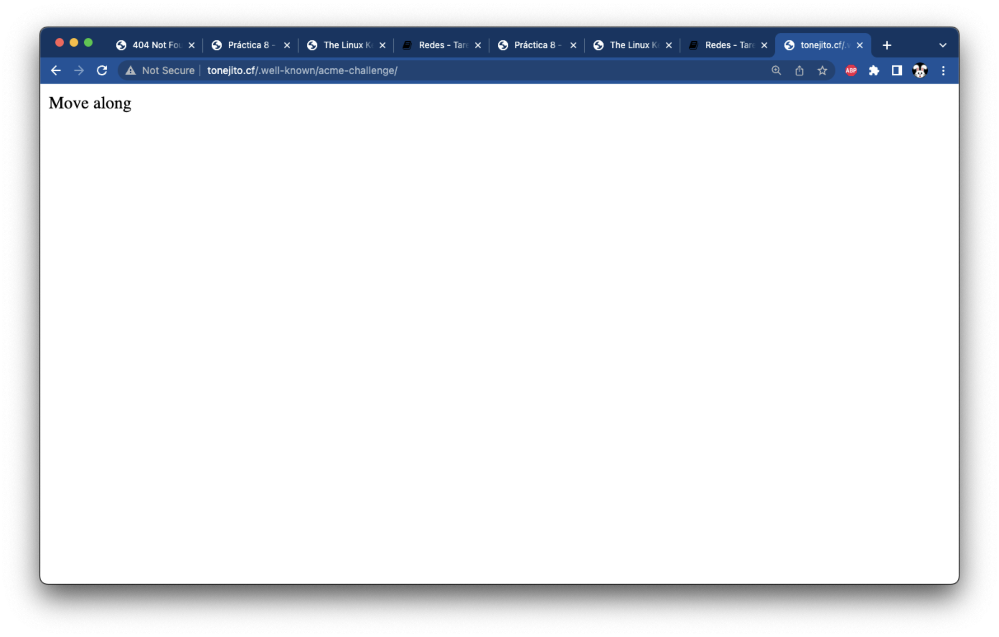
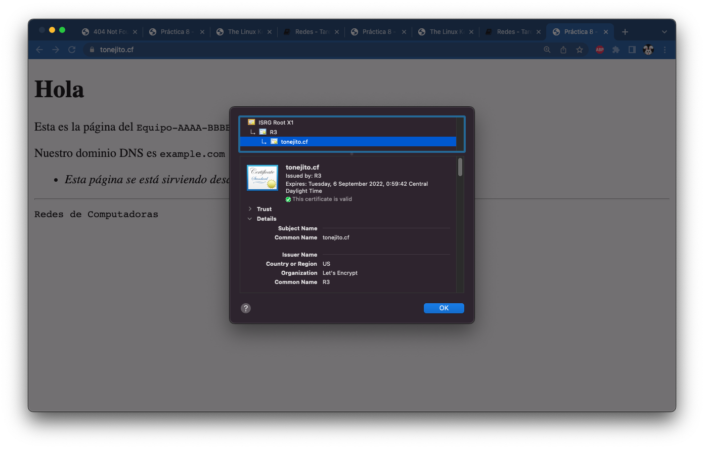
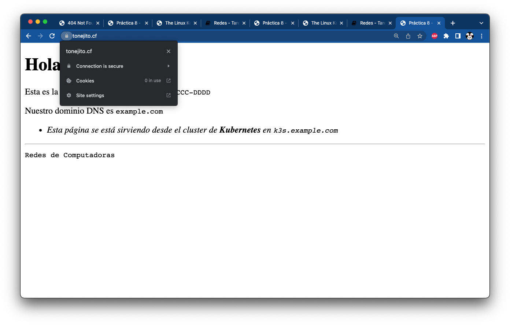
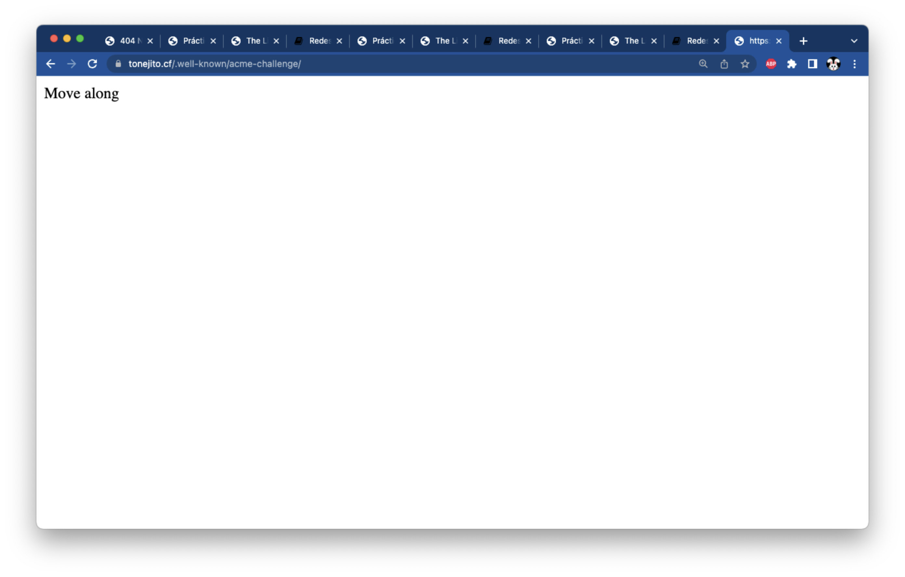
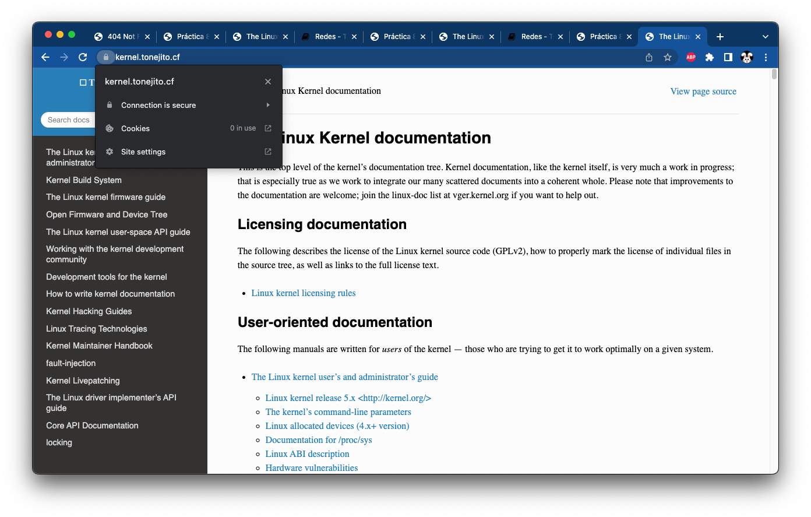
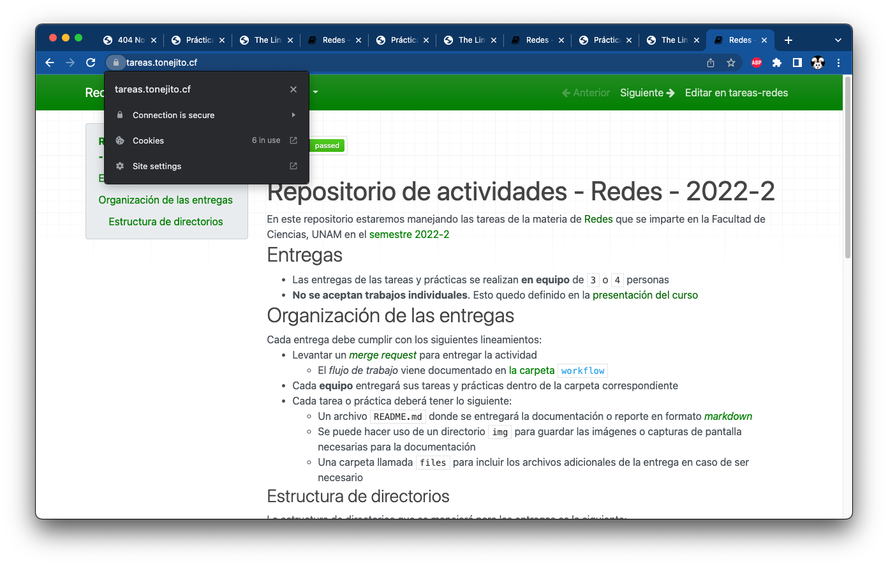

# Configuración de SSL/TLS en Ingress NGINX

--------------------------------------------------------------------------------

## Agrega el directorio de validación ACME al _host_ _default_

Crea un archivo de índice para el directorio `/var/www/html/.well-known/acme-challenge` en la máquina virtual de Azure

Este directorio se utiliza para la validación que hace Let's Encrypt de tu certificado SSL utilizando el protocolo ACME

- Ya deberías tener este directorio en tu máquina virtual [porque lo creaste en la práctica 7][practica-7-letsencrypt]

```
root@example:~# echo "Move along" > /var/www/html/.well-known/acme-challenge/index.html
```

### Edita el recurso `deployment` del _host_ _default_

Agrega las líneas correspondientes a `volumeMounts` y `volumes` en las secciones adecuadas

- Reemplaza `index-equipo-aaaa-bbbb-cccc-dddd` con el nombre de tu equipo (**en minúsculas**)
    - Esta acción ya la debiste de haber realizado [en una sección anterior de esta activdad][deployments-mounts]

!!! warning
    - Verifica que la identación de las líneas sea correcta y que insertes las secciones en el lugar adecuado
    - YAML es un lenguaje que maneja la identación utlizando **DOS ESPACIOS**

```
usuario@laptop ~ % kubectl edit deployment root-nginx
	...
```

```yaml
---
apiVersion: apps/v1
kind: Deployment
  name: root-nginx
  namespace: default
...
spec:
...
  template:
...
    spec:
...
      containers:
      - name: nginx
...
        volumeMounts:  # Agrega el punto de montaje "acme-challenge"
        - name: acme-challenge
          mountPath: /usr/share/nginx/html/.well-known
        - name: index-equipo-aaaa-bbbb-cccc-dddd
          mountPath: /usr/share/nginx/html/index.html
          subPath: index.html
...
      volumes:  # Agrega el volumen hostPath "acme-challenge"
      - name: acme-challenge
        hostPath:
          path: /var/www/html/.well-known
      - name: index-equipo-aaaa-bbbb-cccc-dddd
        configMap:
          name: index-equipo-aaaa-bbbb-cccc-dddd
          defaultMode: 420
...
```

Cierra el editor de texto, espera unos segundos y revisa que haya un nuevo _pod_ perteneciente al _deployment_ `root-nginx` y que su estado sea `Running`

```
usuario@laptop ~ % kubectl get pods -l app=root-nginx
NAME                          READY   STATUS    RESTARTS   AGE
root-nginx-6b5df6d5f5-zxm6w   1/1     Running   0          30s
```

Visita la URL donde se publica el directorio `/.well-known/acme-challenge` para visualizar la página de índice que acabas de crear

| Página de índice `/.well-known/acme-challenge`
|:----------------------------------------------:|
| 

## Revisa la validéz del certficado SSL

Lista el contenido del directorio `/etc/letsencrypt/live`, este directorio contiene ligas simbólicas a los archivos del certificado, la llave privada y el archivo de CA intermedias de Let's Encrypt

```
root@example:~# tree /etc/letsencrypt/live
/etc/letsencrypt/live
├── README
└── example.com
    ├── cert.pem -> ../../archive/example.com/cert1.pem
    ├── chain.pem -> ../../archive/example.com/chain1.pem
    ├── fullchain.pem -> ../../archive/example.com/fullchain1.pem
    ├── privkey.pem -> ../../archive/example.com/privkey1.pem
    └── README

1 directory, 6 files
```

Obtén una representación en texto del certificado SSL y guardala en un archivo

!!! note
    - Incluye este archivo en tu reporte

```
root@example:~# cd /etc/letsencrypt/live
root@example:/etc/letsencrypt/live# openssl x509 -in example.com/cert.pem -noout -text > example.com/cert.txt
```

Lista los datos de tu certificado

!!! note
    - Incluye la salida de este comando en tu reporte

```
root@example:/etc/letsencrypt/live# openssl x509 -in example.com/cert.pem -noout -issuer -subject -dates -ext subjectAltName
issuer=C = US, O = Let's Encrypt, CN = R3
subject=CN = example.com
notBefore=Jun  8 05:59:43 2022 GMT
notAfter=Sep  6 05:59:42 2022 GMT
X509v3 Subject Alternative Name:
    DNS:*.example.com, DNS:example.com
```

Verifica la validez de tu certificado digital `cert.pem`

- Utiliza el directorio `/etc/ssl/certs` como ruta de las CA raíz en las que confia el sistema operativo
- Utiliza el archivo `chain.pem` como el archivo de CA intermedias de Let's Encrypt

!!! note
    - Incluye la salida de este comando en tu reporte

```
root@example:/etc/letsencrypt/live# openssl verify -show_chain -CApath /etc/ssl/certs -untrusted example.com/chain.pem example.com/cert.pem
example.com/cert.pem: OK
Chain:
depth=0: CN = example.com (untrusted)
depth=1: C = US, O = Let's Encrypt, CN = R3 (untrusted)
depth=2: C = US, O = Internet Security Research Group, CN = ISRG Root X1
```

--------------------------------------------------------------------------------

## Configura el certificado SSL y la llave privada en el cluster

Copia el directorio `/etc/letsencrypt/live` al equipo local, este directorio contiene los certificados tramitados con Let's Encrypt

- Reemplaza `20.213.120.169` con la dirección IP **pública** de tu máquina virtual

```
usuario@laptop ~ % mkdir -vp ~/Downloads/letsencrypt
mkdir: created directory '/home/usuario/Downloads/letsencrypt'

usuario@laptop ~ % scp -i ~/.ssh/redes_azure.pem 'root@20.213.120.169:/etc/letsencrypt/live/example.com/*' ~/Downloads/letsencrypt/
	...
```

Lista el contenido del directorio donde copiaste los archivos de Let's Encrypt

```
usuario@laptop ~ % ls -la ~/Downloads/letsencrypt
total 64
drwxr-xr-x    8 tonejito  staff   256 Jun  8 02:39 .
drwx------@ 145 tonejito  staff  4640 Jun  8 02:39 ..
-rw-r--r--    1 tonejito  staff   692 Jun  8 02:39 README
-rw-r--r--    1 tonejito  staff  1854 Jun  8 02:39 cert.pem
-rw-r--r--    1 tonejito  staff  5260 Jun  8 02:39 cert.txt
-rw-r--r--    1 tonejito  staff  3749 Jun  8 02:39 chain.pem
-rw-r--r--    1 tonejito  staff  5603 Jun  8 02:39 fullchain.pem
-rw-------    1 tonejito  staff  1708 Jun  8 02:39 privkey.pem
```

### Agrega el certificado SSL y la llave privada en un recurso `secret tls`

Crea un recurso de tipo `secret tls` que contenga los siguientes campos:

- **Certificado SSL**: Utiliza el archivo `fullchain.pem` que contiene el certificado del servidor y los certificados de las CA intermedias
- **Llave privada**: Utiliza el archivo `privkey.pem`

```
usuario@laptop ~ % cd ~/Downloads/letsencrypt
usuario@laptop letsencrypt % kubectl create secret tls nginx-ingress-tls --cert fullchain.pem --key privkey.pem
secret/nginx-ingress-tls created
```

Verifica que el recurso de tipo `secret` haya sido creado y que contenga los siguientes campos:

- `tls.crt`: Certificado
- `tls.key`: Llave privada

```
usuario@laptop ~ % kubectl get secret nginx-ingress-tls
NAME                TYPE                DATA   AGE
nginx-ingress-tls   kubernetes.io/tls   2      30s

usuario@laptop ~ % kubectl describe secret nginx-ingress-tls
Name:         nginx-ingress-tls
Namespace:    default
Labels:       <none>
Annotations:  <none>

Type:  kubernetes.io/tls

Data
====
tls.crt:  5603 bytes
tls.key:  1708 bytes
```

## Agrega el soporte TLS al recurso `ingress`

Edita el archivo [`recurso-ingress.yaml`][recurso-ingress-yaml] donde se define el recurso de tipo `ingress` y agrega la sección de configuración donde se especifican los siguientes campos:

- Nombre del recurso de tipo `secret` que contiene el certificado y la llave privada
- Nombres DNS de las rutas en las que se va a configurar el soporte de TLS
    - Reemplaza `example.com` con tu nombre de dominio

!!! warning
    - Verifica que la identación de las líneas sea correcta y que insertes las secciones en el lugar adecuado
    - YAML es un lenguaje que maneja la identación utlizando **DOS ESPACIOS**

```yaml
---
apiVersion: networking.k8s.io/v1
kind: Ingress
metadata:
  name: ingress-nginx
  namespace: default
...
spec:  # Agrega la sección "tls" después de "spec"
  tls:
  - secretName: nginx-ingress-tls
    hosts:
    - '*.example.com'
    - kernel.example.com
    - tareas.example.com
  ingressClassName: nginx
  rules:
...
```

Aplica los cambios al recurso `ingress` utilizando el archivo YAML que editaste

```
usuario@laptop ~ % kubectl apply -f recurso-ingress.yaml
ingress.networking.k8s.io/ingress-nginx configured
```

## Cambia el certificado SSL en el _ingress controller_

Edita el _deployment_ `ingress-nginx-controller` en el _namespace_ `ingress-nginx` para modificar los argumentos con los que se lanza el proceso

```
usuario@laptop ~ % kubectl edit deployment/ingress-nginx-controller -n ingress-nginx
	...
```

Agrega una línea al final de los argumentos del proceso `nginx-ingress-controller` donde se especifique que utilizarás el certificado que subiste al servidor en un paso anterior

- Establece el argumento `default-ssl-certificate` con el valor `default/nginx-ingress-tls` para usar el recurso _secret_ que contiene el certificado y la llave privada

!!! warning
    - Verifica que la identación de las líneas sea correcta y que insertes las secciones en el lugar adecuado
    - YAML es un lenguaje que maneja la identación utlizando **DOS ESPACIOS**

```yaml
---
apiVersion: apps/v1
kind: Deployment
metadata:
  name: ingress-nginx-controller
  namespace: ingress-nginx
...
spec:
...
  template:
...
    spec:
      containers:
      - args:
        - /nginx-ingress-controller
        - --publish-service=$(POD_NAMESPACE)/ingress-nginx-controller
        - --election-id=ingress-controller-leader
        - --controller-class=k8s.io/ingress-nginx
        - --ingress-class=nginx
        - --configmap=$(POD_NAMESPACE)/ingress-nginx-controller
        - --validating-webhook=:8443
        - --validating-webhook-certificate=/usr/local/certificates/cert
        - --validating-webhook-key=/usr/local/certificates/key
        # Utiliza el certificado SSL importado de Let's Encrypt
        - --default-ssl-certificate=default/nginx-ingress-tls
```

Cierra el editor de texto y espera unos segundos antes de continuar con el paso siguiente

## Reinicia el controlador de _ingress_ en el cluster

Es necesario reiniciar el pod principal del _ingress controller_ después de haber modificado los argumentos del proceso `nginx-ingress-controller`

Normalmente kubernetes realiza esta operación de manera automática, sin embargo este cluster está utilizando la red del _host_ y se necesita hacer el ajuste de manera manual

Lista el _deployment_ y _pod_ del _ingress controller_ instalado en el cluster en el _namespace_ `ingress-nginx`

- Toma nota del nombre del _pod_ y el tiempo que lleva en ejecución

```
usuario@laptop ~ % kubectl get deployments,pods -n ingress-nginx -l app.kubernetes.io/component=controller
NAME                                       READY   UP-TO-DATE   AVAILABLE   AGE
deployment.apps/ingress-nginx-controller   1/1     1            1           8d

NAME                                            READY   STATUS    RESTARTS      AGE
pod/ingress-nginx-controller-5f6547f4f7-6kzc9   1/1     Running   1 (20m ago)   23h
```

Forza la detención y reinicio del proceso al hacer un escalamiento a **cero _pods_** y después a **un _pod_** para el _deployment_ `ingress-nginx-controller` en el _namespace_ `ingress-nginx`

```
usuario@laptop ~ % kubectl scale deployment ingress-nginx-controller -n ingress-nginx --replicas 0
deployment.apps/ingress-nginx-controller scaled

usuario@laptop ~ % kubectl scale deployment ingress-nginx-controller -n ingress-nginx --replicas 1
deployment.apps/ingress-nginx-controller scaled
```

Lista de nuevo el _deployment_ y _pod_ del _ingress controller_ instalado en el cluster en el _namespace_ `ingress-nginx`

- El nombre del pod debería ser diferente y el tiempo que lleva en ejecución debería ser relativamente corto
- Espera a que el pod tenga un estado `Running` y que el campo **READY** muestre un valor de `1/1`

```
usuario@laptop ~ % kubectl get deployments,pods -n ingress-nginx -l app.kubernetes.io/component=controller
NAME                                       READY   UP-TO-DATE   AVAILABLE   AGE
deployment.apps/ingress-nginx-controller   1/1     1            1           8d

NAME                                            READY   STATUS    RESTARTS   AGE
pod/ingress-nginx-controller-5f6547f4f7-kfnfk   1/1     Running   0          30s
```

--------------------------------------------------------------------------------

## Verificar la conectividad a los sitios web

### Puertos de red

Revisa que te puedas conectar a los puertos `80` y `443` del servidor con `netcat`

!!! note
    - Incluye la salida de estos comandos en tu reporte

```
usuario@laptop ~ % nc -vz example.com 80
example.com [20.213.120.169] 80 (http) open

usuario@laptop ~ % nc -vz example.com 443
example.com [20.213.120.169] 443 (https) open
```

### Certificado SSL

Revisa la conectividad al servidor ejecutando `openssl s_client` en el equipo local para realizar las siguientes acciones

- Verificar que el servidor está entregando los certificados de manera correcta al cliente
    - Revisa los datos de los certificados en la sección `Certificate chain`
- Revisar que el certificado SSL que presenta el servidor se está validando de manera correcta del lado del cliente
    - Revisa que aparezca `Verify return code: 0 (ok)` cerca del final de la salida del comando

!!! note
    - Incluye la salida de este comando en tu reporte

```
usuario@laptop ~ % openssl s_client -showcerts -connect example.com:443 < /dev/null
CONNECTED(00000005)
depth=2 C = US, O = Internet Security Research Group, CN = ISRG Root X1
verify return:1
depth=1 C = US, O = Let's Encrypt, CN = R3
verify return:1
depth=0 CN = example.com
verify return:1
---
Certificate chain
 0 s:/CN=example.com
   i:/C=US/O=Let's Encrypt/CN=R3
-----BEGIN CERTIFICATE-----
	...
-----END CERTIFICATE-----
 1 s:/C=US/O=Let's Encrypt/CN=R3
   i:/C=US/O=Internet Security Research Group/CN=ISRG Root X1
-----BEGIN CERTIFICATE-----
	...
-----END CERTIFICATE-----
 2 s:/C=US/O=Internet Security Research Group/CN=ISRG Root X1
   i:/O=Digital Signature Trust Co./CN=DST Root CA X3
-----BEGIN CERTIFICATE-----
	...
-----END CERTIFICATE-----
---
Server certificate
subject=/CN=example.com
issuer=/C=US/O=Let's Encrypt/CN=R3
---
No client certificate CA names sent
Server Temp Key: ECDH, X25519, 253 bits
---
SSL handshake has read 4493 bytes and written 289 bytes
---
New, TLSv1/SSLv3, Cipher is ECDHE-RSA-AES128-GCM-SHA256
Server public key is 2048 bit
Secure Renegotiation IS supported
Compression: NONE
Expansion: NONE
No ALPN negotiated
SSL-Session:
    Protocol  : TLSv1.2
    Cipher    : ECDHE-RSA-AES128-GCM-SHA256
    Session-ID: 7FF26997B5D8D92DC68728821E7F647EFA1C7B2ADB0D3146FEB58BAFBC19754B
    Session-ID-ctx:
    Master-Key: D5F57D7DCFDC88CDD3EA3F987006CDF6EBE5366BA98983E8227413B7E7EBC7EC02CE92346DD6E4CF80FEA49FD815EFB7
    Start Time: 1654675316
    Timeout   : 7200 (sec)
    Verify return code: 0 (ok)
---
```

Visita la URL del sitio principal con un navegador web y asegúrate de que el certificado SSL se valide correctamente

- `https://example.com/`

| Página en Kubernetes mostrada a través de _ingress_
|:---------------------------------------------------:|
| 

### _Host_ _default_

Revisa que puedas alcanzar el servicio `root-nginx` en la siguientes URLs

- `https://example.com/`
- `https://example.com/.well-known/acme-challenge/`

!!! warning
    - Reemplaza `example.com` con tu nombre de dominio
    - Asegúrate de utilizar HTTPS para visitar el sitio web por medio de una conexión cifrada

!!! note
    - Incluye la salida de este comando en tu reporte

```
usuario@laptop ~ % curl -v# 'https://example.com/' | egrep '</?title>'
*   Trying 20.213.120.169:443...
* Connected to example.com (20.213.120.169) port 443 (#0)
* ALPN, offering h2
* ALPN, offering http/1.1
* successfully set certificate verify locations:
*  CAfile: /etc/ssl/cert.pem
*  CApath: none
* (304) (OUT), TLS handshake, Client hello (1):
} [316 bytes data]
* (304) (IN), TLS handshake, Server hello (2):
{ [122 bytes data]
* (304) (IN), TLS handshake, Unknown (8):
{ [19 bytes data]
* (304) (IN), TLS handshake, Certificate (11)
{ [4036 bytes data]
* (304) (IN), TLS handshake, CERT verify (15):
{ [264 bytes data]
* (304) (IN), TLS handshake, Finished (20):
{ [52 bytes data]
* (304) (OUT), TLS handshake, Finished (20):
} [52 bytes data]
* SSL connection using TLSv1.3 / AEAD-AES256-GCM-SHA384
* ALPN, server accepted to use h2
* Server certificate:
*  subject: CN=example.com
*  start date: Jun  8 05:59:43 2022 GMT
*  expire date: Sep  6 05:59:42 2022 GMT
*  subjectAltName: host "example.com" matched cert's "example.com"
*  issuer: C=US; O=Let's Encrypt; CN=R3
*  SSL certificate verify ok.
* Using HTTP2, server supports multiplexing
* Connection state changed (HTTP/2 confirmed)
* Copying HTTP/2 data in stream buffer to connection buffer after upgrade: len=0
* Using Stream ID: 1 (easy handle 0x14c010a00)
> GET / HTTP/2
> Host: example.com
> user-agent: curl/7.79.1
> accept: */*
>
* Connection state changed (MAX_CONCURRENT_STREAMS == 128)!
< HTTP/2 200
< date: Wed, 08 Jun 2022 07:58:35 GMT
< content-type: text/html
< content-length: 595
< last-modified: Wed, 08 Jun 2022 06:18:15 GMT
< etag: "62a03f27-253"
< accept-ranges: bytes
< strict-transport-security: max-age=15724800; includeSubDomains
<
{ [595 bytes data]
######################################################################### 100.0%
* Connection #0 to host example.com left intact

    <title>Práctica 8 - Redes 2022-2</title>
```

Visita la URL del sitio principal con un navegador web y asegúrate de que se muestre la página de indice del _host_ "_catch-all_"

- `https://example.com/`

!!! warning
    - Reemplaza `example.com` con tu nombre de dominio
    - Asegúrate de utilizar HTTPS para visitar el sitio web por medio de una conexión cifrada

!!! note
    - Incluye una captura de pantalla en tu reporte

| Página en Kubernetes mostrada a través de _ingress_
|:---------------------------------------------------:|
| 

#### Directorio de validación ACME

Visita la URL del directorio de validación de ACME y asegúrate que se muestre la página de índice que creaste en el directorio `/var/www/html/.well-known/acme-challenge` en la máquina virtual de Azure

- `https://example.com/.well-known/acme-challenge/`

!!! warning
    - Reemplaza `example.com` con tu nombre de dominio
    - Asegúrate de utilizar HTTPS para visitar el sitio web por medio de una conexión cifrada

!!! note
    - Incluye una captura de pantalla en tu reporte

| Página del directorio `/.well-known/acme-challenge`
|:---------------------------------------------------:|
| 

### Sitio web con la documentación del _kernel_ Linux

Revisa que puedas alcanzar el servicio `linux-doc` en la siguiente URL

- `https://kernel.example.com/`

!!! warning
    - Reemplaza `example.com` con tu nombre de dominio
    - Asegúrate de utilizar HTTPS para visitar el sitio web por medio de una conexión cifrada

!!! note
    - Incluye la salida de este comando en tu reporte

```
usuario@laptop ~ % curl -v# 'https://kernel.example.com/' | egrep '</?title>'
*   Trying 20.213.120.169:443...
* Connected to kernel.example.com (20.213.120.169) port 443 (#0)
* ALPN, offering h2
* ALPN, offering http/1.1
* successfully set certificate verify locations:
*  CAfile: /etc/ssl/cert.pem
*  CApath: none
* (304) (OUT), TLS handshake, Client hello (1):
} [323 bytes data]
* (304) (IN), TLS handshake, Server hello (2)
{ [122 bytes data]
* (304) (IN), TLS handshake, Unknown (8):
{ [19 bytes data]
* (304) (IN), TLS handshake, Certificate (11):
{ [4036 bytes data]
* (304) (IN), TLS handshake, CERT verify (15):
{ [264 bytes data]
* (304) (IN), TLS handshake, Finished (20):
{ [52 bytes data]
* (304) (OUT), TLS handshake, Finished (20):
} [52 bytes data]
* SSL connection using TLSv1.3 / AEAD-AES256-GCM-SHA384
* ALPN, server accepted to use h2
* Server certificate:
*  subject: CN=example.com
*  start date: Jun  8 05:59:43 2022 GMT
*  expire date: Sep  6 05:59:42 2022 GMT
*  subjectAltName: host "kernel.example.com" matched cert's "*.example.com"
*  issuer: C=US; O=Let's Encrypt; CN=R3
*  SSL certificate verify ok.
* Using HTTP2, server supports multiplexing
* Connection state changed (HTTP/2 confirmed)
* Copying HTTP/2 data in stream buffer to connection buffer after upgrade: len=0
* Using Stream ID: 1 (easy handle 0x131010a00)
> GET / HTTP/2
> Host: kernel.example.com
> user-agent: curl/7.79.1
> accept: */*
>
* Connection state changed (MAX_CONCURRENT_STREAMS == 128)!
< HTTP/2 200
< date: Wed, 08 Jun 2022 08:04:28 GMT
< content-type: text/html
< content-length: 145412
< last-modified: Fri, 29 Apr 2022 09:36:50 GMT
< etag: "626bb1b2-23804"
< accept-ranges: bytes
< strict-transport-security: max-age=15724800; includeSubDomains
<
{ [3853 bytes data]
######################################################################### 100.0%
* Connection #0 to host kernel.example.com left intact

	<title>The Linux Kernel documentation &mdash; The Linux Kernel  documentation</title>
```

Visita la misma URL con un navegador web y asegúrate de que se muestre el sitio web de la documentación del _kernel_ Linux

!!! note
    - Incluye una captura de pantalla en tu reporte

| Página en Kubernetes mostrada a través de _ingress_
|:---------------------------------------------------:|
| 

### Sitio web de tareas de la materia

Revisa que puedas alcanzar el servicio `tareas-redes` en la siguiente URL

- `https://tareas.example.com/`

!!! warning
    - Reemplaza `example.com` con tu nombre de dominio
    - Asegúrate de utilizar HTTPS para visitar el sitio web por medio de una conexión cifrada

!!! note
    - Incluye la salida de este comando en tu reporte

```
tonejito@VF-0S kubernetes % curl -v# 'https://tareas.example.com/' | egrep '</?title>'
*   Trying 20.213.120.169:443...
* Connected to tareas.example.com (20.213.120.169) port 443 (#0)
* ALPN, offering h2
* ALPN, offering http/1.1
* successfully set certificate verify locations:
*  CAfile: /etc/ssl/cert.pem
*  CApath: none
* (304) (OUT), TLS handshake, Client hello (1):
} [323 bytes data]
* (304) (IN), TLS handshake, Server hello (2):
{ [122 bytes data]
* (304) (IN), TLS handshake, Unknown (8):
{ [19 bytes data]
* (304) (IN), TLS handshake, Certificate (11):
{ [4036 bytes data]
* (304) (IN), TLS handshake, CERT verify (15):
{ [264 bytes data]
* (304) (IN), TLS handshake, Finished (20):
{ [52 bytes data]
* (304) (OUT), TLS handshake, Finished (20):
} [52 bytes data]
* SSL connection using TLSv1.3 / AEAD-AES256-GCM-SHA384
* ALPN, server accepted to use h2
* Server certificate:
*  subject: CN=example.com
*  start date: Jun  8 05:59:43 2022 GMT
*  expire date: Sep  6 05:59:42 2022 GMT
*  subjectAltName: host "tareas.example.com" matched cert's "*.example.com"
*  issuer: C=US; O=Let's Encrypt; CN=R3
*  SSL certificate verify ok.
* Using HTTP2, server supports multiplexing
* Connection state changed (HTTP/2 confirmed)
* Copying HTTP/2 data in stream buffer to connection buffer after upgrade: len=0
* Using Stream ID: 1 (easy handle 0x14f010a00)
> GET / HTTP/2
> Host: tareas.example.com
> user-agent: curl/7.79.1
> accept: */*
>
* Connection state changed (MAX_CONCURRENT_STREAMS == 128)!
< HTTP/2 200
< date: Wed, 08 Jun 2022 08:06:22 GMT
< content-type: text/html
< content-length: 12443
< last-modified: Tue, 31 May 2022 01:47:02 GMT
< etag: "62957396-309b"
< accept-ranges: bytes
< strict-transport-security: max-age=15724800; includeSubDomains
<
{ [3855 bytes data]
######################################################################### 100.0%
* Connection #0 to host tareas.example.com left intact

	<title>Redes - Tareas 2022-2</title>
```

Visita la misma URL con un navegador web y asegúrate de que se muestre el sitio web de tareas de la materia

!!! note
    - Incluye una captura de pantalla en tu reporte

| Página en Kubernetes mostrada a través de _ingress_
|:---------------------------------------------------:|
| 

--------------------------------------------------------------------------------

## Verifica la configuración

Reinicia el equipo remoto para verificar que los cambios sean persistentes

```
root@example:~# reboot
```

!!! danger
    - Verifica que **TODAS** las configuraciones que hiciste estén presentes respués de reiniciar la máquina antes de regresar a [la página principal][siguiente] para elaborar tu reporte

!!! note
    - Continúa en [la página principal][siguiente] si el certificado SSL emitido por Let's Encrypt instalado en el _ingress controller_ y si los sitios web se muestran correctamente por HTTPS
    
--------------------------------------------------------------------------------

|                 ⇦           |        ⇧      |                  ⇨            |
|:----------------------------|:-------------:|------------------------------:|
| [Página anterior][anterior] | [Arriba](../) | [Página siguiente][siguiente] |

[anterior]: ../k8s-ingress-resource
[siguiente]: ../../proyecto-final

[ingress-nginx-tls]: https://kubernetes.github.io/ingress-nginx/user-guide/tls/
[ingress-nginx-force-redirect]: https://kubernetes.github.io/ingress-nginx/user-guide/nginx-configuration/annotations/#server-side-https-enforcement-through-redirect

[deployments-mounts]: ../k8s-deployments/#asigna-el-volumen-de-la-pagina-de-indice-al-deployment-del-servidor-web
[practica-7-letsencrypt]: ../../../laboratorio/practica-7/ssl-lets-encrypt/#tramita-el-certificado-ssl-con-lets-encrypt
[recurso-ingress-yaml]: files/kubernetes/recurso-ingress.yaml
