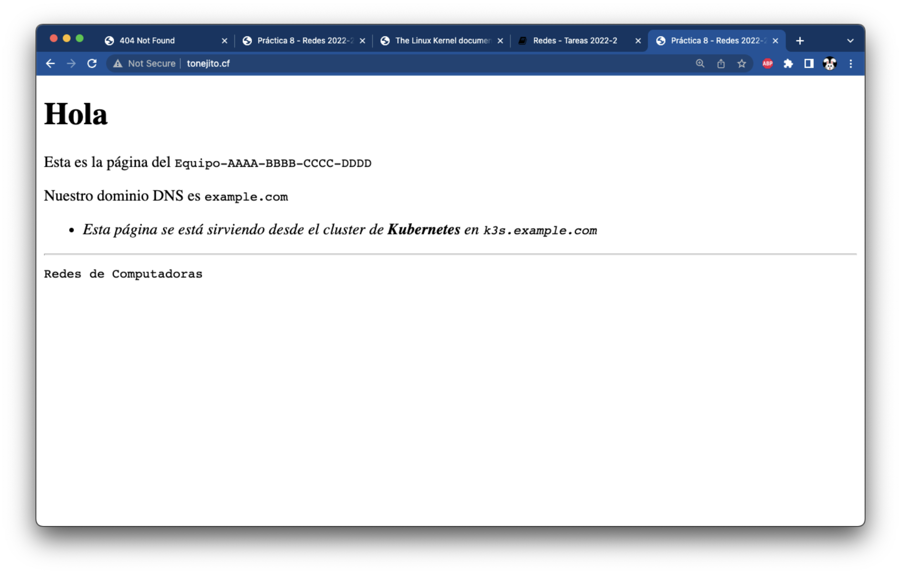
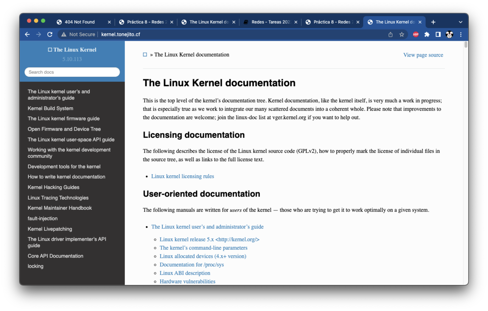
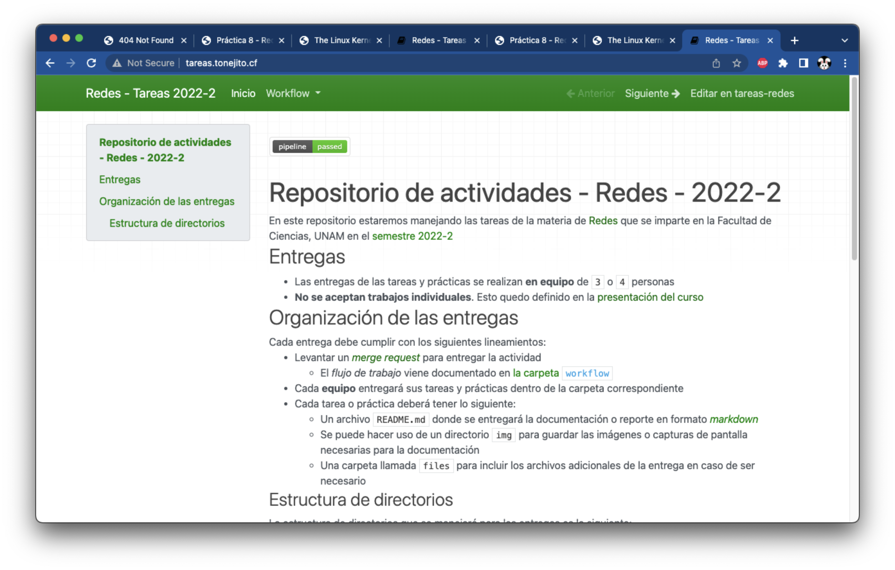

# Implementación de ingress en **Kubernetes**

--------------------------------------------------------------------------------

## Crea servicios para direccionar tráfico a los _pods_

Normalmente los pods no se acceden directamente en el cluster de Kubernetes, sino que se utilizan servicios que tienen un _selector_ que sirve para buscar algún _pod_ y enviarle el tráfico de red

Utiliza la opción `expose` de `kubectl` para crear un servicio que apunte a los pods de un _deployment_ especifico

- Repite esta acción para los tres deployments que tienes: `root-nginx`, `linux-doc` y `tareas-redes`

```
usuario@laptop ~ % kubectl expose deployment root-nginx --port=80
service/root-nginx exposed

usuario@laptop ~ % kubectl expose deployment linux-doc --port=80
service/linux-doc exposed

usuario@laptop ~ % kubectl expose deployment tareas-redes --port=80
service/tareas-redes exposed
```

Verifica que los servicios hayan sido creados y que apunten al puerto `80`

```
usuario@laptop ~ % kubectl get services
NAME           TYPE        CLUSTER-IP      EXTERNAL-IP   PORT(S)   AGE
kubernetes     ClusterIP   10.43.0.1       <none>        443/TCP   1d
root-nginx     ClusterIP   10.43.156.103   <none>        80/TCP    60s
linux-doc      ClusterIP   10.43.161.53    <none>        80/TCP    40s
tareas-redes   ClusterIP   10.43.180.100   <none>        80/TCP    20s
```

## Crea las rutas para dirigir tráfico a los servicios

Utiliza el archivo [`recurso-ingress.yaml`][recurso-ingress-yaml] para crear un recurso de tipo `ingress` que utiliza rutas para exponer los servicios internos del cluster y que estos reciban tráfico

Edita el archivo [`recurso-ingress.yaml`][recurso-ingress-yaml]

- Establece las anotaciones `rewrite-target` con el valor `/` que significa la raíz del sitio web
- Establece la ruta para el host _catch-all_ y apúntala al servicio `root-nginx` en el puerto `80`
- Establece la ruta para el host `kernel.example.com` y apúntala la raíz del sitio al servicio `linux-doc` en el puerto `80`
- Establece la ruta para el host `tareas.example.com` y apúntala la raíz del sitio al servicio `tareas-redes` en el puerto `80`

!!! warning
    - Reemplaza `example.com` con tu nombre de dominio

Crea el recurso `ingress` utilizando el archivo YAML que editaste

```
usuario@laptop ~ % kubectl apply -f recurso-ingress.yaml
ingress.networking.k8s.io/ingress-nginx created
```

--------------------------------------------------------------------------------

## Verificar la conectividad a los sitios web

### _Host_ _default_

Revisa que puedas alcanzar el servicio `root-nginx` en la siguiente URL 

- `http://example.com/`

!!! warning
    - Reemplaza `example.com` con tu nombre de dominio
    - Asegúrate de utilizar HTTP para visitar el sitio web

```
usuario@laptop ~ % curl -vk#L 'http://example.com/' | egrep '</?title>'
*   Trying 20.213.120.169:80...
* Connected to example.com (20.213.120.169) port 80 (#0)
> GET / HTTP/1.1
> Host: example.com
> User-Agent: curl/7.79.1
> Accept: */*
>
* Mark bundle as not supporting multiuse
< HTTP/1.1 200 OK
< Date: Tue, 07 Jun 2022 08:03:54 GMT
< Content-Type: text/html
< Content-Length: 595
< Connection: keep-alive
< Last-Modified: Tue, 07 Jun 2022 07:01:02 GMT
< ETag: "629ef7ae-253"
< Accept-Ranges: bytes
<
{ [595 bytes data]
######################################################################### 100.0%
* Connection #0 to host example.com left intact

	<title>Práctica 8 - Redes 2022-2</title>
```

Visita la misma URL con un navegador web y asegúrate de que se muestre la página de indice del _host_ "_catch-all_"

| Página en Kubernetes mostrada a través de _ingress_
|:---------------------------------------------------:|
| 

### Sitio web con la documentación del _kernel_ Linux

Revisa que puedas alcanzar el servicio `linux-doc` en la siguiente URL 

- `http://kernel.example.com/`

!!! warning
    - Reemplaza `example.com` con tu nombre de dominio
    - Asegúrate de utilizar HTTP para visitar el sitio web

```
usuario@laptop ~ % curl -vk#L 'http://kernel.example.com/' | egrep '</?title>'
*   Trying 20.213.120.169:80...
* Connected to kernel.example.com (20.213.120.169) port 80 (#0)
> GET / HTTP/1.1
> Host: kernel.example.com
> User-Agent: curl/7.79.1
> Accept: */*
>
* Mark bundle as not supporting multiuse
< HTTP/1.1 200 OK
< Date: Tue, 07 Jun 2022 08:04:08 GMT
< Content-Type: text/html
< Content-Length: 145412
< Connection: keep-alive
< Last-Modified: Fri, 29 Apr 2022 09:36:50 GMT
< ETag: "626bb1b2-23804"
< Accept-Ranges: bytes
<
{ [13653 bytes data]
######################################################################### 100.0%
* Connection #0 to host kernel.example.com left intact

	<title>The Linux Kernel documentation &mdash; The Linux Kernel  documentation</title>
```

Visita la misma URL con un navegador web y asegúrate de que se muestre el sitio web de la documentación del _kernel_ Linux

| Página en Kubernetes mostrada a través de _ingress_
|:---------------------------------------------------:|
| 

### Sitio web de tareas de la materia

Revisa que puedas alcanzar el servicio `tareas-redes` en la siguiente URL 

- `http://tareas.example.com/`

!!! warning
    - Reemplaza `example.com` con tu nombre de dominio
    - Asegúrate de utilizar HTTP para visitar el sitio web

```
usuario@laptop ~ % curl -vk#L 'http://tareas.example.com/' | egrep '</?title>'
*   Trying 20.213.120.169:80...
* Connected to tareas.example.com (20.213.120.169) port 80 (#0)
> GET / HTTP/1.1
> Host: tareas.example.com
> User-Agent: curl/7.79.1
> Accept: */*
>
* Mark bundle as not supporting multiuse
< HTTP/1.1 200 OK
< Date: Tue, 07 Jun 2022 08:04:16 GMT
< Content-Type: text/html
< Content-Length: 12443
< Connection: keep-alive
< Last-Modified: Tue, 31 May 2022 01:47:02 GMT
< ETag: "62957396-309b"
< Accept-Ranges: bytes
<
{ [6655 bytes data]
######################################################################### 100.0%
* Connection #0 to host tareas.example.com left intact

	<title>Redes - Tareas 2022-2</title>
```

Visita la misma URL con un navegador web y asegúrate de que se muestre el sitio web de tareas de la materia

| Página en Kubernetes mostrada a través de _ingress_
|:---------------------------------------------------:|
| 

--------------------------------------------------------------------------------

!!! danger
    - Verifica que **TODAS** las configuraciones que hiciste estén presentes respués de reiniciar la máquina antes de continuar con [la siguiente sección][siguiente]

!!! note
    - Continúa en [la siguiente página][siguiente] si pudiste ver las páginas por medio de HTTP con los nombres de dominio utilizando un navegador web
        - `http://example.com/`
        - `http://kernel.example.com/`
        - `http://tareas.example.com/`
    - Reemplaza `example.com` con tu nombre de dominio

--------------------------------------------------------------------------------

|                 ⇦           |        ⇧      |                  ⇨            |
|:----------------------------|:-------------:|------------------------------:|
| [Página anterior][anterior] | [Arriba](../) | [Página siguiente][siguiente] |

[anterior]: ../k8s-deployments
[siguiente]: ../k8s-ingress-nginx-tls

[kubernetes-ingress]: https://kubernetes.io/docs/concepts/services-networking/ingress/
[recurso-ingress-yaml]: files/kubernetes/recurso-ingress.yaml
