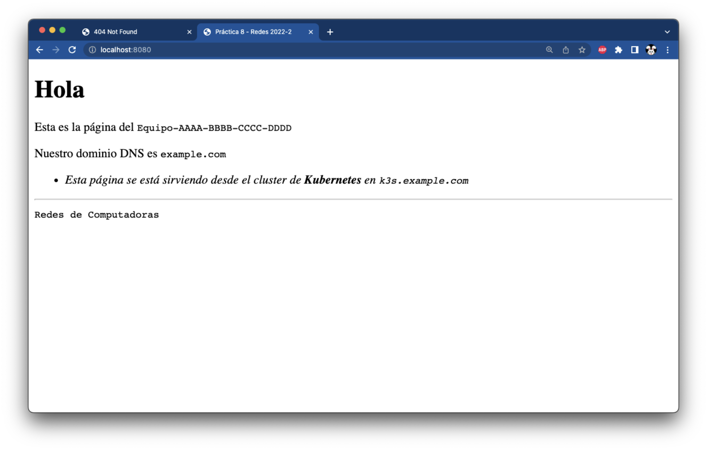
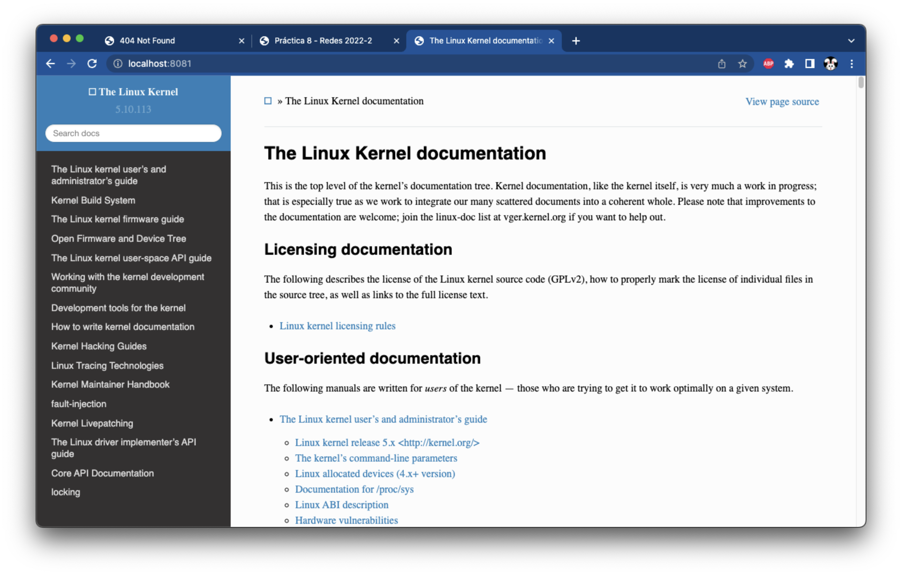
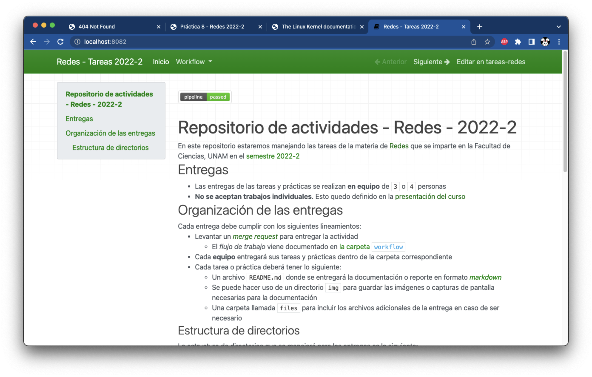

# Implementación de sitios web en **Kubernetes**

--------------------------------------------------------------------------------

## Sitio web _default_

La primer tarea es configurar un sitio web "_default_" que maneje todo el tráfico, esto se conoce como un sitio _catch-all_

- En la práctica anterior, esto se configuró en el _VirtualHost_ `_default_` de Apache HTTPD

### Crea la página de índice

Crea un archivo llamado `index.html` con el siguiente contenido

- Reemplaza `Equipo-AAAA-BBBB-CCCC-DDDD` con el nombre de tu equipo
- Reemplaza `example.com` con tu nombre de dominio

!!! note
    Puedes utilizar otra página `index.html`, siempre y cuando **no utilice recursos externos** y muestre la información solicitada

```html
<!DOCTYPE HTML>
<html>
  <head>
    <meta charset="UTF-8">
    <title>Práctica 8 - Redes 2022-2</title>
    <link href="data:image/x-icon;base64," rel="icon" type="image/x-icon" />
  </head>
  <body>
    <h1>Hola</h1>
    <div>
      <p>Esta es la página del <code>Equipo-AAAA-BBBB-CCCC-DDDD</code></p>
      <p>Nuestro dominio DNS es <code>example.com</code></p>
      <ul>
        <li><em>Esta página se está sirviendo desde el cluster de <b>Kubernetes</b> en <code>k3s.example.com</code></em></li>
      </ul>
    </div>
    <hr/>
    <code>Redes de Computadoras</code>
  </body>
</html>
```

Crea un _configmap_ para guardar el contenido del archivo `index.html`

- Este _configmap_ se pasará a un servidor web para mostrar la página cuando se visita la URL del servidor
- Reemplaza `index-equipo-aaaa-bbbb-cccc-dddd` con el nombre de tu equipo (**en minúsculas**)

```
usuario@laptop ~ % kubectl create configmap index-equipo-aaaa-bbbb-cccc-dddd --from-file=index.html
configmap/index-equipo-aaaa-bbbb-cccc-dddd created
```

### Crea el _deployment_ del servidor web

Ejecuta el siguiente comando para crear un _deployment_ del servidor web `nginx` y especifica que escucha conexiones en el puerto `80`

```
usuario@laptop ~ % kubectl create deployment root-nginx --image=nginx --port=80
```

Verifica que el _pod_ de `nginx` se encuentre en estado de ejecución

```
usuario@laptop ~ % kubectl get pods -l app=root-nginx 
NAME                          READY   STATUS    RESTARTS   AGE
root-nginx-68778df5d4-gjlkh   1/1     Running   0          60s
```

### Asigna el volúmen de la página de índice al _deployment_ del servidor web

Edita el _deployment_ `root-nginx` para agregar las líneas donde se monta el _configmap_ que contiene el archivo `index.html`

```
usuario@laptop ~ % kubectl edit deployment/root-nginx
	...
```

Agrega las líneas correspondientes a `volumeMounts` y `volumes` en las secciones adecuadas

- Reemplaza `index-equipo-aaaa-bbbb-cccc-dddd` con el nombre de tu equipo (**en minúsculas**)

!!! warning
    - Verifica que la identación de las líneas sea correcta y que insertes las secciones en el lugar adecuado
    - YAML es un lenguaje que maneja la identación utlizando **DOS ESPACIOS**

```yaml
---
apiVersion: apps/v1
kind: Deployment
...
spec:
...
  template:
...
    spec:  # Agrega la sección "volumes" entre "spec" y "containers"
      volumes:
      - name: index-equipo-aaaa-bbbb-cccc-dddd
        configMap:
          name: index-equipo-aaaa-bbbb-cccc-dddd
      containers:
      - name: nginx
...
        terminationMessagePolicy: File  # Agrega la sección "volumeMounts" después de esta línea
        volumeMounts:
        - name: index-equipo-aaaa-bbbb-cccc-dddd
          mountPath: /usr/share/nginx/html/index.html
          subPath: index.html
```

Si tienes éxito, aparecerá un mensaje indicando que el _deployment_ fue editado, en caso contrario `kubectl` te regresará al editor e insertará un comentario en el archivo tratando de explicar el error

```
usuario@laptop ~ % kubectl edit deployment/root-nginx
deployment.apps/root-nginx edited
```

Espera unos segundos mientras se lanza otro _pod_ con la nueva configuración

```
usuario@laptop ~ % kubectl get pods -l app=root-nginx
NAME                          READY   STATUS    RESTARTS   AGE
root-nginx-5f8f6c5d9f-2t26s   1/1     Running   0          30s
```

!!! note
    - El identificador del _pod_ debe ser diferente porque se creó uno nuevo con la configuración actualizada del _deployment_
    - Utiliza los siguientes comandos para forzar la creación de un nuevo _pod_ en caso de que no se cree uno automáticamente

    <pre><code>
    usuario@laptop ~ % kubectl scale deployment/root-nginx --replicas 0
    usuario@laptop ~ % kubectl scale deployment/root-nginx --replicas 1
    </code></pre>

### Visualiza la página de índice utilizando _port-forward_

Haz una redirección de puertos de Kubernetes para visualizar la página de índice que acabas de configurar

- Esto funciona al poner el puerto `8080` del equipo local en escucha y redireccionar las peticiones al puerto `80` del _pod_ en el cluster

```
usuario@laptop ~ % kubectl port-forward deployment/root-nginx 8080:80          
Forwarding from 127.0.0.1:8080 -> 80
Forwarding from [::1]:8080 -> 80
```

Accede con un navegador al puerto `8080` en el equipo local

| Página en Kubernetes mostrada a través de _port-forward_
|:-----------------------------------------------------------:|
| 

Presiona `Ctrl+C` para salir de `kubectl port-forward`

```
usuario@laptop ~ % kubectl port-forward deployment/root-nginx 8080:80          
Forwarding from 127.0.0.1:8080 -> 80
Forwarding from [::1]:8080 -> 80
Handling connection for 8080
^C
```

--------------------------------------------------------------------------------

## Sitio de la página de documentación del _kernel_ Linux

Crea un _deployment_ donde se ejecute la imágen de contenedor que contiene el sitio web de la documentación del _kernel_ Linux

- Reemplaza `docker.io/tonejito/nginx:linux-doc` con el [nombre de la imagen de contenedor que creaste][docker-crear-imagenes-de-contenedor] para el sitio web de la documentación del _kernel_ Linux

```
usuario@laptop ~ % CONTAINER_IMAGE="docker.io/tonejito/nginx:linux-doc"
usuario@laptop ~ % kubectl create deployment linux-doc --image="${CONTAINER_IMAGE}" --port=80
deployment.apps/linux-doc created
```

Verifica que el _pod_ asociado al _deployment_ `linux-doc` se está ejecutando

```
usuario@laptop ~ % kubectl get pods -l app=linux-doc
NAME                        READY   STATUS    RESTARTS   AGE
linux-doc-7d564dbdf7-5d9rw   1/1     Running   0          30s
```

Verifica que puedas acceder al sitio web con `kubectl port-forward`

```
usuario@laptop ~ % kubectl port-forward deployment/linux-doc 8081:80                                   
Forwarding from 127.0.0.1:8081 -> 80
Forwarding from [::1]:8081 -> 80
Handling connection for 8081
	...
```

| Página en Kubernetes mostrada a través de _port-forward_
|:--------------------------------------------------------:|
| 

--------------------------------------------------------------------------------

## Sitio de la página de tareas de la materia

Crea un _deployment_ donde se ejecute la imágen de contenedor que contiene el sitio web de tareas de la materia

- Reemplaza `docker.io/tonejito/nginx:tareas-redes` con el [nombre de la imagen de contenedor que creaste][docker-crear-imagenes-de-contenedor] para el sitio web de tareas de la materia

```
usuario@laptop ~ % CONTAINER_IMAGE="docker.io/tonejito/nginx:tareas-redes"
usuario@laptop ~ % kubectl create deployment tareas-redes --image="${CONTAINER_IMAGE}" --port=80
deployment.apps/tareas-redes created
```

Verifica que el _pod_ asociado al _deployment_ `tareas-redes` se está ejecutando

```
usuario@laptop ~ % kubectl get pods -l app=tareas-redes                                              
NAME                            READY   STATUS    RESTARTS   AGE
tareas-redes-59cb877d79-74kp6   1/1     Running   0          15s
```

Verifica que puedas acceder al sitio web con `kubectl port-forward`

```
usuario@laptop ~ % kubectl port-forward deployment/tareas-redes 8082:80
Forwarding from 127.0.0.1:8082 -> 80
Forwarding from [::1]:8082 -> 80
Handling connection for 8082
	...
```

| Página en Kubernetes mostrada a través de _port-forward_
|:--------------------------------------------------------:|
| 

--------------------------------------------------------------------------------

## Verifica la configuración

Revisa que los _deployments_ tengan estado **READY** `1/1` y que el estado de los _pods_ sea `Running`

```
usuario@laptop ~ % kubectl get deployments,pods
NAME                           READY   UP-TO-DATE   AVAILABLE   AGE
deployment.apps/root-nginx     1/1     1            1           31m
deployment.apps/linux-doc      1/1     1            1           21m
deployment.apps/tareas-redes   1/1     1            1           11m

NAME                                READY   STATUS    RESTARTS   AGE
pod/root-nginx-5f8f6c5d9f-2t26s     1/1     Running   0          30m
pod/linux-doc-7d564dbdf7-5d9rw      1/1     Running   0          20m
pod/tareas-redes-59cb877d79-74kp6   1/1     Running   0          10m
```

!!! danger
    - Verifica que **TODAS** las configuraciones que hiciste estén presentes respués de reiniciar la máquina antes de continuar con [la siguiente sección][siguiente]

!!! note
    - Continúa en [la siguiente página][siguiente] si los _deployments_ y _pods_ se están ejecutando y pudiste ver las páginas utilizando `kubectl port-forward` en el equipo local

--------------------------------------------------------------------------------

|                 ⇦           |        ⇧      |                  ⇨            |
|:----------------------------|:-------------:|------------------------------:|
| [Página anterior][anterior] | [Arriba](../) | [Página siguiente][siguiente] |

[anterior]: ../k8s-ingress-nginx
[siguiente]: ../k8s-ingress-resource

[docker-crear-imagenes-de-contenedor]: ../docker#crear-imagenes-de-contenedor
