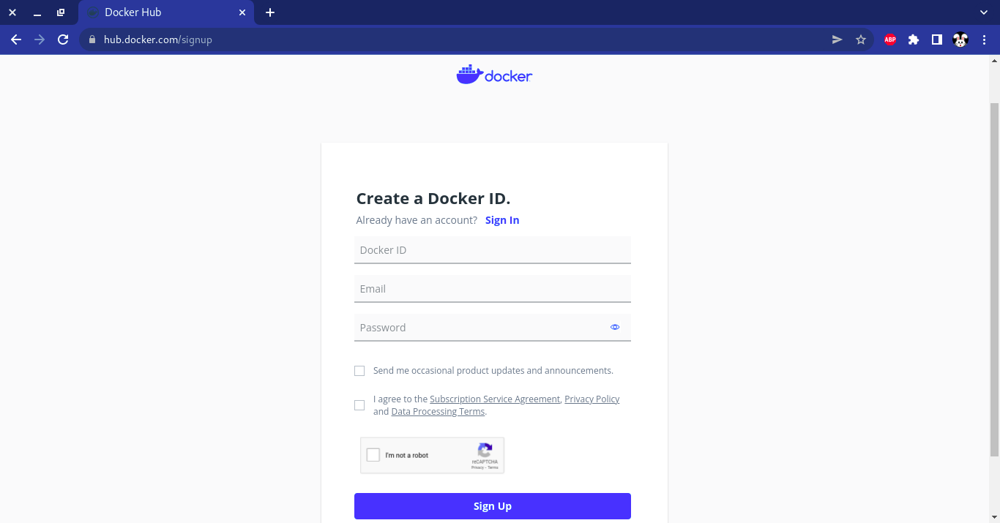
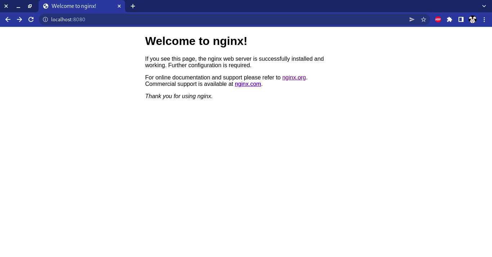
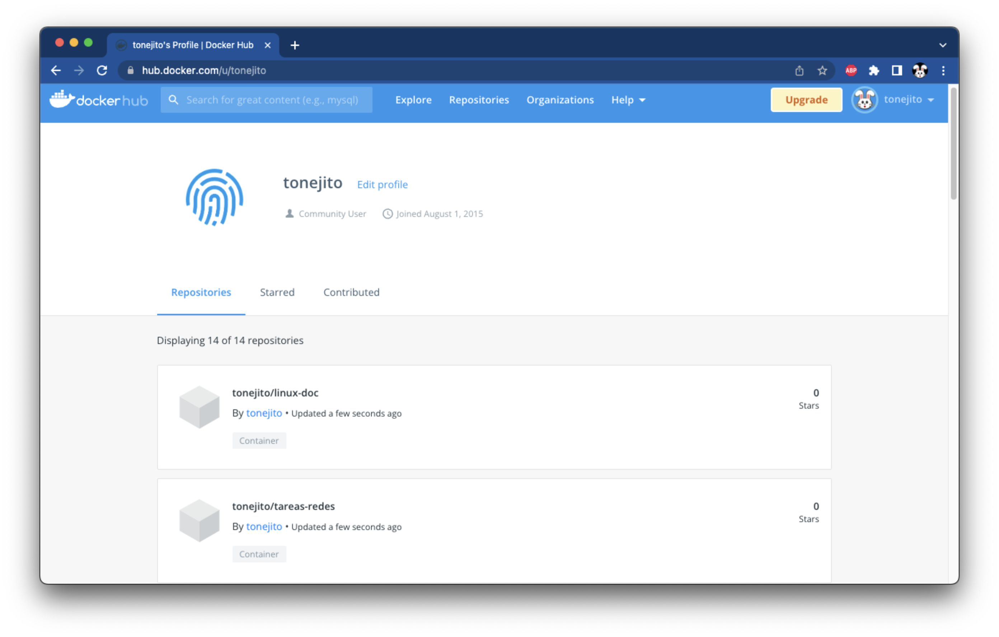

# Creación de imágenes de contenedor con Docker

--------------------------------------------------------------------------------

## Cuenta en Docker Hub

Crea una cuenta en Docker Hub

- <https://hub.docker.com/signup>

!!! note
    - Todos los integrantes del equipo deben crear una cuenta en DockerHub
    - Anota **todos** los nombres de usuario (Docker ID) en tu reporte

| Página de registro de Docker Hub
|:----:|
| 

## Instalación de Docker Desktop

Instala Docker Desktop en tu computadora personal

- <https://www.docker.com/products/docker-desktop/>
- <https://docs.docker.com/desktop/>
- <https://www.docker.com/blog/getting-started-with-docker-desktop/>

!!! note
    En GNU/Linux opcionalmente puedes instalar el demonio de docker (sin interfaz gráfica)
    Para esto sigue las instrucciones de **Docker Engine** para tu distribución de GNU/Linux
    
    - <https://docs.docker.com/engine/install/debian/>

## Prueba de un contenedor

Ejecuta el contenedor `hello-world` para verificar que Docker está instalado correctamente

```
usuario@laptop ~ % docker run -it hello-world
Unable to find image 'hello-world:latest' locally
latest: Pulling from library/hello-world
7050e35b49f5: Pull complete 
Digest: sha256:80f31da1ac7b312ba29d65080fddf797dd76acfb870e677f390d5acba9741b17
Status: Downloaded newer image for hello-world:latest

Hello from Docker!
This message shows that your installation appears to be working correctly.

To generate this message, Docker took the following steps:
 1. The Docker client contacted the Docker daemon.
 2. The Docker daemon pulled the "hello-world" image from the Docker Hub.
    (arm64v8)
 3. The Docker daemon created a new container from that image which runs the
    executable that produces the output you are currently reading.
 4. The Docker daemon streamed that output to the Docker client, which sent it
    to your terminal.

To try something more ambitious, you can run an Ubuntu container with:
 $ docker run -it ubuntu bash

Share images, automate workflows, and more with a free Docker ID:
 https://hub.docker.com/

For more examples and ideas, visit:
 https://docs.docker.com/get-started/
```

## Descargar una imagen de contenedor

Descarga una imagen de contenedor del _registry_ `docker.io`

!!! note
    Normalmente este paso se puede omitir porque la imagen se descarga cuando el contenedor se ejecuta o se construye

```
usuario@laptop ~ % docker pull nginx:1.22-alpine
1.22-alpine: Pulling from library/nginx
b3c136eddcbf: Already exists 
6f08591b28af: Pull complete 
db529e11ed4a: Pull complete 
538c1c0868e9: Pull complete 
8d3b0ed53822: Pull complete 
99eb1bbfd865: Pull complete 
Digest: sha256:f335d7436887b39393409261603fb248e0c385ec18997d866dd44f7e9b621096
Status: Downloaded newer image for nginx:1.22-alpine
docker.io/library/nginx:1.22-alpine
```

<!--
## Borrar una imagen de contenedor

```
usuario@laptop ~ % docker rmi nginx:1.22-alpine             
Untagged: nginx:1.22-alpine
Untagged: nginx@sha256:f335d7436887b39393409261603fb248e0c385ec18997d866dd44f7e9b621096
Deleted: sha256:9c7cb2355812edb2803e546f8474c8d62c0469850bf2cdcc86439f9ef6ec6008
Deleted: sha256:37954b4918e4fd6764e8eef266a383147f381c66a28e5929277570a5e5f484a9
Deleted: sha256:94ed34401043dce17d33d84bf0caf3a928f5bc8c767d8482a654ded948c7233e
Deleted: sha256:45ea4c5dfbf128839ffe49d90cb26651d2958c6d8a98a1b1f1e311a3f76cd54d
Deleted: sha256:9857ad081fa859007cde8ec23acf0ae9fdc53d6b966f702fa906aa3fe4a2875c
Deleted: sha256:0fabb7af533f4b05473a8642c75f38b85161813e793e6eb7688dd1bf51d988d9
```

```
usuario@laptop ~ % docker rmi nginx:1.22-alpine
Error response from daemon: conflict: unable to remove repository reference "nginx:1.22-alpine" (must force) - container 9c8fc358e7c3 is using its referenced image 9c7cb2355812
```

```
usuario@laptop ~ % docker rm 9c8fc358e7c3
9c8fc358e7c3

usuario@laptop ~ % docker rmi nginx:1.22-alpine
	...
```
-->

## Ejecutar un contenedor con un servidor web

Ejecuta la imagen de contenedor que acabas de descargar

- La opción `-it` indica que se muestre en pantalla la salida del proceso que se ejecuta en contenedor
- La opción `-p 8080:80` indica que se redireccionará el puerto `8080` del equipo físico al puerto `80` del contenedor

!!! note
    Usualmente se puede escribir el nombre corto del contenedor (`nginx:1.22-alpine`), pero es recomendable escribir la ruta completa de la imagen para evitar ambigüedades entre _registries_

```
usuario@laptop ~ % docker run -it -p 8080:80 docker.io/library/nginx:1.22-alpine
Unable to find image 'nginx:1.22-alpine' locally
1.22-alpine: Pulling from library/nginx
b3c136eddcbf: Already exists 
6f08591b28af: Already exists 
db529e11ed4a: Already exists 
538c1c0868e9: Already exists 
8d3b0ed53822: Already exists 
99eb1bbfd865: Already exists 
Digest: sha256:01ba4719c80b6fe911b091a7c05124b64eeece964e09c058ef8f9805daca546b
Status: Downloaded newer image for nginx:1.22-alpine
/docker-entrypoint.sh: /docker-entrypoint.d/ is not empty, will attempt to perform configuration
/docker-entrypoint.sh: Looking for shell scripts in /docker-entrypoint.d/
/docker-entrypoint.sh: Launching /docker-entrypoint.d/10-listen-on-ipv6-by-default.sh
10-listen-on-ipv6-by-default.sh: info: Getting the checksum of /etc/nginx/conf.d/default.conf
10-listen-on-ipv6-by-default.sh: info: Enabled listen on IPv6 in /etc/nginx/conf.d/default.conf
/docker-entrypoint.sh: Launching /docker-entrypoint.d/20-envsubst-on-templates.sh
/docker-entrypoint.sh: Launching /docker-entrypoint.d/30-tune-worker-processes.sh
/docker-entrypoint.sh: Configuration complete; ready for start up
2022/06/01 06:01:07 [notice] 1#1: using the "epoll" event method
2022/06/01 06:01:07 [notice] 1#1: nginx/1.22.0
2022/06/01 06:01:07 [notice] 1#1: built by gcc 11.2.1 20220219 (Alpine 11.2.1_git20220219) 
2022/06/01 06:01:07 [notice] 1#1: OS: Linux 5.10.104-linuxkit
2022/06/01 06:01:07 [notice] 1#1: getrlimit(RLIMIT_NOFILE): 1048576:1048576
2022/06/01 06:01:07 [notice] 1#1: start worker processes
2022/06/01 06:01:07 [notice] 1#1: start worker process 33
2022/06/01 06:01:07 [notice] 1#1: start worker process 34
2022/06/01 06:01:07 [notice] 1#1: start worker process 35
2022/06/01 06:01:07 [notice] 1#1: start worker process 36
172.17.0.1 - - [01/Jun/2022:06:01:27 +0000] "GET / HTTP/1.1" 200 615 "-" "curl/7.79.1" "-"
	...
```

### Acceder al contenedor del servidor web

Abre otra terminal y lista los contenedores que se están ejecutando

- Visualiza la columna `PORTS` y verifica que indique que el puerto `8080` del equipo físico se redirige al puerto `80` del contenedor
    - `0.0.0.0:8080->80/tcp` para las conexiones IPv4
    - `:::8080->80/tcp` para las conexiones IPv6

```
usuario@laptop ~ % docker ps
CONTAINER ID   IMAGE               COMMAND                  CREATED         STATUS         PORTS                  NAMES
da39a3ee5e6b   nginx:1.22-alpine   "/docker-entrypoint…"   5 seconds ago   Up 4 seconds   0.0.0.0:8080->80/tcp   raccoon_city
```

<!--
```
usuario@laptop ~ % curl -vk# http://localhost:8080/
*   Trying 127.0.0.1:8080...
* Connected to localhost (127.0.0.1) port 8080 (#0)
> GET / HTTP/1.1
> Host: localhost:8080
> User-Agent: curl/7.79.1
> Accept: */*
> 
* Mark bundle as not supporting multiuse
< HTTP/1.1 200 OK
< Server: nginx/1.22.0
< Date: Wed, 01 Jun 2022 06:01:27 GMT
< Content-Type: text/html
< Content-Length: 704
< Last-Modified: Wed, 25 May 2022 10:01:09 GMT
< Connection: keep-alive
< ETag: "1f2e3d4c-5b0"
5ba93c9db0cff93f52b521d7420e43f6eda2784f
< Accept-Ranges: bytes
< 
<!DOCTYPE html>
<html>
  <head>
    <title>Welcome to nginx!</title>
    <style>
      html { color-scheme: light dark; }
      body { width: 35em; margin: 0 auto; font-family: Tahoma, Verdana, Arial, sans-serif; }
    </style>
  </head>
  <body>
    <h1>Welcome to nginx!</h1>
    <p>
      If you see this page, the nginx web server is successfully installed and working.
      Further configuration is required.
    </p>
    <p>
      For online documentation and support please refer to <a href="http://nginx.org/">nginx.org</a>.
      <br/>
      Commercial support is available at <a href="http://nginx.com/">nginx.com</a>.
    </p>
    <p><em>Thank you for using nginx.</em></p>
  </body>
</html>
```
-->

Accede a la URL del contenedor para verificar que el servidor web responde

```
usuario@laptop ~ % curl -fsSL http://localhost:8080/ | egrep '</?title>'
    <title>Welcome to nginx!</title>
```

Abre un navegador web y accede a la URL del contenedor

- <http://localhost:8080/>

| Página web del contenedor `nginx`
|:----:|
| 

--------------------------------------------------------------------------------

## Crear imagenes de contenedor

### Sintaxis de `Dockerfile`

Esta es la sintaxis de un `Dockerfile` que utiliza [**BuildKit**][docker-buildkit] y algunas características modernas como _heredoc_ en el comando `COPY`

[docker-buildkit]: https://docs.docker.com/develop/develop-images/build_enhancements/

Cada acción se explica en un comentario

!!! warning
    - Asegúrate de especificar la primer línea `# syntax=docker/dockerfile:1.4` (con el símbolo `#`) para utilizar las características avanzadas de BuildKit
    - En caso de que tu versión de Docker no soporte BuildKit, utiliza la otra opción en el `Dockerfile`

```
# syntax=docker/dockerfile:1.4
# La primer línea permite utilizar características avanzadas de BuildKit

# Especifica qué contenedor se utilizará como base para la nueva imagen
FROM	docker.io/library/nginx:1.22-alpine AS nginx

# Declara una variable de entorno para utilizarla después en algún comando
ENV	NGINX_ROOT=/usr/share/nginx/html

# Crea la página de índice para NGINX
# Es necesaria la primer línea (syntax=docker/...) para hacer uso de esta variante de COPY
COPY	<<EOF ${NGINX_ROOT}/index.html
<html>
  <head>
    <title>Hello world!</title>
  </head>
  <body>
    <h1>It works!</h1>
  </body>
</html>
EOF
```

<!--
```
usuario@laptop ~ % curl -fsSL http://localhost:8080/                    
<html>
  <head>
    <title>Hello world!</title>
  </head>
  <body>
    <h1>It works!</h1>
  </body>
</html>
```
-->

- Revisa el contenido de los siguientes archivos `Dockerfile`
- Modificalos haciendo comentarios línea por línea explicando las acciones realizadas
- Anexa los archivos modificados a tu reporte `files/linux-doc/Dockerfile` y `files/tareas-redes/Dockerfile`

    - [`Dockerfile` para el contenedor `linux-doc`][dockerfile-linux-doc]
    - [`Dockerfile` para el contenedor `tareas-redes`][dockerfile-tareas-redes]
        - Modifica las variables de entorno `GIT_PROJECT`, `GIT_REPO` y `GIT_BRANCH` de tal manera que `GITLAB_URL` apunte al repositorio donde tu equipo envía las tareas de la materia

[dockerfile-hello-nginx]: ../files/hello-nginx/Dockerfile
[dockerfile-linux-doc]: ../files/linux-doc/Dockerfile
[dockerfile-tareas-redes]: ../files/tareas-redes/Dockerfile

### Construir imagenes de contenedor

Utiliza `docker build` para construir la imagen del contenedor, verifica que el `TAG` corresponda a tu nombre de usuario y el contenedor `linux-doc` o `tareas-redes` según sea el caso

!!! note
    - Se recomienda utilizar la opción `--progress plain` para capturar toda la salida de `docker build`
    - Guarda esta salida en los archivos `files/linux-doc/build-output.txt` y `files/tareas-redes/build-output.txt`
    - Anexa estos archivos a tu reporte

!!! warning
    - Necesitas construir las imagenes de contenedor en un equipo con arquitectura `x86_64` (también conocida como `amd64`)
    - Las imágenes no podrán ser ejecutadas en el cluster de Kubernetes en Azure si se construyen en una computadora con procesador `ARM` porque la máquina virtual de Azure tiene arquitectura `x86_64`

```
usuario@laptop ~ % TAG=tonejito/hello-nginx
usuario@laptop ~ % docker build --progress plain -t "${TAG}" ./
#1 [internal] load build definition from Dockerfile

	...

#13 exporting to image
#13 sha256:a1b2c3...d4e5f6
#13 exporting layers 0.0s done
#13 writing image sha256:f6e5d4...c3b2a1 done
#12 naming to docker.io/tonejito/hello-nginx done
#13 DONE 0.0s
```

### Lista las imagenes de contenedor

```
usuario@laptop ~ % docker images
REPOSITORY             TAG           IMAGE ID       CREATED             SIZE
tonejito/tareas-redes  latest        cf83e1357eef   12 minutes ago      54MB
tonejito/linux-doc     latest        b8bdf1542850   24 minutes ago      22MB
tonejito/hello-nginx   latest        d66d8007d620   48 minutes ago      22MB
debian                 11            e4050b5715dc   1 days ago          118MB
python                 3.10-alpine   83f4a921d36c   3 days ago          46.9MB
nginx                  1.22-alpine   e9ce47d0d13c   5 days ago          22MB
httpd                  2.4-alpine    5d85f2b0ff83   7 days ago          136MB
```


### Enviar las imagenes de contenedor al _registry_

Utiliza `docker push` para enviar tus imagenes de contenedor `linux-doc` y `tareas-redes` al _registry_ Docker Hub

!!! note
    - Guarda esta salida en los archivos `files/linux-doc/push-output.txt` y `files/tareas-redes/push-output.txt`
    - Anexa estos archivos a tu reporte

```
usuario@laptop ~ % TAG=tonejito/hello-nginx
usuario@laptop ~ % docker push "${TAG}"
Using default tag: latest
The push refers to repository [docker.io/tonejito/hello-nginx]
38b060a751ac: Pushed 
96384cd9327e: Mounted from library/nginx
b1b1e36a21fd: Mounted from library/nginx
b71114be0743: Mounted from library/nginx 
4c0cc7bf63f6: Mounted from library/nginx
e1da274edebf: Mounted from library/nginx
e76f65fbd51a: Mounted from tonejito/hello-nginx 
latest: digest: sha256:01234...567890 size: 1024
```

--------------------------------------------------------------------------------

## Verifica los cambios realizados

Revisa que tus imagenes de contenedor `linux-doc` y `tareas-redes` aparezcan en tu cuenta de usuario en Docker Hub

- <https://hub.docker.com/u/USUARIO>

| Imagenes de contenedor en Docker Hub
|:------------------------------------:|
| 


!!! warning
    - Necesitas construir las imagenes de contenedor en un equipo con arquitectura `x86_64` (también conocida como `amd64`)
    - Las imágenes no podrán ser ejecutadas en el cluster de Kubernetes en Azure si se construyen en una computadora con procesador `ARM` porque la máquina virtual de Azure tiene arquitectura `x86_64`

!!! danger
    - Verifica que **TODAS** las imagenes de contenedor esten presentes antes de continuar con [la siguiente sección][siguiente]

!!! note
    - Continúa en [la siguiente página][siguiente] cuando hayas terminado de construir las imagenes de contenedor y las hayas subido a Docker Hub


--------------------------------------------------------------------------------

|                 ⇦           |        ⇧      |                  ⇨            |
|:----------------------------|:-------------:|------------------------------:|
| [Página anterior][anterior] | [Arriba](../) | [Página siguiente][siguiente] |

[anterior]: ../../practica-8
[siguiente]: ../prepare-vm

[docker-desktop]: https://www.docker.com/products/docker-desktop/
[docker-desktop-docs]: https://docs.docker.com/desktop/

[dockerfile-heredoc]: https://www.docker.com/blog/introduction-to-heredocs-in-dockerfiles/
[dockerfile-buildkit-syntax]: https://hub.docker.com/r/docker/dockerfile
[dockerfile-frontend-syntaxe]: https://github.com/moby/buildkit/blob/master/frontend/dockerfile/docs/syntax.md
