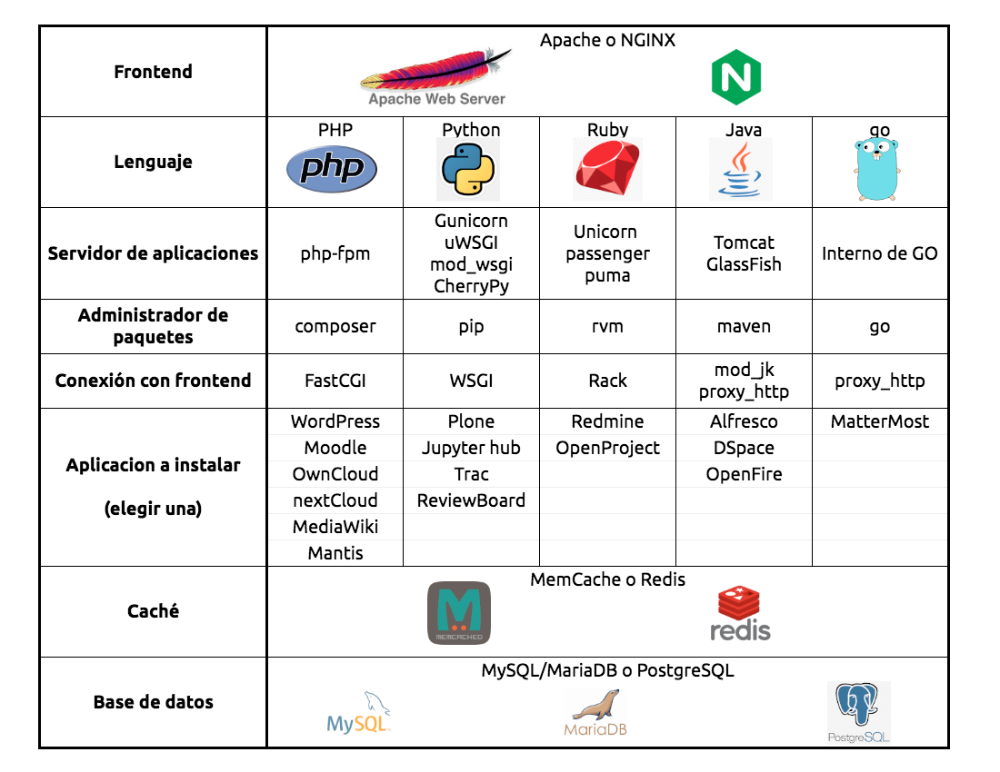
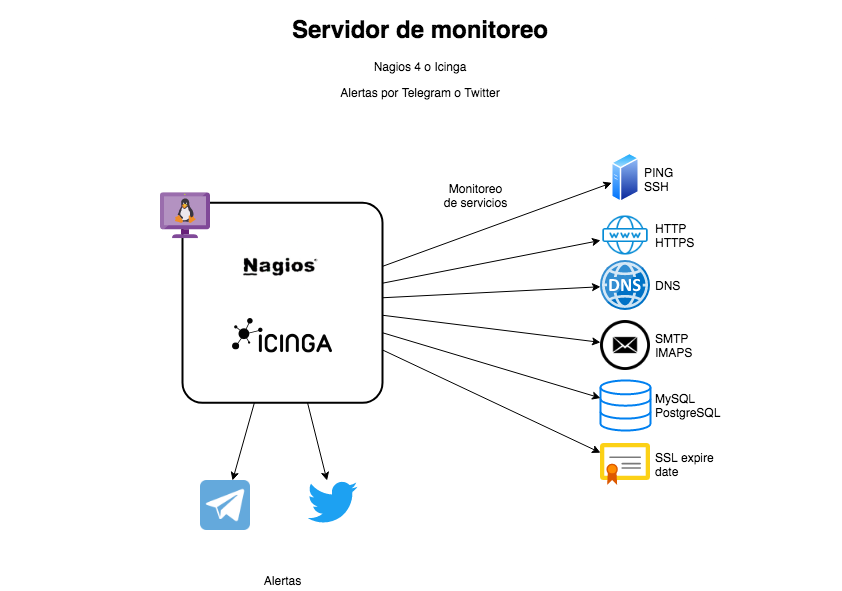

---
# https://www.mkdocs.org/user-guide/writing-your-docs/#meta-data
title: Proyecto 1 - Implementación de un servicio de producción
authors:
- Andrés Leonardo Hernández Bermúdez
---

# Proyecto 1: Implementación de un servicio de producción

--------------------------------------------------------------------------------

## Objetivos

- Instalación y configuración de un servidor de aplicaciones
- Creación del VirtualHost para la aplicación web
- Instalación de una aplicación web y configuración de ambiente productivo
- Instalación y configuración de la base de datos y motor de caché

## Elementos de apoyo

- Todos estos videos están en una [lista de reproducción dedicada a los temas de HTTP y SSL 📹][playlist-https]
- [Protocolo DNS 📼][video-protocolo-dns]
- [Configuración de OpenSSH y autenticación con llaves 📼][video-configuracion-ssh]
- [Configuración de Apache HTTPD en Debian 📼][video-configuracion-apache-debian]
- [Directivas de configuración de Apache HTTPD 📼][video-directivas-apache]
- [Configuración de VirtualHosts de Apache HTTPD 2.4 utilizando /etc/hosts 📼][video-virtualhosts-apache-etc-hosts]
- [Configuración de VirtualHosts de Apache HTTPD 2.4 con registros DNS 📼][video-virtualhosts-apache-registros-dns]
- [Certificados SSL x509 📼][video-certificados-ssl-x509]
- [Certificados SSL con OpenSSL y VirtualHost HTTPS en Apache HTTPD 📼][video-certificados-ssl-virtualhost-https-apache]
- [Trámite de un certificado SSL con Let's Encrypt utilizando certbot 📼][video-letsencrypt-certbot]

???+ details "Páginas de manual de Apache HTTPD"

    - [Apache HTTP Server - Documentation - Version 2.4][apache-docs]
    - [Configuration Sections][apache-docs-config-sections]
    - [Security Tips][apache-docs-security]
    - [Server-Wide Configuration][apache-docs-server-wide]
    - [URL Rewriting with mod_rewrite][apache-docs-url-rewrite]
    - [Apache Virtual Host documentation][apache-docs-virtualhost]
    - [Apache SSL/TLS Encryption][apache-docs-ssl]
    - [Apache HTTP Server Tutorial: .htaccess files][apache-docs-htaccess]

## Restricciones

!!! danger
    - La evaluación de este proyecto final corresponderá al **tercer examen parcial** del curso

!!! warning
    - **Esta actividad depende de los recursos implementados en la [práctica 8](../../laboratorio/practica-8) y [práctica 9](../../laboratorio/practica-9)**
    - Se recomienda que se realicen las actividades previas [siguiendo la calendarización](../../laboratorio) con el objeto de dejar suficiente tiempo para la elaboración de este proyecto

- La fecha límite de entrega es el **lunes 05 de diciembre de 2022** a las 23:59 horas
- Esta actividad debe ser entregada **en equipo** de acuerdo al [flujo de trabajo para la entrega de tareas y prácticas][flujo-de-trabajo]
    - Utilizar la carpeta `docs/proyectos/proyecto-web/Equipo-ABCD-EFGH-IJKL-MNOP` para entregar la práctica
    - Donde `Equipo-ABCD-EFGH-IJKL-MNOP` representa el nombre del equipo que debió anotarse previamente en la [lista del grupo][lista-redes]
    - Hacer un _merge request_ a la rama `proyecto-web` del [repositorio de tareas][repo-tareas] para entregar la actividad

- Cada equipo tendrá que configurar uno de los servicios de red que se describen a continuación y anotar su elección en [la hoja de cálculo compartida][proyecto-web]

- No se permite tener proyectos repetidos. Revisar los requerimientos de la aplicación o sistema elegido para seleccionar la base de datos y motor de caché en memoria (si aplica).

--------------------------------------------------------------------------------

## Implementación de un _stack_ web

<a id="tabla" name="tabla"></a>

| Lista de proyectos
|:-------------------------------------:|
| 

- Elegir una aplicación de la [tabla](#tabla) en [la hoja de cálculo compartida][proyecto-web]

- Proteger la _sección administrativa_ del sitio utilizando [autenticación de tipo `digest`][apache-auth-digest]

- El sitio debe tener un certificado **wildcard** SSL emitido por Let's Encrypt y se debe utilizar el mismo nombre de dominio que en la [práctica 9](../../laboratorio/practica-9)

- El sitio debe hacer redirección de todas las peticiones HTTP hacía su versión en HTTPS

    - Se pueden usar redirecciones estándar `301` y `302` de HTTP

    - Utilizar la directiva [`Redirect`][apache-redirect-https] o la configuración de [`mod_rewrite`][apache-rewrite-https] (pero no ambas porque son excluyentes entre si)

- Habilitar el soporte de `userdir` donde cada usuario tenga en su directorio `HOME` una carpeta llamada [`public_html`][apache-userdir] o `public_tomcat` que sirva para que el usuario suba sus archivos y que estén disponibles en `/~usuario` en el servidor

    - Ej. `/home/andres-hernandez/public_html` ⇨ `https://example.com/~andres-hernandez`

- Instalar y configurar una aplicación web simple que se conecte al motor de caché y a la base de datos

  - Montar la aplicación elegida en el directorio `/opt`

  - Crear un VirtualHost para que la aplicación responda en los dominios `proyecto.example.com` y `aplicacion.example.com` sobre HTTP y HTTPS

  - No utilizar los VirtualHosts predeterminados ni ningún otro que se haya creado en la [práctica 9](../../laboratorio/practica-9) para HTTP ni HTTPS
      - Los sitios estáticos creados en la [práctica 9](../../laboratorio/practica-9) deben seguir funcionando

## Configuración de respaldos

Automatizar el respaldo de la base de datos en "esquema" y "contenido"

- Script y configuración de la tarea programada para respaldar la base de datos <u>cada 12 horas</u> ([medio día y media noche][cron])

- Definir un **prefijo** para que indique la fecha (`YYYY-MM-DD-HH-MM`) o _marca de tiempo_ UNIX epoch (ver salida de `date '+%s'`)

- Definir si los archivos respaldo se guardan el prefijo en el nombre o si se crearán carpetas con el prefijo para contener los archivos de cada respaldo

- `recursos.tar.gz`: Crear un archivo TAR comprimido con `gzip` que tenga los archivos que hayan subido los usuarios, cada aplicación tiene una carpeta que no forma parte del código donde guarda estos archivos

- `esquema.sql.gz`: Generar un archivo SQL comprimido con `gzip` con el **esquema** de la base de datos (definición de tablas)

- `datos.sql.gz`: Generar otro archivo SQL con los **datos** de todas las tablas de la base de datos

- Subir los archivos resultantes a Google Drive utilizando [`rclone`][rclone-gdrive].

    - Tener cuidado con los [permisos que se dan a la aplicación][google-drive-permissions] y seleccionar [el modo de acceso `drive.file`][rclone-gdrive-scopes] para dar acceso **ÚNICAMENTE a los archivos y directorios que `rclone` haya creado**.

    - Establecer un folder como la [raíz que puede ver `rclone`][rclone-gdrive-root-folder] para limitar aún mas el acceso a Google Drive.

[google-drive-permissions]: https://developers.google.com/drive/api/guides/api-specific-auth
[rclone-gdrive-scopes]: https://rclone.org/drive/#scopes
[rclone-gdrive-root-folder]: https://rclone.org/drive/#root-folder-id

```
$ rclone config

	...

Scope that rclone should use when requesting access from drive.
Choose a number from below, or type in your own value
 1 / Full access all files, excluding Application Data Folder.
   \ "drive"
 2 / Read-only access to file metadata and file contents.
   \ "drive.readonly"
   / Access to files created by rclone only.	⬅	⬅	⬅	⬅	⬅	⬅	⬅
 3 | These are visible in the drive website.	⬅	⬅	⬅	⬅	⬅	⬅	⬅
   | File authorization is revoked when the user deauthorizes the app.	⬅	⬅
   \ "drive.file"	⬅	⬅	⬅	⬅	⬅	⬅	⬅	⬅	⬅	⬅	⬅	⬅	⬅
   / Allows read and write access to the Application Data folder.
 4 | This is not visible in the drive website.
   \ "drive.appfolder"
   / Allows read-only access to file metadata but
 5 | does not allow any access to read or download file content.
   \ "drive.metadata.readonly"

scope> 3	⬅	⬅	⬅	⬅	⬅	⬅	⬅	⬅	⬅	⬅	⬅	⬅	⬅	⬅	⬅

	...

ID of the root folder - leave blank normally.  Fill in to access "Computers" folders. (see docs).
root_folder_id> xxxxxxxxxxxxxxxxxxxxxxxxxxxxxxxxx	⬅	⬅	⬅	⬅	⬅	⬅

	...
```

[rclone-authorize]: https://rclone.org/commands/rclone_authorize/

<!--
--------------------------------------------------------------------------------
-->
<!--
## Servidor de monitoreo

- El sitio debe tener un certificado **wildcard** SSL emitido por Let's Encrypt y se debe utilizar el mismo nombre de dominio que en la [práctica 9](../../laboratorio/practica-9)

- El sitio debe hacer redirección de todas las peticiones HTTP hacía su versión en HTTPS

    - Se pueden usar redirecciones estándar 301 y 302 de HTTP

    - Utilizar la directiva [`Redirect`][apache-redirect-https] o la configuración de [`mod_rewrite`][apache-rewrite-https] (pero no ambas porque son excluyentes entre si)

- Instalar un servidor de monitoreo mediante el software Nagios o Icinga

  - Crear un VirtualHost para que la aplicación responda en los dominios `proyecto.example.com` y `aplicacion.example.com` sobre HTTP y HTTPS

  - No utilizar los VirtualHosts predeterminados para HTTP ni HTTPS

- Se debe configurar el servidor para llevar a cabo el monitoreo de estado de los siguientes servicios de red:

    - DNS
    - HTTP y HTTPS
    - IMAP
    - SMTP
    - MemCache
    - Redis
    - MySQL
    - PostgreSQL
    - Validez del certificado SSL
    - Expiración del dominio

- Generar alertas en caso de falla y avisos de recuperación de los servicios utilizando scripts guardados en el directorio `/usr/local/bin`

    - [Telegram][api-telegram]: Crear un canal y publicar un mensaje cada que un host o servicio cambie de estado
    - [Twitter][api-twitter]: Crear una nueva cuenta y publicar un _tweet_ cada que un host o servicio cambie de estado

- Los elementos que se deberán implementar en este servicio se muestran en el diagrama:

|                                                   |
|:-------------------------------------------------:|
|  |
-->

--------------------------------------------------------------------------------

## Entregables

<!--
### General
-->

- Ver el siguiente video y emitir un comentario sobre la relación del contenido presentado y los conceptos utilizados en este proyecto

    - [Seguridad en AWS - AWS Public Sector Summit Mexico City 2020 📼](https://youtu.be/d3jnbtaLb24&list=PL2yQDdvlhXf_h40vMoMoh2SBa05geKLDq&index=10&)

- Subir a la [carpeta compartida de Google Drive][carpeta-drive] los siguientes archivos de respaldo que sustentan el trabajo elaborado en el desarrollo del proyecto:

    - Par de llaves SSH con las que se accedió al servidor en un archivo `TAR` (archivos `equipo_redes_rsa` y `equipo_redes_rsa.pub`)

    - Lista de usuarios y contraseñas para acceder a la aplicación web, base de datos y demás, en un archivo de texto llamado `accesos.txt`

    - Certificado y llave privada utilizados en el sitio web en un archivo `TAR` (directorio `/etc/letsencrypt`)

    - Respaldo de configuraciones del servidor en un archivo `TAR` (directorio `/etc`)

    - Respaldo de bitácoras del sistema en un archivo `TAR` (directorio `/var/log`)

<!--
### Para los proyectos del _stack_ web
-->

- Subir adicionalmente a la carpeta compartida:

    - Respaldo de la aplicación web en un archivo `TAR` (directorio `/opt`)

    - Respaldo de la base de datos utilizada en formato SQL

        - Puede ser comprimido con gzip, bzip2 o 7zip
<!--
### Para el proyecto de monitoreo

- Subir adicionalmente a la carpeta compartida:

    - Respaldo de los archivos de trabajo del sistema de monitoreo en un archivo `TAR`

        - Nagios: directorio `/var/lib/nagios4`

        - Icinga: directorio `/var/lib/icinga2`

    - Respaldo de los _scripts_ utilizados para enviar las alertas por Telegram y Twitter (directorio `/usr/local/bin`)
-->
--------------------------------------------------------------------------------

## Extra

<!--
### General
-->

<!--
- [Crear una imágen AMI][aws-ec2-ami] de la instancia EC2 y [compartirla con los profesores][aws-ec2-ami-share]

    - Cuenta de AWS `374417498684`
-->

- Implementar [**HSTS**][hsts] en las cabeceras del sitio para forzar a que se pida el contenido del sitio a través de HTTPS

    - Establecer un timeout bajo de entre `60` y `300` segundos para probar que HSTS funciona

- Implementar la cabecera [`X-Robots-Tag`][x-robots-tag] para evitar que los motores de búsqueda indexen el sitio

<!--
### Para los proyectos del _stack_ web

- Respaldo (movido a la sección de implementación)
-->

<!--
### Para el proyecto de monitoreo

- El sistema de monitoreo instala una autenticación de tipo `basic` de manera predeterminada, [cambiar el tipo de autenticación a `digest`][apache-auth-digest]

- Automatizar el respaldo de las bitácoras del servidor y los archivos de trabajo de Nagios o Icinga

    - Script y configuración de la tarea programada para respaldar la base de datos [**diario a media noche**][cron]

    - Creación de archivo `TAR` con las bitácoras del servidor

    - Creación de archivo `TAR` con los archivos de trabajo de Nagios o Icinga
-->
--------------------------------------------------------------------------------

## Notas adicionales

- No se aceptan instalaciones que provengan de _scripts_ que automaticen el proceso, ni de soluciones todo en uno (_one click install_)

- Redacte un reporte por equipo, en el que consigne los pasos que considere necesarios para explicar cómo realizó el proyecto, incluya capturas de pantalla que justifiquen su trabajo

- Incluya en su reporte un apartado de conclusiones referentes al trabajo realizado

- Puede agregar posibles errores, complicaciones, opiniones, críticas de el proyecto, o cualquier comentario relacionado

- Entregue su reporte de acuerdo a la [forma de entrega de tareas y prácticas][lineamientos-entrega] definida al inicio del curso


<!--
--------------------------------------------------------------------------------

## Monitoreo del estado de la infraestructura


-->

--------------------------------------------------------------------------------

[apache-userdir]: https://httpd.apache.org/docs/2.4/howto/public_html.html
[apache-redirect-https]: https://cwiki.apache.org/confluence/plugins/servlet/mobile?contentId=115522478#content/view/115522444
[apache-rewrite-https]: https://cwiki.apache.org/confluence/plugins/servlet/mobile?contentId=115522478#content/view/115522478
[api-telegram]: https://core.telegram.org/
[api-twitter]: https://developer.twitter.com/en/docs/twitter-api
[carpeta-drive]: https://drive.google.com/drive/folders/1dIZm3qWfVedrdSG8GZ6eDcJQXmFLw5Xa
[aws-ec2-ami]: https://docs.aws.amazon.com/AWSEC2/latest/UserGuide/creating-an-ami-ebs.html
[aws-ec2-ami-share]: https://docs.aws.amazon.com/AWSEC2/latest/UserGuide/sharingamis-explicit.html
[hsts]: https://https.cio.gov/hsts/
[x-robots-tag]: https://developers.google.com/search/docs/advanced/robots/robots_meta_tag
[apache-auth-digest]: https://httpd.apache.org/docs/2.4/howto/auth.html
[cron]: https://opensource.com/article/17/11/how-use-cron-linux
[lineamientos-entrega]: https://redes-ciencias-unam.gitlab.io/2023-1/tareas-redes/workflow/

[flujo-de-trabajo]: https://redes-ciencias-unam.gitlab.io/2023-1/tareas-redes/workflow/
[repo-tareas]: https://gitlab.com/Redes-Ciencias-UNAM/2023-1/tareas-redes/-/merge_requests

[proyecto-web]: https://tinyurl.com/Redes-2023-1-Proyecto-Web
[lista-redes]: https://tinyurl.com/Lista-Redes-2023-1

[playlist-https]: https://www.youtube.com/playlist?list=PLN1TFzSBXi3QGCMqARFoO1ePBX1P38erB
[video-protocolo-dns]: https://www.youtube.com/watch?v=r4PntflJs9E
[video-configuracion-ssh]: https://youtu.be/Hnu7BHBDcoM&t=1390
[video-configuracion-apache-debian]: https://youtu.be/XbQ_dBuERdM
[video-directivas-apache]: https://youtu.be/3JkQs3KcjxQ
[video-virtualhosts-apache-etc-hosts]: https://youtu.be/ZnqSNXIr-h4
[video-virtualhosts-apache-registros-dns]: https://youtu.be/JYo5rc4mhf0
[video-certificados-ssl-x509]: https://youtu.be/rXqkJi_FTuQ
[video-certificados-ssl-virtualhost-https-apache]: https://youtu.be/66dOHHD6L5I
[video-letsencrypt-certbot]: https://youtu.be/kpiChLT5JPs

[apache-docs]: https://httpd.apache.org/docs/2.4/
[apache-docs-config-sections]: https://httpd.apache.org/docs/2.4/sections.html
[apache-docs-security]: https://httpd.apache.org/docs/2.4/misc/security_tips.html
[apache-docs-server-wide]: https://httpd.apache.org/docs/2.4/server-wide.html
[apache-docs-url-rewrite]: https://httpd.apache.org/docs/2.4/rewrite/
[apache-docs-virtualhost]: https://httpd.apache.org/docs/2.4/vhosts/
[apache-docs-ssl]: https://httpd.apache.org/docs/2.4/ssl/
[apache-docs-htaccess]: https://httpd.apache.org/docs/2.4/howto/htaccess.html

[certbot-instructions-debian-10-buster]: https://certbot.eff.org/instructions?ws=apache&os=debianbuster

[rclone-gdrive]: https://rclone.org/drive/
