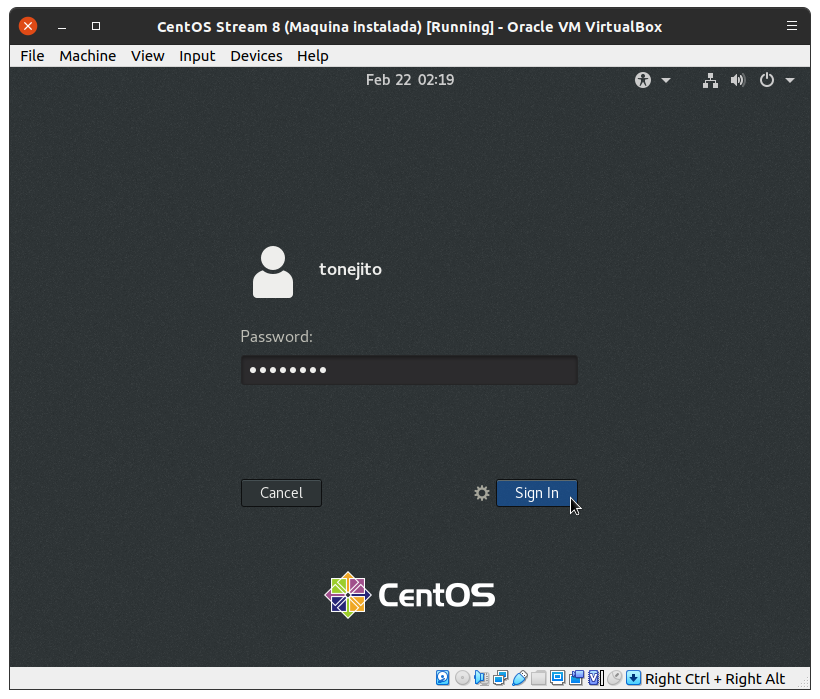

# Configuración de CentOS Stream 8

!!! note
    - Asegúrate de haber instalado la [máquina virtual de CentOS](../centos-install)

## Configuración en VirtualBox

### Quitar imagen ISO de instalación

<!--
|      |
|:----:|
|  |
-->

|      |
|:----:|
|  |

|      |
|:----:|
|  |

### Agregar interfaz _host-only_

|      |
|:----:|
|  |

|      |
|:----:|
|  |

### Configuración del portapapeles y _drag and drop_

|      |
|:----:|
|  |

|      |
|:----:|
|  |

### Creación de _snapshot_

<!--
|      |
|:----:|
|  |
-->

|      |
|:----:|
|  |

|      |
|:----:|
|  |

<!--
|      |
|:----:|
|  |
-->

--------------------------------------------------------------------------------

## Configuración de la máquina virtual

### Información del sistema

|      |
|:----:|
|  |

|      |
|:----:|
|  |

|      |
|:----:|
|  |

|      |
|:----:|
|  |

|      |
|:----:|
|  |

|      |
|:----:|
|  |

|      |
|:----:|
|  |


### Configuración de repositorios

- Eleva privilegios utilizando `su`

```bash
[tonejito@centos-8 ~]$ su -
Password:
[root@centos-8 ~]#
```

- Actualiza la lista de paquetes disponibles

```bash
[root@centos-8 ~]# dnf makecache
	...
Metadata cache created.
```

- Instala el paquete `epel-release` para agregar el repostorio EPEL al sistema.

```bash
[root@centos-8 ~]# dnf install epel-release

	...

Install  2 Packages

Total download size: 35 k
Installed size: 38 k
Is this ok [y/N]: y

	...

Importing GPG key 0x8483C65D:
 Userid     : "CentOS (CentOS Official Signing Key) <security@centos.org>"
 Fingerprint: 99DB 70FA E1D7 CE22 7FB6 4882 05B5 55B3 8483 C65D
 From       : /etc/pki/rpm-gpg/RPM-GPG-KEY-centosofficial
Is this ok [y/N]: y
Key imported successfully

	...

Installed:
  epel-next-release-8-11.el8.noarch            epel-release-8-11.el8.noarch

Complete!
```

- Actualiza la lista de paquetes disponibles

```bash
[root@centos-8 ~]# dnf makecache
	...
Metadata cache created.
```

### Configurar `sudo`

- Eleva privilegios utilizando `su`

```bash
[tonejito@centos-8 ~]$ su -
Password:
[root@centos-8 ~]#
```

- Instala el paquete de `sudo`

```bash
[root@centos-8 ~]# dnf install sudo
Last metadata expiration check: 0:06:35 ago on Tue 22 Feb 2022 01:43:37 AM CST.
Package sudo-1.8.29-8.el8.x86_64 is already installed.
```

- Edita el archivo `/etc/sudoers`

```bash
# visudo
```

!!! danger
    - Utiliza **únicamente** el programa `visudo` para editar el archivo `/etc/sudoers`, no lo intentes editar a mano con otro editor común de texto.
    - Si necesitas cambiar el editor, puedes exportar el nombre como variable de entorno: `export EDITOR=vim`

- Modifica la línea para no requerir contraseña al ejecutar `sudo`

```bash
# Allows people in  group wheel to run all commands
# %wheel	ALL=(ALL)	ALL

## Same thing without a password
%wheel	ALL=(ALL)	NOPASSWD:	ALL
```

- Agrega a tu usuario al grupo `wheel` para que pueda elevar privilegios

```bash
[root@centos-8 ~]# usermod -aG wheel tonejito
```

- Verifica que el usuario esté en el grupo `wheel`

```bash
[root@centos-8 ~]# groups tonejito
tonejito : tonejito wheel
```

- Reinicia la máquina virtual para aplicar los cambios

```bash
[root@centos-8 ~]# reboot
	...
```

### Instalar SSH

- Instala el servicio de SSH

```bash
[root@centos-8 ~]# dnf install openssh-server
Last metadata expiration check: 0:03:25 ago on Tue 22 Feb 2022 01:43:37 AM CST.
Package openssh-server-8.0p1-12.el8.x86_64 is already installed.
Dependencies resolved.
Nothing to do.
Complete
```

- Habilita el servicio de SSH

```bash
root@debian-11:~# systemctl enable sshd
```

- Agrega una regla al firewall de host para permitir el tráfico de entrada SSH

```bash
[root@centos-8 ~]# firewall-cmd --zone=public --permanent --add-service=ssh
Warning: ALREADY_ENABLED: ssh
success

[root@centos-8 ~]# firewall-cmd --reload
success
```

### Configura la interfaz de red _host-only_

- Revisa que el sistema operativo reconozca la interfaz de red y que esta no se encuentre configurada

!!! note
    En este ejemplo, la asignación de interfaces de red es la siguiente:

    - `lo`: _loopback_
    - `enp0s3`: NAT
    - `enp0s8`: _host-only_ (**esta es la interfaz que vas a configurar**)

```bash
[root@centos-8 ~]# ip addr
1: lo: <LOOPBACK,UP,LOWER_UP> mtu 65536 qdisc noqueue state UNKNOWN group default qlen 1000
    link/loopback 00:00:00:00:00:00 brd 00:00:00:00:00:00
    inet 127.0.0.1/8 scope host lo
       valid_lft forever preferred_lft forever
    inet6 ::1/128 scope host
       valid_lft forever preferred_lft forever
2: enp0s3: <BROADCAST,MULTICAST,UP,LOWER_UP> mtu 1500 qdisc fq_codel state UP group default qlen 1000
    link/ether 08:00:27:3c:7d:19 brd ff:ff:ff:ff:ff:ff
    inet 10.0.2.15/24 brd 10.0.2.255 scope global dynamic noprefixroute enp0s3
       valid_lft 83813sec preferred_lft 83813sec
    inet6 fe80::a00:27ff:fe3c:7d19/64 scope link noprefixroute
       valid_lft forever preferred_lft forever
3: enp0s8: <BROADCAST,MULTICAST,UP,LOWER_UP> mtu 1500 qdisc fq_codel state UP group default qlen 1000
    link/ether 08:00:27:2a:29:14 brd ff:ff:ff:ff:ff:ff
4: virbr0: <NO-CARRIER,BROADCAST,MULTICAST,UP> mtu 1500 qdisc noqueue state DOWN group default qlen 1000
    link/ether 52:54:00:7b:94:83 brd ff:ff:ff:ff:ff:ff
    inet 192.168.122.1/24 brd 192.168.122.255 scope global virbr0
       valid_lft forever preferred_lft forever
```

- Crea el archivo `/etc/sysconfig/network-scripts/enp0s8` con el siguiente conetenido

!!! note
    - Verifica el nombre de tu interfaz de red
    - Este ejemplo utiliza la interfaz de red `enp0s8`

```
DEVICE=enp0s8
TYPE=Ethernet
BOOTPROTO=dhcp
DEFROUTE=no
NAME=enp0s8
ONBOOT=yes
```

- Instala los paquetes de compatibilidad para tener los comandos `ifup` e `ifdown`

```bash
[root@centos-8 ~]# dnf install network-scripts
	...
```

- Levanta de manera manual tu interfaz de red

```bash
[root@centos-8 ~]# ifup enp0s8
WARN      : [ifup] You are using 'ifup' script provided by 'network-scripts', which are now deprecated.
WARN      : [ifup] 'network-scripts' will be removed in one of the next major releases of RHEL.
WARN      : [ifup] It is advised to switch to 'NetworkManager' instead - it provides 'ifup/ifdown' scripts as well.
```

- Verifica que la interfaz de red esté configurada

!!! note
    En este ejemplo, la asignación de interfaces de red es la siguiente:

    - `lo`: _loopback_
    - `enp0s3`: NAT
    - `enp0s8`: _host-only_

```bash
[root@centos-8 ~]# ip addr
1: lo: <LOOPBACK,UP,LOWER_UP> mtu 65536 qdisc noqueue state UNKNOWN group default qlen 1000
    link/loopback 00:00:00:00:00:00 brd 00:00:00:00:00:00
    inet 127.0.0.1/8 scope host lo
       valid_lft forever preferred_lft forever
    inet6 ::1/128 scope host
       valid_lft forever preferred_lft forever
2: enp0s3: <BROADCAST,MULTICAST,UP,LOWER_UP> mtu 1500 qdisc fq_codel state UP group default qlen 1000
    link/ether 08:00:27:3c:7d:19 brd ff:ff:ff:ff:ff:ff
    inet 10.0.2.15/24 brd 10.0.2.255 scope global dynamic noprefixroute enp0s3
       valid_lft 83693sec preferred_lft 83693sec
    inet6 fe80::a00:27ff:fe3c:7d19/64 scope link noprefixroute
       valid_lft forever preferred_lft forever
3: enp0s8: <BROADCAST,MULTICAST,UP,LOWER_UP> mtu 1500 qdisc fq_codel state UP group default qlen 1000
    link/ether 08:00:27:2a:29:14 brd ff:ff:ff:ff:ff:ff
    inet 172.28.128.8/24 brd 172.28.128.255 scope global dynamic noprefixroute enp0s8
       valid_lft 592sec preferred_lft 592sec
    inet6 fe80::a00:27ff:fe2a:2914/64 scope link
       valid_lft forever preferred_lft forever
4: virbr0: <NO-CARRIER,BROADCAST,MULTICAST,UP> mtu 1500 qdisc noqueue state DOWN group default qlen 1000
    link/ether 52:54:00:7b:94:83 brd ff:ff:ff:ff:ff:ff
    inet 192.168.122.1/24 brd 192.168.122.255 scope global virbr0
       valid_lft forever preferred_lft forever
```


### Instalar _software_

- Instala las herramientas de Python en el sistema

```bash
```

- Instala las herramientas de red en el sistema

```bash
[root@centos-8 ~]# dnf install tcpdump nmap netcat ngrep dsniff wget curl whois bind-utils net-tools iproute iptables iptables-services iputils traceroute ethtool
	...
```

#### Instalar `wireshark`

- Instala `wireshark` utilizando `dnf`

```bash
[root@centos-8 ~]# dnf install wireshark wireshark-cli
	...
```

- Verifica que exista el grupo de usuarios `wireshark`

```bash
[root@centos-8 ~]# getent group wireshark
wireshark:x:972:
```

- Agrega tu usuario al grupo `wireshark`

```bash
[root@centos-8 ~]# usermod -aG wireshark tonejito
```

- Verifica que tu usuario pertenezca al grupo

```bash
[root@centos-8 ~]# groups tonejito
tonejito : tonejito wheel wireshark
```

### Configuración de las herramientas de VirtualBox para Linux

- Instala las herramientas de desarrollo para compilar los módulos de kernel

```bash
[root@centos-8 ~]# dnf groupinstall "Development tools"
	...

)root@centos-8 ~]# dnf install dkms kernel-headers kernel-devel kernel-devel-$(uname -r)
```

- Inserta la imagen ISO de las utilerías de VirtualBox en la máquina virtual

<!-- FIXME -->
|      |
|:----:|
|  |

<!--
|      |
|:----:|
|  |
-->

- Verifica que la imagen ISO se encuentre montada en `/run/media/tonejito/VBox_GAs_6.1.30/`
    - Monta la imágen ISO en el directorio si es necesario
    - El nombre de la carpeta puede ser diferente en otras versiones de VirtualBox

```bash
[root@centos-8 ~]# ls -la /run/media/tonejito/VBox_GAs_6.1.30/
total 46923
dr-xr-xr-x 5 root root     2570 Nov 22 09:24 .
drwxr-xr-x 3 root root     4096 Feb 21 23:30 ..
-r--r--r-- 1 root root      763 Feb 20  2020 AUTORUN.INF
-r-xr-xr-x 1 root root     6384 Nov 22 09:17 autorun.sh
dr-xr-xr-x 2 root root      792 Nov 22 09:24 cert
dr-xr-xr-x 2 root root     1824 Nov 22 09:24 NT3x
dr-xr-xr-x 2 root root     2652 Nov 22 09:24 OS2
-r-xr-xr-x 1 root root     4821 Nov 22 09:17 runasroot.sh
-r--r--r-- 1 root root      592 Nov 22 09:24 TRANS.TBL
-r--r--r-- 1 root root  3991991 Nov 22 09:21 VBoxDarwinAdditions.pkg
-r-xr-xr-x 1 root root     3949 Nov 22 09:16 VBoxDarwinAdditionsUninstall.tool
-r-xr-xr-x 1 root root  7443891 Nov 22 09:18 VBoxLinuxAdditions.run
-r--r--r-- 1 root root  9420288 Nov 22 09:10 VBoxSolarisAdditions.pkg
-r-xr-xr-x 1 root root 16890912 Nov 22 09:21 VBoxWindowsAdditions-amd64.exe
-r-xr-xr-x 1 root root   270840 Nov 22 09:18 VBoxWindowsAdditions.exe
-r-xr-xr-x 1 root root  9998128 Nov 22 09:19 VBoxWindowsAdditions-x86.exe
-r--r--r-- 1 root root      259 Oct  4 10:48 windows11-bypass.reg
```

- Ejecuta el _script_ de instalación para compilar los módulos de kernel y habilitar los servicios

```bash
[root@centos-8 ~]# cd /run/media/tonejito/VBox_GAs_6.1.30/
[root@centos-8 VBox_GAs_6.1.30]# bash ./VBoxLinuxAdditions.run
Verifying archive integrity... All good.
Uncompressing VirtualBox 6.1.30 Guest Additions for Linux........
VirtualBox Guest Additions installer
Copying additional installer modules ...
Installing additional modules ...
VirtualBox Guest Additions: Starting.
VirtualBox Guest Additions: Building the VirtualBox Guest Additions kernel modules.
VirtualBox Guest Additions: This may take a while.
VirtualBox Guest Additions: To build modules for other installed kernels, run
VirtualBox Guest Additions:   /sbin/rcvboxadd quicksetup <version>
VirtualBox Guest Additions: or
VirtualBox Guest Additions:   /sbin/rcvboxadd quicksetup all
VirtualBox Guest Additions: Building the modules for kernel 4.18.0-365.el8.x86_64.

VirtualBox Guest Additions: Look at /var/log/vboxadd-setup.log to find out what went wrong
VirtualBox Guest Additions: Running kernel modules will not be replaced until the system is restarted
```

!!! warning
    - El error que se lanza es por una característica que tiene el kernel de CentOS
        - Para más información consultar [este enlace][bug-vbox-guest-additions]
    - Este error no debería afectar la funcionalidad de las utilerías de VirtualBox

- Reinicia el equipo y verifica que los módulos de kernel se carguen

!!! note
    - En este punto ya podrías utilizar las funciones de resolución automática, portapapeles compartido, carpetas compartidas y arrastrar desde y hacia la máquina virtual para copiar archivos.

```bash
[root@centos-8 VBox_GAs_6.0.24]# lsmod | grep vbox
vboxsf                 90112  0
vboxguest             385024  3 vboxsf
vboxvideo              32768  0
drm_vram_helper        20480  1 vboxvideo
drm_ttm_helper         16384  2 drm_vram_helper,vboxvideo
drm_kms_helper        266240  3 vmwgfx,drm_vram_helper,vboxvideo
drm                   585728  9 vmwgfx,drm_kms_helper,drm_vram_helper,vboxvideo,drm_ttm_helper,ttm
```

### Configuración de carpeta compartida con la máquina física

- Una vez que las utilerías de VirtualBox se encuentren configuradas en la máquina virtual, puedes compartir carpetas

|      |
|:----:|
|  |

|      |
|:----:|
|  |

|      |
|:----:|
|  |

- Verifica que la carpeta compartida esté en la ubicación que seleccionaste
    - Puedes crear algunos archivos o directorios y ver que aparezcan en la máquina física y en la virtual

```bash
[root@centos-8 ~]# mount | grep vbox
Public on /mnt/shared type vboxsf (rw,nodev,relatime,iocharset=utf8,uid=0,gid=973,dmode=0770,fmode=0770,tag=VBoxAutomounter)
```

!!! warning
    - La carpeta compartida se monta de manera predeterminada con privilegios restrictivos
    - Puedes agregar una entrada a `/etc/fstab` con la información de montaje que está en `/etc/mtab` y ajustarla con los identificadores `uid` y `gid` de tu usuario

--------------------------------------------------------------------------------

!!! info
    - Cuando hayas terminado de configurar la máquina CentOS, captura la información de los entregables y envíala en un merge request al repositorio de tareas

[bug-vbox-guest-additions]: https://www.virtualbox.org/ticket/20488#comment:4
