# Configuración de Debian 11 _bullseye_

!!! note
    - Asegúrate de haber instalado la [máquina virtual de Debian](../debian-install)

## Configuración de VirtualBox

|      |
|:----:|
| 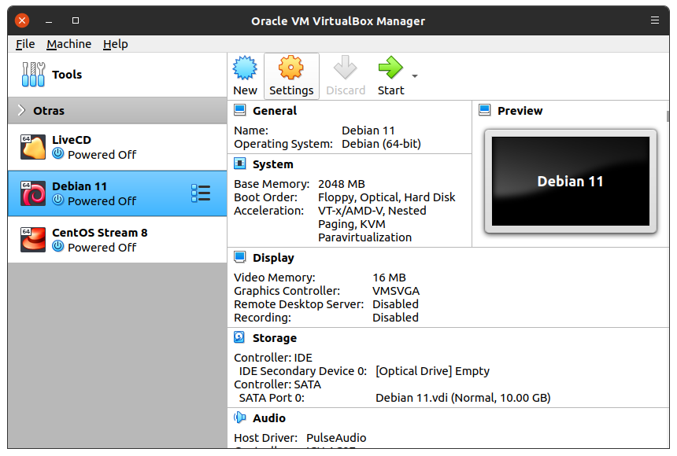 |

### Quitar imagen ISO de instalación

|      |
|:----:|
| 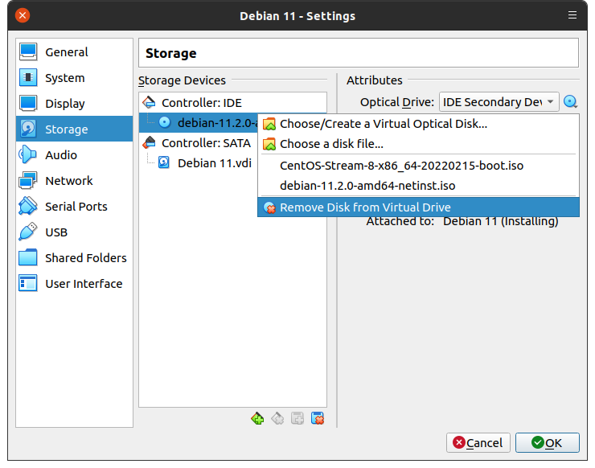 |

<!--
|      |
|:----:|
|  |
-->

|      |
|:----:|
| 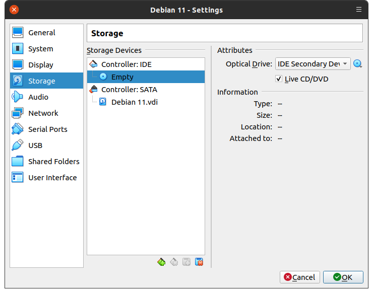 |

### Agregar interfaz _host-only_

|      |
|:----:|
| 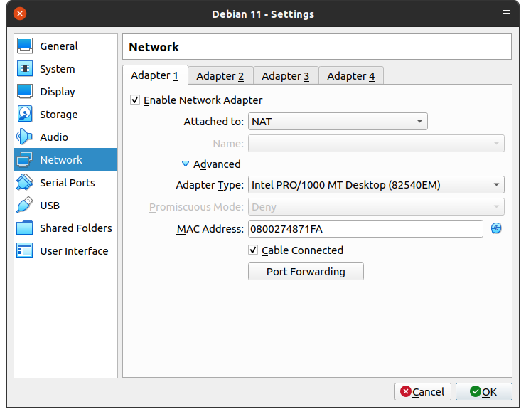 |

|      |
|:----:|
| 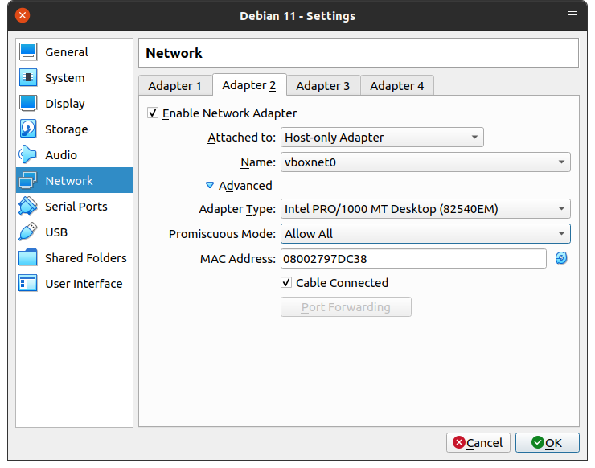 |

### Configuración del portapapeles y _drag and drop_

|      |
|:----:|
| 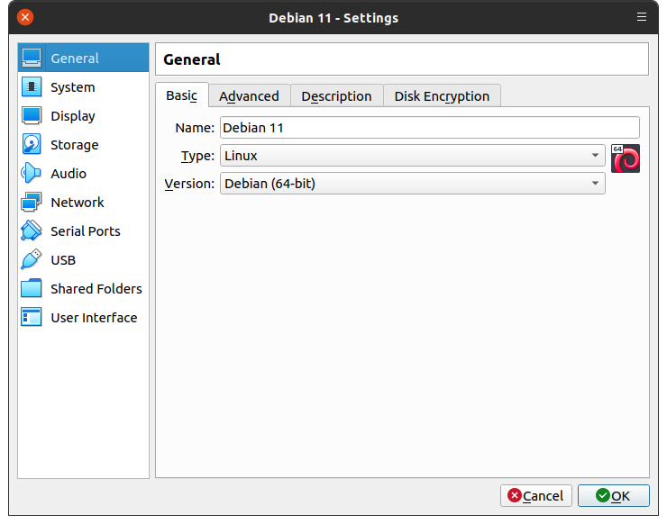 |

|      |
|:----:|
| 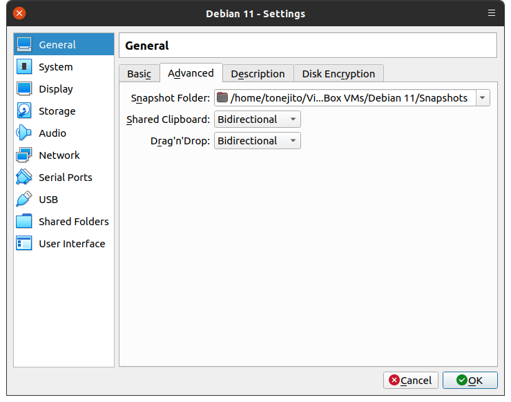 |

### Configuración de aceleración 3D

|      |
|:----:|
| 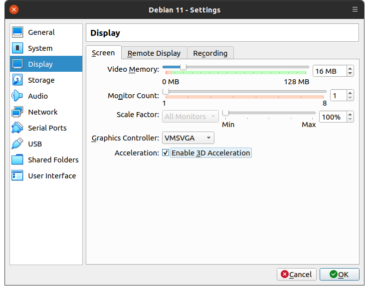 |

### Creación de _snapshot_

|      |
|:----:|
| 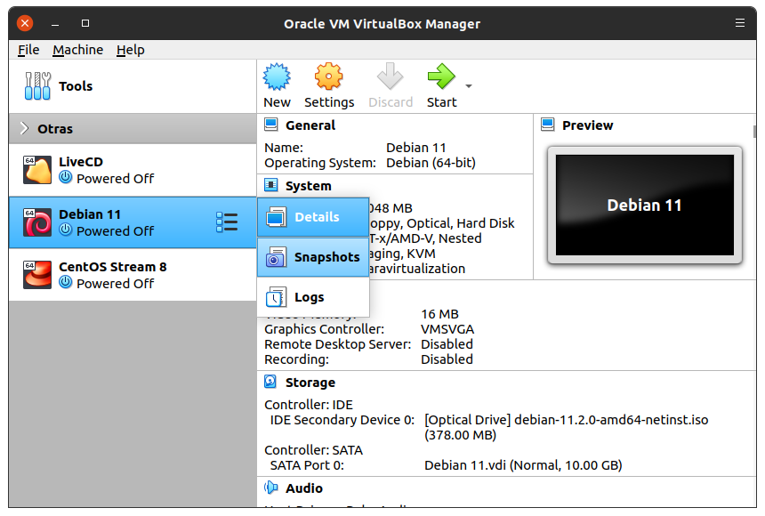 |

|      |
|:----:|
| 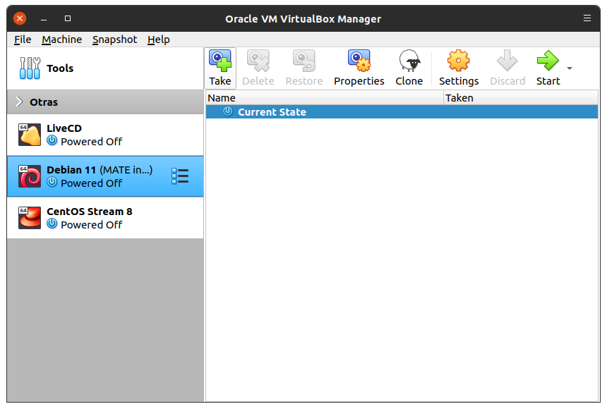 |

|      |
|:----:|
| 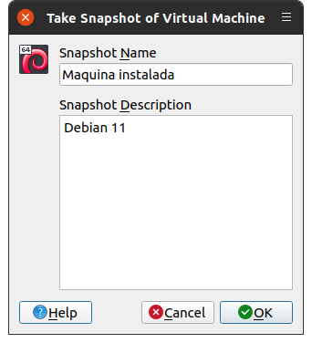 |

|      |
|:----:|
| 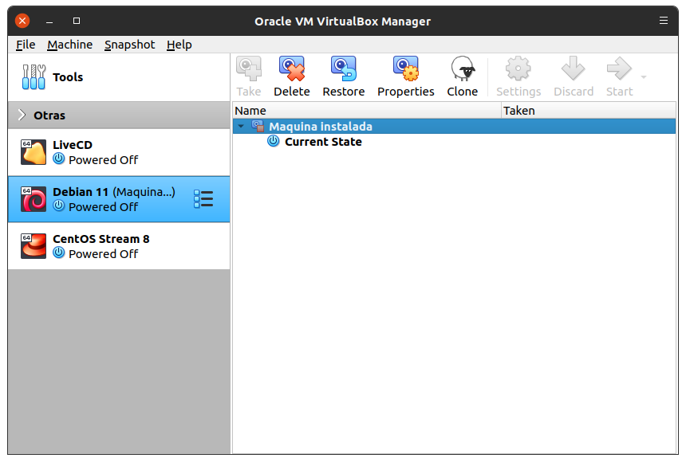 |

--------------------------------------------------------------------------------

## Configuración de la máquina virtual

### Información del sistema

|      |
|:----:|
| 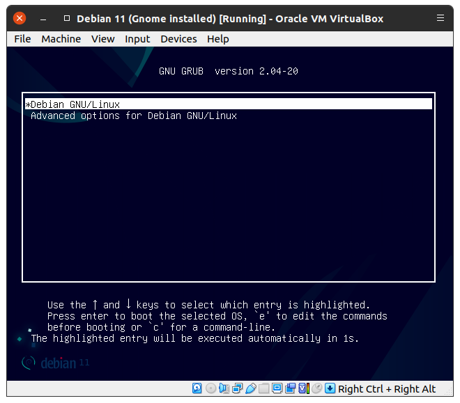 |

|      |
|:----:|
| 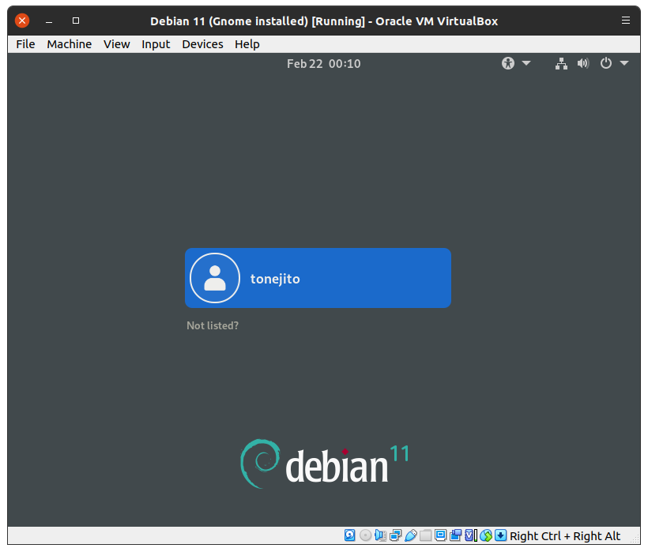 |

|      |
|:----:|
| 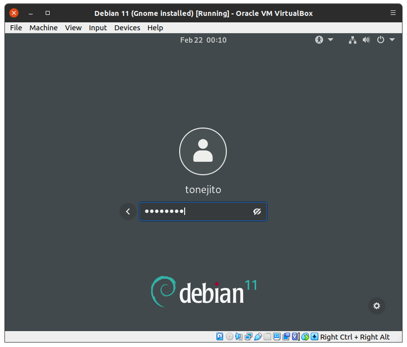 |

|      |
|:----:|
| 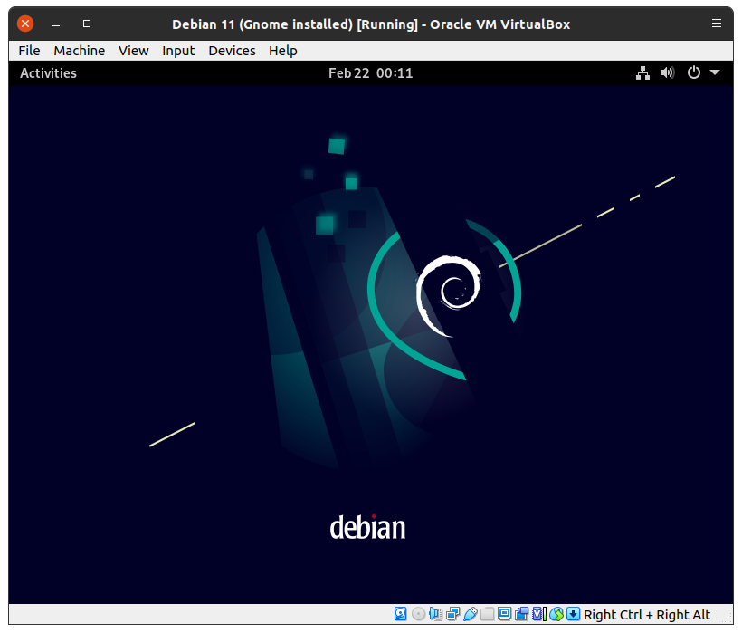 |

|      |
|:----:|
| 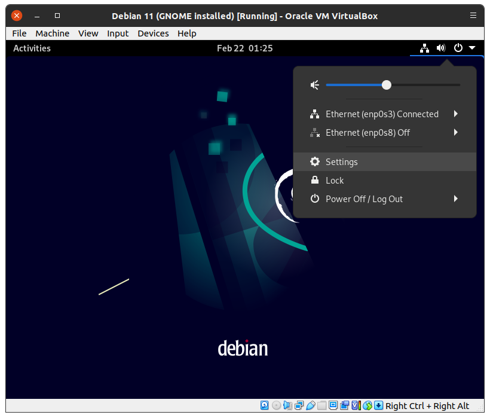 |

|      |
|:----:|
| 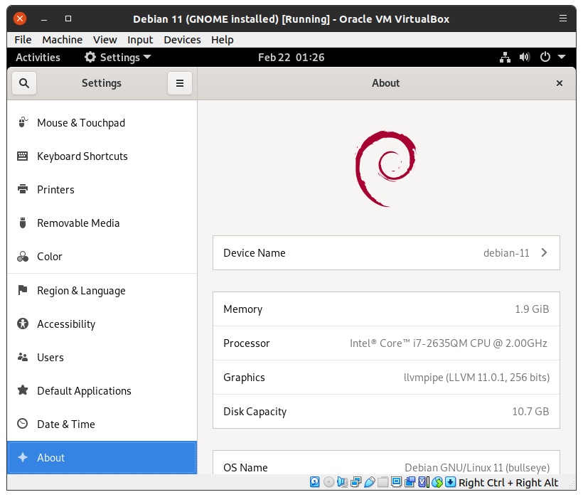 |

|      |
|:----:|
| 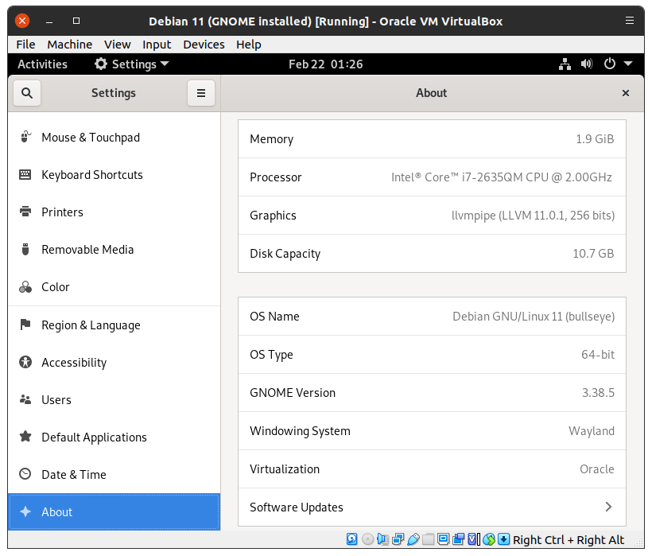 |


### Configuración de repositorios

- Asegúrate de que los siguientes repositorios estén presentes en el archivo `/etc/apt/sources.list`

```bash
# Tipo  URL                                         Suite               Secciones
deb     http://deb.debian.org/debian/               bullseye            main contrib non-free
deb-src http://deb.debian.org/debian/               bullseye            main contrib non-free
deb     http://security.debian.org/debian-security  bullseye-security   main contrib non-free
deb-src http://security.debian.org/debian-security  bullseye-security   main contrib non-free
deb     http://deb.debian.org/debian/               bullseye-updates    main contrib non-free
deb-src http://deb.debian.org/debian/               bullseye-updates    main contrib non-free
deb-src http://deb.debian.org/debian/               bullseye-backports  main contrib non-free
deb     http://deb.debian.org/debian/               bullseye-backports  main contrib non-free
```

- Actualiza la lista de paquetes disponibles

```bash
root@debian-11:~# apt update
	...
```

### Configurar `sudo`

- Eleva privilegios utilizando `su`

```bash
tonejito@debian-11:~$ su -
Password:
root@debian-11:~#
```

- Instala el paquete de `sudo`

```bash
root@debian-11:~# apt update
	...
root@debian-11:~# apt install sudo
	...
```

- Edita el archivo `/etc/sudoers`

```bash
# visudo
```

!!! danger
    - Utiliza **únicamente** el programa `visudo` para editar el archivo `/etc/sudoers`, no lo intentes editar a mano con otro editor común de texto.
    - Si necesitas cambiar el editor, puedes exportar el nombre como variable de entorno: `export EDITOR=vim`

- Modifica la línea para no requerir contraseña al ejecutar `sudo`

```bash
%sudo   ALL=(ALL:ALL) NOPASSWD:ALL
```

- Agrega a tu usuario al grupo `sudo` para que pueda elevar privilegios

```bash
root@debian-11:~# adduser tonejito sudo
Adding user `tonejito' to group `sudo' ...
Adding user tonejito to group sudo
Done.
```

- Verifica que el usuario esté en el grupo `sudo`

```bash
root@debian-11:~# groups tonejito
tonejito : tonejito cdrom floppy sudo audio dip video plugdev netdev bluetooth scanner
```

- Reinicia la máquina virtual para aplicar los cambios

```bash
root@debian-11:~# reboot
	...
```

### Instalar SSH

- Instala el servicio de SSH

```bash
root@debian-11:~# apt install ssh
	...
```

- Habilita el servicio de SSH

```bash
root@debian-11:~# systemctl enable ssh
Synchronizing state of ssh.service with SysV service script with /lib/systemd/systemd-sysv-install.
Executing: /lib/systemd/systemd-sysv-install enable ssh

root@debian-11:~# systemctl status ssh
● ssh.service - OpenBSD Secure Shell server
     Loaded: loaded (/lib/systemd/system/ssh.service; enabled; vendor preset: enabled)
     Active: active (running) since Tue 2022-02-22 01:33:17 CST; 15s ago
       Docs: man:sshd(8)
             man:sshd_config(5)
   Main PID: 3405 (sshd)
      Tasks: 1 (limit: 2325)
     Memory: 1.1M
        CPU: 27ms
     CGroup: /system.slice/ssh.service
             └─3405 sshd: /usr/sbin/sshd -D [listener] 0 of 10-100 startups

Feb 22 01:33:17 debian-11 systemd[1]: Starting OpenBSD Secure Shell server...
Feb 22 01:33:17 debian-11 sshd[3405]: Server listening on 0.0.0.0 port 22.
Feb 22 01:33:17 debian-11 sshd[3405]: Server listening on :: port 22.
Feb 22 01:33:17 debian-11 systemd[1]: Started OpenBSD Secure Shell server.
```

### Configura la interfaz de red _host-only_

- Revisa que el sistema operativo reconozca la interfaz de red y que esta no se encuentre configurada

!!! note
    En este ejemplo, la asignación de interfaces de red es la siguiente:

    - `lo`: _loopback_
    - `enp0s3`: NAT
    - `enp0s8`: _host-only_ (**esta es la interfaz que vas a configurar**)

```bash
root@debian-11:~# ip addr
1: lo: <LOOPBACK,UP,LOWER_UP> mtu 65536 qdisc noqueue state UNKNOWN group default qlen 1000
    link/loopback 00:00:00:00:00:00 brd 00:00:00:00:00:00
    inet 127.0.0.1/8 scope host lo
       valid_lft forever preferred_lft forever
    inet6 ::1/128 scope host
       valid_lft forever preferred_lft forever
2: enp0s3: <BROADCAST,MULTICAST,UP,LOWER_UP> mtu 1500 qdisc pfifo_fast state UP group default qlen 1000
    link/ether 08:00:27:48:71:fa brd ff:ff:ff:ff:ff:ff
    inet 10.0.2.15/24 brd 10.0.2.255 scope global dynamic noprefixroute enp0s3
       valid_lft 84541sec preferred_lft 84541sec
    inet6 fe80::a00:27ff:fe48:71fa/64 scope link noprefixroute
       valid_lft forever preferred_lft forever
3: enp0s8: <BROADCAST,MULTICAST,UP,LOWER_UP> mtu 1500 qdisc pfifo_fast state UP group default qlen 1000
    link/ether 08:00:27:9a:f7:36 brd ff:ff:ff:ff:ff:ff
```

- Edita el archivo /etc/network/interfaces y agrega una configuración para que se levante automáticamente tu interfaz de red.

!!! note
    - Verifica el nombre de tu interfaz de red
    - Este ejemplo utiliza la interfaz de red `enp0s8`

```bash
	...

auto enp0s8
iface enp0s8 inet dhcp
```

- Levanta de manera manual tu interfaz de red

!!! note
    - Verifica el nombre de tu interfaz de red
    - Este ejemplo utiliza la interfaz de red `enp0s8`

```
root@debian-11:~# ifup enp0s8
Internet Systems Consortium DHCP Client 4.4.1
Copyright 2004-2018 Internet Systems Consortium.
All rights reserved.
For info, please visit https://www.isc.org/software/dhcp/

Listening on LPF/enp0s8/08:00:27:9a:f7:36
Sending on   LPF/enp0s8/08:00:27:9a:f7:36
Sending on   Socket/fallback
Created duid "\000\001\000\001)\247S\220\010\000'\232\3676".
DHCPDISCOVER on enp0s8 to 255.255.255.255 port 67 interval 7
DHCPOFFER of 172.28.128.7 from 172.28.128.2
DHCPREQUEST for 172.28.128.7 on enp0s8 to 255.255.255.255 port 67
DHCPACK of 172.28.128.7 from 172.28.128.2
bound to 172.28.128.7 -- renewal in 233 seconds.
```

- Verifica que la interfaz de red esté configurada

!!! note
    En este ejemplo, la asignación de interfaces de red es la siguiente:

    - `lo`: _loopback_
    - `enp0s3`: NAT
    - `enp0s8`: _host-only_

```bash
root@debian-11:~# ip addr
1: lo: <LOOPBACK,UP,LOWER_UP> mtu 65536 qdisc noqueue state UNKNOWN group default qlen 1000
    link/loopback 00:00:00:00:00:00 brd 00:00:00:00:00:00
    inet 127.0.0.1/8 scope host lo
       valid_lft forever preferred_lft forever
    inet6 ::1/128 scope host
       valid_lft forever preferred_lft forever
2: enp0s3: <BROADCAST,MULTICAST,UP,LOWER_UP> mtu 1500 qdisc pfifo_fast state UP group default qlen 1000
    link/ether 08:00:27:48:71:fa brd ff:ff:ff:ff:ff:ff
    inet 10.0.2.15/24 brd 10.0.2.255 scope global dynamic noprefixroute enp0s3
       valid_lft 84503sec preferred_lft 84503sec
    inet6 fe80::a00:27ff:fe48:71fa/64 scope link noprefixroute
       valid_lft forever preferred_lft forever
3: enp0s8: <BROADCAST,MULTICAST,UP,LOWER_UP> mtu 1500 qdisc pfifo_fast state UP group default qlen 1000
    link/ether 08:00:27:9a:f7:36 brd ff:ff:ff:ff:ff:ff
    inet 172.28.128.7/24 brd 172.28.128.255 scope global dynamic enp0s8
       valid_lft 596sec preferred_lft 596sec
```

### Instalar _software_

- Instala las herramientas de Python en el sistema

```bash
root@debian-11:~# apt install python3 python3-dev python3-pip
	...
```

- Instala las herramientas de red en el sistema

```bash
root@debian-11:~# apt install tcpdump nmap netcat-openbsd ngrep dsniff wget curl whois dnsutils net-tools iproute2 iptables iptables-persistent tsocks inetutils-ping inetutils-traceroute inetutils-tools ethtool
	...
```

#### Instalar `wireshark`

- Instala `wireshark` utilizando `apt`

```bash
root@debian-11:~# apt install wireshark tshark
	...
```

- Verifica que exista el grupo de usuarios `wireshark`

```bash
root@debian-11:~# getent group wireshark
wireshark:x:124:
```

- Agrega tu usuario al grupo `wireshark`

````bash
root@debian-11:~# adduser tonejito wireshark
Adding user `tonejito' to group `wireshark' ...
Adding user tonejito to group wireshark
Done.
```

- Verifica que tu usuario pertenezca al grupo

```bash
root@debian-11:~# groups tonejito
tonejito : tonejito cdrom floppy sudo audio dip video plugdev netdev bluetooth scanner wireshark
```

### Configuración de las herramientas de VirtualBox para Linux

- Instala las herramientas de desarrollo para compilar los módulos de kernel

```bash
root@debian-11:~# apt install build-essential linux-headers-amd64 linux-headers-$(uname -r)

	...

root@debian-11:~# apt-mark auto linux-headers-$(uname -r)
linux-headers-5.10.0-11-amd64 set to automatically installed.
```

- Inserta la imagen ISO de las utilerías de VirtualBox en la máquina virtual

|      |
|:----:|
| 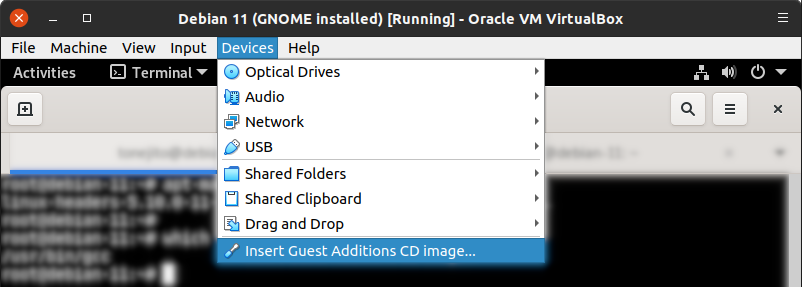 |

- Verifica que la imagen ISO se encuentre montada en `/media/cdrom0`
    - Monta la imágen ISO en el directorio si es necesario

```bash
root@debian-11:~# ls -la /media/cdrom0
total 46923
dr-xr-xr-x 5 root root     2570 Nov 22 09:24 .
drwxr-xr-x 3 root root     4096 Feb 21 23:30 ..
-r--r--r-- 1 root root      763 Feb 20  2020 AUTORUN.INF
-r-xr-xr-x 1 root root     6384 Nov 22 09:17 autorun.sh
dr-xr-xr-x 2 root root      792 Nov 22 09:24 cert
dr-xr-xr-x 2 root root     1824 Nov 22 09:24 NT3x
dr-xr-xr-x 2 root root     2652 Nov 22 09:24 OS2
-r-xr-xr-x 1 root root     4821 Nov 22 09:17 runasroot.sh
-r--r--r-- 1 root root      592 Nov 22 09:24 TRANS.TBL
-r--r--r-- 1 root root  3991991 Nov 22 09:21 VBoxDarwinAdditions.pkg
-r-xr-xr-x 1 root root     3949 Nov 22 09:16 VBoxDarwinAdditionsUninstall.tool
-r-xr-xr-x 1 root root  7443891 Nov 22 09:18 VBoxLinuxAdditions.run
-r--r--r-- 1 root root  9420288 Nov 22 09:10 VBoxSolarisAdditions.pkg
-r-xr-xr-x 1 root root 16890912 Nov 22 09:21 VBoxWindowsAdditions-amd64.exe
-r-xr-xr-x 1 root root   270840 Nov 22 09:18 VBoxWindowsAdditions.exe
-r-xr-xr-x 1 root root  9998128 Nov 22 09:19 VBoxWindowsAdditions-x86.exe
-r--r--r-- 1 root root      259 Oct  4 10:48 windows11-bypass.reg
```

- Ejecuta el _script_ de instalación para compilar los módulos de kernel y habilitar los servicios

```bash
root@debian-11:~# cd /media/cdrom0/
root@debian-11:/media/cdrom0# bash ./VBoxLinuxAdditions.run
Verifying archive integrity... All good.
Uncompressing VirtualBox 6.1.30 Guest Additions for Linux........
VirtualBox Guest Additions installer
Copying additional installer modules ...
Installing additional modules ...
VirtualBox Guest Additions: Starting.
VirtualBox Guest Additions: Building the VirtualBox Guest Additions kernel modules.
VirtualBox Guest Additions: This may take a while.
VirtualBox Guest Additions: To build modules for other installed kernels, run
VirtualBox Guest Additions:   /sbin/rcvboxadd quicksetup <version>
VirtualBox Guest Additions: or
VirtualBox Guest Additions:   /sbin/rcvboxadd quicksetup all
VirtualBox Guest Additions: Building the modules for kernel 5.10.0-11-amd64.
update-initramfs: Generating /boot/initrd.img-5.10.0-11-amd64
VirtualBox Guest Additions: Running kernel modules will not be replaced until the system is restarted

root@debian-11:/media/cdrom0# cd ~
```

- Reinicia el equipo y verifica que los módulos de kernel se carguen

!!! note
    - En este punto ya podrías utilizar las funciones de resolución automática, portapapeles compartido, carpetas compartidas y arrastrar desde y hacia la máquina virtual para copiar archivos.

```bash
root@debian-11:~# lsmod | grep -i vbox
vboxvideo              49152  0
vboxguest              49152  1
ttm                   114688  2 vmwgfx,vboxvideo
drm_kms_helper        278528  2 vmwgfx,vboxvideo
drm                   618496  6 vmwgfx,drm_kms_helper,vboxvideo,ttm
```

### Configuración de carpeta compartida con la máquina física

- Una vez que las utilerías de VirtualBox se encuentren configuradas en la máquina virtual, puedes compartir carpetas

|      |
|:----:|
| 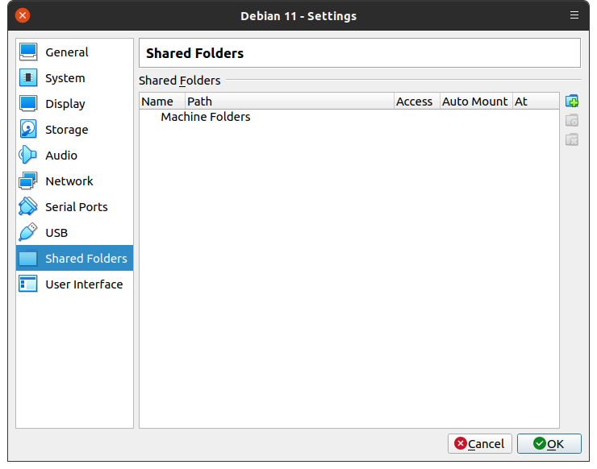 |

|      |
|:----:|
| 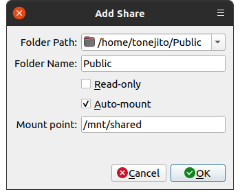 |

|      |
|:----:|
| 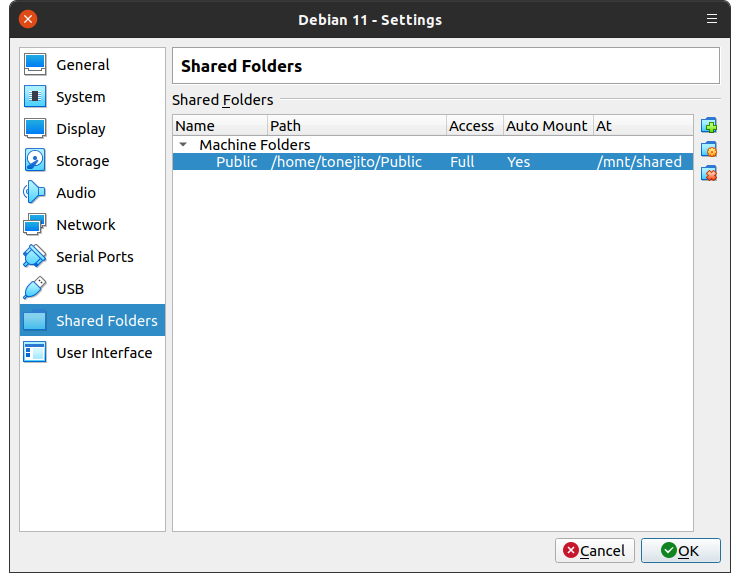 |

- Verifica que la carpeta compartida esté en la ubicación que seleccionaste
    - Puedes crear algunos archivos o directorios y ver que aparezcan en la máquina física y en la virtual

```bash
root@debian-11:~# mount | grep vbox
Public on /mnt/shared type vboxsf (rw,nodev,relatime,iocharset=utf8,uid=0,gid=998,dmode=0770,fmode=0770,tag=VBoxAutomounter)
```

!!! warning
    - La carpeta compartida se monta de manera predeterminada con privilegios restrictivos
    - Puedes agregar una entrada a `/etc/fstab` con la información de montaje que está en `/etc/mtab` y ajustarla con los identificadores `uid` y `gid` de tu usuario

--------------------------------------------------------------------------------

!!! info
    - Cuando hayas terminado de configurar la máquina Debian, [continúa con la máquina CentOS](../centos-install)
