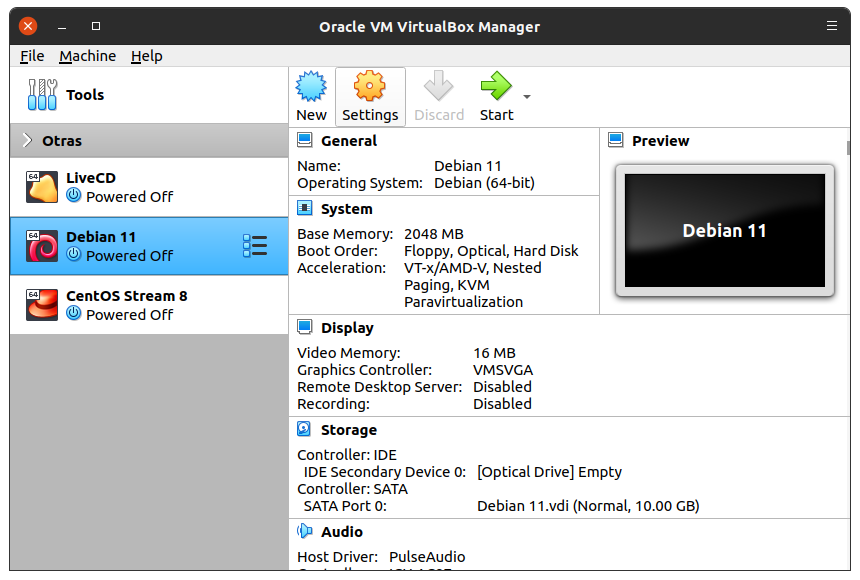
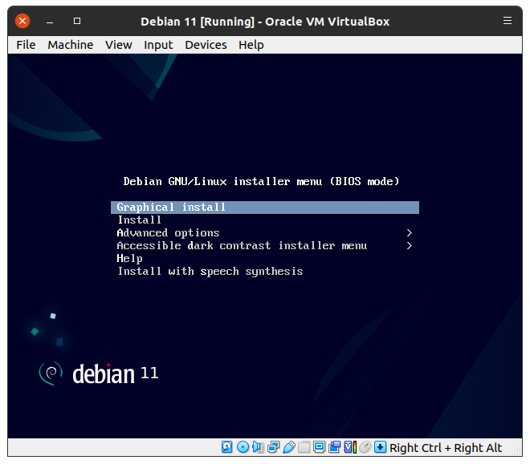

# Instalación de Debian 11 _bullseye_

!!! note
    - Si ya instalaste tu máquina virtual, continúa en [la siguiente página](../debian-configure)
    - No olvides verificar la configuración de VirtualBox

--------------------------------------------------------------------------------

<!--

Da clic aquí para expandir

-->

## Descarga de imagen ISO

|      |
|:----:|
|  |

|      |
|:----:|
|  |

|      |
|:----:|
|  |

|      |
|:----:|
|  |

--------------------------------------------------------------------------------

## Creación de máquina virtual

### Crear nueva máquina virtual

|      |
|:----:|
|  |

|      |
|:----:|
|  |

|      |
|:----:|
|  |

|      |
|:----:|
|  |

|      |
|:----:|
|  |

|      |
|:----:|
|  |

|      |
|:----:|
|  |

|      |
|:----:|
|  |

<!--
|      |
|:----:|
|  |
-->

### Agregar imagen ISO de instalación

|      |
|:----:|
|  |

<!--
|      |
|:----:|
|  |
-->

|      |
|:----:|
|  |

|      |
|:----:|
|  |

### Iniciar máquina virtual

|      |
|:----:|
|  |

--------------------------------------------------------------------------------

## Instalación del sistema operativo

|      |
|:----:|
|  |

### Seleccionar idioma y ubicación

|      |
|:----:|
|  |

|      |
|:----:|
|  |

|      |
|:----:|
|  |

|      |
|:----:|
|  |

|      |
|:----:|
|  |

|      |
|:----:|
|  |

### Configurar nombre de host

|      |
|:----:|
|  |

<!--
|      |
|:----:|
|  |
-->

### Configurar usuarios y contraseñas

|      |
|:----:|
|  |

|      |
|:----:|
|  |

|      |
|:----:|
|  |

|      |
|:----:|
|  |

### Configuración horaria

|      |
|:----:|
|  |

### Particionar disco

|      |
|:----:|
|  |

|      |
|:----:|
|  |

|      |
|:----:|
|  |

|      |
|:----:|
|  |

|      |
|:----:|
|  |

### Instalar sistema base

|      |
|:----:|
|  |

|      |
|:----:|
|  |

|      |
|:----:|
|  |

|      |
|:----:|
|  |

|      |
|:----:|
|  |

|      |
|:----:|
|  |

|      |
|:----:|
|  |

### Participar en la encuesta de uso de paquetes (opcional)

|      |
|:----:|
|  |

### Seleccionar entorno de escritorio

|      |
|:----:|
|  |

|      |
|:----:|
|  |

### Instalar gestor de arranque

|      |
|:----:|
|  |

|      |
|:----:|
|  |

|      |
|:----:|
|  |

### Finalizar instalación

|      |
|:----:|
|  |

|      |
|:----:|
|  |

<!-- 
 -->

--------------------------------------------------------------------------------

!!! info
    - Cuando hayas terminado de instalar la máquina Debian, [continúa con la configuración](../debian-configure)
