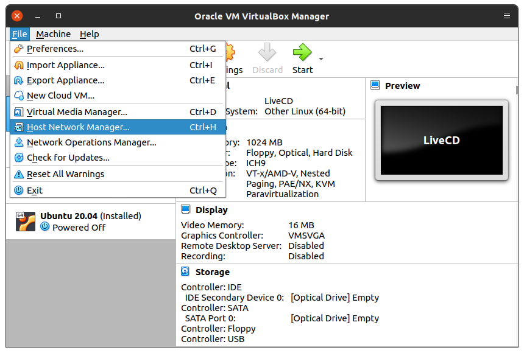
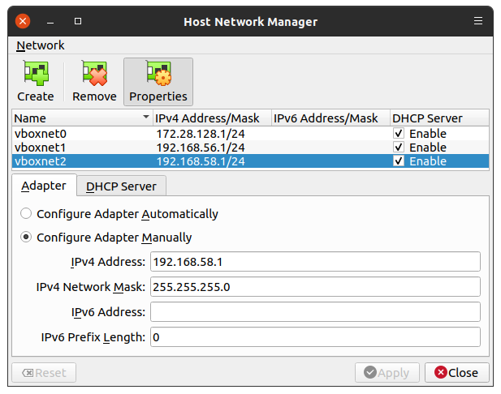
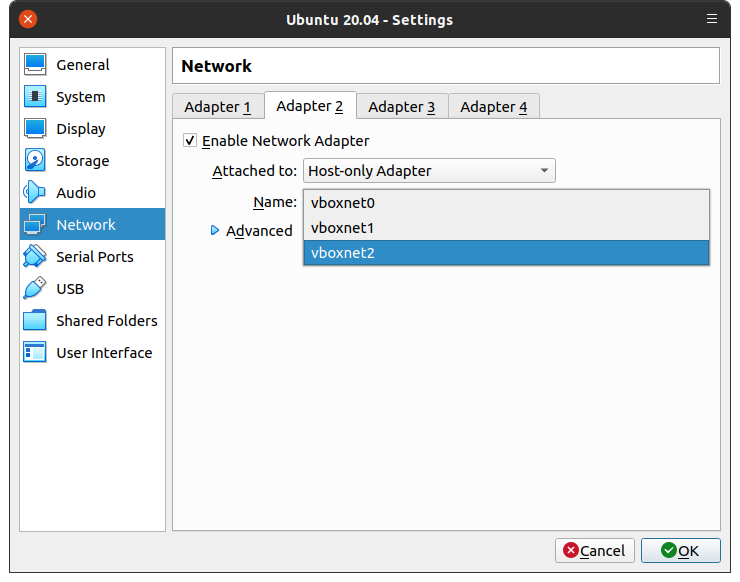

# Instalación de VirtualBox

!!! note
    - Si ya instalaste tu VirtualBox y tienes el adaptador de red `vboxnet*`, crea tus máquinas virtuales [la siguiente página](../debian-install)

<!--

## Extensiones de virtualización

Habilitar las extensiones de virtualización en el BIOS o configuración de UEFI

- Esto depende de la máquina, consultar el manual de servicio

### Linux

- En Linux revisar las características del CPU

```bash
tonejito@linux:~$ grep --color 'vmx' /proc/cpuinfo | tail -n 1
```

### macOS

- En macOS revisar si el procesador tiene la característica `VMX`

```bash
tonejito@macOS ~ % sysctl -a | grep 'machdep.cpu.features:' | grep --color=auto 'VMX'
machdep.cpu.features: FPU VME DE PSE TSC MSR PAE MCE CX8 APIC SEP MTRR PGE MCA
CMOV PAT PSE36 CLFSH DS ACPI MMX FXSR SSE SSE2 SS HTT TM PBE SSE3 PCLMULQDQ
DTES64 MON DSCPL VMX SMX EST TM2 SSSE3 FMA CX16 TPR PDCM SSE4.1 SSE4.2 x2APIC
MOVBE POPCNT AES PCID XSAVE OSXSAVE SEGLIM64 TSCTMR AVX1.0 RDRAND F16C
```

### Windows

- En Windows se puede ver si está habilitado utilizando el administrador de tareas


- Otra opción es ejecutar el siguiente comando en PowerShell

```PowerShell
PS C:\> Get-ComputerInfo -property "HyperV*"

HyperVisorPresent                                 : True
HyperVRequirementDataExecutionPreventionAvailable : True
HyperVRequirementSecondLevelAddressTranslation    : True
HyperVRequirementVirtualizationFirmwareEnabled    : True
HyperVRequirementVMMonitorModeExtensions          : True
```

-->

## Instalación de VirtualBox

## Creación del adaptador de red _host-only_

Da clic en el menú **File** y selecciona **Host Network Manager**.

|      |
|:----:|
| 

Da clic en el botón **Create** para agregar un nuevo adaptador de red sólo anfitrión (_host-only_).

|      |
|:----:|
| 

El nuevo adaptador aparecerá en la lista.
En este caso el adaptador es `vboxnet2`.
Asegúrate de habilitar la casilla de **DHCP Server**.

|      |
|:----:|
| 

Abre la configuración de tu máquina virtual y asigna el adaptador sólo anfitrión a la **segunda** interfaz de red.
Guarda la configuración para preservar los cambios.

|      |
|:----:|
| 

