---
# https://www.mkdocs.org/user-guide/writing-your-docs/#meta-data
title: Instalación de Packet Tracer
authors:
- Andrés Leonardo Hernández Bermúdez
---

# Instalación de Packet Tracer

--------------------------------------------------------------------------------

Ir al sitio [NetAcad.com][network-academy] y buscar el curso de **Packet Tracer**.

[network-academy]: https://NetAcad.com/

- <https://www.netacad.com/courses/packet-tracer>

|      |
|:----:|
| 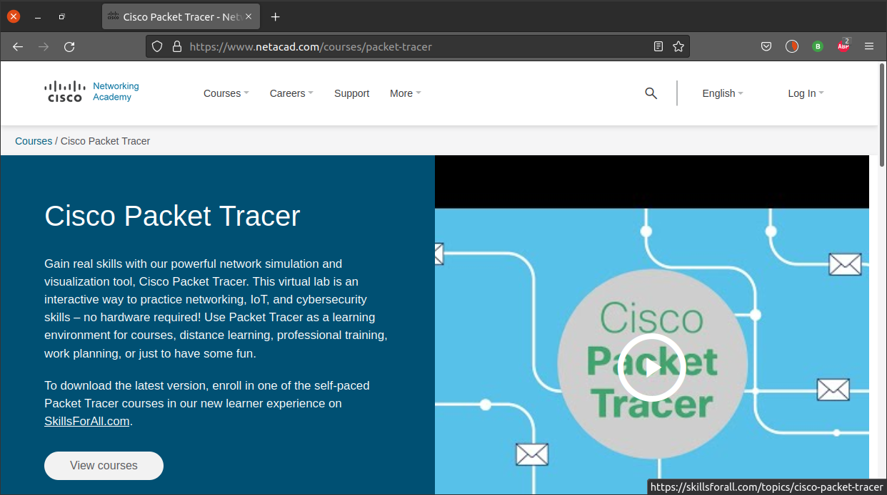 |

Dar clic en **View courses** y serás redireccionado a la página de [SkillsForAll.com][skills-for-all]

[skills-for-all]: https://SkillsForAll.com/

- <https://skillsforall.com/topics/cisco-packet-tracer>

|      |
|:----:|
| 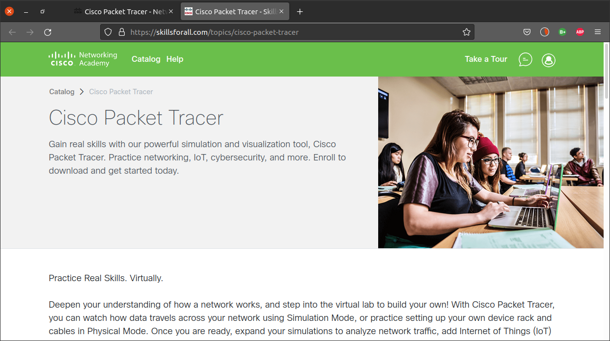 |

Ir a la parte inferior de la página y seleccionar el curso **Getting Started with Cisco Packet Tracer**

- <https://skillsforall.com/course/getting-started-cisco-packet-tracer>

|      |
|:----:|
| 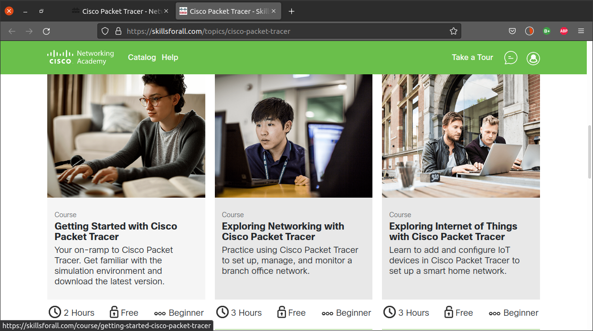 |

Dar clic en el botón **Get Started** para ingresar al curso

|      |
|:----:|
| 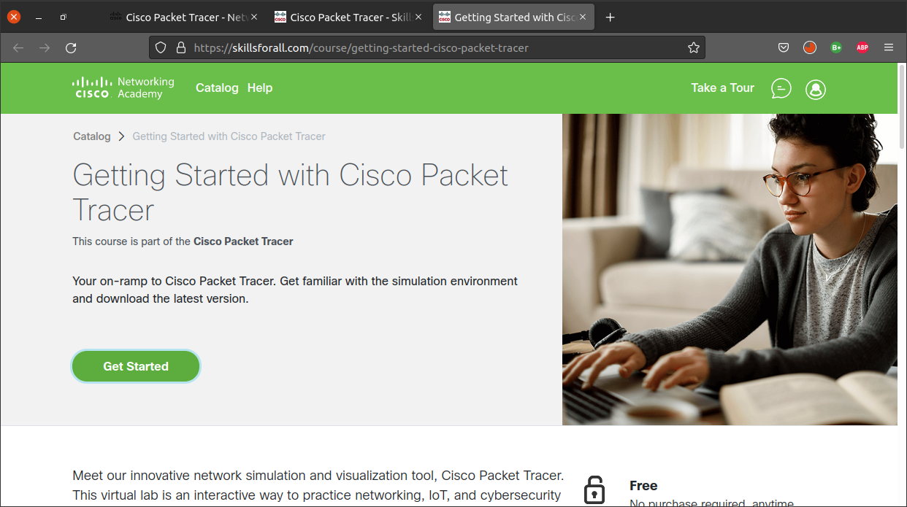 |

Iniciar sesión con la cuenta de **Cisco Network Academy** o de **Skills for All**

|      |
|:----:|
|  |

Si se utiliza una cuenta de **Cisco Network Academy**, se pedirá una información adicional para ligar la cuenta con **Skills for All**

<!--
|      |
|:----:|
| 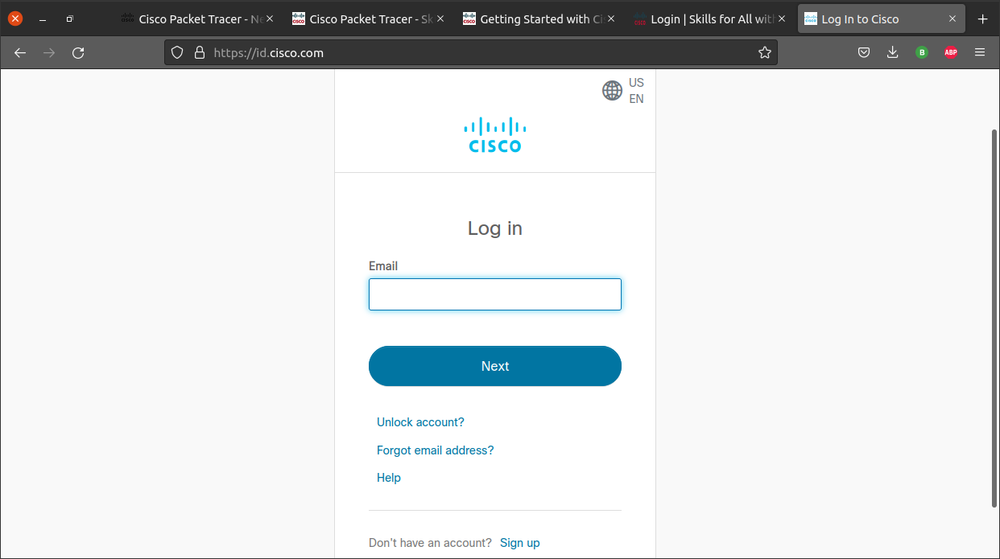 |
-->

|      |
|:----:|
|  |

Aceptar los términos y condiciones de **Skills for All**

|      |
|:----:|
| 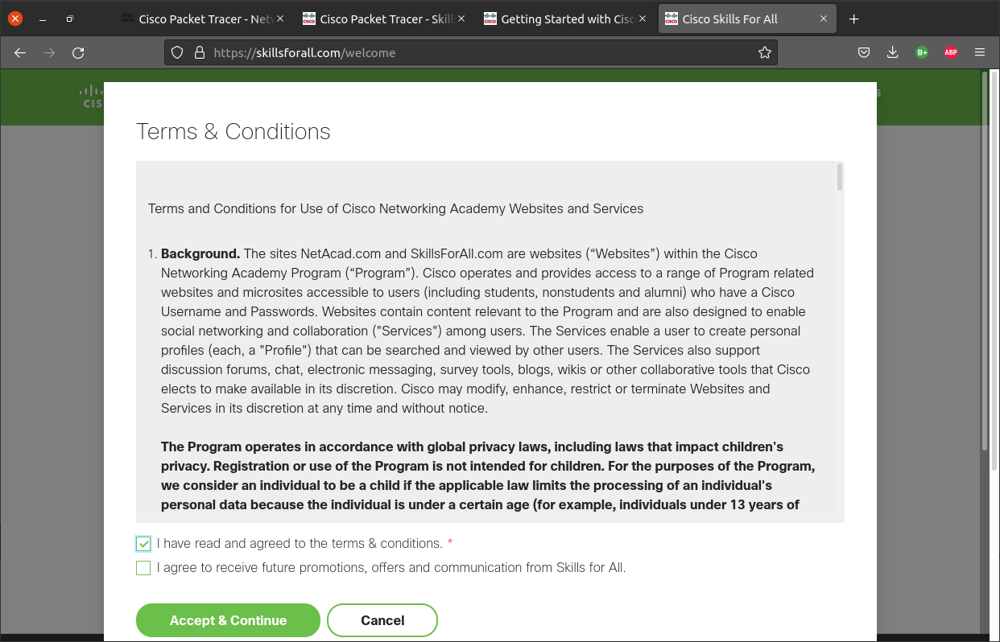 |

Esperar a que cargue el curso

|      |
|:----:|
| 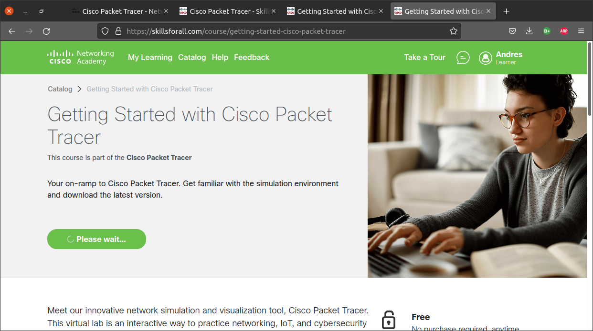 |

Es posible que el navegador pida habilitar DRM para cargar el curso de manera correcta

|      |
|:----:|
| 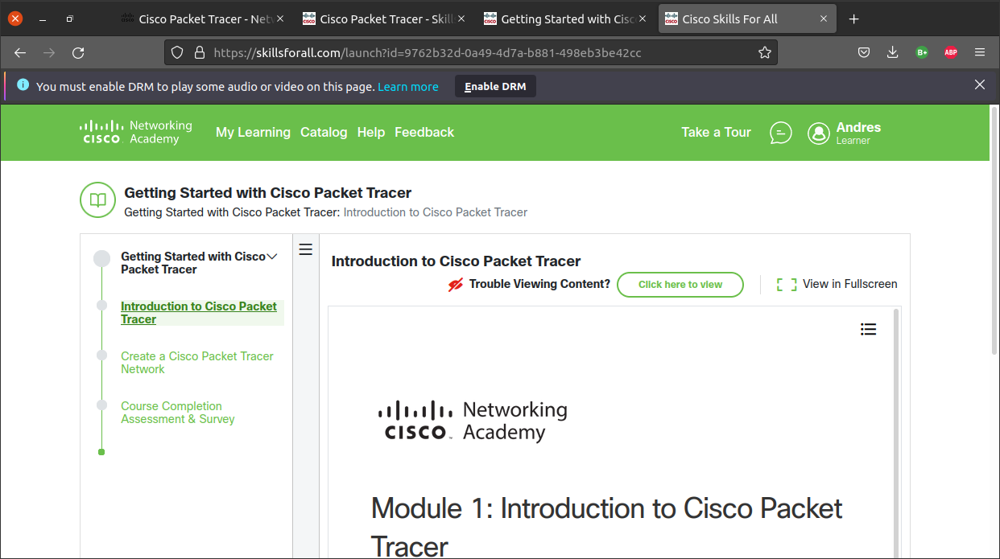 |

<!--
|      |
|:----:|
| 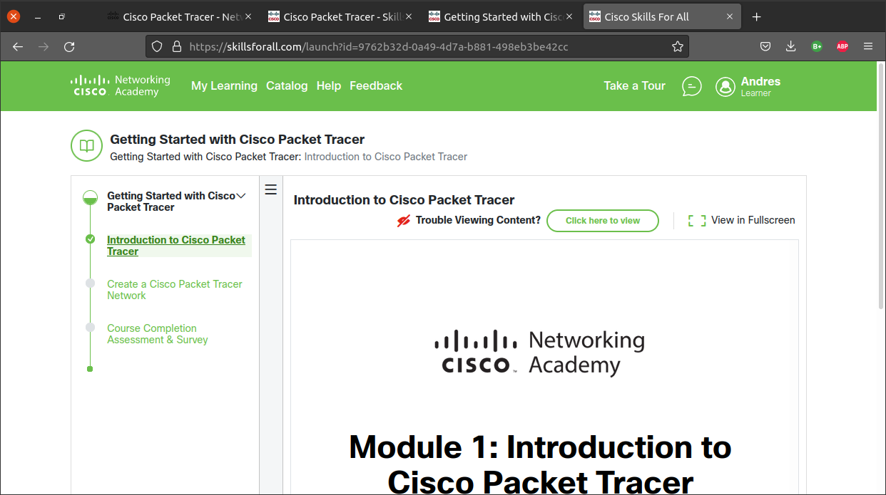 |
-->

## Descargar Packet Tracer

Ir al centro de recursos para descargar el paquete de instalación de Packet Tracer

- <https://skillsforall.com/resources/lab-downloads>

|      |
|:----:|
|  |

Ir a la parte inferior de la página para ver los enlaces de descarga para GNU/Linux (**Ubuntu**), macOS (`x86_64`) y Windows

|      |
|:----:|
| 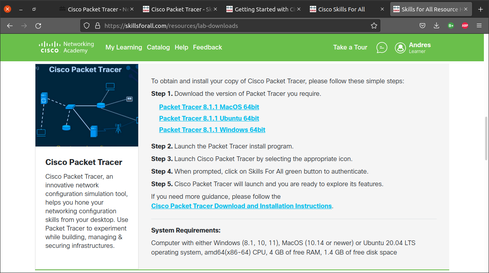 |

Descargar el paquete para el sistema operativo que se ejecute

|      |
|:----:|
| 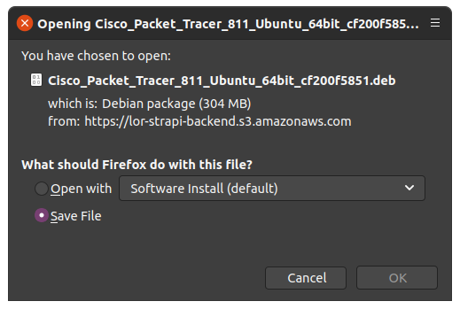 |
| 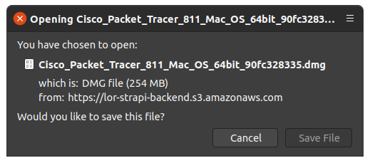 |
| 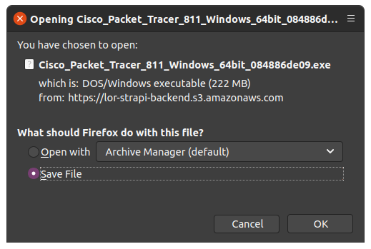 |
| 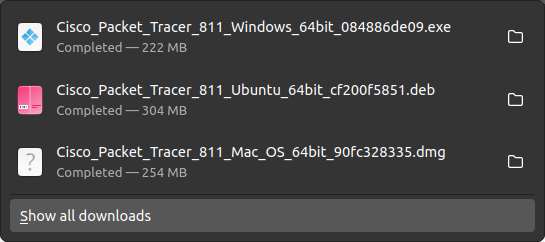 |

Descargar también el documento con las notas de instalación

- <https://skillsforall.com/skillsforall/files/Cisco_Packet_Tracer_Download_and_Installation_Instructions.pdf>

|      |
|:----:|
| 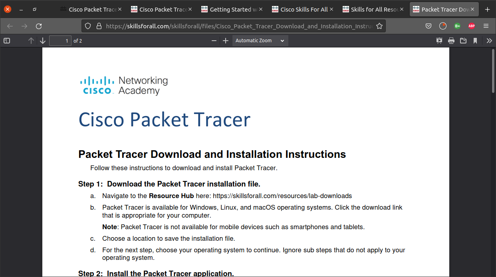 |


## Instalar Packet Tracer

### GNU/Linux

Instalar el paquete con `dpkg`

```bash
root@ubuntu-20-04:~# dpkg -i ~tonejito/Downloads/Cisco_Packet_Tracer_811_Ubuntu_64bit_*.deb
Selecting previously unselected package packettracer.
(Reading database ... 129310 files and directories currently installed.)
Preparing to unpack .../Cisco_Packet_Tracer_811_Ubuntu_64bit_cf200f5851.deb ...
Unpacking packettracer (8.1.1) ...
```

Aceptar los términos de la licencia.

- **EULA**: <https://www.cisco.com/c/en/us/about/legal/cloud-and-software/end_user_license_agreement.html>
- **SEULA**: <https://www.cisco.com/c/dam/en_us/about/doing_business/legal/seula/cisco-packet-tracer-software.pdf>

```
Package configuration

 ┌───────────────────────┤ Configuring PacketTracer ├────────────────────────┐
 │                                                                           │
 │ Cisco Packet Tracer                                                       │
 │                                                                           │
 │ Software License Agreement                                                │
 │                                                                           │
 │ DOWNLOADING, INSTALLING, OR USING THE CISCO PACKET TRACER SOFTWARE        │
 │ CONSTITUTES ACCEPTANCE OF THE CISCO END USER LICENSE AGREEMENT ("EULA"    │
 │ https://www.cisco.com/c/en/us/about/legal/cloud-and-software/end_user_li  │
 │ cense_agreement.html) AND THE SUPPLEMENTAL END USER LICENSE AGREEMENT     │
 │ FOR CISCO PACKET TRACER ("SEULA"                                          │
 │ https://www.cisco.com/c/dam/en_us/about/doing_business/legal/seula/cisco  │
 │ -packet-tracer-software.pdf). IF YOU DO NOT AGREE TO ALL OF THE TERMS OF  │
 │ THE EULA AND SEULA, THEN CISCO SYSTEMS, INC. ("CISCO") IS UNWILLING TO    │
 │ LICENSE THE SOFTWARE TO YOU AND YOU ARE NOT AUTHORIZED TO DOWNLOAD,       │
 │ INSTALL OR USE THE SOFTWARE.                                              │
 │                                                                           │
 │                                  <Ok>                                     │
 │                                                                           │
 └───────────────────────────────────────────────────────────────────────────┘
```

```
Package configuration

                   ┌──────┤ Configuring PacketTracer ├──────┐
                   │                                        │
                   │                                        │
                   │                                        │
                   │ Do you accept the terms of this EULA?  │
                   │                                        │
                   │         <Yes>            <No>          │
                   │                                        │
                   └────────────────────────────────────────┘
```

El programa `dpkg` muestra un error al instalar porque no se tienen las dependencias necesarias

```
root@ubuntu-20-04:~# dpkg -i ~tonejito/Downloads/Cisco_Packet_Tracer_811_Ubuntu_64bit_*.deb

	...

dpkg: dependency problems prevent configuration of packettracer:
 packettracer depends on dialog; however:
  Package dialog is not installed.
 packettracer depends on libgl1-mesa-glx; however:
  Package libgl1-mesa-glx is not installed.
 packettracer depends on libxcb-xinerama0-dev; however:
  Package libxcb-xinerama0-dev is not installed.

dpkg: error processing package packettracer (--install):
 dependency problems - leaving unconfigured
Processing triggers for gnome-menus (3.36.0-1ubuntu1) ...
Processing triggers for desktop-file-utils (0.24-1ubuntu3) ...
Processing triggers for mime-support (3.64ubuntu1) ...
Processing triggers for shared-mime-info (1.15-1) ...
Errors were encountered while processing:
 packettracer

```

Instalar las dependencias adicionales con `apt-get`

```bash
root@ubuntu-20-04:~# apt-get --fix-broken install
Reading package lists... Done
Building dependency tree
Reading state information... Done
Correcting dependencies... Done
The following additional packages will be installed:
  dialog libgl1-mesa-glx libpthread-stubs0-dev libxau-dev libxcb-xinerama0
  libxcb-xinerama0-dev libxcb1-dev libxdmcp-dev x11proto-core-dev x11proto-dev
  xorg-sgml-doctools
Suggested packages:
  libxcb-doc
The following NEW packages will be installed:
  dialog libgl1-mesa-glx libpthread-stubs0-dev libxau-dev libxcb-xinerama0
  libxcb-xinerama0-dev libxcb1-dev libxdmcp-dev x11proto-core-dev x11proto-dev
  xorg-sgml-doctools
0 upgraded, 11 newly installed, 0 to remove and 19 not upgraded.
1 not fully installed or removed.
Need to get 978 kB of archives.
After this operation, 4 041 kB of additional disk space will be used.
Do you want to continue? [Y/n] y

	...

```

Verificar que el paquete haya sido instalado

```
root@ubuntu-20-04:~# apt list --installed packettracer
Listing... Done
packettracer/now 8.1.1 amd64 [installed,local]
```

```
tonejito@ubuntu-20-04:~$ which packettracer
/usr/local/bin/packettracer

tonejito@ubuntu-20-04:~$ ls -l /usr/local/bin/packettracer
lrwxrwxrwx 1 root root 20 mar  2 12:38 /usr/local/bin/packettracer -> /opt/pt/packettracer
```

<!-- asciinema cast for packet tracer -->

- Al terminar, **Packet Tracer** estará disponible en el buscador de aplicaciones.

|      |
|:----:|
| 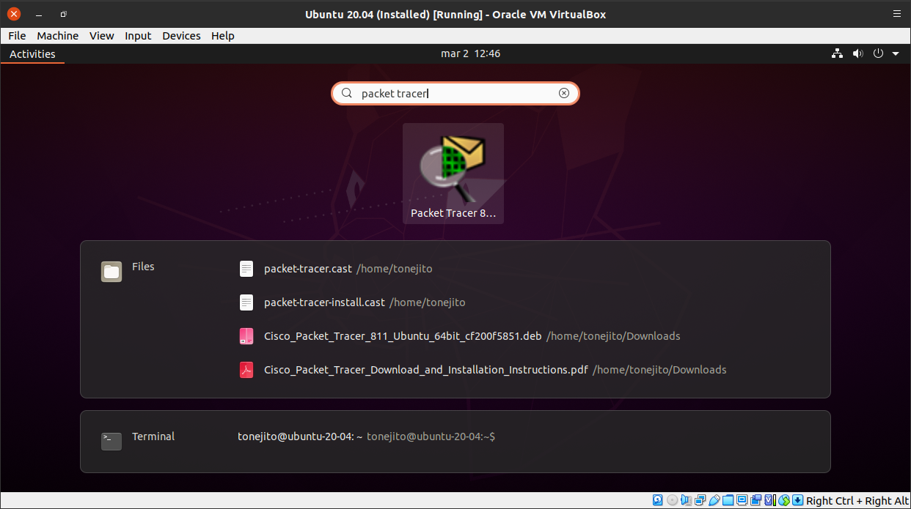 |

<!--
|      |
|:----:|
| 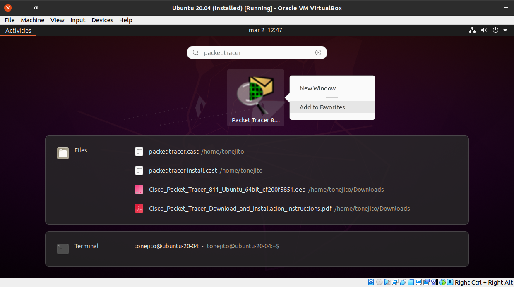 |

|      |
|:----:|
| 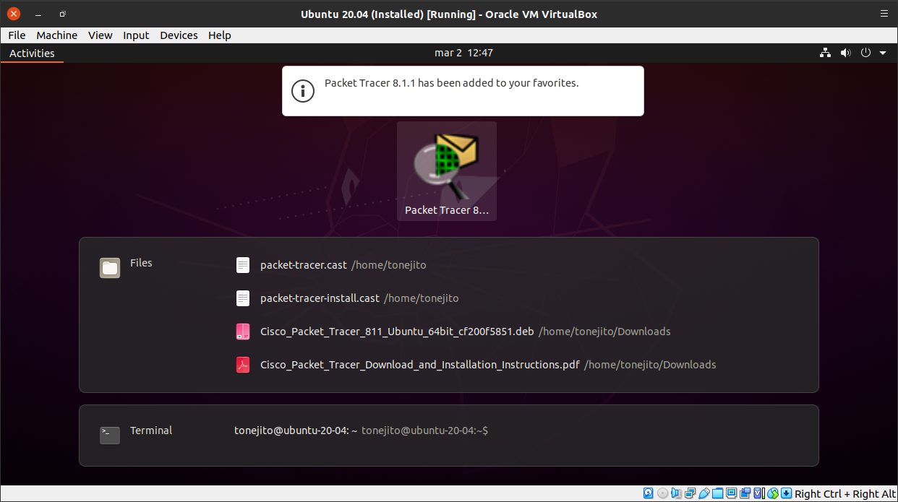 |
-->

### macOS

- Abrir la imagen DMG en Finder.

- Abrir el programa de instalación.

- Seguir el asistente de instalación y aceptar los términos de la licencia.

- Al terminar, **Packet Tracer.app** estará disponible en `/Applications`

### Windows

- Abrir el archivo EXE del instalador

- Seguir el asistente de instalación y aceptar los términos de la licencia.

- Al terminar, **Packet Tracer** estará disponible en el menú inicio.
