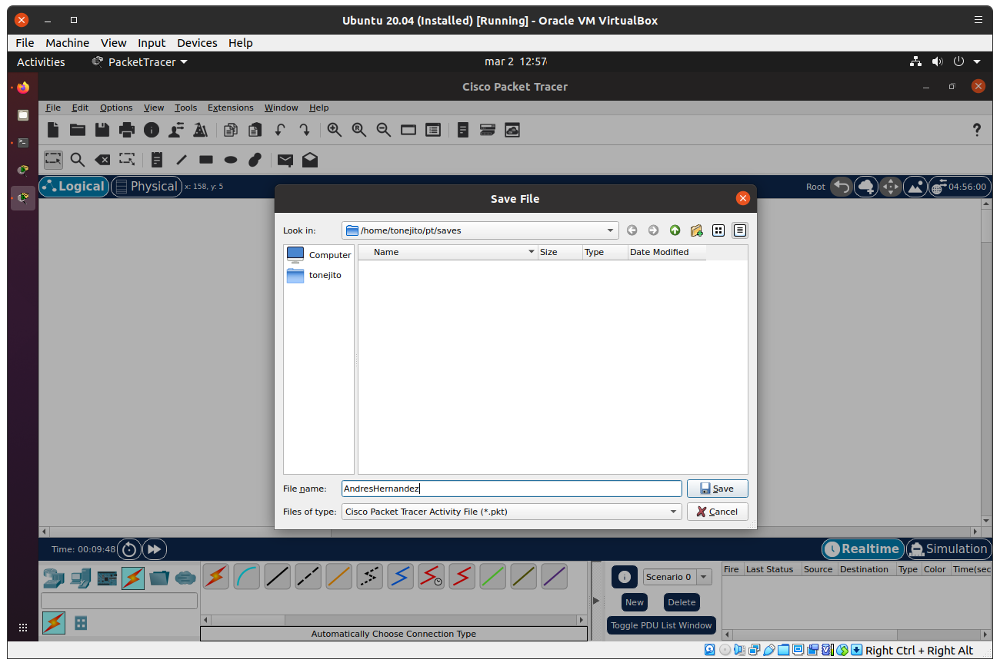

---
# https://www.mkdocs.org/user-guide/writing-your-docs/#meta-data
title: Creación de una topología de red en Packet Tracer
authors:
- Andrés Leonardo Hernández Bermúdez
---

# Creación de una topología de red en Packet Tracer

## Abrir Packet Tracer

Lanzar **Packet Tracer** y seleccionar **NO** en el cuadro de diálogo que aparece.

|      |
|:----:|
|  |

Iniciar sesión con la cuenta de **Cisco Network Academy** o de **Skills for All**

|      |
|:----:|
|  |

<!--
|      |
|:----:|
|  |

|      |
|:----:|
|  |
-->

Seleccionar el menú **Help** > **About**

|      |
|:----:|
|  |

Esta es la interfaz principal de Packet Tracer

## Crear topología de red

|      |
|:----:|
|  |

Agregar algunos equipos de red para hacer una topología de muestra

- Switch-PT
- Server
- Laptop

Seleccionar el botón del **rayo** para conectar los equipos

|      |
|:----:|
|  |

### Configurar direcciones IP

!!! note
    Para este ejercicio el switch no tendrá dirección IP asignada

Configurar la dirección IP de la laptop

|      |
|:----:|
|  |

Configurar la dirección IP del servidor

|      |
|:----:|
|  |

### Verificar conectividad

Abrir la interfaz de escritorio de la laptop

|      |
|:----:|
|  |

Listar la configuración de red con el comando `ipconfig`

|      |
|:----:|
|  |

Verificar la conectividad hacia el servidor con el comando `ping`

|      |
|:----:|
|  |

Abrir la interfaz de escritorio del servidor

|      |
|:----:|
|  |

Listar la configuración de red con el comando `ipconfig`

|      |
|:----:|
|  |

Verificar la conectividad hacia el servidor con el comando `ping`

|      |
|:----:|
|  |

Listar la configuración de red de los dos equipos

!!! note
    Para este ejercicio el switch no tendrá dirección IP asignada

|      |
|:----:|
|  |

Listar las ventanas de comandos con el resultado de `ping`

|      |
|:----:|
|  |

## Guardar el archivo de trabajo

|      |
|:----:|
|  |

|      |
|:----:|
|  |
