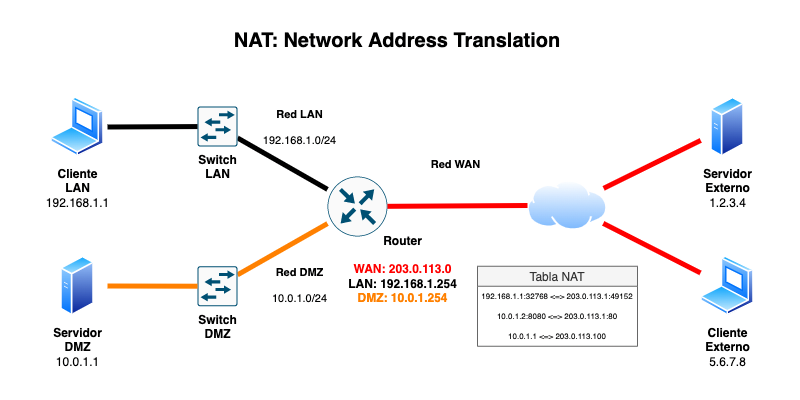
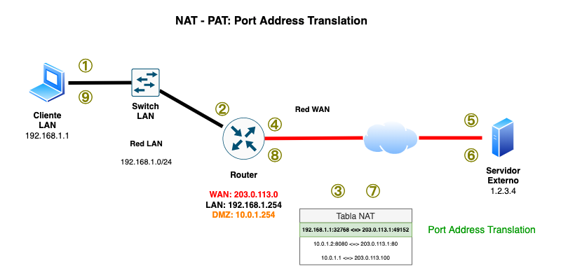
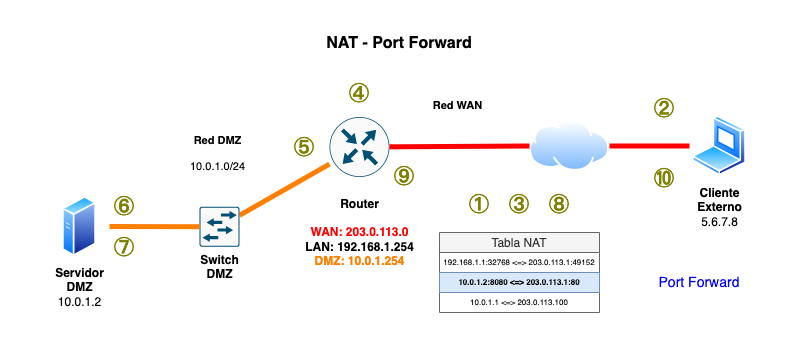
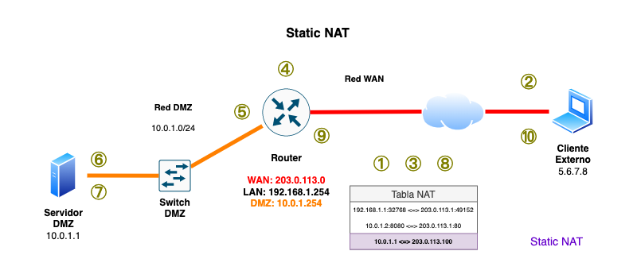

# Traducción de direcciones en equipos Cisco

## Tipos de **NAT** en Packet Tracer

Existen tres configuraciones de NAT en equipos Cisco, cada una corresponde a un caso de uso diferente

- **PAT**: Traducción de dirección y puerto de origen (_Port Address Translation_ _overload_)
    - Permite que los equipos de la red LAN se conecten a otras redes a través del _router_
- **Redirección de puertos** (_Port Forward_)
    - Permite que los clientes externos utilicen un servicio de la red DMZ cuando se conectan a determinado puerto de la dirección IP de la interfaz WAN del _router_
- **NAT estático** (_Static NAT_)
    - Permite que los clientes externos se conecten al servidor de la DMZ utilizando una dirección IP de la red WAN reservada en el _router_

<a id="diagrama-nat" name="diagrama-nat"></a>

|                         |
|:-----------------------:|
| 

--------------------------------------------------------------------------------

### PAT: _Port Address Translation_ (NAT `overload`)

Características:

- El router establece que la red LAN esta "dentro" del NAT y la red WAN esta "afuera" del NAT
- Los clientes LAN pueden salir a las demás redes a través del router
- Los equipos en la red WAN **no pueden** conectarse de manera directa a los clientes LAN

¿Cómo funciona?:

<a id="diagrama-nat-pat" name="diagrama-nat-pat"></a>

| Traducción de dirección IP y puerto       |
|:-----------------------------------------:|
| 
| [Configuración en Packet Tracer](#configuracion-de-pat-nat-overload)

1. El cliente LAN se conecta a otras redes a través del router
2. La dirección IP y puerto de las conexiones originadas por el cliente LAN se **enmascaran** cuando sale a la red WAN
3. El router anota la referencia de la dirección IP y puerto origen de la conexión original en la **tabla de traducciones**
4. El router reemplaza la dirección IP del cliente LAN por la suya en la interfaz WAN y el puerto original por un número de puerto disponible
5. El servidor externo recibe y procesa la petición que **aparenta** ser del router en la interfaz WAN
6. El servidor externo envía la respuesta a la dirección del router en la interfaz WAN
7. El router recibe la conexión y busca en la **tabla de traducciones** la dirección IP y puerto de la conexión original
8. El router reemplaza la dirección IP y el puerto de su interfaz WAN en la respuesta con la dirección IP y puerto original del cliente
9. El router envía la respuesta al cliente
10. Empieza desde (1) para enviar la respuesta del cliente al servidor externo

--------------------------------------------------------------------------------

### Redirección de puertos

Características:

- El router redirecciona las conexiones en uno o varios puertos de la interfaz WAN para que las atienda un servidor de la DMZ
- Los equipos externos en la red WAN pueden conectarse al puerto en la interfaz WAN del router para utilizar el servicio de red que brinda el servidor de la DMZ

¿Cómo funciona?:

<a id="diagrama-nat-port-forward" name="diagrama-nat-port-forward"></a>

| Redirección de puertos        |
|:-----------------------------:|
| 
| [Configuración en Packet Tracer](#configuracion-de-la-redireccion-de-puertos)

1. El router establece una lista determinada de puertos de red donde recibe conexiones y las redirige al servidor de la DMZ
2. El servidor externo se conecta a la IP de la interfaz WAN del router en el puerto especificado
3. El router busca en la **tabla de traducciones** de la dirección IP y puerto a donde se va a redirigir la conexión y anota la referencia de la conexión original del equipo externo
4. El router reemplaza la dirección IP del equipo externo por la suya en la interfaz DMZ y el puerto original por un número de puerto disponible
5. El router envía la conexión al servidor en la red DMZ
6. El servidor en la DMZ recibe y procesa la petición que **aparenta** ser del router en la interfaz DMZ
7. El servidor en la DMZ envía la respuesta a la dirección del router en la interfaz DMZ
8. El router recibe la conexión y busca en la **tabla de traducciones** la dirección IP y puerto de la conexión original
9. El router reemplaza la dirección IP y el puerto de su interfaz DMZ en la respuesta con la dirección IP y puerto original del equipo externo
10. El router envía la respuesta al equipo externo
11. Empieza desde (1) para enviar la respuesta del cliente al servidor externo

--------------------------------------------------------------------------------

### NAT `estático`

Características:

- El router reserva una dirección IP en la interfaz WAN
- Los equipos externos pueden conectarse a la dirección IP reservada para comunicarse con el servidor de la DMZ
- Todas las conexiones hacia esa dirección IP reservada son redireccionadas al servidor en la DMZ
- El servidor en la DMZ recibe las conexiones en **todos** los puertos de red <!-- NOTE -->

¿Cómo funciona?:

<a id="diagrama-nat-static" name="diagrama-nat-static"></a>

| NAT estático            |
|:-----------------------:|
| 
| [Configuración en Packet Tracer](#configuracion-del-nat-estatico)

1. El router establece una dirección IP reservada para redirigir las conexiones hacia el servidor de la DMZ
2. El servidor externo se conecta a la dirección IP reservada
3. El router busca en la **tabla de traducciones** de la dirección IP a donde se va a redirigir la conexión y anota la referencia de la conexión original del equipo externo
4. El router reemplaza la dirección IP del equipo externo por la suya en la interfaz DMZ y el puerto original por un número de puerto disponible
5. El router envía la conexión al servidor en la red DMZ
6. El servidor en la DMZ recibe y procesa la petición que **aparenta** ser del router en la interfaz DMZ
7. El servidor en la DMZ envía la respuesta a la dirección del router en la interfaz DMZ
8. El router recibe la conexión y busca en la **tabla de traducciones** la dirección IP y puerto de la conexión original
9. El router reemplaza la dirección IP y el puerto de su interfaz DMZ en la respuesta con la dirección IP y puerto original del equipo externo
10. El router envía la respuesta al equipo externo
11. Empieza desde (1) para enviar la respuesta del cliente al servidor externo

--------------------------------------------------------------------------------

## Configuración de NAT en Packet Tracer

### Tabla NAT

Los ruteadores con Cisco IOS pueden mostrar las estadísticas de la traducción de direcciones y la tabla con todas las traducciones de direcciones registradas.

#### Estadísticas de NAT

```
Router# show ip nat statistics 
Total translations: 5 (1 static, 4 dynamic, 4 extended)
Outside Interfaces: GigabitEthernet0/0
Inside Interfaces: GigabitEthernet1/0 , GigabitEthernet2/0
Hits: 139  Misses: 4193
Expired translations: 121
Dynamic mappings:
```

#### Tabla de traducciones NAT

```
Router# show ip nat translations 
Pro  Inside global     Inside local       Outside local      Outside global
icmp 203.0.113.1:1     192.168.1.1:1      1.2.3.4:1          1.2.3.4:1
icmp 203.0.113.1:2     192.168.1.1:2      1.2.3.4:2          1.2.3.4:2
udp  203.0.113.1:1025  192.168.1.1:1025   9.9.9.9:53         9.9.9.9:53
tcp  203.0.113.1:2047  192.168.1.1:1033   1.2.3.4:80         1.2.3.4:80
tcp  203.0.113.1:2048  192.168.1.1:1034   1.2.3.4:80         1.2.3.4:80
---  203.0.113.100     10.0.1.1           ---                ---
```

--------------------------------------------------------------------------------

### Configuración común del _router_

- Se debe de configurar de manera corecta las interfaces y agregar una descripción que ayude a identificarlas.
- También es necesario marcar las interfaces como activas con `no shutdown`.

```
!
hostname Router
!
! # Configuración de la red WAN
!
interface GigabitEthernet0/0
 description Red-WAN
 ip address 203.0.113.1 255.255.255.0
 no shutdown
!
! # Configuración de la red LAN
!
interface GigabitEthernet1/0
 description Red-LAN
 ip address 192.168.1.254 255.255.255.0
 no shutdown
!
! # Configuración de la red DMZ
!
interface GigabitEthernet2/0
 description Red-DMZ
 ip address 10.0.1.254 255.255.255.0
 no shutdown
!
! # Deshabilita el uso de clases de direcciones y
! # habilita la configuración de bloques CIDR
!
ip classless
!
end
```

--------------------------------------------------------------------------------

### Configuración de **PAT**: "NAT `overload`"

- Para configurar la traducción de direcciones y puertos (PAT), se debe especificar si la interfaz de red está "dentro" o "fuera" del NAT.
- Después se establece una lista de control de acceso (ACL) que indique que se va a permitir el tráfico de la red LAN (`192.168.1.0/24`).

```
access-list <num-ACL> permit <IP-red> <máscara-wildcard>
```

- Para el **NAT `overload`** se debe especifiar el número de la ACL y el nombre de la interfaz WAN

```
ip nat inside source list <num-ACL> interface <nombre-interfaz> overload
```

Esta es la configuración para el escenario del [diagrama de _Port Address Translation_](#pat-port-address-translation-nat-overload):

```
!
! # Indica que la red WAN está "fuera" del NAT
!
interface GigabitEthernet0/0
 ip nat outside
!
! # Indica que la red DMZ está "dentro" del NAT
!
interface GigabitEthernet1/0
 ip nat inside
!
! # ACL que permite el tráfico de la red LAN 192.168.1.0/24
! # La cadena 0.0.0.255 es la "máscara de wildcard" para el segmento /24
!
access-list 1 permit 192.168.1.0 0.0.0.255
!
! # Configura el enmascaramiento de la red LAN utilizando una ACL
!
ip nat inside source list 1 interface GigabitEthernet0/0 overload
!
! # Fin de la configuración
!
end
```

- La cadena `0.0.0.255` corresponde a la **máscara de wildcard**, es similar a la _máscara de subred_ pero con los valores invertidos. Se puede calcular utilizando el programa `ipcalc`.

```
$ ipcalc 192.168.1.0/24
Address:   192.168.1.0          11000000.10101000.00000001. 00000000
Netmask:   255.255.255.0 = 24   11111111.11111111.11111111. 00000000	# Máscara de subred
Wildcard:  0.0.0.255            00000000.00000000.00000000. 11111111	# Máscara de wildcard
=>
Network:   192.168.1.0/24       11000000.10101000.00000001. 00000000
HostMin:   192.168.1.1          11000000.10101000.00000001. 00000001
HostMax:   192.168.1.254        11000000.10101000.00000001. 11111110
Broadcast: 192.168.1.255        11000000.10101000.00000001. 11111111
Hosts/Net: 254                   Class C, Private Internet
```

--------------------------------------------------------------------------------

### Configuración de la _redirección de puertos_

- Para configurar la traducción de direcciones y puertos (PAT), se debe especificar si la interfaz de red está "dentro" o "fuera" del NAT.
- Para la **redirección de purtos** se debe especificar el protocolo de transporte (opcional) la dirección interna en la DMZ (_inside local IP_), el puerto local (_local port_), la dirección reservada en la red WAN (_inside global IP_) y el puerto reservado en la red WAN (_global port_)

```
ip nat inside source static [<proto>] <inside-local-ip> <local-port> <inside-global-ip> <global-port>
```

Esta es la configuración para el escenario del [diagrama de redirección de puertos](#diagrama-nat-port-forward):

```
!
! # Indica que la red WAN está "fuera" del NAT
!
interface GigabitEthernet0/0
 ip nat outside
!
! # Indica que la red DMZ está "dentro" del NAT
!
interface GigabitEthernet2/0
 ip nat inside
!
! # Redirige las conexiones al puerto 80 de la IP de la interfaz WAN del router
! # hacia el servidor de la DMZ 10.0.1.2 en el puerto 8080
!
ip nat inside source static tcp 10.0.1.2 8080 203.0.113.1 80
!
! # Fin de la configuración
!
end
```

--------------------------------------------------------------------------------

### Configuración del "NAT `estático`"

- Para configurar la traducción de direcciones y puertos (PAT), se debe especificar si la interfaz de red está "dentro" o "fuera" del NAT.
- Para el **NAT estático** se debe especificar la dirección interna en la DMZ (_inside local IP_) y la dirección reservada en la red WAN (_inside global IP_).

```
ip nat inside source static <inside-local-ip> <inside-global-ip>
```

Esta es la configuración para el escenario del [diagrama de NAT estático](#diagrama-nat-static):

```
!
! # Indica que la red WAN está "fuera" del NAT
!
interface GigabitEthernet0/0
 ip nat outside
!
! # Indica que la red DMZ está "dentro" del NAT
!
interface GigabitEthernet2/0
 ip nat inside
!
! # Configura el NAT estático hacia el servidor de la DMZ 10.0.1.1
! # El router reserva la dirección 203.0.113.100 para que los clientes externos
! # se conecten al servidor de la DMZ
!
ip nat inside source static 10.0.1.1 203.0.113.100 
!
! # Fin de la configuración
!
end
```

--------------------------------------------------------------------------------

## Referencias

- <https://www.cisco.com/c/en/us/td/docs/ios-xml/ios/ipaddr_nat/configuration/xe-16/nat-xe-16-book/iadnat-addr-consv.html>
- <https://www.networkstraining.com/configuring-nat-on-cisco-routers/>
