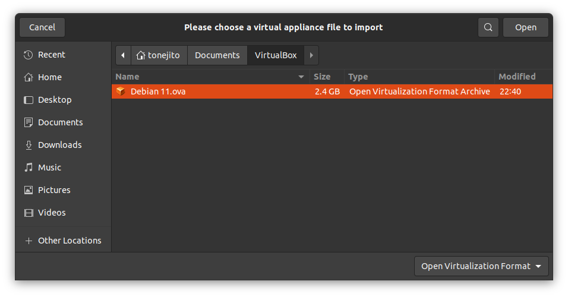

# Cómo compactar y exportar una máquina virtual de VirtualBox

## Configurar _locale_

Seleccionar los siguientes idiomas para el sistema operativo

```
# dpkg-reconfigure -p low locales
```

- [x] `en-US.UTF-8`
- [x] `es-MX.UTF-8`

## Instalar herramientas

```
# apt install zerofree localepurge
```

!!! note
    Configurar `localepurge` con las opciones predeterminadas

## Eliminar caché de APT

```
# apt clean
# apt purge
# apt autoremove
```

- `/var/cache/apt/archives`
- `/var/cache/apt/archives/partial`

## Compactar el sistema de archivos en la máquina virtual

### Iniciar la máquina virtual en modo de rescate

Iniciar la máquina virtual y seleccionar las _opciones avanzadas de inicio_.

```text

                           GNU GRUB  version 2.04-20

 +----------------------------------------------------------------------------+
 |  Debian GNU/Linux                                                          | 
 |■ Advanced options for Debian GNU/Linux ■■■■■■■■■■■■■■■■■■■■■■■■■■■■■■■■■■■■|
 |                                                                            |
 |                                                                            |
 |                                                                            |
 |                                                                            |
 |                                                                            |
 |                                                                            |
 |                                                                            |
 |                                                                            |
 |                                                                            |
 |                                                                            | 
 +----------------------------------------------------------------------------+

      Use the ^ and v keys to select which entry is highlighted.
      Press enter to boot the selected OS, `e' to edit the commands
      before booting or `c' for a command-line.

```

Seleccionar el _modo de recuperación_ para iniciar en un ambiente reducido.

```text

                           GNU GRUB  version 2.04-20

 +----------------------------------------------------------------------------+
 |  Debian GNU/Linux, with Linux 5.10.0-17-amd64                              | 
 |■ Debian GNU/Linux, with Linux 5.10.0-17-amd64 (recovery mode) ■■■■■■■■■■■■■|
 |                                                                            |
 |                                                                            |
 |                                                                            |
 |                                                                            |
 |                                                                            |
 |                                                                            |
 |                                                                            |
 |                                                                            |
 |                                                                            | 
 +----------------------------------------------------------------------------+

      Use the ^ and v keys to select which entry is highlighted.          
      Press enter to boot the selected OS, `e' to edit the commands       
      before booting or `c' for a command-line. ESC to return             
      previous menu.                                                      

```

Escribir la contraseña del usuario `root`, no se mostrará en la pantalla.

```text
  Booting a command list

Loading Linux 5.10.0-17-amd64 ...
Loading initial ramdisk ...
/dev/sda1: clean, 64094/593344 files, 543653/2371072 blocks
You are in rescue mode. After logging in, type "journalctl -xb" to view
system logs, "systemctl reboot" to reboot, "systemctl default" or "exit"
to boot into default mode.
Give root password for maintenance
(or press Control-D to continue): 

```

### Reducir programas en ejecución

Listar los procesos en ejecución.

```bash
root@debian-11:~# ps afx
    PID TTY      STAT   TIME COMMAND
      2 ?        S      0:00 [kthreadd]
...	...	...	...	...	...	...
      1 ?        Ss     0:01 /sbin/init single
    182 ?        Ss     0:00 /lib/systemd/systemd-journald
    202 ?        Ss     0:00 /lib/systemd/systemd-udevd
    268 ?        Ssl    0:00 /lib/systemd/systemd-timesyncd
    291 ?        Ssl    0:00 /sbin/dhclient -4 -v -i -pf /run/dhclient.eth0.pid -lf /var/lib/dhcp/dhclient.eth0.leases -I -df /var/lib/dhcp/dhclient6.eth0.leases eth0
    292 ?        Ssl    0:00 /sbin/dhclient -4 -v -i -pf /run/dhclient.eth1.pid -lf /var/lib/dhcp/dhclient.eth1.leases -I -df /var/lib/dhcp/dhclient6.eth1.leases eth1
    390 ttyS0    Ss     0:00 /lib/systemd/systemd-sulogin-shell rescue
    391 ttyS0    S      0:00  \_ /sbin/sulogin
    392 ttyS0    S      0:00      \_ bash
    398 ttyS0    R+     0:00      |   \_ ps afx
    399 ttyS0    S+     0:00      |   \_ more
    393 tty1     Ss+    0:00      \_ /sbin/sulogin
```

Detener los servicios de SystemD.

```bash
root@debian-11:~# systemctl stop systemd-journald systemd-udevd systemd-timesyncd
...	...	...	...	...	...	...
Warning: Stopping systemd-journald.service, but it can still be activated by:
  systemd-journald-dev-log.socket
  systemd-journald-audit.socket
  systemd-journald.socket
Warning: Stopping systemd-udevd.service, but it can still be activated by:
  systemd-udevd-control.socket
  systemd-udevd-kernel.socket
```

Listar los procesos del cliente de DHCP y detenerlos.

```bash
root@debian-11:~# pgrep dhclient
291 292

root@debian-11:~# pkill dhclient
```

Listar los procesos restantes.

```bash
root@debian-11:~# ps afx
    PID TTY      STAT   TIME COMMAND
      2 ?        S      0:00 [kthreadd]
...	...	...	...	...	...	...
      1 ?        Ss     0:01 /sbin/init single
    390 ttyS0    Ss     0:00 /lib/systemd/systemd-sulogin-shell rescue
    391 ttyS0    S      0:00  \_ /sbin/sulogin
    392 ttyS0    S      0:00      \_ bash
    416 ttyS0    R+     0:00      |   \_ ps afx
    393 tty1     Ss+    0:00      \_ /sbin/sulogin
```

### Montar el sistema de archivos en modo de sólo lectura

Identificar los discos y particiones que tiene la máquina virtual.

```bash
root@debian-11:~# lsblk
NAME   MAJ:MIN RM   SIZE RO TYPE MOUNTPOINTS
...
sda      8:0    0    10G  0 disk 
├─sda1   8:1    0     9G  0 part 
├─sda2   8:2    0     1K  0 part 
└─sda5   8:5    0   975M  0 part 
sr0     11:0    1     1M  0 rom
```

Identificar la partición que tiene el sistema de archivos raíz.

```bash
root@debian-11:~# df -m /
Filesystem     1M-blocks  Used Available Use% Mounted on
/dev/sda1           9017  1879      6660  23% /
```

Verificar si el sistema de archivos está montado como lectura-escritura (`rw`).

```
root@debian-11:~# mount | grep '/dev/sda1'
/dev/sda1   on   /   type   ext4   (rw,relatime,errors=remount-ro)
```

Remontar el sistema de archivos en modo sólo lectura (`ro`).

```
root@debian-11:~# mount -o remount,ro /

root@debian-11:~# mount | grep '/dev/sda1'
/dev/sda1   on   /   type   ext4   (ro,relatime,errors=remount-ro)
```

### Compactar el sistema de archivos raíz

Identificar la ruta al programa `zerofree` y las opciones con las que se ejecuta

<!--
!!! note
    Estos pasos también se pueden ejecutar desde un LiveCD, siempre y cuando se monte el sistema de archivos raíz como sólo lectura.
-->

```
root@debian-11:~# which zerofree
/usr/sbin/zerofree

root@debian-11:~# zerofree
usage: zerofree [-n] [-v] [-f fillval] filesystem
```

Ejecutar el programa `zerofree` para rellenar el sistema de archivos con `0x00`.

```
root@debian-11:~# zerofree -v /dev/sda1
0.0%
...
100.0%
12280/1827419/2371072
```

Apagar la máquina inmediatamente.

```
# poweroff
```

<!--
## Compactar la partición de la memoria SWAP

```bash
root@debian-11:~# lsblk
NAME   MAJ:MIN RM   SIZE RO TYPE MOUNTPOINTS
...
sda      8:0    0    10G  0 disk 
├─sda1   8:1    0     9G  0 part 
├─sda2   8:2    0     1K  0 part 
└─sda5   8:5    0   975M  0 part 
sr0     11:0    1   1.0G  0 rom  /cdrom

root@debian-11:~# free -m
             total        used        free      shared  buff/cache   available
Mem:           976          49         864           0          62         826
Swap:          974           0         974

root@debian-11:~# cat /proc/swaps 
Filename            Type            Size            Used            Priority
/dev/sda5           partition       998396          0               -2

root@debian-11:~# file -s /dev/sda5
/dev/sda5: Linux swap file, 4k page size, little endian, version 1, size 249599 pages, 0 bad pages, no label, UUID=daa1103b-5a80-4de0-9e9b-afec5e39985e

root@debian-11:~# swapoff -a

root@debian-11:~# free -m
             total        used        free      shared  buff/cache   available
Mem:           976          49         864           0          62         826
Swap:          0             0         974

root@debian-11:~# dd if=/dev/zero of=/dev/sda5 bs=1M status=progress
731906048 bytes (732 MB, 698 MiB) copied, 1 s, 732 MB/s
dd: error writing '/dev/sda5': No space left on device
976+0 records in
975+0 records out
1022361600 bytes (1.0 GB, 975 MiB) copied, 1.53814 s, 665 MB/s

# mkswap --verbose -L swap -U daa1103b-5a80-4de0-9e9b-afec5e39985e /dev/sda5
Setting up swapspace version 1, size = 975 MiB (1022357504 bytes)
LABEL=swap, UUID=daa1103b-5a80-4de0-9e9b-afec5e39985e
```
-->

## Compactar el disco de la máquina virtual

Listar el tamaño del disco de la máquina virtual.

```
tonejito@laptop:~/VirtualBox VMs/Debian 11$ ls -l *.vdi
-rw------- 1 tonejito tonejito 4707319808 oct 24 12:32 'Debian 11.vdi'
```

| Tamaño disco original VDI
|:----:|
| 

Ejecutar el comando para compactar el disco VDI.

```
tonejito@laptop:~/VirtualBox VMs/Debian 11$ VBoxManage modifyhd "Debian 11.vdi" -compact
0%...10%...20%...30%...40%...50%...60%...70%...80%...90%...100%
```

Verificar que el disco de la máquina virtual haya sido compactado.

```
tonejito@laptop:~/VirtualBox VMs/Debian 11$ ls -l *.vdi
-rw------- 1 tonejito tonejito 2360344576 oct 25 22:33 'Debian 11.vdi'
```

| Tamaño disco VDI compactado
|:----:|
| 


## Exportar la máquina virtual

| Pantalla principal de VirtualBox
|:----:|
| 

| Menú exportar
|:----:|
| 

| Seleccionar máquina virtual
|:----:|
| 

| Configuración OVA
|:----:|
| 

| Información OVA
|:----:|
| 

| Exportando imagen OVA…
|:----:|
| 

| Tamaño disco original VDI
|:----:|
| 

| Tamaño imagen OVA
|:----:|
| 

## Importar imagen OVA

| Menú importar
|:----:|
| 

| Seleccionar imagen OVA
|:----:|
| 

| Buscar imagen OVA
|:----:|
| 

| Configuración OVA
|:----:|
| 

| Importando imagen OVA…
|:----:|
| 


--------------------------------------------------------------------------------

## Referencias

- <https://wiki.debian.org/Locale>
- <https://manpages.debian.org/bullseye/coreutils/dd.1.en.html>
- <https://manpages.debian.org/bullseye/zerofree/zerofree.8.en.html>
- <https://manpages.debian.org/bullseye/localepurge/localepurge.8.en.html>
- <https://www.debian.org/releases/bullseye/amd64/ch05s03.en.html>
- <https://www.virtualbox.org/manual/ch08.html#vboxmanage-modifymedium>
- <https://www.virtualbox.org/wiki/Serial_redirect>
- <http://blog.tonejito.org/2011/11/zerofree-zero-out-space-on-virtual.html>
- <http://blog.tonejito.org/2012/05/virtualbox-serial-console-on-mac-os-x.html>
- <https://www.cyberciti.biz/faq/linux-unix-dd-command-show-progress-while-coping/>
- <https://www.cyberciti.biz/faq/howto-setup-serial-console-on-debian-linux/>
- <https://www.gonwan.com/2014/04/07/setting-up-serial-console-on-virtualbox/>
- <https://unix.stackexchange.com/questions/42015/mount-is-busy-when-trying-to-mount-as-read-only-so-that-i-can-run-zerofree>
