# Redes de Computadoras

## Registro de un dominio

### Objetivos
-------------
-   El alumno aprenderá el proceso para registrar un nombre de dominio.
-   Pondrá en práctica los conocimiento relacionados con el Sistema de
    Nombre de Dominio o DNS.
-   Configurará diversos registros, y así comprenderá su
    funcionamiento.

### Introducción
----------------
DNS (Domain Name System) es un sistema jerárquico de nombres basado en
dominios, que usa una base de datos distribuida para alamacenar sus
registros. Uno de sus usos más comunes consiste en asociar los nombres
de un dominio, por ejemplo de un sitio web, con una dirección IP
asociada al servidor que contiene dicho sitio, de ésta forma los
clientes podrán enviar mensajes a esa dirección IP para poder establecer
una comunicación con el sitio web.

El espacio de nombres de dominio es una jerarquía de nombres
administrada por la ICANN (*Internet Corporation for Assigned Name and
Numbers*). En la que cada dominio se divide en subdominios, los que a su
vez se dividen en otros subdominios, y así en lo sucesivo. Los dominios
se pueden representar mediante un árbol, las hojas del árbol representan
los dominios o subdominios, como se observa en la
[figura 1](#domain_tree).

<a name="domain_tree">*Figura 1. Espacio de nombres de dominio*</a>
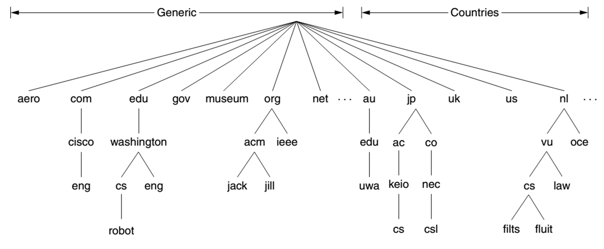

Los dominios de nivel superior se dividen en dos categorías:

-   Genéricos, datan de 1980, pero a lo largo del tiempo se han
    introducido nuevos.
-   Países, los dominios de país incluyen una entrada para cada país, de
    acuerdo a la ISO 3166.

Los dominios de nivel superior o TLD (*Top Level Domains*) son
administrados por Operadores de registro o *Registry Operators*
acreditados por la ICANN[^1]. Por ejemplo, el *Registry Operator* del
dominio *.com*, es la compañía VeriSign que ha sido autorizada[^2] por
la ICANN para mantener este dominio. Los *Registries Operators* pueden
delegar la venta comercial de los dominios a un tercero llamado
Registrador o *Registrar*, por supuesto de por medio una tarifa. Los
*Registrars* también deben de estar acreditados[^3] por la misma ICANN.
Es a éstos últimos, o a empresas revendedoras, que los clientes como
nosotros les podemos arrendar un nombre de dominio. Para solicitar un
nombre de dominio, se hace la solicitud y si el registro está disponible
y la marca no está registrada se otorga el dominio y se paga una cuota.
El tiempo máximo para arrendar un dominio es de 10 años, y puede ser
renovado. Una vez que hemos contratado un dominio, podemos transferirlo
a otro *Registrar* distinto para que éste tenga los registros
autoritativos. Este proceso se esquematiza en la
[figura 2](#registrar-flow).

<a name="registrar-flow">*Figura 2. Flujo de registro de un dominio*</a>


Cada dominio puede tener un grupo de registros de recursos asociados a
él. Los registros son la base de datos del DNS. Por ejemplo, para un
host individual, el registro de recursos más común es la dirección IP.
Por lo que la función principal del DNS es relacionar los nombres de
dominio con los registros de recursos. Algunos de los registros son:

-   A - Dirección IPv4 de un host.
-   NS - Servidor de nombres para un dominio.
-   CNAME - Nombre canónico.
-   MX - Indica qué nombre dominio puede enviar y recibir correo
    electrónico.

### Desarrollo
----------------
La práctica consiste en registrar un dominio *.tech*, a través de *.tech
Domains*, cuyo es sitio <https://get.tech>. Para posteriormente crear
algunos registros DNS usando los servicios de *Hurricane Electric* o HE,
a través de su sitio <https://dns.he.net>. Y por último, verificar que
se hicieron los registros adecuadamente al hacer algunas consultas.

#### Adherirse al programa Github Student Developer Pack

El Github Student Developer Pack es un programa dirigido a estudiantes,
que provee de forma gratuita diversas herramientas y servicios con el
fin de apoyarlos en su carrera como desarrolladores de software. Nos
apoyaremos de este programa para que el registro de un dominio a través
de *.tech Domains* sea gratuito durante un año.

1. Acceder al sitio <https://education.github.com> como se muestra en
    la [figura 3](#Student_Developer_Pack), y dar clic en el botón *GitHub
    Student Developer Pack*, para acceder a los beneficios del programa.

    <a name="Student_Developer_Pack">*Figura 3. Github Student Developer Pack*</a>
    

2.  En la siguiente pantalla se pueden revisar todos los servicios y
    herramientas que ofrece el programa. Para continuar con el registro,
    dar clic en el botón *Get your pack*, [figura 4](#Github_student_benefits).

    <a name="Github_student_benefits">*Figura 4. Beneficios del programa*</a>
    

3.  A continuación se muestran los beneficios del programa tanto para
    estudiantes como para profesores. Dar clic en el botón *Get student
    benefits*, como se muestra en la [figura 5](#student_benefits).

    <a name="student_benefits">*Figura 5.Beneficios para el estudiante y el profesor*</a>
    

4.  Para el siguiente paso es necesario ingresar usando una cuenta de
    GitHub, si ya se tiene una bastará con ingresar los datos de acceso
    que se solicitan; en caso de que no se tenga una cuenta, entonces
    dar clic en el enlace de *Create an account*, y cumplimentar con los
    datos que se soliciten, [figura 6](#signin). Es
    necesario que el correo electrónico usado sea de un dominio
    `@unam.mx`, como por ejemplo, las cuentas de correo
    `@ciencias.unam.mx`, o `@comunidad.unam.mx`.

    <a name="signin">*Figura 6. Ingreso a cuenta de GitHub*</a>
    

5.  Una vez que se ha ingresado con una cuenta de GitHub, cumplimentar
    el formulario de solicitud de ingreso al programa Github Student
    Developer Pack, se sugiere usar los datos que se muestran en la
    [figura 7](#student_application). Si la cuenta de GitHub se creó con
    una cuenta que no es del dominio `@unam.mx`, entonces será necesario
    agregar una dirección extra de correo electrónico de dicho dominio,
    para tener mayor probabilidad de ser aceptados en el programa, ésto
    se hace a través del botón *Add an email address*. Una vez que se
    envían los datos, éstos no pueden ser modificados.

    <a name="student_application">*Figura 7. Solicitud de ingreso al programa*</a>
    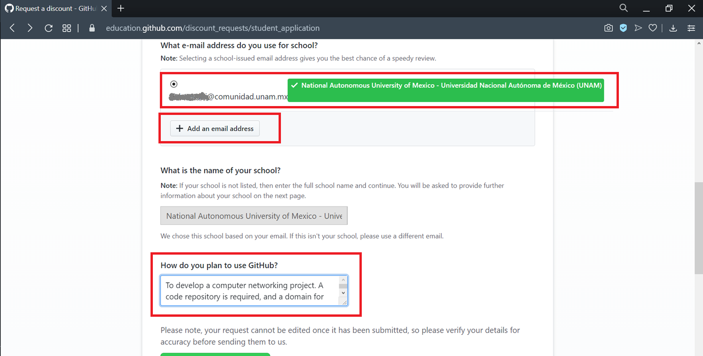

6.  Una vez que se ha llenado y enviado la solicitud, verificar el
    correo electrónico que indica que ha sido aprobada la solicitud,
    [figura 8](#email_confirmation).

    <a name="email_confirmation">*Figura 8. Correo de confirmación*</a>
    

#### Obtener un dominio en .tech Domains

Se usará el servicio de *.tech Domains* para registrar de forma
gratuita, gracias al programa Github Student Developer Pack, el dominio
que usaremos a lo largo de todo el semestre.

1.  Ingresar al sitio <https://education.github.com/pack/offers>, y
    autenticarse con su cuenta de GitHub, tal como se hizo previamente.
    Desplazarse a través de la página hasta encontrar
    el servicio de *.tech Domains*, y dar clic en el enlace *.TECH*,
    [figura 9](#link_to_techdomains).

    <a name="link_to_techdomains">*Figura 9. Enlace al servicio de .tech Domains*</a>
    

2.  Una vez que se ha ingresado al sitio, en el campo de búsqueda de
    dominio, escribir el dominio .tech por el que tenemos interés en
    registrar, después dar clic en el botón *SEARCH*, como se puede
    observar en la [figura 10](#domain_search).

    <a name="domain_search">*Figura 10.Búsqueda de nombre de dominio*</a>
    

3.  Si se encuentra disponible para su registro, aparecerá una pantalla
    como la de la [figura 11](#domain_name_availability)
    , en la que se indica el costo;
    en caso de que el nombre de dominio no se encuentre disponible, será
    necesario escoger otro y de nuevo verificar su disponibilidad. Dar
    clic en el ícono de carrito de compras.

    <a name="domain_name_availability">*Figura 11.Verificación de la disponibilidad del dominio*</a>
    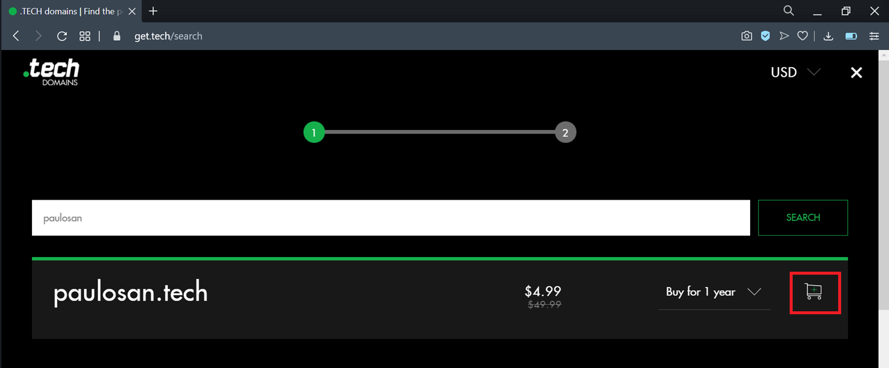

4.  En la siguiente pantalla de la [figura 12](#domain_name_selection)
    , aparecerá la opción de compra,
    dar clic en el botón *PROCEED*. En caso de que no sea visible dicho
    botón, este proceso se puede continuar ingresando a la opción de
    carrito de compras desde la pantalla inicial del sitio.

    <a name="domain_name_selection">*Figura 12. Selección del nombre de dominio*</a>
    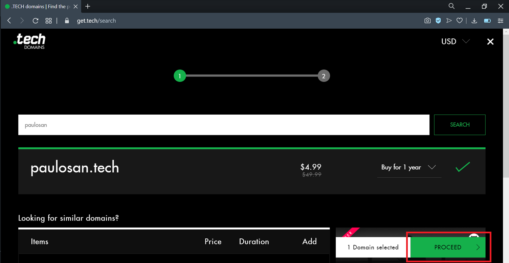

5.  Enseguida aparecerá una pantalla como la de la [figura 13](#shopping)
    , dar clic en el botón *LOGIN WITH GITHUB*,
    para poder registrar este nombre de dominio de forma gratuita. Se
    deberá ingresar con los datos de la cuenta de GitHub previamente
    afiliada al programa Github Student Developer Pack.

    <a name="shopping">*Figura 13. Carrito de compra*</a>
    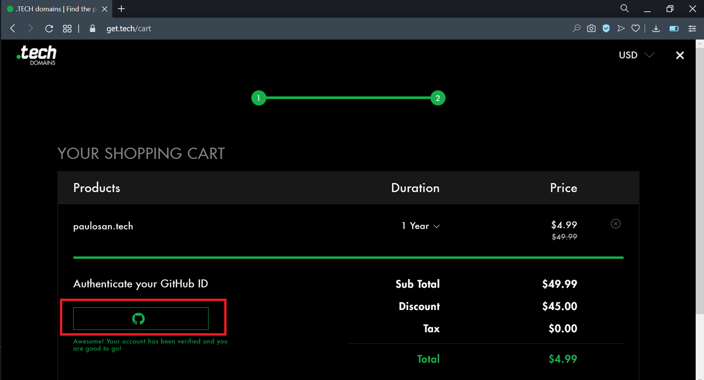

6.  Ingresar a la cuenta de GitHub y dar autorización para la
    autenticación entre GitHub y .tech Domains, [figura 14](#github_authentication)
    . Dar clic en el botón *Authorize
    RadixFZC*. Después redigirá a la página de .tech Domains.

    <a name="github_authentication">*Figura 14. Autenticación con Github*</a>
    

7.  Una vez completado el paso anterior, dar clic en el botón *PLACE
    ORDER*, para continuar con el proceso de registro. Notar que se
    aplicó un descuento del 100% en el registro del nombre de dominio,
    esto gracias al programa Github Student Developer Pack, [figura 15](#github_discount).

    <a name="github_discount">*Figura 15. Descuento en la compra por el programa Github Student Developer Pack*</a>
    

8.  Antes de continuar, se solicita el ingreso con una cuenta de .tech
    Domains. Si se cuenta con una, sólo bastará con poner las
    credenciales y dar clic en el botón *SIGN IN*, en caso de no ser
    así, entonces dar clic en el botón *CREATE ACCOUNT*, para crear una,
    [figura 16](#.techdomain_creation_account).

    <a name=".techdomain_creation_account">*Figura 16. Generar una cuenta en .tech Domains*</a>
    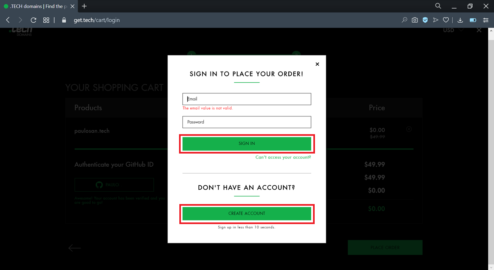

9.  Cumplimentar el formulario de registro, y después dar clic en el
    botón *CREATE ACCOUNT* para continuar con el registro del nombre de
    dominio, [figura 17](#.techdomain_account_form).

    <a name=".techdomain_account_form">*Figura 17. Formulario de registro*</a>
    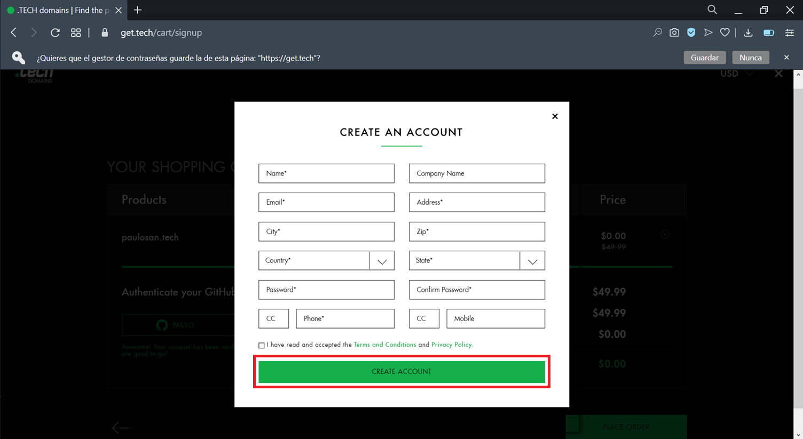

10. Una vez completado el paso anterior, sólo restará dar clic en el
    botón *CONFIRM ORDER* para terminar con el registro, [figura 18](#.techdomain_confirm_order).

    <a name=".techdomain_confirm_order">*Figura 18. Confirmar orden de compra*</a>
    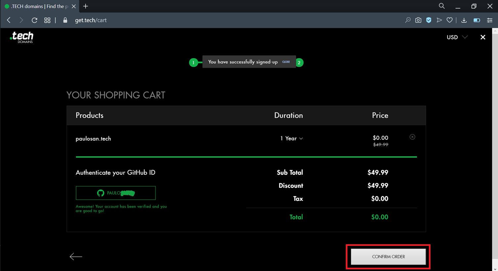

11. Por último, si el procedimiento fue exitoso, nos mostrará una
    pantalla indicándolo, [figura 19](#.techdomain_order_sucessful).

    <a name=".techdomain_order_sucessful">*Figura 19. Confirmación de la orden de compra del nombre de dominio*</a>
    

#### Obtener cuenta en Hurricane Electric

Se usará el servicio de DNS de HE para crear los registros necesarios.

1.  Entrar al sitio <https://dns.he.net> y si no se cuenta con una
    cuenta en el sitio, dar clic en el botón *Register* para realizar el
    registro de una, [figura 20](#dnshenet_web).

    <a name="dnshenet_web">*Figura 20. Sitio de Hurricane Electric Free DNS*</a>
    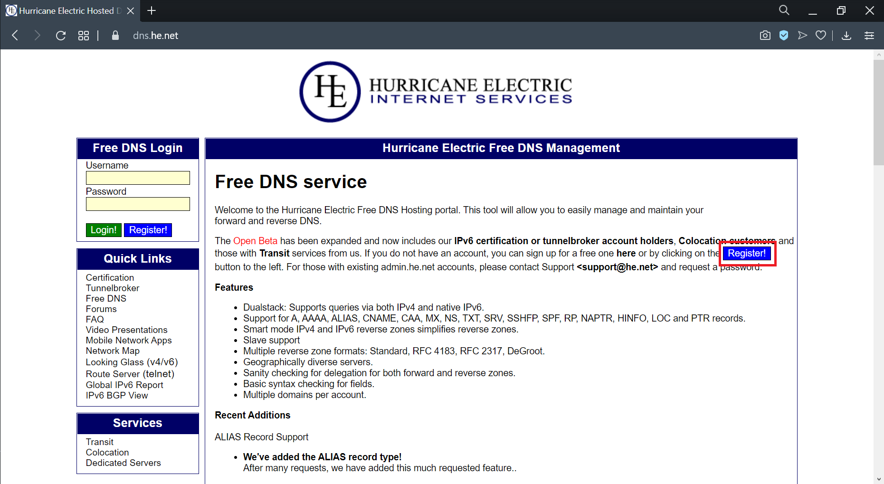

2.  Cumplimentar el formulario con los datos que se piden, y dar clic en
    el botón Register que se encuentra al final de dicho formulario,
    [figura 21](#dnshenet_register).

    <a name="dnshenet_register">*Figura 21. Formulario de registro*</a>
    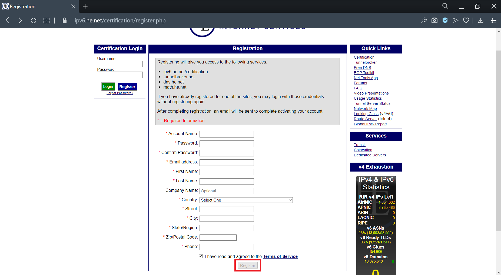

3.  Se recibirá un correo electrónico similar al de la [figura 22](#dnshenet_email_1)
    y la [figura 23](#dnshenet_email_2),
    indicando los pasos para confirmar el registro.

    <a name="dnshenet_email_1">*Figura 22. Correo de confirmación*</a>
    

    <a name="dnshenet_email_2">*Figura 23. Verificación*</a>
    

#### Configuración de los *Name Servers*

Se deberá indicar a .tech Domains que los servidores autoritativos para
el dominio registrado serán los servidores de HE, para ello es necesario
seguir los siguiente pasos.

1.  Ingresar con la cuenta recién configurada a https://dns.he.net, y
    copiar los servidores de la lista que se muestra, éstos se
    configurarán en .tech Domains, [figura 24](#dnshenet_ns).

    <a name="dnshenet_ns">*Figura 24. Name servers*</a>
    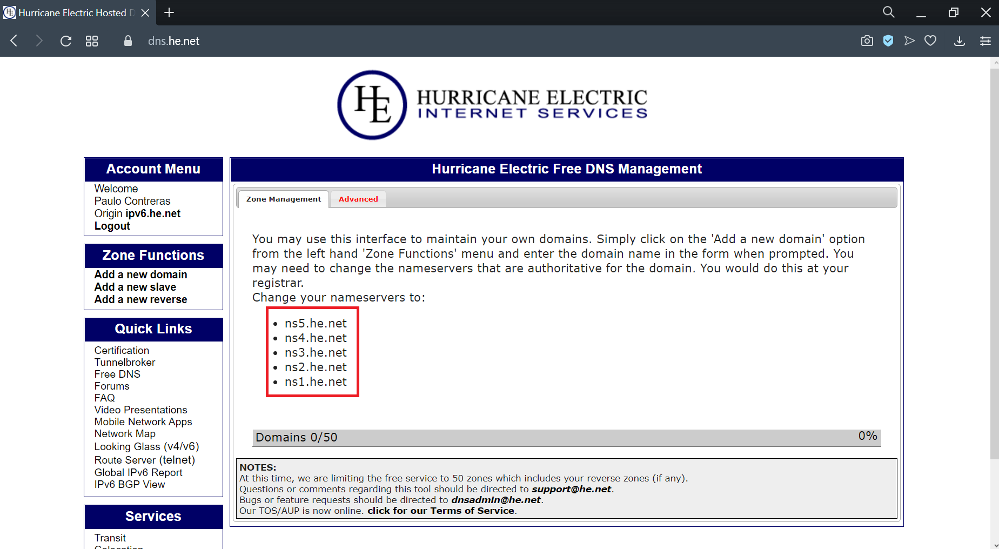

2.  Ingresar a .tech Domain con la cuenta configurada previamente. Una
    vez dentro, ingresar en el menú *MY ACCOUNT*, [figura 25](#.techdomains_myaccount).

    <a name=".techdomains_myaccount">*Figura 25. Configuración de My Account*</a>
    

3.  Una vez dentro, ir al menú *Manage Orders* > *List/Search Orders*,
    [figura 26](#.techdomains_listorders).

    <a name=".techdomains_listorders">*Figura 26. Menú de lista de dominios registrados*</a>
    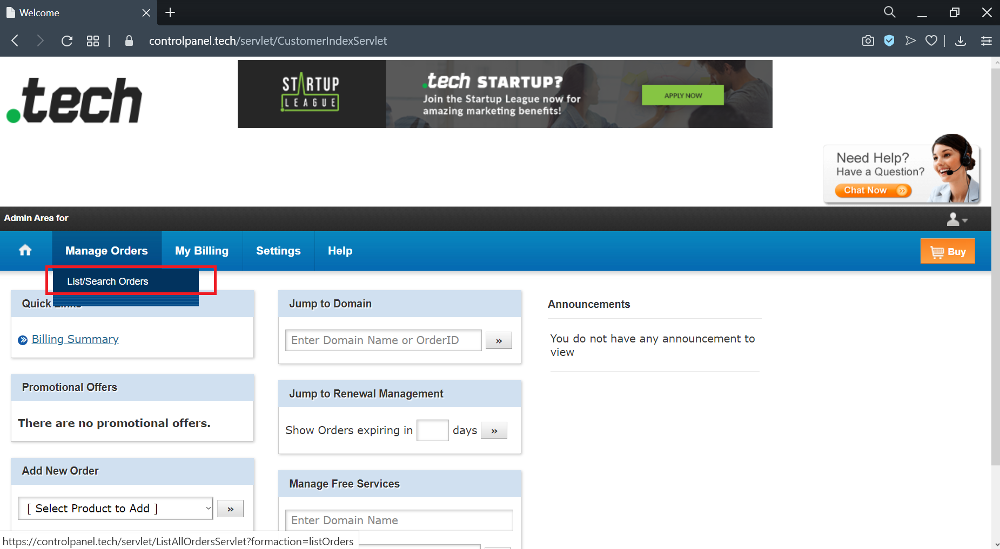

4.  A continuación el sitio mostrará los dominios que se han registrado,
    dar clic sobre el dominio que se registró previamente, [figura 27](#.techdomains_listdomainnames).

    <a name=".techdomains_listdomainnames">*Figura 27. Lista de dominios registrados en .tech Domains*</a>
    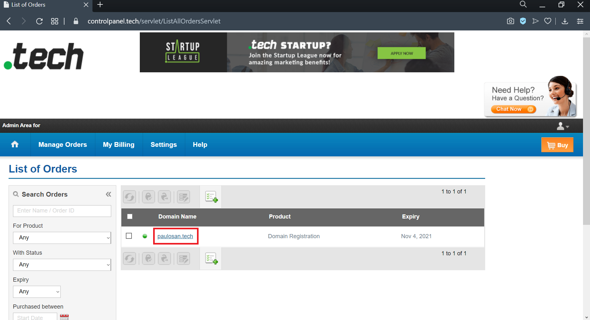

5.  Ahora, dar clic en la opción *Name Servers*, [figura 28](#.techdomains_nsservers).

    <a name=".techdomains_nsservers">*Figura 28. Configuración de servidores autoritativos*</a>
    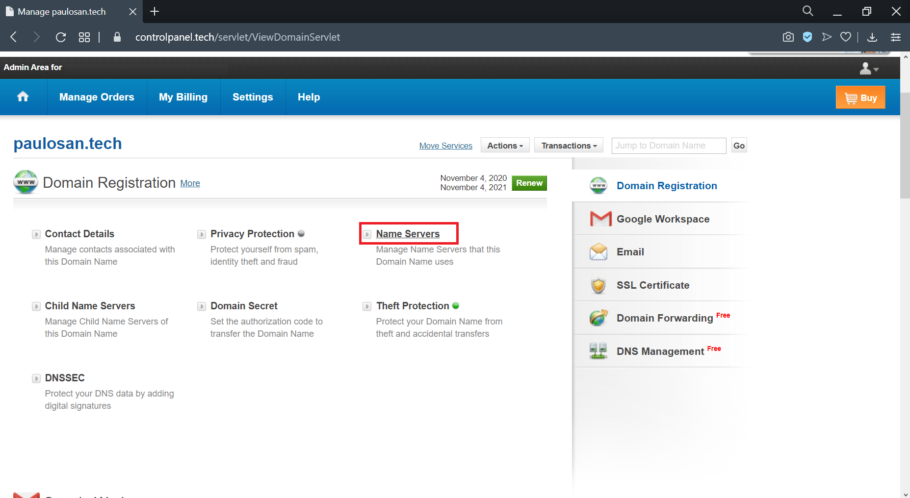

6.  En el cuadro desplegado, pegar los dominios de los
    servidores autoritativos de HE, y después dar clic en botón *Update
    Name Servers*, [figura 29](#.techdomains_nsservershe).

    <a name=".techdomains_nsservershe">*Figura 29. Servidores autoritativos de HE*</a>
    

7.  Si la configuración fue exitosa, se desplegará un mensaje de
    confirmación parecido al de la [figura 30](#.techdomains_nsserversconfirm).

    <a name=".techdomains_nsserversconfirm">*Figura 30. Mensaje de confirmación*</a>
    

8.  Realiza una consulta al servicio `WHOIS` para revisar si los servidores DNS autoritativos aparecen listados.

```
$ whois dominio.tech
% IANA WHOIS server
% for more information on IANA, visit http://www.iana.org
% This query returned 1 object

refer:        whois.nic.tech

domain:       TECH				<=	Dominio DNS de primer nivel

	...

Domain Name: DOMINIO.TECH			<=	Nombre de dominio DNS
Registry Domain ID: D206985368-CNIC
Registrar WHOIS Server: whois.dotserve.website
Registrar URL: http://dotserve.website
Updated Date: 2021-04-11T23:11:29.0Z
Creation Date: 2020-11-04T07:12:17.0Z
Registry Expiry Date: 2021-11-04T23:59:59.0Z
Registrar: Dotserve Inc
Registrar IANA ID: 1913
Domain Status: clientTransferProhibited https://icann.org/epp#clientTransferProhibited
Registrant Organization: ...
Registrant State/Province: ...
Registrant Country: ...
Registrant Email: ...
Admin Email: ...
Tech Email: ...
Name Server: NS1.HE.NET				<=	Servidor DNS autoritativo
Name Server: NS3.HE.NET				<=	Servidor DNS autoritativo
DNSSEC: unsigned
Billing: ...
Registrar Abuse Contact Email: ...
Registrar Abuse Contact Phone: ...
URL of the ICANN Whois Inaccuracy Complaint Form: https://www.icann.org/wicf/
>>> Last update of WHOIS database: 2021-07-04T06:53:00.0Z <<<
```

Si los nombres y/o direcciones IP de los servidores DNS autoritativos para esta zona están listados continuar con el siguiente paso. En caso contrario esperar unos minutos y volver a intentar.
**Anexa esta consulta de WHOIS a tu reporte.**

9.  Regresar al sitio de Hurricane Electric, y configurar ahora el
    nombre de dominio. En el menú derecho dar clic en la opción *Add a
    new domain*, [figura 31](#dnshenet_newdomain).

    <a name="dnshenet_newdomain">*Figura 31. Agregar un nuevo dominio*</a>
    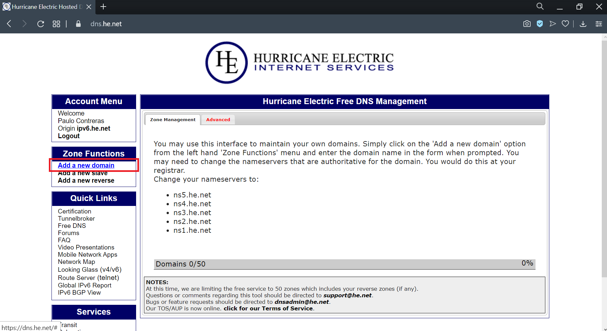

10.  En el cuadro de diálogo ingresar el nombre de dominio registrado
    previamente en .tech Domains, y después dar clic en el botón *Add
    Domain!*, [figura 32](#dnshenet_newdomainname).

    <a name="dnshenet_newdomainname">*Figura 32. Ingresar nombre de dominio*</a>
    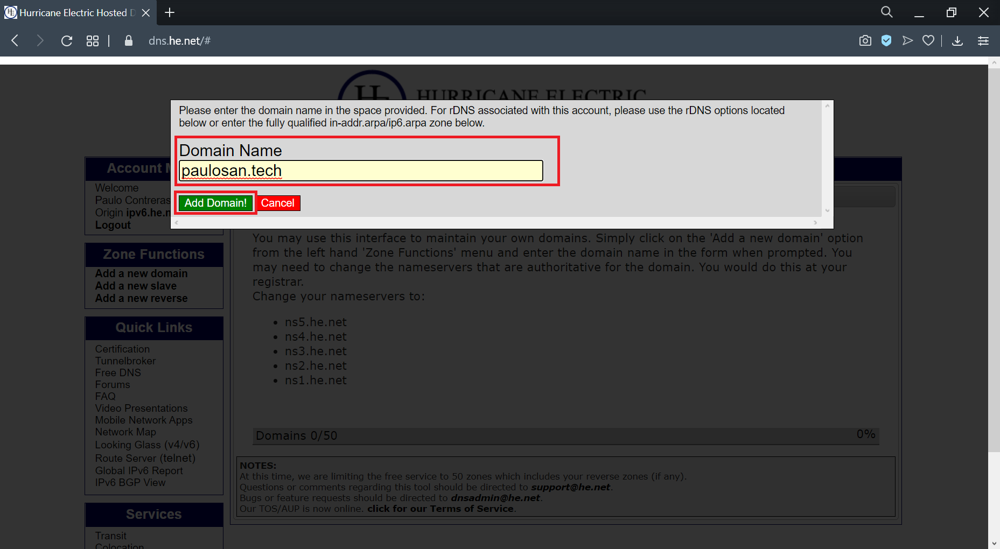

11. Si la configuración fue correcta, aparecerá una pantalla similar a
    la de la [figura 33](#dnshenet_confirm)
    . Es probable que haya que esperar
    algunos minutos para que se propague esta configuración a todo el
    sistema distruibido de DNS en toda la Internet. Para verificar la
    creación automática tanto de los registros SOA como NS, dar clic en
    el botón *Edit zone*.

    <a name="dnshenet_confirm">*Figura 33. Alta de nombre de dominio en Hurricane Electric*</a>
    

12. A continuación se mostrarán dichos registros, con una configuración
    parecida a la de la [figura 34](#dnshenet_confirm).

    <a name="dnshenet_confirm">*Figura 34. Alta de nombre de dominio en Hurricane Electric*</a>
    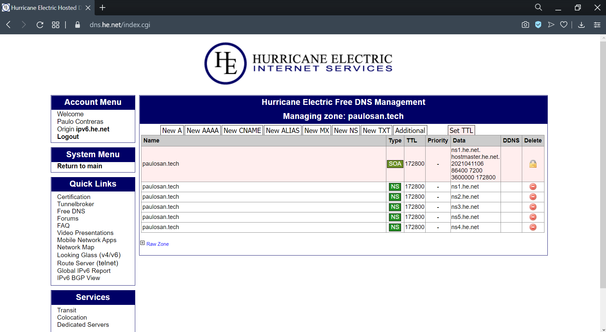

13. Además, podemos utilizar el comando dig para verificar que la
    propagación de la configuración ya fue aplicada. Para ello es
    necesario abrir una terminal de comandos en nuestros equipos, e
    introducir los siguientes comandos.

    -   Consultas al servidor DNS autoritativo de Hurricane Electric.

```
$ dig SOA mi-dominio.tech. @ns1.he.net

$ dig NS  mi-dominio.tech. @ns1.he.net
```

    -   Consultas a un servidor DNS público. Al hacer ésto se realiza una consulta DNS recursiva.

```
$ dig SOA mi-dominio.tech. @1.1.1.1

$ dig NS  mi-dominio.tech. @1.1.1.1
```

**Anexa estas consultas de DNS a tu reporte de la práctica.**

14. Agrega dos registros de host para asociar un nombre DNS con una dirección de IPv4 (registro `A`) y con una dirección de IPv6 (registro `AAAA`).

```
host.mi-dominio.tech.	300	IN	A	94.177.170.210

host.mi-dominio.tech.	300	IN	AAAA	2a00:6d40:60:69d2::1
```

Verifica que los registros se hayan guardado en el servidor DNS con el comando `dig`.
**Anexa estas consultas de DNS a tu reporte de la práctica.**

15. Agrega un registro `CNAME` para asociar el nombre de host `prueba` en el contexto de tu dominio con los registros DNS del paso anterior.

```
prueba.mi-dominio.tech.	300	IN	CNAME	host.mi-dominio.tech.
```

Verifica que los registros se hayan guardado en el servidor DNS con el comando `dig`.
**Anexa estas consultas de DNS a tu reporte de la práctica.**

16. Accede a la URL `http://prueba.mi-dominio.tech/` en un navegador web.

  - ¿Qué contenido muestra la página web?.
  - ¿Qué significa la parte que está resaltada en amarillo?

17. Agrega dos registros `CNAME` más que hagan referencia a otros nombres DNS en un dominio diferente.

```
test-1.mi-dominio.tech.	300	IN	CNAME	test.redes.tonejito.cf.
test-2.mi-dominio.tech.	300	IN	CNAME	foo.redes.tonejito.cf.
test-3.mi-dominio.tech.	300	IN	CNAME	vhost.redes.tonejito.cf.
```

Verifica que los registros se hayan guardado en el servidor DNS con el comando `dig`.
**Anexa estas consultas de DNS a tu reporte de la práctica.**

18. Accede a la URL de cada uno de los registros de DNS de tu dominio por HTTP en un navegador web.
¿Qué pasa?. ¿Alguna página marca error?. ¿Por qué sucede esto?.

19. Accede a los registros DNS del dominio `redes.tonejto.cf` por medio de HTTP en un navegador web.
¿Obtienes una respuesta similar al paso anterior?. ¿Qué diferencia hubo?. ¿Por qué sucede esto?.

20. Agrega varios registros de tipo `TXT` con el nombre de cada uno los integrantes de tu equipo.
No utilices acentos, eñe, ni caracteres especiales.

```
$ dig TXT integrante.mi-dominio.tech.
integrante.mi-dominio.tech.	300	IN	TXT	"Jose Luis Torres"
integrante.mi-dominio.tech.	300	IN	TXT	"Andres Hernandez"
integrante.mi-dominio.tech.	300	IN	TXT	"Paulo Contreras"
integrante.mi-dominio.tech.	300	IN	TXT	"Diego Barriga"
```

Verifica que los registros se hayan guardado en el servidor DNS con el comando `dig`.
**Anexa estas consultas de DNS a tu reporte de la práctica.**

21. Guarda una copia de la zona DNS que esta hospedada en `he.net`.
Da clic en el botón `Raw Zone` y copia todo el texto que está en el recuadro gris.
**Incluye esto en un archivo llamado `zona.txt` en tu reporte.**

```
; mi-dominio.tech Dumped Sun Jul  4 00:01:02 2021
;
mi-dominio.tech.	86400	IN	SOA	ns1.he.net. hostmaster.he.net. (
					2021070400	;serial
					86400		;refresh
					7200		;retry
					3600000		;expire
					86400	)	;minimum
mi-dominio.tech.	86400	IN	NS	ns1.he.net.
mi-dominio.tech.	86400	IN	NS	ns2.he.net.
mi-dominio.tech.	86400	IN	NS	ns3.he.net.
mi-dominio.tech.	86400	IN	NS	ns5.he.net.
mi-dominio.tech.	86400	IN	NS	ns4.he.net.

	...	...	...	...	...	...	...	...

```

### Cuestionario
----------------

1.  Investigue que son los *DNS root servers*.

2.  ¿Qué uso le podría dar al nombre de dominio que ha registrado?

3.  ¿Qué consecuencias habría si los servidores DNS del *Registrar* del
    dominio que registró en esta práctica, dejaran de dar servicio?

4.  Analice la nota *Cómo evitar que Internet se caiga*, que puede leer
    en este enlace
    <https://latam.kaspersky.com/blog/attack-on-dyn-explained/7901/>, y
    emita un comentario al respecto.

<!--
Consulta de WHOIS punto 8
Consultas DNS
Preguntas de los puntos 16, 18 y 19
-->


### Notas adicionales
---------------------

-   Redacte un reporte por equipo, en el que consigne los
    pasos que considere necesarios para explicar cómo realizó la
    práctica, incluya capturas de pantalla que justifiquen su trabajo.

-   Incluya en su reporte tanto las respuestas del Cuestionario, como un
    apartado de conclusiones referentes al trabajo realizado.

-   Puede agregar posibles errores, complicaciones, opiniones, críticas
    de la práctica o del laboratorio, o cualquier comentario relativo a
    la misma.

-   Entregue su reporte de acuerdo a la forma de entrega de tareas y
    prácticas definida al inicio del curso,
    <https://redes-ciencias-unam.gitlab.io/2021-2/tareas-redes/workflow/>.


##### *Notas al pie*


[^1]: La ICANN, es un departamento que pertenece a la IANA *Internet
    Assigned Numbers Authority*

[^2]: La lista de *Registries Operators* acreditados se puede consultar
    en <https://www.icann.org/resources/pages/listing-2012-02-25-en>

[^3]: La lista completa de *Registrars* se puede encontrar en
    <https://www.icann.org/en/accredited-registrars>
