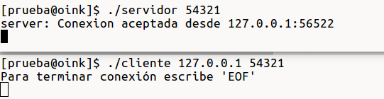
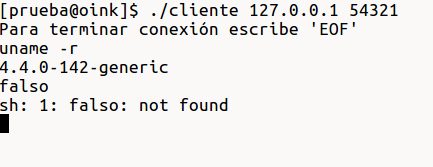

# Práctica 2: Sockets

###Fecha de entrega: 4/Mar/19

## Especificaciones

+ Esta práctica es individual
+ Debe de realizarse utilizando el lenguaje de programación C.
+ Hacer un archivo `Makefile` para la compilación.
+ Incluir un archivo `README.md` en donde se documente la práctica, con imágenes de ejemplos de ejecución.
+ Implementar manejo de errores.

### Ejercicio: Bind shell
Se deberá de crear un programa `cliente.c`y un programa `servidor.c`. Ambos programas deben de comunicarse a través de sockets, `servidor.c` debe recibir un argumento que indicará el puerto por el que se pondrá en escucha, `cliente.c` recibirá dos argumentos, la dirección IPv4 del servidor al que se quiere conectar, y el puerto. El cliente al conectarse al servidor, deberá de poder enviar comandos que serán ejecutados por el servidor, la salida de estos comandos será entonces enviada al cliente. También se debe de enviar la salida de error estándar.

#### Ejemplo

Conexión entre cliente y servidor:

Ejecución de comandos desde el cliente:
 

### Ejercicio extra: Múltiples clientes

Hacer que el servidor acepte múltiples clientes al mismo tiempo, por medio de hilos.
