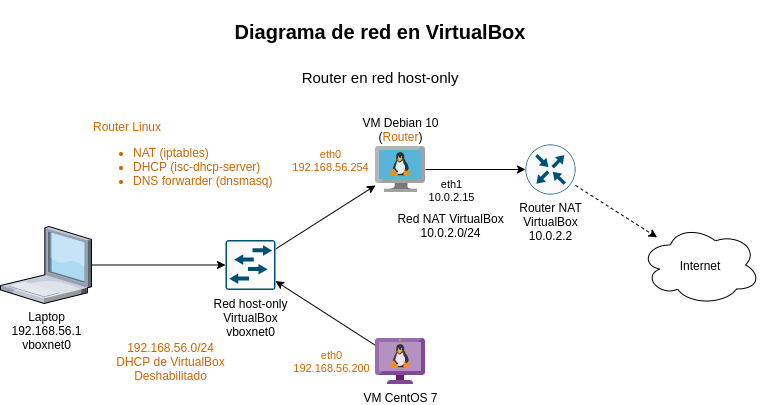
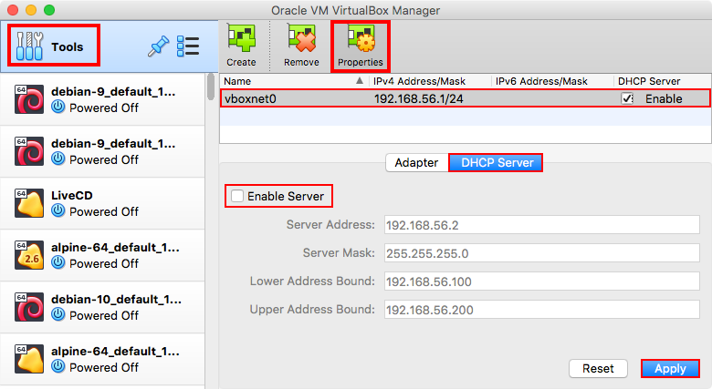

# Redes de Computadoras

## Configuración de servicios *DHCP*, *NAT* y *DNS* con Virtualbox

Se presentan los pasos para elaborar la configuración de un *NAT*, *DHCP* y *DNS local* utilizando VirtualBox con base en la topología de red que se muestra a continuación:



Esta practica guiada esta basada en los videos de la clase que se muestra a continuación.
La configuración de VirtualBox está explicada en la primer parte del video "Configuración de NAT, DHCP y Forwarder de DNS en GNU/Linux".

- [Configuración de NAT, DHCP y Forwarder de DNS en GNU/Linux 📼](https://www.youtube.com/watch?v=BzL3MQkHjwg)
- [Configuración persistente de direcciones IP en GNU/Linux 📼](https://www.youtube.com/watch?v=UErZ4i9XmLM)
- [Configuración de iptables en GNU/Linux 📼](https://www.youtube.com/watch?v=6lYnadL60Cs)
- [Protocolo DHCP 📼](https://www.youtube.com/watch?v=6l4WQJfD7o0)
- [Protocolo DNS 📼](https://www.youtube.com/watch?v=r4PntflJs9E)

### Fecha de entrega

- **Domingo 18 de junio de 2021 a las 23:59**.
- La fecha de entrega se extiende unos días si decides hacer la [actividad extra](#actividad-extra)

### Objetivos

* El alumno aplicará los conceptos teóricos de un NAT y DHCP en una topología de red básica
* El alumno configurará un NAT por medio de maquinas virtuales
* El alumno configurará un DHCP con maquinas virtuales
* El alumno montará un servidor *DNS* local

### Creación del *NAT* con `iptables`

#### Configuración en VirtualBox

Deshabilitar el servicio de DHCP en la interfaz host only.

- Abrir VirtualBox y dar clic en el menú de herramientas
- Aparecerá la lista de interfaces host-only dar clic en la primera
- Ir a la pestaña del servidor de DHCP y desmarcar la casilla para deshabilitarlo
- Dar clic en aplicar cambios



#### En la máquina Debian 10

0. Instalar las utilerias de red

```
# apt -q update
# apt -qy install net-tools
```

1. Instalar `iptables-persistent` para cargar las reglas de iptables en el inicio del sistema.

```
# apt install iptables-persistent
```

2. Configura una dirección IP estática en la interfaz host-only `192.168.56.254`.

**Anexa el archivo `/etc/network/interfaces` a tu reporte de la práctica**.

3. Revisar que no haya reglas existentes en `iptables`.

```
# iptables -n -L
```

4. Habilitar de manera persistente la funcionalidad de *IP forward* en el kernel para que no se descarten paquetes que no sean destinados a otra máquina.

  * Editar el archivo `/etc/sysctl.conf` y descomentar la linea.

```
net.ipv4.ip_forward = 1
```

  * Recargar la configuración de `sysctl`.

```
# sysctl -p
```

5. Habilitar la regla en la tabla de NAT de `iptables`.

```
# iptables -t nat -A POSTROUTING -o eth1 -j MASQUERADE
```

6. Indicar a `iptables` que se el tráfico puede entrada por *host-only* (`eth0`) y salir por la NAT (`eth1`) y viceversa.

```
# iptables -A FORWARD -i eth0 -o eth1 -j ACCEPT
# iptables -A FORWARD -i eth1 -o eth0 -m state --state ESTABLISHED,RELATED -j ACCEPT
```

7. Guarda las reglas de manera persistente.

```
# service netfilter-persistent save
```

**Anexa el archivo `/etc/iptables/rules.v4` a tu reporte de la práctica**.

### Configuración del *DHCP*

#### En la maquina Debian 10

1. Instalar el programa para configurar DHCP.

```
# apt -qy install isc-dhcp-server
```

2. Configurar el DHCP en el archivo `/etc/dhcp/dhcpd.conf`.
   Buscar y sustituir las líneas por defecto con la siguiente información.
   **Nota:** Hacer una copia del archivo antes de modificarlo.

```
option  domain-name  "ciencias.local"
option  domain-name-servers  192.168.56.254;

# No se dará servicio en la red externa (NAT de VirtualBox)
subnet 10.0.2.0 netmask 255.255.255.0 {
}

# Rango de direcciones a asignar
subnet  192.168.56.0  netmask  255.255.255.0 {
    range  192.168.56.100  192.168.56.200;
    option  routers  192.168.56.254;
}
```

**Anexa el archivo `/etc/dhcp/dhcpd.conf` a tu reporte de la práctica**.

3. Especificar la interface (*host-only* -> `eth0`) por donde escuchará el DHCP en el archivo `/etc/default/isc-dhcp-server`.

```
INTERFACESv4="eth0"
```

**Anexa el archivo `/etc/default/isc-dhcp-server` a tu reporte de la práctica**.

4. Reiniciar y revisar que el status del servicio de *DHCP* este corriendo.

```
# service isc-dhcp-server restart
# systemctl status isc-dhcp-server
```

#### **Actividad**

* Reservar una dirección estatica con el DHCP para la máquina CentOS 7.

* Anexa en el cuestionario como es que se reserva la dirección IP para un cliente en la configuración del DHCP.


### Configuración del _forwarder_ de *DNS*

#### En la máquina Debian 10

1. Instalar el programa `dnsmasq`.

```
# apt -qy install dnsmasq
```

2. Modificar las siguientes líneas en el archivo `/etc/dnsmasq.conf` para configurar el programa.

```
# Archivo que contiene las reglas para resolver DNS
# El archivo puede tener cualquier nombre
resolv-file=/etc/resolv-upstream.conf

# Redirección
address=/gateway.local/192.168.56.254
address=/dns.local/192.168.56.254

# Especificar la red por donde escuchará
# Al ser un dns local será la interfaz interna
interface=eth0
bind-interfaces
```

El parámetro `address` se utiliza para asociar una dirección IP con un nombre DNS arbitrario.

**Anexa el archivo `/etc/dnsmasq.conf` a tu reporte de la práctica**.

3. Crear el archivo `/etc/resolv-upstream.conf` con las reglas de resolución de dominios 

```
nameserver	1.1.1.1
nameserver	8.8.8.8
nameserver	9.9.9.9
```

**Anexa el archivo `/etc/resolv-upstream.conf` a tu reporte de la práctica**.

4. Reiniciar servicios

```
# service dnsmasq restart
# service isc-dhcp-server restart
```

#### En la máquina Debian 10

5. Una vez verifico el correcto funcionamiento del *DNS* local modificar el archivo `/etc/resolv.conf`

```
# Envía la consultas de DNS a dnsmasq local
nameserver  127.0.0.1
```

**Anexa el archivo `/etc/resolv.conf` a tu reporte de la práctica**.

#### En la máquina CentOS 7

6. Reiniciar la interface de red para obtener los nuevos parámetros de red.
   **Nota**: Otra opción es reiniciar la máquina virtual para obtener los nuevos parámetros de red.

```
# ifdown eth0
# ifup eth0
```

7. Instala los comandos para la utilerias de red:

```
# yum -y install net-tools elinks
```

7. Verificar los nuevos parámetros de red.
**Anexa la salida de todos estos comandos en tu reporte**.

  - Configuración de red

```
$ ifconfig -a

$ route -n

$ cat /etc/resolv.conf
```

  - Conectividad local

```
$ ping -c 4 192.168.56.254

$ ping -c 4 gateway.local

$ ping -c 4 dns.local
```

  - Resolución de DNS

```
$ dig example.com. @192.168.56.254

$ dig example.com. @dns.local

$ dig example.com.
```

  - Conectividad externa

```
$ ping -c 4 1.1.1.1

$ ping -c 4 example.com.

$ links -dump http://example.com/
```

### Cuestionario

1. Explica que significa la salida de los siguientes comandos:

```
# iptables-save
# iptables -n -L
```

2. Adjunta dos capturas de tráfico realizadas en la máquina Debian:

  - Tráfico de DHCP en la interfaz host-only `eth0`

```
# tcpdump -veni eth0 -o captura-dhcp.pcap 'port (67 or 68)'
```

  - Tráfico DNS en todas las interfaces de red.

```
# tcpdump -veni any -o captura-dns.pcap 'port 53'
```

3. Explica por que estas capturas se deben hacer en la máquina Debian que funge como servidor DHCP, NAT y DNS local y no en alguno de los clientes.

4. Muestra claramente como la máquina CentOS 7 llega a Internet gracias al NAT

5. ¿Cuál es la utilidad del *DHCP* en esta topología de red? ¿Qué utilidad tendría en topologías mas grandes?

6. Investiga qué es un **relay de *DHCP** y para qué sirve

7. Muestra claramente como es que el *DHCP* asigna las direcciones IP automaticamente

8. Anexa el archivo `/var/lib/dhcp/dhcpd.leases` correspondiente al servidor de DHCP a tu reporte de la práctica y explica el contenido.
   **Nota**: Existe otro archivo llamado `dhcp.leases` que es para el cliente de DHCP, este archivo no se requiere.

  - Para más información consulta la página de manual del archivo [`man 5 dhcpd.leases`](https://linux.die.net/man/5/dhcpd.leases "Lo invitamos a leer el man")

9. ¿Cuál es la utilidad del *DNS* local para esta topología de red?

10. Muestra claramente las interfaces en las que se está dando servicios de *DNS* 

11. Muestra claramente que este funcionando correctamente el *DNS* local indicando en que momento se utiliza el cache

12. Analiza la nota [*DHCP snooping: más seguridad para tu red*](https://www.ionos.mx/digitalguide/servidores/seguridad/dhcp-snooping/) y escribe un comentario al respecto.

### Notas adicionales

- Redacten un reporte por equipo, en el que consignes los pasos que consideres necesarios para explicar cómo realizaron la práctica.
  Incluyan capturas de pantalla que justifiquen su trabajo.

- Incluyan en su reporte tanto las respuestas del Cuestionario, como un apartado de conclusiones referentes al trabajo realizado.

- Pueden agregar posibles errores, complicaciones, opiniones, críticas de la práctica o del laboratorio, o cualquier comentario relativo a la misma.

- Entreguen su reporte de acuerdo a la [forma de entrega de prácticas][entrega-de-tareas] definida al inicio del curso.

[entrega-de-tareas]: https://redes-ciencias-unam.gitlab.io/2021-2/tareas-redes/workflow/

--------------------------------------------------------------------------------

### Actividad Extra

Esta actividad es opcional. Si deciden hacer esta parte, la fecha de entrega se extiende hasta el **miércoles 21 de junio de 2021 a las 23:59**.

* En la máquina **Debian 10** modifica la interface *NAT* por una *bridge* y explica que diferencia hace este cambio en la topología.
  **Nota**: Puede que necesites especificar si la interfaz bridge es con tu interfaz física cableada o inalámbrica.

* Agrega otro cliente, se recomienda una distribución ligera como Alpine Linux utilizando la [imágen ISO LiveCD][alpine-linux-iso].
  Capturar el tráfico *DNS* y *DHCP* en el cliente CentOS.
  No todo el tráfico se captura, explica por qué.

  - Tráfico de DHCP en la interfaz host-only `eth0`

```
# tcpdump -veni eth0 -o captura-dhcp-cliente.pcap 'port (67 or 68)'
```

  - Tráfico DNS en todas las interfaces de red.

```
# tcpdump -veni eth0 -o captura-dns-cliente.pcap 'port 53'
```

[alpine-linux-iso]: https://dl-cdn.alpinelinux.org/alpine/v3.14/releases/x86_64/alpine-virt-3.14.0-x86_64.iso
