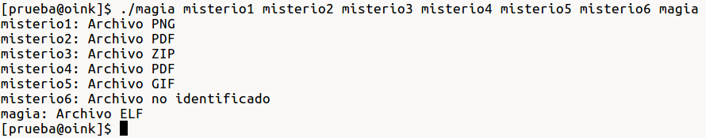
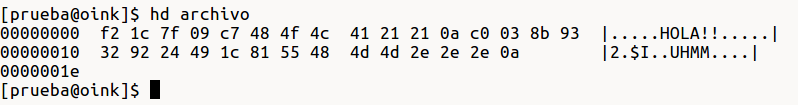
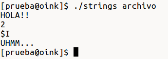
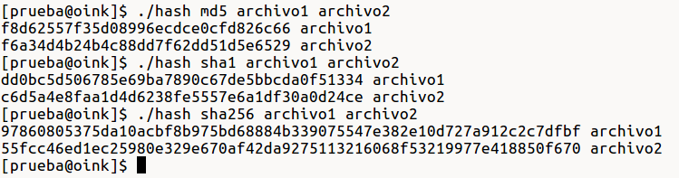
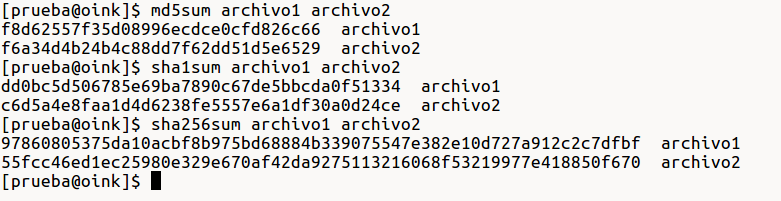

# Práctica 3: Manejo de archivos binarios y captura de paquetes

###Fecha de entrega: 10/Mar/19

## Especificaciones

+ Esta práctica es individual.
+ Debe de realizarse utilizando el lenguaje de programación C.
+ Hacer un archivo `Makefile` para la compilación.
+ Incluir un archivo `README.md` en donde se documente la práctica, con imágenes de ejemplos de ejecución. 
+ Implementar manejo de errores.

## Ejercicios

### 1. file

Implementar un programa que funcione como el comando [`file`](http://man7.org/linux/man-pages/man1/file.1.html), es decir, que reciba como argumentos una lista con nombres de archivos e identifique cuál es el formato de cada uno por medio de los [números mágicos](https://en.wikipedia.org/wiki/List_of_file_signatures). Los formatos a ser identificados son GIF, ELF, PNG, ZIP, PDF, MP3 y EXE.

#### Ejemplo

### 2. strings

Hacer una implementación sencilla del programa [`strings`](https://linux.die.net/man/1/strings), es decir, identificar las cadenas conformadas por caracteres imprimibles consecutivos dentro de un archivo binario, cada cadena puede tener una longitud de uno a N caracteres. Los caracteres imprimibles a ser tomados en cuenta son los que tienen un rango ASCII de 32 a 126 (en decimal). 
 
#### Ejemplo

Tenemos un archivo con el siguiente contenido:

El programa recibiendo este archivo como argumento dará la siguiente salida:

### 3. Hashes

Implementar el cálculo de [hashes](https://latam.kaspersky.com/blog/que-es-un-hash-y-como-funciona/2806/) de tipo MD5, SHA1 y SHA256 utilizando la biblioteca de [openssl](http://theshybulb.com/2015/10/10/use-openssl-c-library.html) para C.

El programa deberá de recibir como argumento una cadena que indique qué tipo de hash se utilizará, seguido de una lista de archivos cuyos hashes serán extraídos.

#### Ejemplo

Comprobar resultados con los comandos `md5sum`, `sha1sum` y `sha256sum`:

### 4. Filtros

Escribir los siguientes filtros para [tcpdump](https://www.tcpdump.org/manpages/pcap-filter.7.html) y [wireshark](https://wiki.wireshark.org/DisplayFilters):

+ Mostrar paquetes que tengan por dirección MAC origen 60:a4:4c:89:3c:a4 o que tengan por dirección MAC destino fc:fb:fb:01:fa:21.
+ Mostrar paqutes cuya dirección MAC ya sea origen o destino comience con 88:53:95.
+ Mostrar paquetes cuyo *ethertype* sea IPv6.
+ Mostrar paqutes que tengan por ethertype a ARP y cuya dirección MAC destino sea ff:ff:ff:ff:ff:ff.
+ Mostrar paquetes cuya dirección IP empieza con 172.

## Ejercicio extra

### e1. Captura Wireshark

Sospechas que una persona no autorizada accedió al sistema de tu empresa, pero sólo tus trabajadores conocen el usuario y contraseña de acceso, por lo que quieres asegurarte de que el personal de tu empresa no haya compartido esta información con personas exteriores, por suerte tienes una [captura de tráfico](media/captura.pcap) que te ayudará a averiguar si algún trabajador le dio a conocer a otra persona esta información confidencial. Contesta las siguientes preguntas:

+ ¿Encontraste algo sospechoso en la captura de tráfico? ¿Si así fue, cuál es la contraseña y usuario que fueron dadas a conocer?
+ ¿Cuáles son las direcciones MAC de los dos equipos que estaban comunicándose?
+ ¿Cuáles son sus direcciones IP?
+ ¿Cuál es el hash MD5 del archivo escondido en la captura?

Describe el procedimiento que llevaste a cabo. 

**Pista:** Vas a necesitar las herramientas que implementaste en los ejercicios anteriores.