# Redes de Computadoras

## Creación de una red con Packet Tracer

Se pide estudiar los siguientes videos sobre los temas que trata la práctica, para su mejor
comprensión y aprendizaje.

- [Creando una red básica con Packet Tracer 📼](https://youtu.be/zixHIQvI79k)
- [Dominios de colisión y dominios de broadcast 📼](https://youtu.be/3lHtbVu2tsM)
- [Funcionamiento e interconexión de switches 📼](https://youtu.be/Y8hm-KdcRxE)
- [Subnetting 📼](https://youtu.be/PGo_hnXwj24)
- [Ejercicio del algoritmo de Estado del enlace 📼](https://youtu.be/eedeO-5j1oI)

### Fecha de entrega

- Domingo 31 de julio de 2021 a las 23:59 hrs.


### Objetivos
-------------
- El alumno aprenderá el uso del software de simulación de redes de computadoras
 Packet Tracer.
- Reforzará el concepto de NAT, DHCP, y DNS al hacer configuraciones para una red
 de una organización.
- Configurará rutas dinámicas en router de diferentes redes interconectadas, a través
del protocolo OSPF.


### Desarrollo
----------------
Para la práctica se usará el software de simulación de redes Packet Tracer en su versión 8.0.1,
 que permite configurar una red de computadoras simulando hardware, protocolos y estándares, tanto
propietarios de la empresa Cisco, como otros de libre acceso.


#### 1. Descargar e instalar Packet Tracer

Descargar el programa *Packet Tracer* del sitio <https://www.netacad.com/es/courses/packet-tracer>, será
necesario crear una cuenta para tal efecto.


#### 2. Configuración de la infraestructura física

1. Crear la infraestructura mostrada a continuación:

    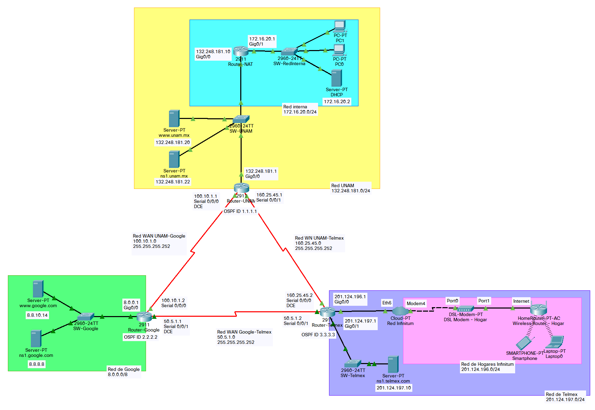

2. Agregar la tarjeta de red inalámbrica *PT-LAPTOP-NM-1W* a *Laptop0* ubicada en la *Red de Telmex*.

   Dar clic encima de la Laptop, abrir la pestaña *Physical*, apagar la Laptop dando clic en el botón
   de I/O, arrastrar la interfaz de red que tiene instalada hacia una zona en blanco de la columna de
   la izquierda en donde se encuentra listado el hardware disponible.

    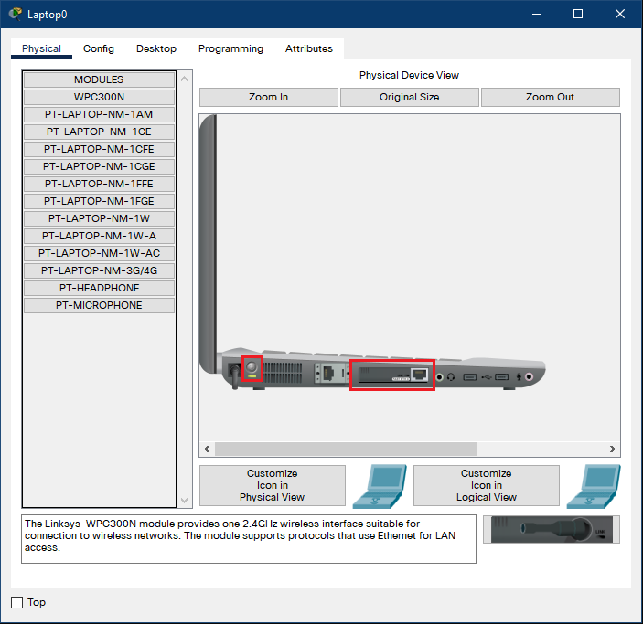

   Seleccionar la tarjeta de red inalámbrica *PT-LAPTOP-NM-1W*, y arrastrarla hasta colocarla en el espacio
   vacio, en donde previamente se encontraba la otra interfaz de red instalada.
   
    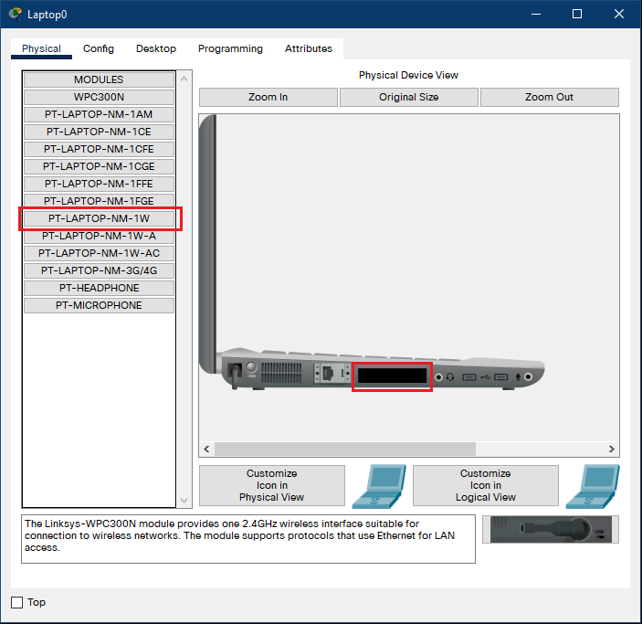

   Encender la Laptop dando clic en el botón de I/O

    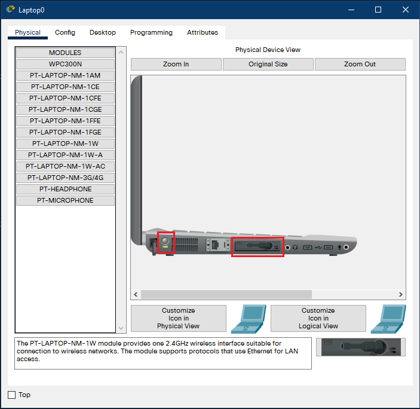


3. Configurar el servicio *Cloud-PT Red Infinitum*

   Generalmente los hogares contratan los servicios de internet con un ISP que provee de la infraestructura 
   necesaria para lograr la conexión. Además de los dispositivos de red, en las instalaciones del ISP se suelen
   tener equipos de telecomunicaciones que permiten la comunicación entre medios analógicos y digitales. En 
   esta práctica se está simulando todos estos equipos de las instalaciones del ISP con un elemento llamado 
   *Cloud-PT*, para la *Red de Hogares Infinitum*, por lo que será necesario hacer una configuración mínima.

   Dar clic encima de *Cloud-PT Red Infinitum*, abrir la pestaña *Config*, y seleccionar en el menú izquierdo la
   conexión *DSL*, y verificar que se encuentren la conexión *Modem4 <-> Ethernet6*.

    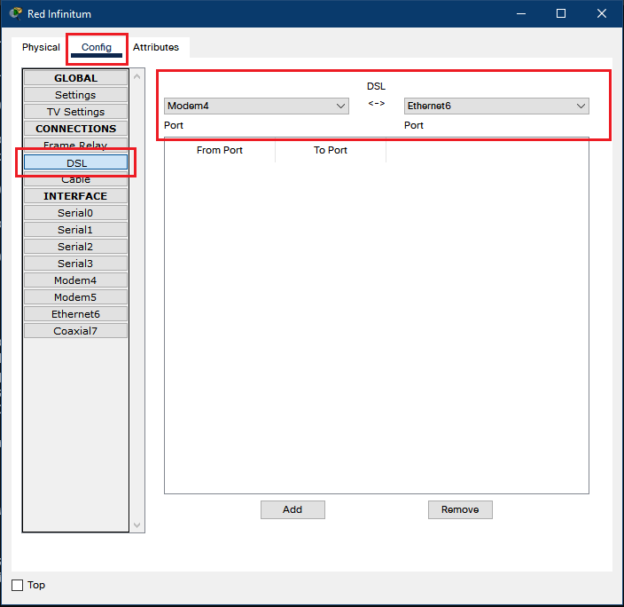

   Ahora, dar clic en el botón *Add* y verificar que se haya agregado correctamente la conexión.

    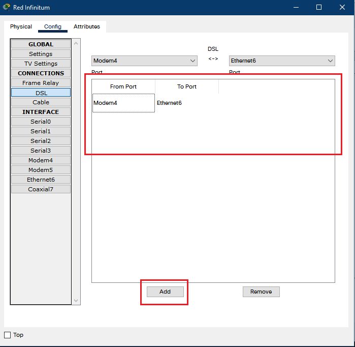


4. Agregar una tarjeta de red serial *HWIC-2T* a cada uno de los router *Router-UNAM*,
 *Router-Google* y *Router-Telmex*.

   Es importante tener en cuenta que los tres router mencionados se conectarán entre sí usando una interfaz serial, 
   dejando dos posibilidades, que sean de tipo *DTE* o *DCE*. En el figura en donde se muestra la infraestructura
   se indica con una etiqueta el tipo de cable que se deberá de usar para cada caso. La diferencia principal entre los
   dos tipos consiste en que los *DCE* envían una señal de reloj para sincronizar las comunicaciones entre los dos
   dispositivos conectados entre sí.

   Dar clic encima del router, abrir la pestaña *Physical*, apagarlo dando clic en el botón
   de I/O. Seleccionar la tarjeta serial *HWIC-2T*, y arrastrarla hasta colocarla en el espacio
   vacio del extremo derecho. Encender el router.


    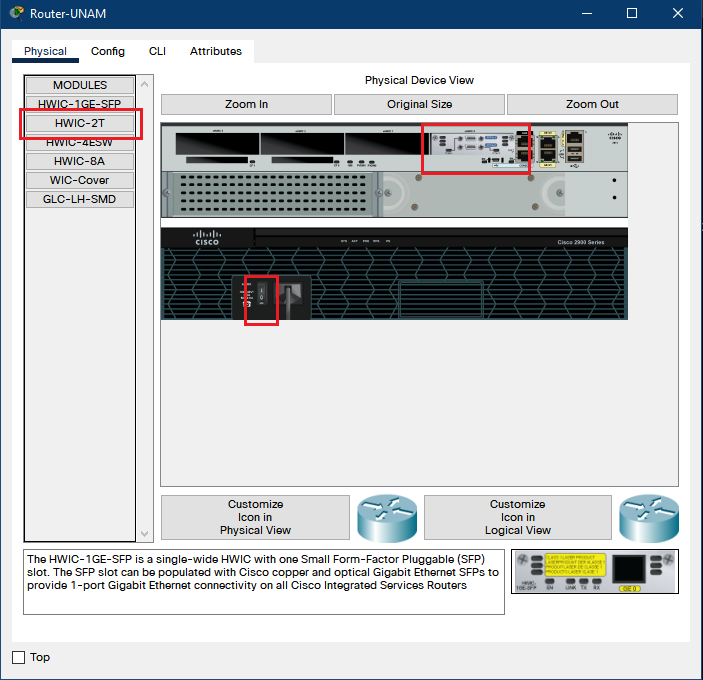


#### Configuración de IP en equipos de la Red de Google

1. Configurar las direcciones IP de cada equipo de la *Red de Google*, de acuerdo a la siguiente tabla:

   | Dispositivo | Nombre         | IP        | Netmask   | Gateway | DNS     |
   |:-----------:|:--------------:|:---------:|:---------:|:-------:|:-------:|
   | Server-PT   | www.google.com | 8.8.10.14 | 255.0.0.0 | 8.0.0.1 | 8.8.8.8 |
   | Server-PT   | ns1.google.com | 8.8.8.8   | 255.0.0.0 | 8.0.0.1 | --      |

   Dar clic encima del servidor, abrir la pestaña *Config* e introducir los parámetros indicados.

    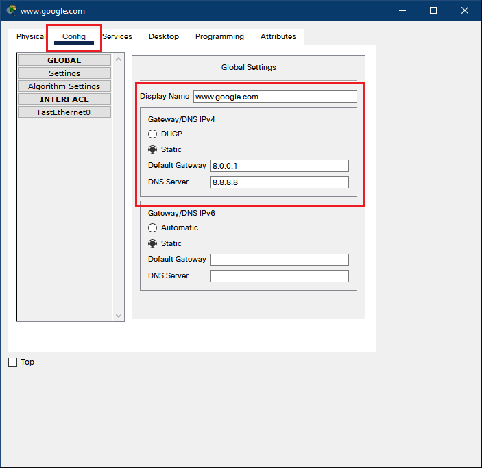

   En la misma pestaña *Config*, seleccionar en el menú izquierdo la interfaz de red *FastEthernet0*,
   y configurar los parámetros indicados.

    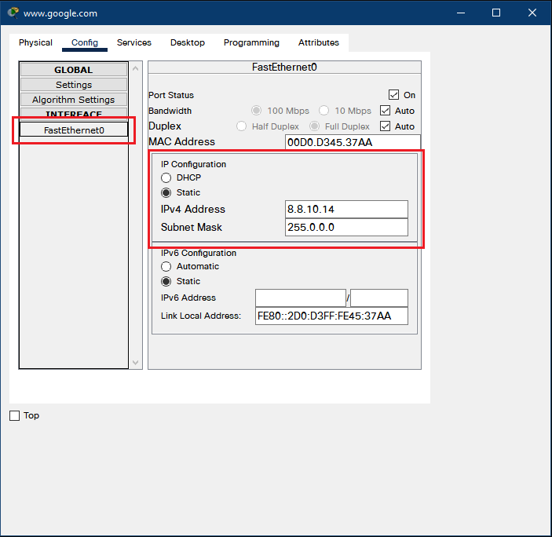

   Repetir el procedimiento para el resto de equipos indicados en la tabla.

2. Configurar las direcciones IP en el *Router-Google*, de acuerdo a la siguiente tabla:

   | Dispositivo   | Nombre         | Interfaz            | Tipo  | IP         | Netmask         |
   |:-------------:|:--------------:|:-------------------:|:-----:|:----------:|:---------------:|
   | Router-Google | R-Google       | GigabitEthernet 0/0 | --    | 8.0.0.1    | 255.0.0.0       |
   |               |                | Serial 0/0/0        | DTE   | 100.10.1.2 | 255.255.255.252 |
   |               |                | Serial 0/0/1        | DCE   | 50.5.1.1   | 255.255.255.252 |


   Dar clic encima del router a configurar, abrir la pestaña *CLI* que quiere decir *Command Line Interface*,
   e introducir los siguientes comandos,

   Ingresar al modo de *EXEC Privileged* o modo de Ejecución privilegiada.
   ```
   Router>en
   ```
 
   Ahora, ingresar al modo de *Global Configuration* o modo de Configuración Global. Cada vez que se vaya a realizar
   alguna configuración, habrá que entrar a este modo,
   ```
   Router#configure terminal
   ```

   Configurar la interfaz de red *GigabitEthernet 0/0*. Primero, entrar al modo configuración de la interfaz,
   ```
   R-Google(config)#interface GigabitEthernet 0/0
   ```

   Después, asignar la dirección IP y netmask o máscara de red, a dicha interfaz
   ```
   R-Google(config-if)#ip address 8.0.0.1 255.0.0.0
   ```

   En los sistemas operativos de Cisco, las interfaces de red a las que se les puede asignar una dirección IP están
   apagadas o administrativamente apagadas, por lo que hay proceder a prenderlas,
   ```
   R-Google(config-if)#no shutdown
   ```

   Por último, habrá que salir del modo de configuración de la interfaz para poder seguir con las configuraciones de las
   otras interfaces de red.
   ```
   R-Google(config-if)#exit
   ```

   De forma similar, configurar los parámetros de red en la interfaz *Serial 0/0/0*, que es de tipo DTE, 
   ```
   R-Google(config)#interface Serial 0/0/0
   R-Google(config-if)#ip address 100.10.1.2 255.255.255.252
   R-Google(config-if)#no shutdown
   R-Google(config-if)#exit
   ```

   Para la interfaz *Serial 0/0/1* que es de tipo *DCE*, se deberán de agregar algunos otros comandos. Primero, 
   configurar los parámetros de red, y además, prender la interfaz,
   ```
   R-Google(config)#interface Serial 0/0/1
   R-Google(config-if)#ip address 50.5.1.1 255.255.255.252
   R-Google(config-if)#no shutdown
   ```
  
   Después, y debido a que es una interfaz *DCE*, es decir, que esta interfaz enviará la señal de reloj para la 
   sincronización de la comunicación a nivel de capa física, es necesario indicar éstos parámetros,
   ```
   R-Google(config-if)#clock rate 64000
   R-Google(config-if)#bandwidth 64
   ```

   Por último, habrá que salir del modo de configuración de la interfaz,
   ```
   R-Google(config-if)#exit
   ``` 
  
   Siempre que terminemos una configuración y después de que probemos su funcionamiento, es muy importante **guardar**
   dicha configuración en la memoria no volátil del equipo, con este comando,
   ```
   R-Google#copy running-config startup-config 
   ```
   
3. Verificar la conectividad entre los equipos que están en la red local, o LAN, de Red de Google.

   Una vez terminada la configuración de los parámetros de red, y para probar su correcto funcionamiento de forma
   sencilla, ejecutar el comando `ping` desde un equipo hacia los otros equipos.

 
   | Origen         | Destino        | IP destino |
   |:--------------:|:--------------:|:----------:|
   | www.google.com | ns1.google.com | 8.8.8.8    |
   |                | Router-Google  | 8.0.0.1    |
   | ns1.google.com | www.google.com | 8.8.10.14  |
   |                | Router-Google  | 8.0.0.1    |
   | Router-Google  | www.google.com | 8.8.10.14  |
   |                | ns1.google.com | 8.8.8.8    |

   Por ejemplo desde el servidor web *www.google.com*. Dar clic encima del servidor, abrir la pestaña de *Desktop*,
   y enseguida dar clic sobre la aplicación *Command Prompt*.
 
    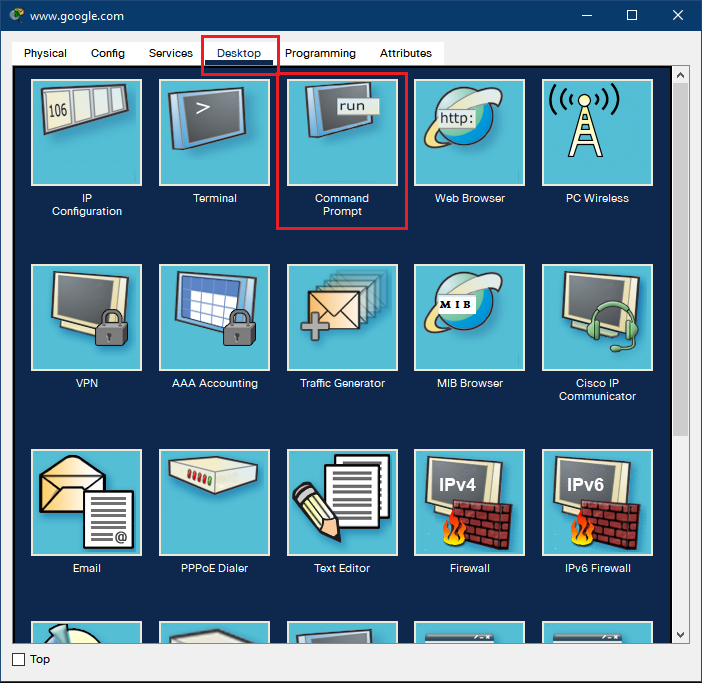

   Ya en la terminal, ejecutar el comando `ping` junto con las IP destino para probar la conectividad.

    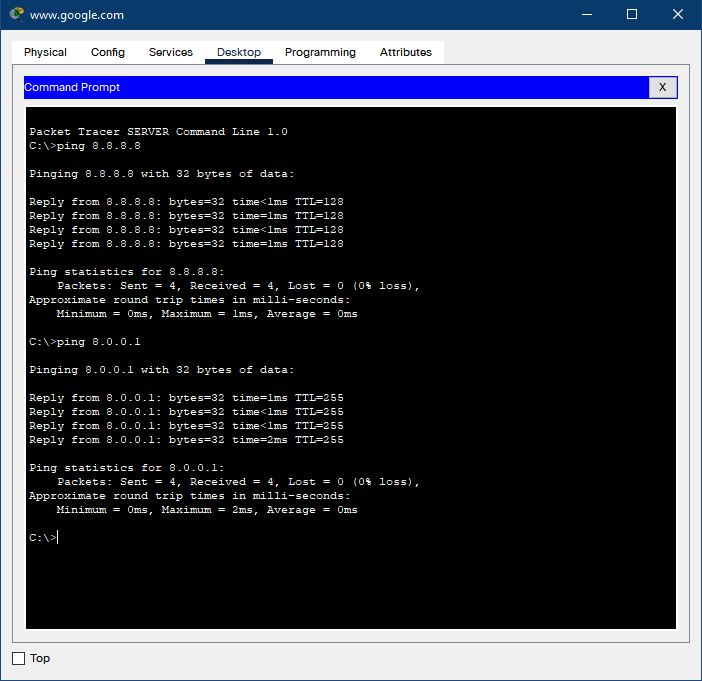

   O también por ejemplo, desde el *Router-Google*, en el modo de *EXEC Privileged*, ejecutar el comando
   ```
   R-Google#ping 8.8.10.14
   ```
  
    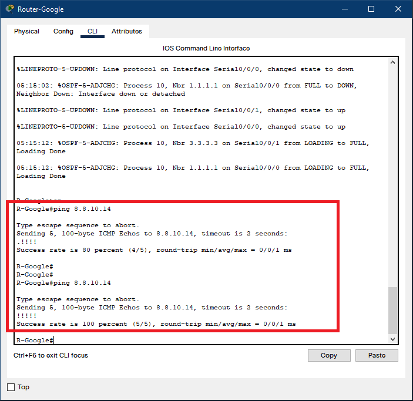

#### Configuración de IP en equipos de la Red de Telmex

1. Configurar las direcciones IP de cada equipo de la *Red de Telmex*, tal como se hizo en la *Red de Google*,
   de acuerdo a la siguiente tabla:

   | Dispositivo | Nombre         | IP             | Netmask       | Gateway       | DNS     |
   |:-----------:|:--------------:|:--------------:|:-------------:|:-------------:|:-------:|
   | Server-PT   | ns1.telmex.com | 201.124.197.10 | 255.255.255.0 | 201.124.197.1 | --      |


2. Configurar las direcciones IP en el *Router-Telmex* tal como se hizo en el *Router-Google*,
   de acuerdo a la siguiente tabla:

   | Dispositivo   | Nombre         | Interfaz            | Tipo  | IP            | Netmask         |
   |:-------------:|:--------------:|:-------------------:|:-----:|:-------------:|:---------------:|
   | Router-Telmex | R-Telmex       | GigabitEthernet 0/0 | --    | 201.124.196.1 | 255.255.255.0   |
   |               |                | GigabitEthernet 0/1 | --    | 201.124.197.1 | 255.255.255.0   |
   |               |                | Serial 0/0/0        | DCE   | 160.25.45.2   | 255.255.255.252 |
   |               |                | Serial 0/0/1        | DTE   | 50.5.1.2      | 255.255.255.252 |


3. Configurar el *Wireless Router - Hogar* que da servicio de WiFi en una red de hogar.

   Dar clic encima del *Wireless Router - Hogar* y abrir la pestaña de *GUI*. Después dirigirse al menú
   *Setup* y *Basic Setup*. En la sección  *Internet Setup* del menú izquierdo, seleccionar la opción 
   *Static IP* y configurar el resto de los parámetros de acuerdo a la siguiente tabla, 

   | Internet IP Address | Subnet Mask   | Default Gateway | DNS 1          |
   |:-------------------:|:-------------:|:---------------:|:--------------:| 
   | 201.124.196.153     | 255.255.255.0 | 201.124.196.1   | 201.124.197.10 |


    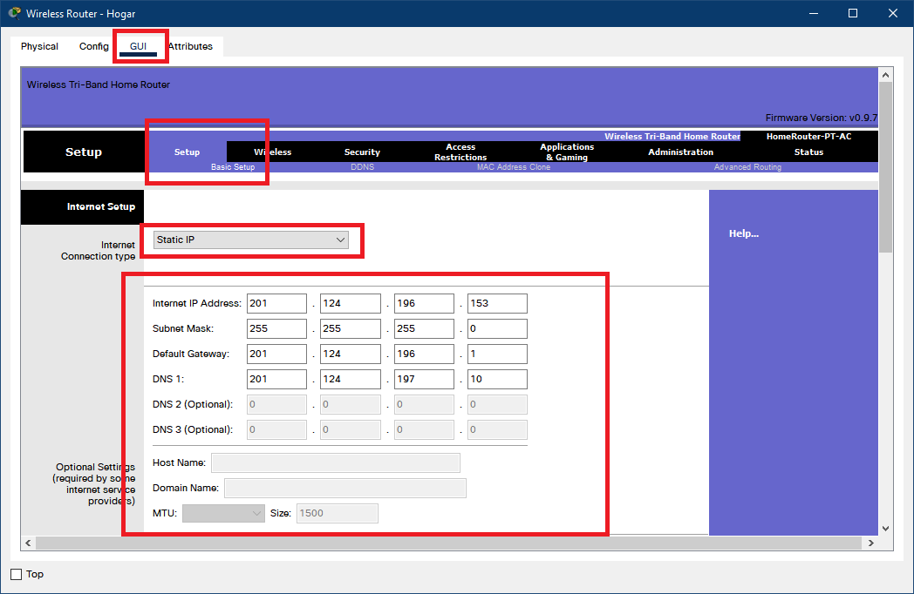

   Configurar la sección *Network Setup* del menú izquierdo, con los siguientes parámetros de red,    

   | IP Address  | Subnet Mask   | DHCP Server | Start IP Address | Maximum number of Users |
   |:-----------:|:-------------:|:-----------:|:----------------:|:-----------------------:|
   | 192.168.0.1 | 255.255.255.0 | Enabled     | 192.168.0.3      | 20                      |

   
    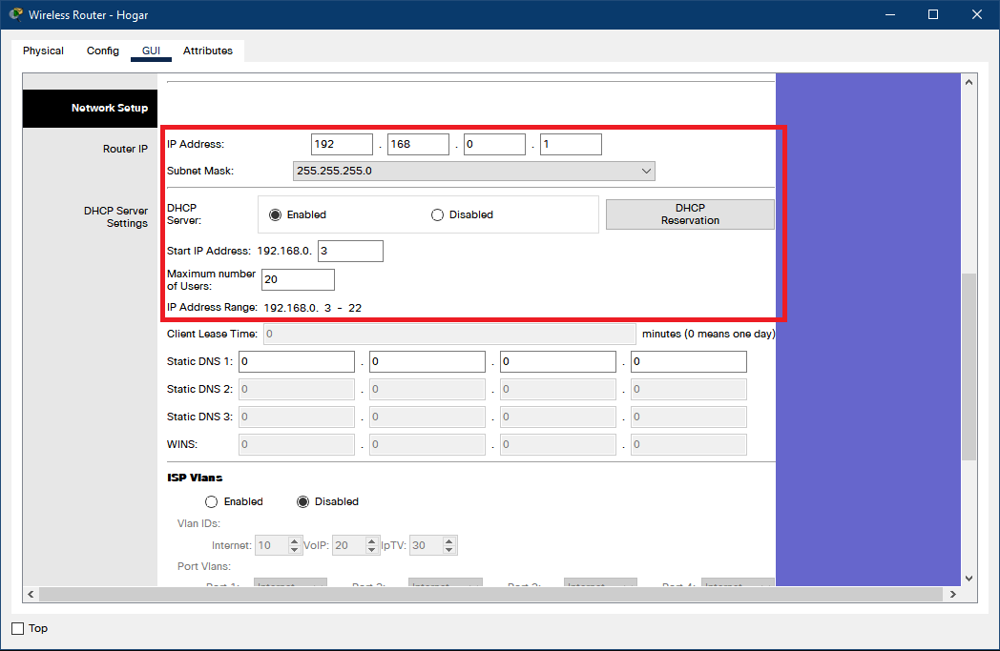

   Dar clic en el botón **Save Settings** que se encuentra la parte inferior, para guardar la configuración.

   Configurar el SSID de la red inalámbrica al nombre de *Infinitum5678* en el menú *Wireless* y 
   *Basic Wireless Settings*. No olvidar dar clic en el botón **Save Settings** para guardar la configuración.

    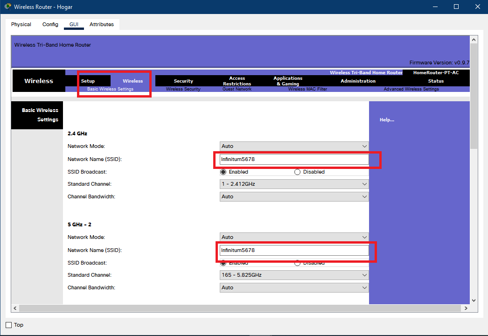

4. Configurar los dispositivos inalámbricos
  
   Ahora que ya se cuenta con una red inalámbrica, conectar tanto la *Laptop0* como el *Smartphone* a dicha red.
   Dar clic encima del *Smartphone*, abrir la pestaña *Config*, seleccionar del menú izquierdo la interfaz *Wireless0*
   y en el parámetro de *SSID* colocar el nombre de la red WiFi configurada en el paso anterior. Y verificar que se 
   recibió una dirección IP por parte del *Wireless Router*.

    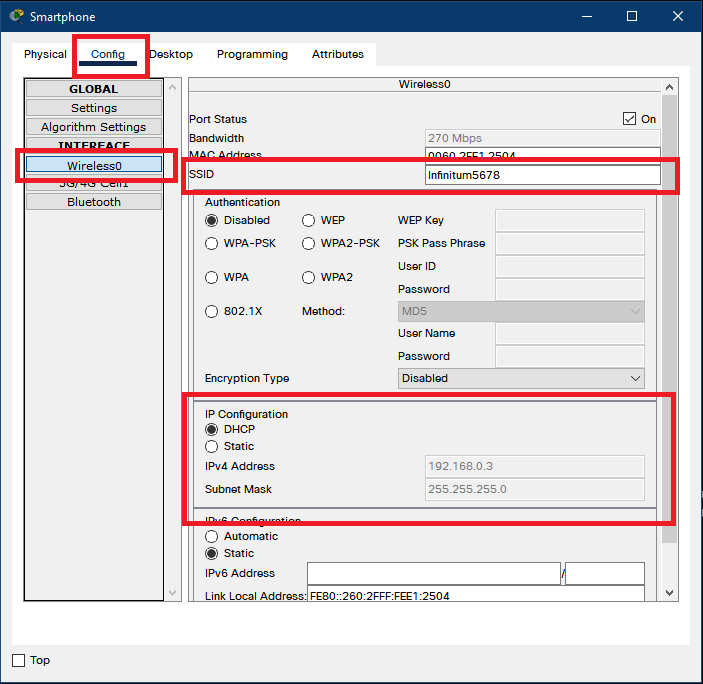

   Repetir el procedimiento en la *Laptop0*.


5. Verificar la conectividad entre los equipos que están en la red local, o LAN, de Red de Telmex.

   Una vez terminada la configuración de los parámetros de red, y para probar su correcto funcionamiento de forma
   sencilla, ejecutar el comando `ping` desde un equipo hacia los otros equipos.

 
   | Origen         | Destino        | IP destino     |
   |:--------------:|:--------------:|:--------------:|
   | ns1.telmex.com | Router-Telmex  | 201.124.197.1  |
   |                | Router-Telmex  | 201.124.196.1  |
   | Router-Telmex  | ns1.telmex.com | 201.124.197.10 |
   | Smartphone     | ns1.telmex.com | 201.124.197.10 |
   |                | Router-Telmex  | 201.124.196.1  |
   | Laptop0        | ns1.telmex.com | 201.124.197.10 |
   |                | Router-Telmex  | 201.124.196.1  |
  

#### Configuración de IP en equipos de la Red UNAM

1. Configurar las direcciones IP de cada equipo de la *Red UNAM*, tal como se hizo en la *Red de Google* de acuerdo a la siguiente tabla:

   | Dispositivo | Nombre         | IP             | Netmask       | Gateway       | DNS             |
   |:-----------:|:--------------:|:--------------:|:-------------:|:-------------:|:---------------:|
   | Server-PT   | www.unam.mx    | 132.248.181.20 | 255.255.255.0 | 132.248.181.1 | 132.248.181.22  |
   | Server-PT   | ns1.unam.mx    | 132.248.181.22 | 255.255.255.0 | 132.248.181.1 | --              |
   | Server-PT   | DHCP           | 172.16.20.2    | 255.255.255.0 | 172.16.20.1   | 132.248.181.22  |

2. Configurar las direcciones IP en el *Router-Telmex* y en el *Router-NAT* tal como se hizo en el *Router-Google*,
   de acuerdo a la siguiente tabla:

   | Dispositivo   | Nombre         | Interfaz            | Tipo  | IP             | Netmask         |
   |:-------------:|:--------------:|:-------------------:|:-----:|:--------------:|:---------------:|
   | Router-UNAM   | R-UNAM         | GigabitEthernet 0/0 | --    | 132.248.181.1  | 255.255.255.0   |
   |               |                | Serial 0/0/0        | DCE   | 100.10.1.1     | 255.255.255.252 |
   |               |                | Serial 0/0/1        | DTE   | 160.25.45.1    | 255.255.255.252 |
   | Router-NAT    | NAT            | GigabitEthernet 0/0 | --    | 132.248.181.10 | 255.255.255.0   |
   |               |                | GigabitEthernet 0/1 | --    | 172.16.20.1    | 255.255.255.0   |


4. Configuración del servidor de *DHCP*

   Configurar el servicio de DHCP del servidor, de acuerdo a los siguientes parámetros,

   | Default Gateway  | DNS Server      | Start IP Address | Subnet Mask   | Max. Number of Users |
   |:----------------:|:---------------:|:----------------:|:-------------:|:--------------------:|
   | 172.16.20.1      | 132.248.181.22  | 172.16.20.3      | 255.255.255.0 | 56                   |

   Dar clic encima del servidor *DHCP*, abrir la pestaña de *Services*, seleccionar el servicio de HTTP 
   del menú izquierdo, y deshabilitar dicho servidor colocando la opción tanto de *HTTP* como de *HTTPS*
   en *Off*.

    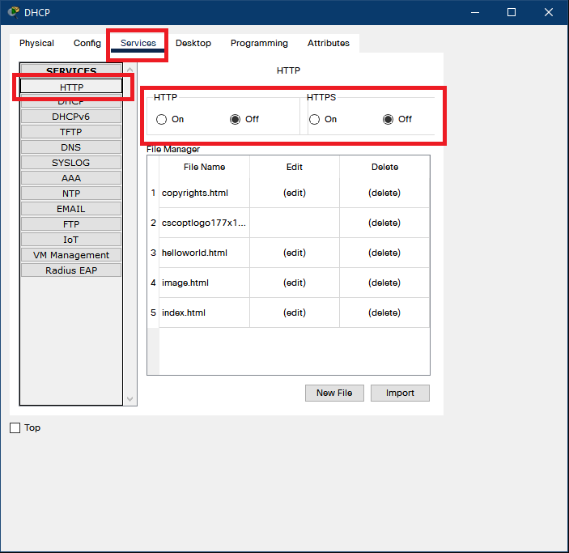

   Ahora, selecccionar el servicio de *DHCP* del menú izquierdo, habilitar el servicio colocando la opción
   del parámetro *Service* en *On*, y completar el resto de parámetros de acuerdo a la tabla anterior.
   Al terminar, dar clic en el botón *Add*.

    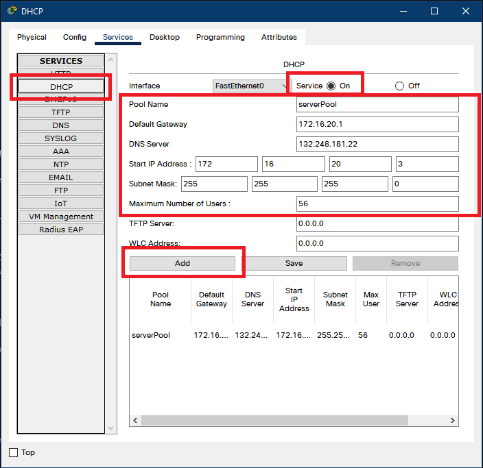


5. Configuración de *NAT* para la Red interna UNAM

   Desde el modo de Configuración global, en el *Router-NAT*, introducir los siguientes comandos para configurar
   NAT. Éste hará la traducción de las direcciones IP de los mensajes de los equipos que pertenecen a la 
   Red Interna UNAM.
   
   Indicar cuál es la interfaz de red conectada a la red de direcciones IP públicas.
   ```
   NAT(config)#interface GigabitEthernet 0/0
   NAT(config-if)#ip nat outside 
   NAT(config-if)#exit
   ```

   Indicar cuál es la interfaz de red conectada a la red de direcciones IP privadas.
   ```
   NAT(config)#interface GigabitEthernet 0/1
   NAT(config-if)#ip nat inside 
   NAT(config-if)#exit
   ```

   Configurar una Lista de control de acceso o *ACL* para permitir el tránsito de los mensajes de la Red Interna, e indicar
   en qué interfaz se llevará a cabo la traducción de las IP.
   ```
   NAT(config)#access-list 1 permit 172.16.20.0 0.0.0.255
   NAT(config)#ip nat inside source list 1 interface GigabitEthernet 0/0 overload
   ```

   Configurar una ruta estática de default indicando cuál es el *Gateway*
   ``` 
   NAT(config)#ip route 0.0.0.0 0.0.0.0 132.248.181.1
   ```

   **Guardar** la configuración realizada.


6. Verificar la conectividad entre los equipos que están en la red local, o LAN, de Red UNAM.

   Una vez terminada la configuración de los parámetros de red, y para probar su correcto funcionamiento de forma
   sencilla, ejecutar el comando `ping` desde un equipo hacia los otros equipos.

 
   | Origen         | Destino        | IP destino     |
   |:--------------:|:--------------:|:--------------:|
   | PC0            | DHCP           | 172.16.20.2    |
   |                | Router-NAT     | 172.16.20.1    |
   |                | Router-UNAM    | 132.248.181.1  |
   |                | ns1.unam.mx    | 132.248.181.22 |
   |                | www.unam.mx    | 132.248.181.20 |
   | Router-NAT     | Router-UNAM    | 132.248.181.1  |
   |                | ns1.unam.mx    | 132.248.181.22 |
   |                | www.unam.mx    | 132.248.181.20 |
  


#### Configuración de los servidores DNS

1. Para cada una de las redes, *Red UNAM*, *Red de Google* y *Red de Telmex*,
   se tiene un servidor de DNS, el cuál es necesario configurar con los registros
   de las siguientes tablas.

   Tabla de registros de tipo A
   | Server         | Name            | Type | Address        |
   |:--------------:|:---------------:|:----:|:--------------:| 
   | ns1.google.com | ns1.telmex.com  | A    | 201.124.197.10 |
   |                | ns1.unam.mx     | A	  | 132.248.181.22 |
   |                | www.google.com  | A    | 8.8.10.14      |
   | ns1.telmex.com | ns1.google.com  | A    | 8.8.8.8        |
   |                | ns1.unam.mx     | A    | 132.248.181.22 |
   | ns1.unam.mx    | ns1.google.com  | A    | 8.8.8.8        |
   |                | ns1.telmex.com  | A    | 201.124.197.10 |
   |                | www.unam.mx     | A    | 132.248.181.20 |

   Tabla de registros de tipo NS
   | Server         | Name            | Type | Server Name        |
   |:--------------:|:---------------:|:----:|:--------------:| 
   | ns1.google.com | telmex.com      | NS   | ns1.telmex.com |
   |                | unam.mx         | NS	  | ns1.unam.mx    |
   | ns1.telmex.com | google.com      | NS   | ns1.google.com |
   |                | unam.mx         | NS   | ns1.unam.mx    |
   | ns1.unam.mx    | google.com      | NS   | ns1.google.com |
   |                | telmex.com      | NS   | ns1.telmex.com |


   Tabla de registros de tipo SOA
   | Server         | Name            | Type | Primary Server Name | Mail Box        | Refresh Time | Retry Time | Expiry Time |
   |:--------------:|:---------------:|:----:|:-------------------:|:---------------:|:------------:|:----------:|:-----------:| 
   | ns1.google.com | google.com      | SOA  | ns1.google.com      | mail.google.com | 9527         | 7200       | 86400       |
   | ns1.telmex.com | telmex.com      | SOA  | ns1.telmex.com      | mail.telmex.com | 9527         | 7200       | 86400       |
   | ns1.unam.mx    | unam.mx         | SOA  | ns1.unam.mx         | mail.unam.mx    | 9527         | 7200       | 86400       |

   Configurar el servidor *ns1.google.com* de la *Red de Google*. Dar clic encima
   del servidor, abrir la pestaña *Services*. Deshabilitar el servicio de *HTTP* y
   *HTTPS* de la misma forma en cómo se hizo al configurar el servidor de DHCP de la 
   *Red UNAM*.

   Seleccionar del menú izquierdo el servicio de *DNS*. Habilitar el servicio DNS, marcando
   la opción *On* del parámetro *DNS Service*. Ir agregando los registros de acuerdo
   a las tablas, no olvidar dar clic en el botón *Add* cuando se termine de configurar 
   cada registro para que agregue.

   
    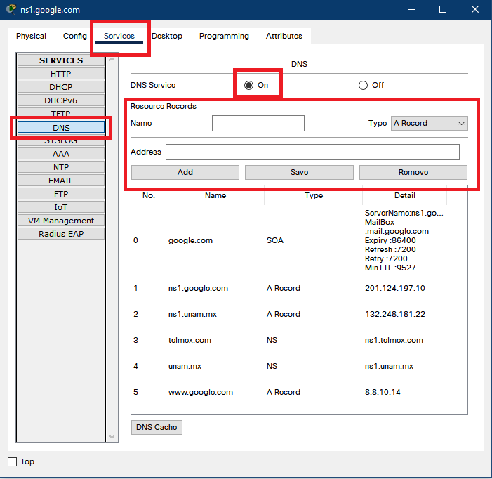
  
   Repetir el procedimiento con los otros dos servidores *DNS*. 


#### Configuración de los servidores Web

1. En la *Red UNAM* y *Red de Google*, configurar los servidores Web. Dar clic encima del servidor
   *www.google.com*, abrir la pestaña de *Services*, y seleccionar del menú izquierdo el servicio
   de *HTTP*. Verificar que tanto *HTTP* como *HTTPS* estén en *On*. Seleccionar el archivo *index.html*
   y dar clic en la opción de *(edit)*.

    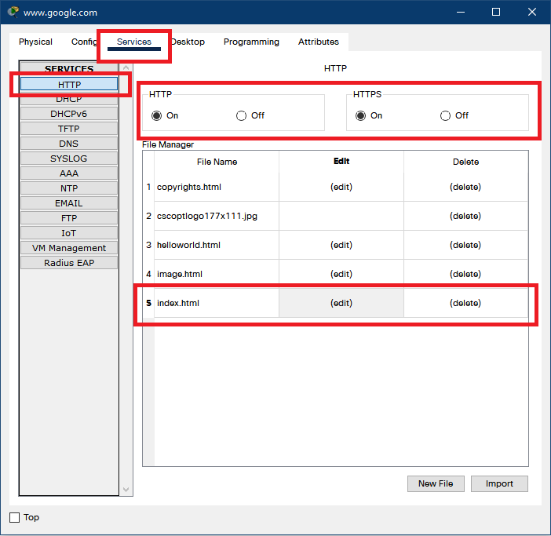

   Modificar el archivo html para que muestre el texto *www.google.com* cuando se solicite la página web.

    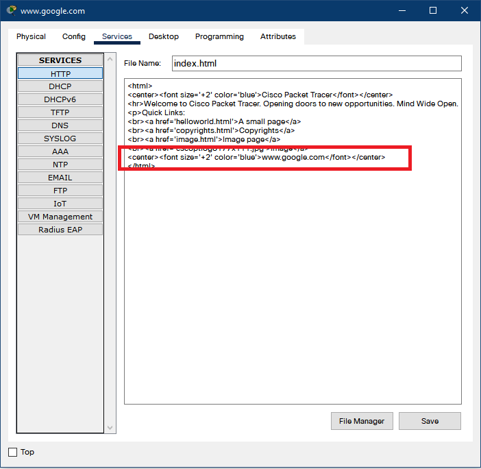


#### Configuración de las rutas dinámicas en los router

En esta infraestructura se tienen tres redes distintas conectadas físicamente entre sí a través de los routers que
se encuentran en el perímetro, para que haya comunicación entre los equipos de una red con los equipos de otra es
 necesario configurar un protocolo de ruteo, éste permitirá que los router decidan por dónde enviarán los mensajes
 que vayan dirigidos a un equipo que no esté dentro de su red.

1. Asignar a cada router un ID, esto es necesario para poder usar el protocolo OSPF.

   | Router        | OSPF ID |
   |:-------------:|:-------:|
   | Router-UNAM   | 1.1.1.1 |
   | Router-Google | 2.2.2.2 |
   | Router-Telmex | 3.3.3.3 |

2. Desde la consola de comando o CLI del *Router-Google* introducir estos comandos.

   Primero se indica que se usará como protocolo de ruteo a OSPF, con un *process-id*, se usará el mismo en los tres
   router
   ```
   R-Google(config)#router ospf 10
   ```

   Después, configurar el ID de ese router, para este caso el ID será *2.2.2.2*
   ```
   R-Google(config-router)#router-id 2.2.2.2
   ```

   Ahora, indicar cuáles de las redes están directamente conectadas a este router, es decir, cuáles son los segmentos de 
   red conectados a cualquiera de sus interfaces. Además, hay que definir en qué área de OSPF se encuentra, en todos los
   router se usará la misma *area 0*. Después del comando `network` se introduce la dirección IP del segmento de red, que es una IP
   que se usa como identificador de la red, y corresponde a la primera dirección IP de ese segmento o conjunto de direcciones
    IP. Enseguida hay que introducir la *Netmask* o máscara de red, pero en formato de *Wildcard*, una forma de calcularla es
   restando la *Netmask* al valor 255.255.255.255, por ejemplo *255.255.255.255 - 255.255.255.252 = 0.0.0.3*.
   ```
   R-Google(config-router)#network 100.10.1.0 0.0.0.3 area 0
   R-Google(config-router)#network 50.5.1.0 0.0.0.3 area 0
   R-Google(config-router)#network 8.0.0.0 0.255.255.255 area 0
   ```

   Por último, indicar en cuál interfaz de red no es necesario que el router lleve a cabo acciones de ruteo, para todos los 
   tres router, corresponderá a la interfaz de red que está conectada a la red interna. De esta forma se cuida el
   mejor rendimiento del procesamiento del router.
   ```
   R-Google(config-router)#passive-interface GigabitEthernet 0/0
   ```

   Y salir del modo de configuración del protocolo de ruteo OSPF.
   ```
   R-Google(config-router)#exit
   ```

   **Guardar** la configuración realizada.


#### Verificar las conexiones

Para verificar que la configuración funcione correctamente, se harán las siguientes pruebas que se deberán de anexar
al reporte.

1. Desde la *PC0* o *PC1* de la *Red UNAM*, abrir las páginas web *www.unam.mx* y *www.google.com*
2. Desde el *smartphone* o la *Laptop0* de la *Red de Hogares Infinitum*, abrir las páginas web *www.unam.mx* y *www.google.com*

    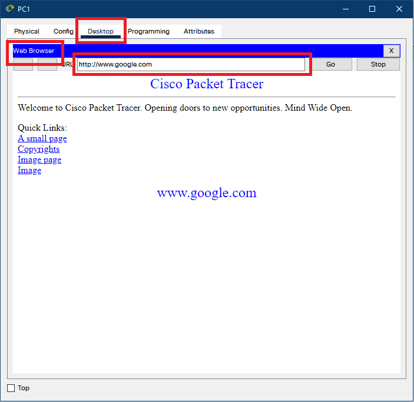
    
    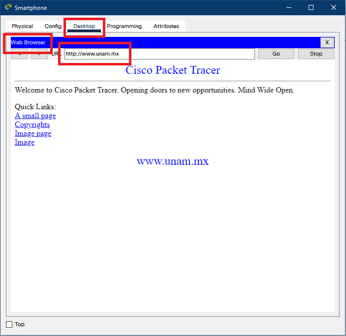


### Cuestionario
----------------

1.  Analice la nota *Egipto desaparece del mapa de Internet*, que puede leer en este enlace
    <https://elpais.com/internacional/2011/01/28/actualidad/1296169207_850215.html>, y
    emita un comentario al respecto.

### Notas adicionales
---------------------

-   Redacte un reporte por equipo, en el que consigne los
    pasos que considere necesarios para explicar cómo realizó la
    práctica, incluya capturas de pantalla que justifiquen su trabajo.

-   Incluya en su reporte tanto las respuestas del Cuestionario, como un
    apartado de conclusiones referentes al trabajo realizado.

-   Por cada uno de los cuatro router, cree un archivo de texto que contenga 
    la configuración del router en cuestión. El nombre de cada archivo corresponderá
    al nombre del router, a saber, *NAT*, *Router-UNAM*, *Router-Google* y 
    *Router-Telmex*. La configuración que pegará en cada archivo de texto la puede
    obtener del router al ejecutar el comando `show startup-config`, recuerde que 
    previamente se tuvo que haber guardado las configuraciones con el comando 
    `copy running-config startup-config`.
    Cree un directorio llamado *config*, y dentro de éste ubique los archivo de 
    texto solicitados.

-   Puede agregar posibles errores, complicaciones, opiniones, críticas
    de la práctica o del laboratorio, o cualquier comentario relativo a
    la misma.

-   Además, incluya en su entrega el archivo de Packet Tracer *.pkt* con
    su trabajo realizado.

-   Entregue su reporte de acuerdo a la forma de entrega de tareas y
    prácticas definida al inicio del curso,
    <https://redes-ciencias-unam.gitlab.io/2021-2/tareas-redes/workflow/>.

