# Práctica 4: DHCP

### Fecha de entrega: 11/Mar/19

## Especificaciones

+ Esta práctica es individual.
+ Documentar práctica en un archivo `README.md` con capturas de pantalla de los pasos seguidos.
+ Para esta práctica se utilizó VMware, se puede utilizar cualquier software de virtualización pero se debe de investigar cómo hacer las configuraciones mostradas.

### Creación de red virtual

En la barra navegadora seleccionar `Edit -> Virtual Network Editor`

 

Añadir una nueva red con `Add Network...`

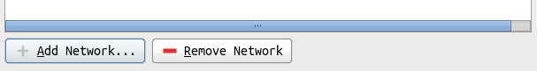 

Crear una red virtual de tipo NAT.

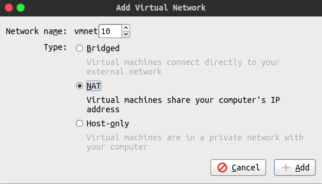

Deseleccionar casilla que indica que se utilice un servicio local de `DHCP` y asignar una subred.

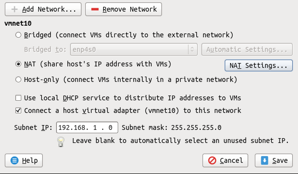

### Configuración de adaptador de red

Crear máquina virtual con `Debian 9`, apagarla y en la barra navegadora entrar a las preferencias de la máquina con `VM -> Settings`, en `Network Adapter -> Network Connection` seleccionar `Custom` con la red virtual que creamos.

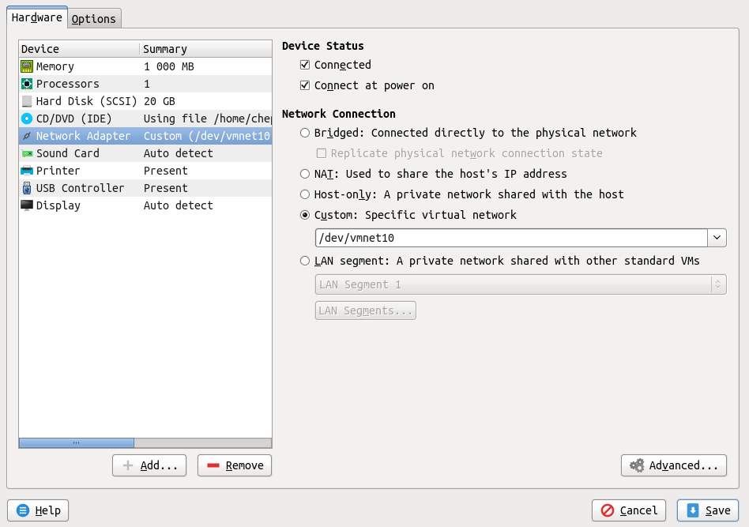
 
### Configuración de interfaz de red

Prender máquina y verificar nombre de interfaz de red con el comando `ip a`

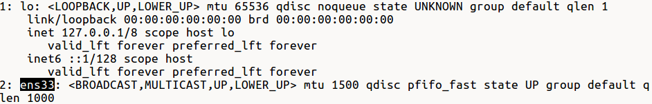

Asignar dirección IP de manera estática a interfaz en archivo `/etc/network/interfaces`:

```
auto ens33
iface ens33 inet static
        address 192.168.1.3
        netmask 255.255.255.0
        gateway 192.168.1.2
```

Reiniciar servicio de red

```
root@dhcp:~# systemctl restart networking
```

Verificar que la interfaz de red tiene la dirección IP asignada

```
root@dhcp:~# ip a
1: lo: <LOOPBACK,UP,LOWER_UP> mtu 65536 qdisc noqueue state UNKNOWN group default qlen 1
    link/loopback 00:00:00:00:00:00 brd 00:00:00:00:00:00
    inet 127.0.0.1/8 scope host lo
       valid_lft forever preferred_lft forever
    inet6 ::1/128 scope host 
       valid_lft forever preferred_lft forever
2: ens33: <BROADCAST,MULTICAST,UP,LOWER_UP> mtu 1500 qdisc pfifo_fast state UP group default qlen 1000
    link/ether 00:0c:29:a2:5a:77 brd ff:ff:ff:ff:ff:ff
    inet 192.168.1.3/24 brd 192.168.1.255 scope global ens33
       valid_lft forever preferred_lft forever
    inet6 fe80::20c:29ff:fea2:5a77/64 scope link 
       valid_lft forever preferred_lft forever
```

Agregar la siguiente línea a archivo `/etc/resolv.conf` (esto permitira hacer búsquedas de `DNS`):

```
nameserver 192.168.1.2
```

Verificar que se tiene acceso a internet con `ping`

```
root@dhcp:~# ping google.com -c 3
PING google.com (172.217.7.46) 56(84) bytes of data.
64 bytes from qro02s12-in-f46.1e100.net (172.217.7.46): icmp_seq=1 ttl=128 time=9.48 ms
64 bytes from qro02s12-in-f46.1e100.net (172.217.7.46): icmp_seq=2 ttl=128 time=9.23 ms
64 bytes from qro02s12-in-f46.1e100.net (172.217.7.46): icmp_seq=3 ttl=128 time=9.02 ms
--- google.com ping statistics ---
3 packets transmitted, 3 received, 0% packet loss, time 2003ms
rtt min/avg/max/mdev = 9.024/9.246/9.486/0.219 ms
```

### Servidor DHCP

Instalar servidor DHCP

```
root@dhcp:~# apt install isc-dhcp-server
```

Modificar archivo de configuración de servidor `/etc/dhcp/dhcpd.conf`, indicando el rango de direcciones IP a ser distribuidas, junto con una puerta de enlace predeterminada y un servidor DNS:

```
default-lease-time 600;
max-lease-time 7200;

subnet 192.168.1.0 netmask 255.255.255.0 {
  range 192.168.1.10 192.168.1.253;
  option domain-name-servers 192.168.1.2;
  option routers 192.168.1.2;
  option broadcast-address 192.168.1.255;
}
```

Desactivar uso de interfaz para IPv6, en archivo `/etc/default/isc-dhcp-server` comentar la siguiente línea:

```
INTERFACESv4="ens33"
#INTERFACESv6=""
```

Borrar contenido de archivo `/etc/dhcp/dhcpd6.conf` y reiniciar servicio:

```
root@dhcp:~# mv /etc/dhcp/dhcpd6.conf /etc/dhcp/dhcpd6.conf.bck
root@dhcp:~# touch /etc/dhcp/dhcpd6.conf
root@dhcp:~# systemctl restart isc-dhcp-server
```

Crear máquina virtual cliente con Debian 9, repetir la **Configuración de adaptador de red** para esta máquina.

Capturar tráfico de red con Wireshark o tcpdump (guardando tráfico en un archivo). El tráfico de red debe de ser únicamente el de la red virtual que fue creada, notar que en la máquina física se creó una interfaz de red virtual asociada a ésta. 

Prender máquina y verificar que se le asignó una dirección IP en el rango de direcciones IP asignadas por el servidor DHCP.

```
root@cliente:~# ip a
1: lo: <LOOPBACK,UP,LOWER_UP> mtu 65536 qdisc noqueue state UNKNOWN group default qlen 1
    link/loopback 00:00:00:00:00:00 brd 00:00:00:00:00:00
    inet 127.0.0.1/8 scope host lo
       valid_lft forever preferred_lft forever
    inet6 ::1/128 scope host 
       valid_lft forever preferred_lft forever
2: ens33: <BROADCAST,MULTICAST,UP,LOWER_UP> mtu 1500 qdisc pfifo_fast state UP group default qlen 1000
    link/ether 00:0c:29:79:af:e0 brd ff:ff:ff:ff:ff:ff
    inet 192.168.1.10/24 brd 192.168.1.255 scope global ens33
       valid_lft forever preferred_lft forever
    inet6 fe80::20c:29ff:fe79:afe0/64 scope link 
       valid_lft forever preferred_lft forever
```

Detener captura de tráfico y observar el tráfico DHCP:

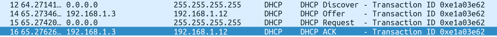

En servidor DHCP, observar que en la bitácora del sistema  se muestra información sobre la asignación de la dirección IP al cliente:

```
root@dhcp:~# cat /var/log/syslog
...
Mar  4 03:12:45 dhcp dhcpd[1387]: DHCPDISCOVER from 00:0c:29:79:af:e0 via ens33
Mar  4 03:12:45 dhcp dhcpd[1047]: DHCPDISCOVER from 00:0c:29:79:af:e0 (cliente) via ens33
Mar  4 03:12:46 dhcp dhcpd[1387]: DHCPOFFER on 192.168.1.10 to 00:0c:29:79:af:e0 (cliente) via ens33
Mar  4 03:12:46 dhcp dhcpd[1047]: DHCPREQUEST for 192.168.1.10 (192.168.1.3) from 00:0c:29:79:af:e0 via ens33
Mar  4 03:12:46 dhcp dhcpd[1047]: DHCPACK on 192.168.1.10 to 00:0c:29:79:af:e0 (cliente) via ens33
Mar  4 03:12:46 dhcp dhcpd[1387]: DHCPREQUEST for 192.168.1.10 (192.168.1.3) from 00:0c:29:79:af:e0 (cliente) via ens33
Mar  4 03:12:46 dhcp dhcpd[1387]: DHCPACK on 192.168.1.10 to 00:0c:29:79:af:e0 (cliente) via ens33
```

### PXE

Modificar archivo `/etc/dhcp/dhcpd.conf`:

```
allow booting;

subnet 192.168.1.0 netmask 255.255.255.0 {
  range 192.168.1.10 192.168.1.253;
  option domain-name-servers 192.168.1.2;
  option routers 192.168.1.2;
  option broadcast-address 192.168.1.255;
  filename "pxelinux.0";
}

group {
  next-server 192.168.1.3;
  host tftpclient {
    filename "pxelinux.0";
  }
}
```

Reiniciar servicio de DHCP

```
systemctl restart isc-dhcp-server
```

Instalar servidor TFTP

```
apt install tftpd-hpa
```

Descargar imagen de sistema operativo:

```
cd /srv/tftp/
wget http://ftp.mx.debian.org/debian/dists/stretch/main/installer-amd64/current/images/netboot/netboot.tar.gz
tar xzvf netboot.tar.gz
chmod -R a+r *
systemctl restart tftpd-hpa
```
 
Crear una nueva máquina virtual de la siguiente manera:

En la sección en donde se indica que se ingrese una imagen del sistema operativo, seleccionar la opción `I will install the operating system later`.
 
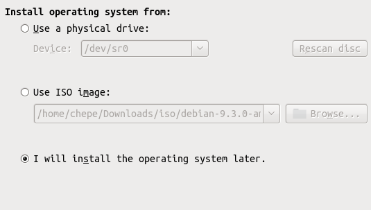

Antes de terminar la creación de la máquina virtual, seleccionar la opción `Customize Hardware...`
  
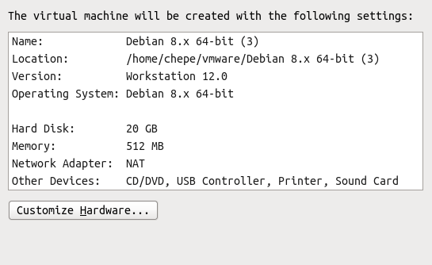

Seleccionar la red virtual creada para el adaptador de red:
   
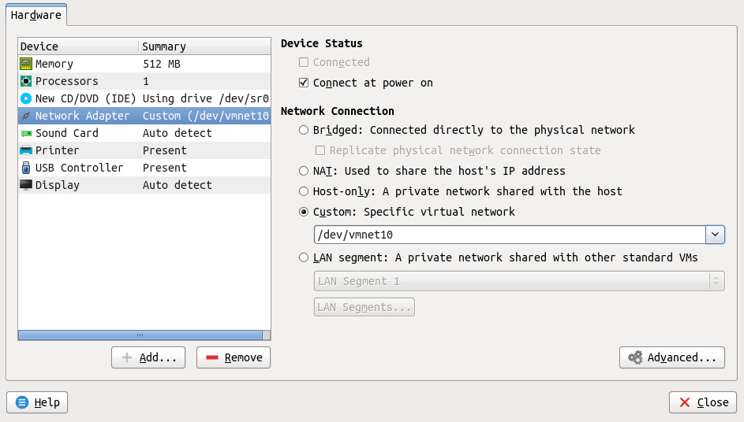

Capturar en un archivo el tráfico de la red virtual, prender máquina y observar que se arranca con la imagen del sistema operativo:

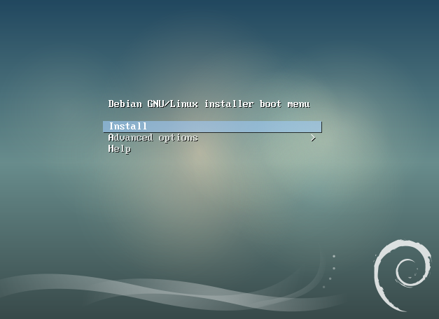

Terminar captura de tráfico, observar cómo se lleva a cabo el intercambio del protocolo DHCP junto con la descarga de archivos para el arranque por medio del protocolo TFTP:

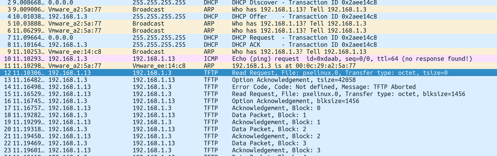

## Responder las siguientes preguntas:

- ¿Cómo funciona el protocolo DHCP?
- ¿Cómo se filtra el tráfico del protocolo DHCP en una captura de tráfico en Wireshark y en tcpdump?
- ¿Qué es el estándar PXE y cuál es su utilidad?
- Adjuntar las capturas de tráfico obtenidas en la práctica. 

## Referencias
[1] [https://wiki.debian.org/PXEBootInstall](https://wiki.debian.org/PXEBootInstall)
