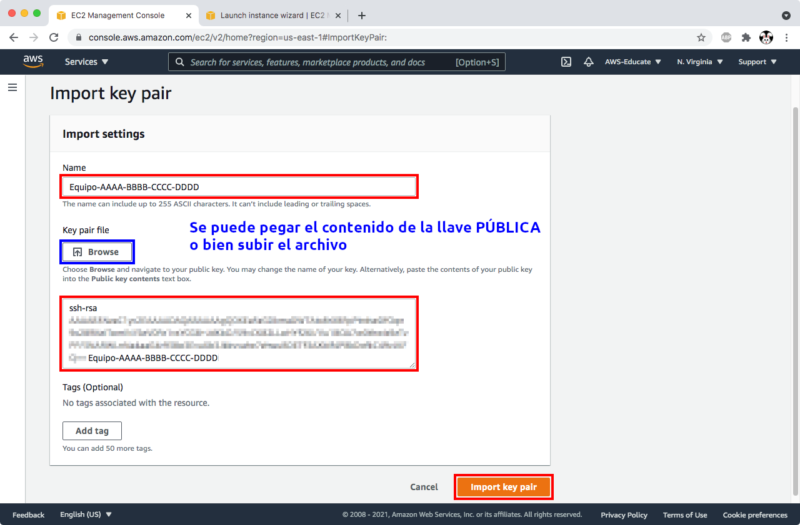
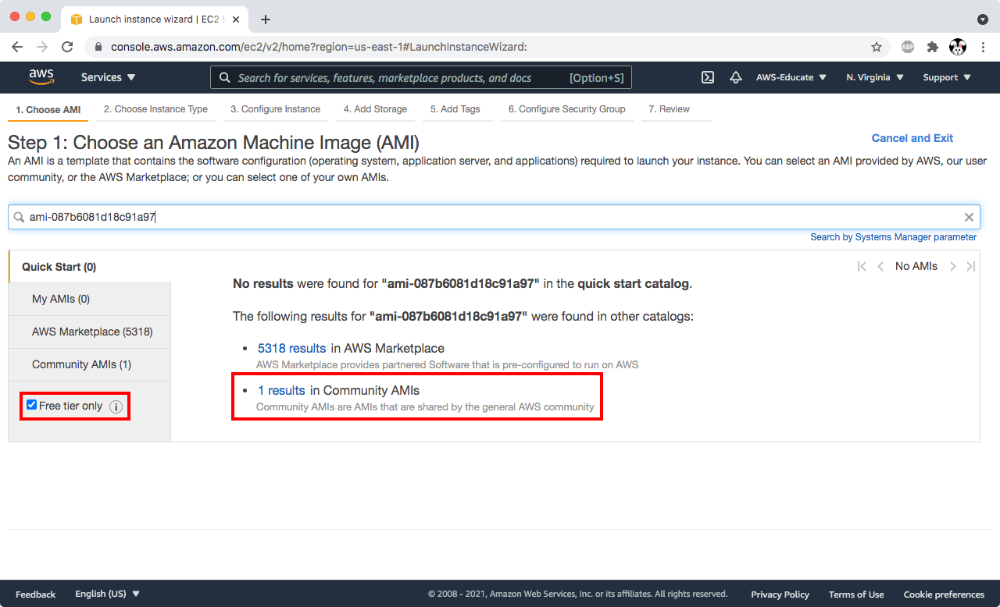
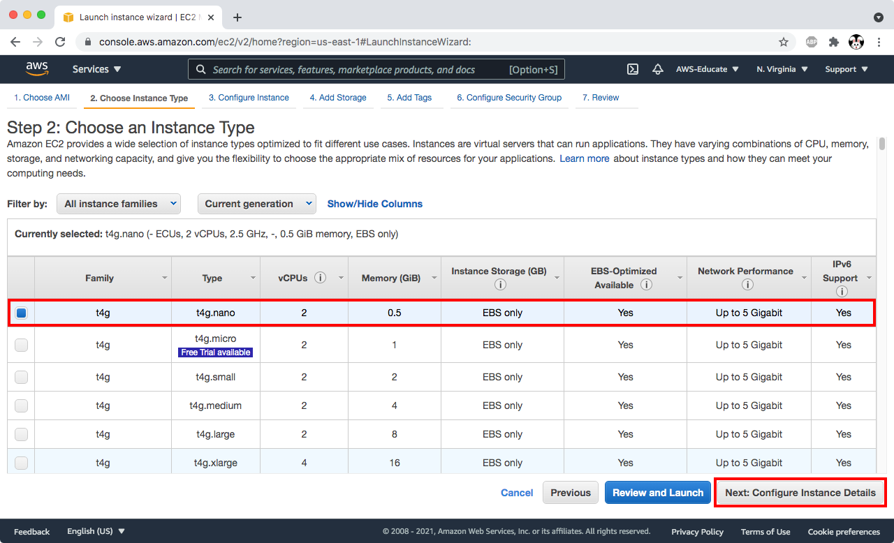
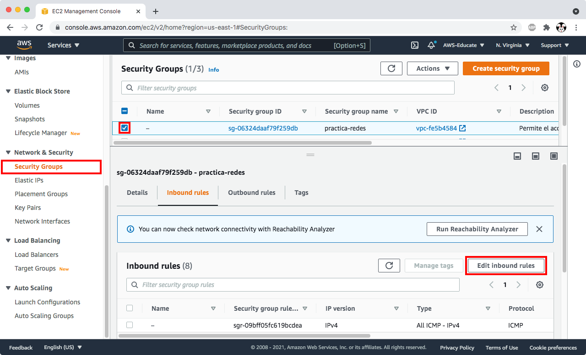
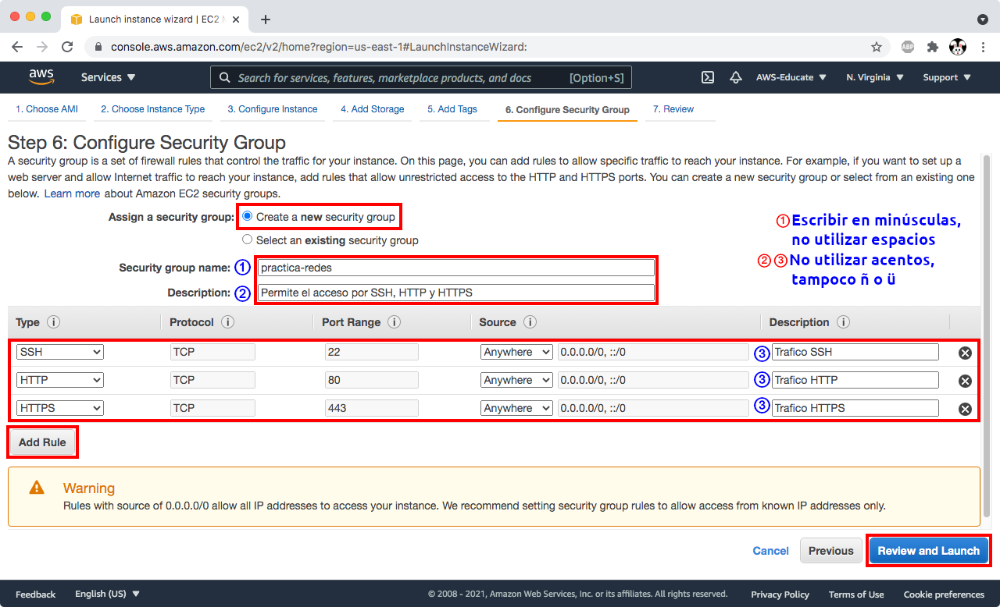
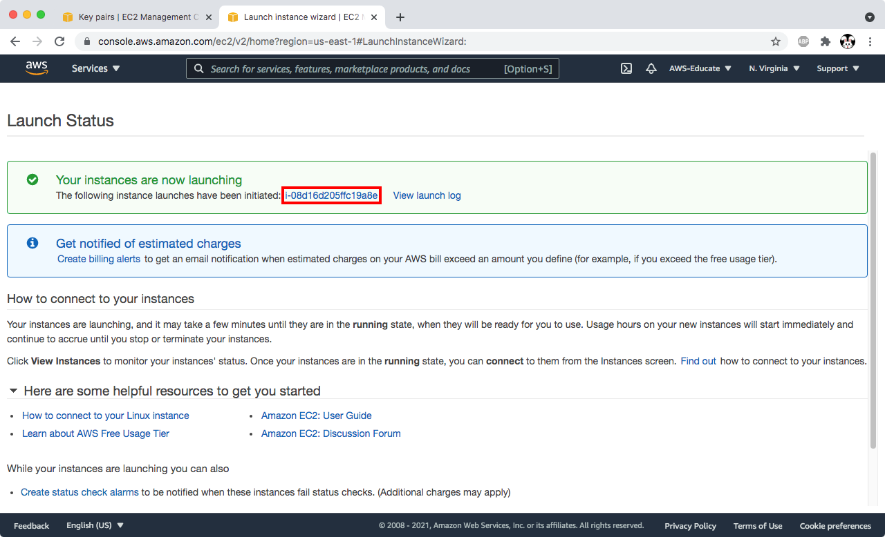
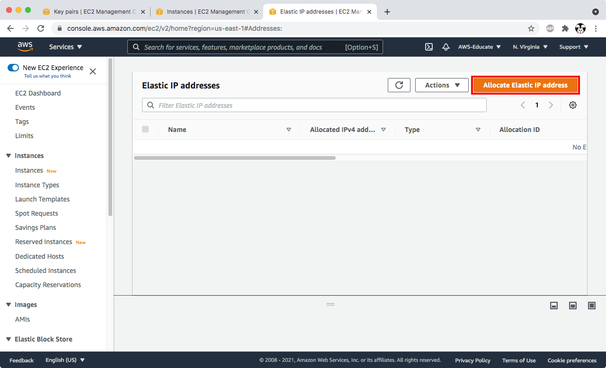
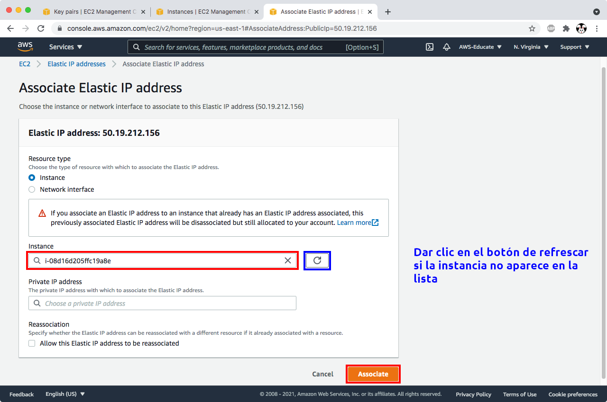
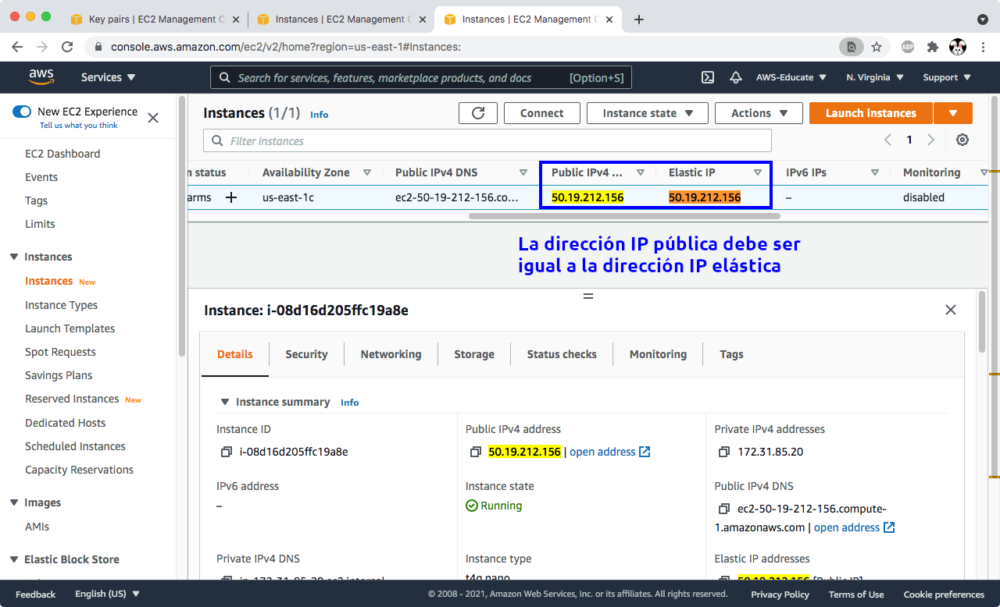

# Redes de Computadoras

## Implementación de sitios web sobre HTTPS

<details open>
  <summary>Expandir / Colapsar</summary>

[[_TOC_]]

</details>

### Videos de la parte teórica y de implementación

Se pide estudiar los siguientes videos sobre los temas que trata la práctica, para su mejor comprensión y aprendizaje.

- Todos estos videos están en una [lista de reproducción][playlist-https].

[playlist-https]: https://www.youtube.com/playlist?list=PLN1TFzSBXi3QGCMqARFoO1ePBX1P38erB

  - [Configuración de OpenSSH y autenticación con llaves 📼](https://youtu.be/Hnu7BHBDcoM&t=1390&list=PLN1TFzSBXi3QGCMqARFoO1ePBX1P38erB&index=1)

  - [Configuración de Apache HTTPD en Debian 10 📼](https://youtu.be/XbQ_dBuERdM&list=PLN1TFzSBXi3QGCMqARFoO1ePBX1P38erB&index=2)

  - [Directivas de configuración de Apache HTTPD 📼](https://youtu.be/3JkQs3KcjxQ&list=PLN1TFzSBXi3QGCMqARFoO1ePBX1P38erB&index=3)

  - [Configuración de VirtualHosts de Apache HTTPD 2.4 utilizando /etc/hosts 📼](https://youtu.be/ZnqSNXIr-h4&list=PLN1TFzSBXi3QGCMqARFoO1ePBX1P38erB&index=4)

  - [Configuración de VirtualHosts de Apache HTTPD 2.4 con registros DNS 📼](https://youtu.be/JYo5rc4mhf0&list=PLN1TFzSBXi3QGCMqARFoO1ePBX1P38erB&index=5)

  - [Certificados SSL x509 📼](https://youtu.be/rXqkJi_FTuQ&list=PLN1TFzSBXi3QGCMqARFoO1ePBX1P38erB&index=6)

  - [Certificados SSL con OpenSSL y VirtualHost HTTPS en Apache HTTPD 📼](https://youtu.be/66dOHHD6L5I&list=PLN1TFzSBXi3QGCMqARFoO1ePBX1P38erB&index=7)

  - [Trámite de un certificado SSL con Let's Encrypt utilizando certbot 📼](https://youtu.be/kpiChLT5JPs&list=PLN1TFzSBXi3QGCMqARFoO1ePBX1P38erB&index=8)

### Fecha de entrega

- [Lunes 9 de agosto de 2021 a las 23:59 hrs][countdown].

[countdown]: https://www.timeanddate.com/countdown/wfh?iso=20210809T235959&p0=155&msg=Entrega+pr%C3%A1ctica+4+-+Redes+Ciencias+UNAM+2021-2&font=cursive&csz=1

### Objetivos

- Crear una máquina virtual en la infraestructura de Amazon Web Services
- Asignar una dirección IP estática a la máquina virtual
- Asignar un nombre de dominio DNS que apunte a la máquina virtual
- Instalar el servidor web Apache HTTPD y configurarlo para que sirva tráfico de HTTP y HTTPS
- Configurar un par de VirtualHosts para HTTP y otro par de VirtualHosts para HTTPS
- Generar un certificado SSL con Let's Encrypt utilizando el cliente `certbot`

### Desarrollo

#### Creación de la máquina virtual en AWS

<details open>
  <summary>Expandir / Colapsar</summary>

##### Generar una llave SSH

- Crear una llave SSH para autenticarse en la instancia EC2

```
usuario@laptop:~$ ssh-keygen -t rsa -b 4096 -C "Equipo-AAAA-BBBB-CCCC-DDDD" -f ~/.ssh/equipo_redes_rsa -N ""
```

- Listar el par de llaves SSH

  - La llave `equipo_redes_rsa` es la llave **PRIVADA** y únicamente debe compartirse con los integrantes del equipo
  - La llave `equipo_redes_rsa.pub` es la llave **pública**, deben subir una copia de esta en el directorio `files` de su reporte

```
usuario@laptop:~$ ls -la ~/.ssh/equipo_redes_rsa*
-rw------- 1 tonejito staff 3389 Aug  3 13:19 /Users/tonejito/.ssh/equipo_redes_rsa
-rw-r--r-- 1 tonejito staff  752 Aug  3 13:19 /Users/tonejito/.ssh/equipo_redes_rsa.pub
```

- Mostrar el contenido de la llave **pública**

<blockquote>

| Nota |
|:-----|
| El contenido de la llave es una cadena muy larga que viene en una sola línea |

</blockquote>

```
usuario@laptop:~$ cat ~/.ssh/equipo_redes_rsa.pub
ssh-rsa AAAAB3NzaC1yc2EAAAAD...lf4PBkDgfkC49vJKFQ== Equipo-AAAA-BBBB-CCCC-DDDD
```

- Iniciar sesión en la cuenta de AWS Educate Starter

- Entrar a la consola de EC2 y dar clic en `keypairs`

  - https://console.aws.amazon.com/ec2


- Dar clic en el botón `Actions` y después en `Import keypair`


En la ventana para importar una llave de SSH

  - Nombrar la llave como `Equipo-AAAA-BBBB-CCCC-DDDD`

  - Pegar el contenido de la llave pública (todo va en una sola línea) o bien buscar el archivo `~/.ssh/equipo_redes_rsa.pub` en el equipo y subirlo.

  - Ir al final de la página y dar clic en el botón `Import keypair`




##### Creación de la instancia EC2

- Navegar a la consola de AWS EC2 y dar clic en el botón `Launch Instance`

  - https://console.aws.amazon.com/ec2


-  Escribir el ID de la imágen de máquina virtual en el campo de búsqueda y dar enter

  - [`ami-087b6081d18c91a97`][ami-debian-10-buster-arm64] para instancias `t4g` de arquitectura `ARM64`
  - [`ami-05ad4ed7f9c48178b`][ami-debian-10-buster-amd64] para instancias `t3a`, `t3` y `t2` de arquitectura `amd64` (`x86_64`)

<blockquote>

| Nota |
|:-----|
| Algunas cuentas de AWS únicamente pueden lanzar instancias `t2.micro`

</blockquote>


- Aparece un mensaje indicando que se encontró un resultado para imagenes AMI hechas por la comunidad, dar clic en ese mensaje



- Revisar que se liste la información del AMI de Debian 10 `buster` para arquitectura ARM o amd64 (x86_64) y dar clic en el botón **azul** `Select`

##### ID de imagenes AMI
<a id="ami" name="ami"></a>

| Región    | Arquitectura   | Instancias         | ID imágen AMI                                         | Nombre de la imágen AMI        |
|:---------:|:--------------:|:------------------:|:-----------------------------------------------------:|:-------------------------------:
| us-east-1 | ARM64          | `t4g`              | [`ami-087b6081d18c91a97`][ami-debian-10-buster-arm64] | `debian-10-arm64-20210721-710` |
| us-east-1 | amd64 (x86_64) | `t3a`, `t3` y `t2` | [`ami-05ad4ed7f9c48178b`][ami-debian-10-buster-amd64] | `debian-10-amd64-20210721-710` |
| us-east-1 | ARM64          | `t4g`              | [`ami-0af96487b9b9c4577`][ami-debian-9-stretch-arm64] | `debian-stretch-hvm-arm64-gp2-2021-07-21-65720`  |
| us-east-1 | amd64 (x86_64) | `t3a`, `t3` y `t2` | [`ami-0d69a91f191e32057`][ami-debian-9-stretch-amd64] | `debian-stretch-hvm-x86_64-gp2-2021-07-21-65742` |

<!--
https://wiki.debian.org/Cloud/AmazonEC2Image/Stretch#Stretch
https://wiki.debian.org/Cloud/AmazonEC2Image/Buster#Buster
-->

[ami-debian-10-buster-arm64]: https://console.aws.amazon.com/ec2/v2/home?region=us-east-1#Images:visibility=public-images;architecture=arm64;ownerAlias=136693071363;imageId=ami-087b6081d18c91a97;name=debian-10-arm64-20210721-710
[ami-debian-10-buster-amd64]: https://console.aws.amazon.com/ec2/v2/home?region=us-east-1#Images:visibility=public-images;architecture=x86_64;ownerAlias=136693071363;imageId=ami-05ad4ed7f9c48178b;name=debian-10-amd64-20210721-710
[ami-debian-9-stretch-arm64]: https://console.aws.amazon.com/ec2/v2/home?region=us-east-1#Images:visibility=public-images;architecture=arm64;ownerAlias=379101102735;imageId=ami-0af96487b9b9c4577;name=debian-stretch-hvm-arm64-gp2-2021-07-21-65720
[ami-debian-9-stretch-amd64]: https://console.aws.amazon.com/ec2/v2/home?region=us-east-1#Images:visibility=public-images;architecture=x86_64;ownerAlias=379101102735;imageId=ami-0d69a91f191e32057;name=debian-stretch-hvm-x86_64-gp2-2021-07-21-65742


- Seleccionar el tipo de instancia `t4g.nano` (2 vCPU, 512 MB de RAM). Dar clic en el botón **gris** `Next: Configure instance details`

<blockquote>

| Nota |
|:-----|
| En caso de error seleccionar con la instancia `t4g.micro` (2 vCPU, 1 GB de RAM) que viene incluida en la [**capa de uso gratuita**][aws-free-tier] de AWS. |
| Algunas cuentas únicamente pueden lanzar instancias `t2.micro`, si este es el caso verifica que tengas el AMI para arquitectura amd64 (x86_64) |

</blockquote>

[aws-free-tier]: https://aws.amazon.com/free/



- Seleccionar los siguientes parámetros para configurar la instancia EC2

  - Dejar los valores predeterminados y dar clic en el botón **gris** `Next: Add storage`


- Cambiar el tamaño del almacenamiento a `10 GB` y el tipo a `gp3`. Dar clic en el botón **gris** `Next: Add tags`


- En el paso `Add tags`, simplemente dar clic en el botón **gris** `Next: Configure security group`

<blockquote>

| Nota |
|:-----|
| No se utilizan _tags_ en esta actividad |

</blockquote>


- Configurar grupo de seguridad

  - Dar clic en el botón radio `Create a new security group`

  - Asignar el nombre `practica redes` (sin acentos)

  - Dar clic en el botón `Add rule` para agregar una nueva regla de entrada

  - Seleccionar el protocolo de la lista

  - Seleccionar `Anywhere` como origen

  - Agregar una descripción (sin acentos)

  - Repetir para cada protocolo de entrada

| Puerto   | Servicio      | Origen                          |
|:--------:|:-------------:|:-------------------------------:|
| `22`     | **SSH**       | Anywhere (`0.0.0.0/0` y `::/0`) |
| `80`     | **HTTP**      | Anywhere (`0.0.0.0/0` y `::/0`) |
| `443`    | **HTTPS**     | Anywhere (`0.0.0.0/0` y `::/0`) |
| `ICMPv4` | **ICMP IPv4** | Anywhere IPv4 (`0.0.0.0/0`)     |
| `ICMPv6` | **ICMP IPv6** | Anywhere IPv6 (`::/0`)          |

>>>

<a id="icmp" name="icmp"></a>

<details open>
  <summary>Expandir / Colapsar</summary>

- Agrega las reglas para el tráfico ICMP de entrada para IPv4 e IPv6

  - Da clic en la sección `Security Groups` el panel izquierdo

  - Selecciona el grupo de seguridad `practica-redes` y da clic en `Edit inbound rules`



  - Agrega las reglas de entrada para el protocolo ICMP sobre IPv4 e IPv6 y da clic en el botón `Save rules`


  - Estos cambios se verán reflejados de manera inmediata en tu instancia EC2

</details>

>>>

- Dar clic en el boton **azul** `Review and Launch`



- Revisar los detalles y dar clic en el botón **azul** `Launch`

- Seleccionar la llave de SSH

  - Seleccionar `Choose an existing keypair` para utilizar la llave SSH que se importó previamente

  - Seleccionar la llave `Equipo-AAAA-BBBB-CCCC-DDDD`

  - Marcar la casilla que confirma que se tiene acceso a la llave privada que es la contraparte de esta llave pública

  - Dar clic en el botón `Launch Instance`


- Dar clic en el identificador de la instancia que aparece en el panel verde para revisar el estado de la instancia



- Esperar aproximadamente 5 minutos a que la instancia termine de inicializarse. El estado debe aparecer como `Running`


- Anotar el identificador de la instancia EC2 en el reporte

- https://docs.aws.amazon.com/AWSEC2/latest/UserGuide/get-set-up-for-amazon-ec2.html
- https://docs.aws.amazon.com/AWSEC2/latest/UserGuide/EC2_GetStarted.html
- https://docs.aws.amazon.com/AWSEC2/latest/UserGuide/ec2-best-practices.html


##### Asignación de IP estática a la instancia EC2

- Entrar a la consola de EC2 y dar clic en `Elastic IPs`


- Dar clic en el botón `Allocate Elastic IP address`



- Aceptar los parámetros predeterminados, ir al final de la página y dar clic en el botón `Allocate`

- Anotar la dirección que se asignó a la _IP elástica_.

- Dar clic en el botón `Actions` y después en `Associate Elastic IP address`


- Seleccionar la instancia EC2, ir al final de la página y dar clic en el botón `Associate`



- Seleccionar `Instances` en el panel izquierdo y seleccionar la instancia EC2 que se creó


- Buscar la dirección IP elástica para confirmar que está asociada a la instancia EC2



- Anotar la dirección IP elástica asociada a la instancia EC2 en el reporte

- https://docs.aws.amazon.com/AWSEC2/latest/UserGuide/using-instance-addressing.html
- https://docs.aws.amazon.com/AWSEC2/latest/UserGuide/elastic-ip-addresses-eip.html
- https://aws.amazon.com/premiumsupport/knowledge-center/ec2-associate-static-public-ip/
- https://docs.aws.amazon.com/AWSEC2/latest/UserGuide/elastic-ip-addresses-eip.html#using-instance-addressing-eips-allocating
- https://docs.aws.amazon.com/AWSEC2/latest/UserGuide/elastic-ip-addresses-eip.html#using-instance-addressing-eips-associating

--------------------------------------------------------------------------------

##### Asignación de nombre DNS a la instancia EC2
<a id="dns" name="dns"></a>

- Obtén la dirección de la IP elástica que asociaste a la instancia EC2 en la sección anterior

- Crear los registros DNS de acuerdo a la siguiente tabla:

<blockquote>

| Nota |
|:-----|
| Utiliza el mismo nombre de dominio que tramitaste en la [práctica 1][practica-1] |

</blockquote>

[practica-1]: /public/laboratorio/practica1#obtener-un-dominio-en-tech-domains

| Nombre                  | Tipo    | Valor                |
|------------------------:|:-------:|---------------------:|
|          `example.com.` | `A`     |      `50.19.212.156` |
|     `docs.example.com.` | `A`     |      `50.19.212.156` |
|   `manual.example.com.` | `A`     |      `50.19.212.156` |
|    `sitio.example.com.` | `CNAME` |       `example.com.` |
| `estatico.example.com.` | `CNAME` | `sitio.example.com.` |

<blockquote>

| Nota |
|:-----|
| - No utilizar acentos ni caracteres como `ñ` o `ü` en los nombres DNS |
| - Reemplazar `50.19.212.156` con la dirección de la IP elástica |
| - Reemplazar `example.com` con el nombre de dominio |

</blockquote>

- Revisa que existan los registros DNS utilizando el comando `dig`

<blockquote>

| Nota |
|:-----|
| El parámetro `A` indica el tipo de registro que se quiere obtener en la respuesta |

</blockquote>

```
usuario@laptop:~$ dig +noall +comments +answer example.com.
;; Got answer:
;; ->>HEADER<<- opcode: QUERY, status: NOERROR, id: 42942
;; flags: qr rd ra; QUERY: 1, ANSWER: 1, AUTHORITY: 0, ADDITIONAL: 1

;; OPT PSEUDOSECTION:
; EDNS: version: 0, flags:; udp: 512
;; ANSWER SECTION:
example.com.		299	IN	A	50.19.212.156
```

```
usuario@laptop:~$ # dig +noall +comments +answer A docs.example.com.
;; Got answer:
;; ->>HEADER<<- opcode: QUERY, status: NOERROR, id: 55594
;; flags: qr rd ra; QUERY: 1, ANSWER: 1, AUTHORITY: 0, ADDITIONAL: 1

;; OPT PSEUDOSECTION:
; EDNS: version: 0, flags:; udp: 512
;; ANSWER SECTION:
docs.example.com.	299	IN	A	50.19.212.156
```

```
usuario@laptop:~$ dig +noall +comments +answer A manual.example.com.
;; Got answer:
;; ->>HEADER<<- opcode: QUERY, status: NOERROR, id: 49129
;; flags: qr rd ra; QUERY: 1, ANSWER: 1, AUTHORITY: 0, ADDITIONAL: 1

;; OPT PSEUDOSECTION:
; EDNS: version: 0, flags:; udp: 512
;; ANSWER SECTION:
manual.example.com.	299	IN	A	50.19.212.156
```

```
usuario@laptop:~$ dig +noall +comments +answer A sitio.example.com.
;; Got answer:
;; ->>HEADER<<- opcode: QUERY, status: NOERROR, id: 43466
;; flags: qr rd ra; QUERY: 1, ANSWER: 2, AUTHORITY: 0, ADDITIONAL: 1

;; OPT PSEUDOSECTION:
; EDNS: version: 0, flags:; udp: 512
;; ANSWER SECTION:
sitio.example.com.	299	IN	CNAME	example.com.
example.com.		299	IN	A	50.19.212.156
```

```
usuario@laptop:~$ dig +noall +comments +answer A estatico.example.com.
;; Got answer:
;; ->>HEADER<<- opcode: QUERY, status: NOERROR, id: 59174
;; flags: qr rd ra; QUERY: 1, ANSWER: 3, AUTHORITY: 0, ADDITIONAL: 1

;; OPT PSEUDOSECTION:
; EDNS: version: 0, flags:; udp: 512
;; ANSWER SECTION:
estatico.example.com.	299	IN	CNAME	sitio.example.com.
sitio.example.com.	299	IN	CNAME	example.com.
example.com.		299	IN	A	50.19.212.156
```

--------------------------------------------------------------------------------

##### Acceso inicial por SSH a la instancia EC2

```
usuario@laptop:~$ ssh -i ~/.ssh/equipo_redes_rsa admin@50.19.212.156

The authenticity of host '50.19.212.156 (50.19.212.156)' can't be established.
ECDSA key fingerprint is SHA256:Gui6wCWdr+ifqtgLEuzSmWmWRHEO97Cg943UnZn5NK0.
Are you sure you want to continue connecting (yes/no)? yes

Warning: Permanently added '50.19.212.156' (ECDSA) to the list of known hosts.
Linux ip-172-31-85-20 4.19.0-17-arm64 #1 SMP Debian 4.19.194-3 (2021-07-18) aarch64

The programs included with the Debian GNU/Linux system are free software;
the exact distribution terms for each program are described in the
individual files in /usr/share/doc/*/copyright.

Debian GNU/Linux comes with ABSOLUTELY NO WARRANTY, to the extent
permitted by applicable law.

	...     Mensajes sobre la configuración de `locale`	...

admin@ip-172-31-85-20:~$
```

Verifica que puedas elevar privilegios con `sudo`

```
admin@ip-172-31-85-20:~$ sudo -i

	...     Mensajes sobre la configuración de `locale`	...

root@ip-172-31-85-20:~#
```

Crea un bloque de configuración en el archivo ~/.ssh/config para facilitar el acceso por SSH

```
Host 50.19.212.156 example.com *.example.com
  User admin
  IdentityFile ~/.ssh/equipo_redes_rsa
```

Prueba la configuración del cliente de SSH

```
usuario@laptop:~$ ssh example.com
	...
admin@ip-172-31-85-20:~$
```

##### Autenticación SSH en la instancia EC2
<a id="ssh-key" name="ssh-key"></a>

Agregar la [llave SSH de los profesores](files/profesores_redes_rsa.pub), la cual ayudará a calificar la práctica

<blockquote>

| Nota |
|:-----|
| Puedes pedir asistencia de los profesores cuando vayas a realizar este paso para evitar problemas de acceso |

</blockquote>

- Copia la llave a la máquina virtual

```
usuario@laptop:~$ scp profesores_redes_rsa.pub admin@example.com:/tmp/profesores_redes_rsa.pub

usuario@laptop:~$ ssh admin@example.com
```

- Instala la llave en la cuenta del usuario `admin`

```
admin@example:~$ test -d ~/.ssh || mkdir -vp ~/.ssh

admin@example:~$ chmod 0700 ~/.ssh

admin@example:~$ install --owner admin --group admin --mode 0600 /tmp/profesores_redes_rsa.pub ~/.ssh/authorized_keys2
```

- Instala la llave SSH en la cuenta del usuario `root`

```
admin@example:~$ sudo -i

root@example:~# test -d ~/.ssh || mkdir -vp ~/.ssh

root@example:~# install --owner root --group root --mode 0600 /tmp/profesores_redes_rsa.pub ~/.ssh/authorized_keys2
```

- Aplica el atributo _inmutable_ a las llaves SSH instaladas

```
root@example:~# chattr +i ~admin/.ssh/authorized_keys2 ~root/.ssh/authorized_keys2
```

- Verifica que los permisos y atributos estén correctamente configurados en el archivo `.ssh/authorized_keys2` en las cuentas de usuario `root` y `admin`

```
root@example:~# ls -la ~admin/.ssh/authorized_keys2 ~root/.ssh/authorized_keys2
-rw------- 1 admin admin 749 Aug  4 09:10 /home/admin/.ssh/authorized_keys2
-rw------- 1 root  root  749 Aug  4 09:10 /root/.ssh/authorized_keys2

root@example:~# lsattr ~admin/.ssh/authorized_keys2 ~root/.ssh/authorized_keys2
----i---------e---- /home/admin/.ssh/authorized_keys2
----i---------e---- /root/.ssh/authorized_keys2
```

- Borra la llave del directorio `/tmp`

```
root@example:~# rm -v /tmp/profesores_redes_rsa.pub
removed '/tmp/redes_rsa.pub'
```

</details>

--------------------------------------------------------------------------------

#### Configuración inicial de la instancia EC2
<a id="config" name="config"></a>

<details open>
  <summary>Expandir / Colapsar</summary>

##### Utilerias de red

- Instala las utilerías del sistema en la máquina virtual

```
usuario@laptop:~$ ssh admin@example.com

admin@example:~$ sudo -i

root@example:~# apt -q update

root@example:~# apt install net-tools wget curl
```

##### hostname

- Configura el nombre de host de la máquina virtual

```
root@example:~# hostnamectl set-hostname example.com
```

- Edita el archivo `/etc/hosts`

```
root@example:~# vim /etc/hosts
```

- Agrega al final del archivo una línea donde se liste la dirección IP pública y el nombre de host

```
# /etc/hosts

127.0.0.1	localhost
::1		localhost ip6-localhost ip6-loopback
ff02::1		ip6-allnodes
ff02::2		ip6-allrouters

127.0.0.1	example.com
::1		example.com

50.19.212.156	example.com
```

- Reemplazar `50.19.212.156` con la dirección IP de la IP elástica
- Reemplazar `example.com` con el nombre de dominio

##### locale

- Configura de manera apropiada los mensajes de localización en la máquina virtual

```
root@example:~# dpkg-reconfigure -p low locales
```

- Selecciona los siguientes en el cuadro de diálogo `Configuring locales`:

- Aparece el cuadro de diálogo `Locales to be generated`, seleccionar los siguientes de la lista:

  - `en_US.UTF-8`
  - `es_MX.UTF-8`

<blockquote>

| Nota |
|:-----|
| - Puedes utilizar las flechas de teclado y/o la tecla `<Tab>` para navegar entre las opciones |
| - La barra espaciadora enciende `[*]` o apaga `[ ]` las opciones |
| - No usar `Ctrl + C` ni `Ctrl + Z` porque se interrumpe el proceso de configuración y puede causar problemas |

</blockquote>

- Aparece el cuadro de diálogo `Default locale for the system environment`:

  - Seleccionar `en_US.UTF-8` en la lista

##### Zona horaria

- Establecer la zona horaria para la máquina virtual

```
root@example:~# dpkg-reconfigure -p low tzdata
```

- Aparece el cuadro de diálogo `Geographic area`

  - Seleccionar `America`

- Aparece el cuadro de diálogo `Time zone`

  - Seleccionar `Mexico City`

- Ejecutar el comando `date` para confirmar que los cambios fueron exitosos

```
root@example:~# date
Tue 03 Aug 2021 02:03:04 AM CDT
```

##### Reiniciar la máquina virtual

Reinicia la máquina virtual después de aplicar los cambios.

```
admin@example:~$ sudo systemctl reboot
```

</details>

--------------------------------------------------------------------------------

#### Instalación del servidor Apache HTTPD

<details open>
  <summary>Expandir / Colapsar</summary>

```
root@example:~# apt install apache2
```

Revisa que Apache escuche en el puerto `80`

<blockquote>

| Nota |
|:-----|
| Puede que aparezca `127.0.0.1` en lugar de `example.com`  en la salida de `apachectl -S` |

</blockquote>

```
root@example:~# netstat -ntulp | grep apache2
tcp6	0	0	:::80	:::*	LISTEN	3306/apache2

root@example:~# apachectl -S
VirtualHost configuration:
*:80                   example.com (/etc/apache2/sites-enabled/000-default.conf:1)
	...
```

<!--
- Configurar la directiva `ServerName` en `/etc/apache2/conf-available/servername.conf`

```
ServerName  example.com
```

- Habilitar la configuración extra y recargar el servicio

```
root@example:~# a2enconf servername

root@example:~# apachectl -t
Syntax OK

root@example:~# systemctl reload apache2
```
-->

##### Página para el VirtualHost predeterminado

- Crea la página de inicio del VirtualHost `_default_` para HTTP y HTTPS con el siguiente contenido en el archivo `/var/www/html/index.html`

<blockquote>

| Nota |
|:-----|
| - Reemplazar `Equipo-AAAA-BBBB-CCCC-DDDD` con el identificador de tu equipo |
| - Reemplazar `example.com` con el nombre de dominio |

</blockquote>

```html
<!DOCTYPE HTML>
<html>
  <head>
    <meta charset="UTF-8">
    <title>Práctica redes</title>
    <link href="data:image/x-icon;base64," rel="icon" type="image/x-icon" />
  </head>
  <body>
    <h1>Hola</h1>
    <div>
      <p>Esta es la página del <code>Equipo-AAAA-BBBB-CCCC-DDDD</code></p>
      <p>Nuestro dominio DNS es <code>example.com</code></p>
    </div>
    <hr/>
    <code>Redes de Computadoras</code>
  </body>
</html>
```

##### Configuración del módulo de SSL

- Habilita el módulo de SSL y VirtualHost para HTTPS y reinicia el servicio de Apache HTTPD

```
root@example:~# a2enmod ssl

root@example:~# a2ensite default-ssl

root@example:~# apachectl -t
Syntax OK

root@example:~# systemctl restart apache2
```

- Revisa que Apache escuche en los puertos `80` y `443`

```
root@example:~# netstat -ntulp | grep apache2
tcp6	0	0	:::80	:::*	LISTEN	5432/apache2
tcp6	0	0	:::443	:::*	LISTEN	5432/apache2

root@example:~# apachectl -S
VirtualHost configuration:
*:80                   example.com (/etc/apache2/sites-enabled/000-default.conf:1)
*:443                  example.com (/etc/apache2/sites-enabled/default-ssl.conf:2)
	...
```

- Edita el archivo `/etc/apache2/sites-enabled/default-ssl.conf` y reemplaza esta línea

```
	<VirtualHost *:443>
```

  - Por esta otra

```
	<VirtualHost _default_:443>
```

- Recarga el servicio de Apache HTTPD

```
root@example:~# systemctl reload apache2
```

<!--
- https://docs.aws.amazon.com/AWSEC2/latest/UserGuide/SSL-on-amazon-linux-2.html
- https://docs.aws.amazon.com/AWSEC2/latest/UserGuide/SSL-on-amazon-linux-ami.html
-->

##### Configuración de seguridad para Apache HTTPD

- Edita el archivo de configuración para configurar las directivas básicas de seguridad

```
root@example:~# cd /etc/apache2

root@example:/etc/apache2# vim conf-available/security.conf
```

- Ubica estas directivas y realiza los cambios pertinentes

```
ServerTokens ProductOnly
ServerSignature Off
TraceEnable Off

<DirectoryMatch "/\.git">
   Require all denied
</DirectoryMatch>
```

- Habilita la configuración, revisa la sintaxis y recarga el servicio

```
root@example:/etc/apache2# a2enconf security

root@example:/etc/apache2# apachectl -t
Syntax OK

root@example:/etc/apache2# systemctl reload apache2

root@example:/etc/apache2# apachectl -S
*:80                   is a NameVirtualHost
         default server example.com (/etc/apache2/sites-enabled/000-default.conf:1)
	...
*:443                  is a NameVirtualHost
         default server example.com (/etc/apache2/sites-enabled/default-ssl.conf:2)
	...
```

--------------------------------------------------------------------------------

##### Tramite de certificado SSL con Let's Encrypt

- Genera un certificado _wildcard_ SSL con `certbot` que cumpla con las siguientes características

  - Subject CN = `example.com`
  - Subject Alt name: `example.com`
  - Subject Alt name: `*.example.com`

- Ejecuta `certbot` en el equipo para generar el certificado SSL con Let's Encrypt

  - Adjunta la salida del comando `certbot` en tu reporte de la práctica

```
root@example:~# certbot --authenticator manual --installer apache --domain 'example.com' --domain '*.example.com'
```

- Let's Encrypt pide que valides el dominio de dos maneras:

  - Con un archivo dentro de la ruta `/.well-known/acme-challenge` bajo el `DocumentRoot`

    - Puedes validar esto con `curl`

```
usuario@laptop:~$ curl -v http://example.com/.well-known/acme-challenge/NOMBRE_DEL_ARCHIVO_PARA_VALIDACIÓN
```

  - Con un registro DNS de tipo `TXT` llamado `_acme-challenge.example.com.`

    - Puedes validar esto con `dig`

```
usuario@laptop:~$ dig TXT _acme-challenge.example.com.
```

  - **Necesitas validar correctamente los dos pasos anteriores antes de continuar con el trámite del certificado SSL**

- `certbot` pregunta si quieres redirigir el tráfico de HTTP hacia HTTPS

  - Aceptar para que se haga la configuración para todos los VirtualHosts de HTTP presentes en Apache HTTPD

- Verifica que tengas el certificado y la llave privada en `/etc/letsencrypt`

```
root@example:~# tree /etc/letsencrypt/archive
/etc/letsencrypt/archive
 └── example.com
     ├── cert1.pem
     ├── chain1.pem
     ├── fullchain1.pem
     └── privkey1.pem

1 directory, 4 files
```
```
root@example:~# tree /etc/letsencrypt/live
/etc/letsencrypt/live
 README
 └── example.com
     ├── cert.pem -> ../../archive/example.com/cert1.pem
     ├── chain.pem -> ../../archive/example.com/chain1.pem
     ├── fullchain.pem -> ../../archive/example.com/fullchain1.pem
     ├── privkey.pem -> ../../archive/example.com/privkey1.pem
     README

1 directory, 6 files
```

- Verifica que se estén utilizando los certificados de Let's Encrypt en tu VirtualHost de HTTPS

```
root@example:~# egrep -i '^\s*SSLCertificate(Key)?File' /etc/apache2/sites-enabled/*.conf
/etc/apache2/sites-enabled/default-ssl.conf:SSLCertificateFile    /etc/letsencrypt/live/example.com/fullchain.pem
/etc/apache2/sites-enabled/default-ssl.conf:SSLCertificateKeyFile /etc/letsencrypt/live/example.com/privkey.pem
```

<blockquote>

| Nota |
|:-----|
| Lo invitamos a leer el man:
| - `certbot --help`
| - `certbot --help all`
| - https://certbot.eff.org/docs/using.html#manual

</blockquote>

</details>

--------------------------------------------------------------------------------

#### Configuración de VirtualHosts para HTTP y HTTPS

<details open>
  <summary>Expandir / Colapsar</summary>

##### VirtualHosts para documentación

- Revisa que existan los siguientes registros utilizando el comando `dig`

  - `docs.example.com.`
  - `manual.example.com.`

- Instalar el paquete `linux-doc`:

```
root@example:~# apt install linux-doc
```

- Revisa que la ruta `/usr/share/doc/linux-doc` sea una _liga simbólica_ hacia la documentación de la versión del kernel

```
root@example:~# ls -lA /usr/share/doc/linux-doc
total 12
-rw-r--r-- 1 root root 5210 Jun 12 00:16 changelog.gz
-rw-r--r-- 1 root root  938 Oct  3  2015 copyright
lrwxrwxrwx 1 root root   28 Jun 12 00:16 CREDITS.gz -> ../linux-doc-4.19/CREDITS.gz
lrwxrwxrwx 1 root root   31 Jun 12 00:16 Documentation -> ../linux-doc-4.19/Documentation
lrwxrwxrwx 1 root root   22 Jun 12 00:16 html -> ../linux-doc-4.19/html
lrwxrwxrwx 1 root root   32 Jun 12 00:16 MAINTAINERS.gz -> ../linux-doc-4.19/MAINTAINERS.gz
```

- Crea un VirtualHost que responda a `docs.example.com` y `manual.example.com` y que sirva el contenido desde la carpeta `/usr/share/doc/linux-doc/html`

<blockquote>

| Nota |
|:-----|
| Puedes poner el VirtualHost de HTTP y HTTPS en el mismo archivo para facilitar la configuración |

</blockquote>

  - Estos VirtualHosts deben escribir sus bitácoras en la ruta `/var/log/apache2/docs_access.log` y `/var/log/apache2/docs_error.log`

  - Recuerda que se debe agregar la directiva `<Directory>` correspondiente puesto que este contenido está fuera de `/var/www`

  - Recuerda agregar la configuración de `mod_rewrite` que tienes presente en `/etc/apache2/sites-enabled/000-default.conf` en el VirtualHost de HTTP para redirigir las peticiones hacia HTTPS. Esta configuración tiene que estar **dentro** del bloque de `<VirtualHost>`

```
RewriteEngine on
RewriteCond %{SERVER_NAME} =docs.example.com [OR]
RewriteCond %{SERVER_NAME} =manual.example.com
RewriteRule ^ https://%{SERVER_NAME}%{REQUEST_URI} [END,NE,R=permanent]
```

- Habilita el VirtualHost y verifica la configuración de Apache HTTPD

```
root@example:~# a2ensite docs.conf

root@example:~# ls -la /etc/apache2/sites-available/docs.conf  /etc/apache2/sites-enabled/docs.conf
-rw-r--r-- 1 root root 1626 Aug  5 06:04 /etc/apache2/sites-available/docs.conf
lrwxrwxrwx 1 root root   28 Aug  5 06:04 /etc/apache2/sites-enabled/docs.conf -> ../sites-available/docs.conf

root@example:~# apachectl -t
Syntax OK

root@example:~# apachectl -S
VirtualHost configuration:
*:80                   is a NameVirtualHost
         default server example.com (/etc/apache2/sites-enabled/000-default.conf:1)
         port 80 namevhost example.com (/etc/apache2/sites-enabled/000-default.conf:1)
         port 80 namevhost docs.example.com (/etc/apache2/sites-enabled/docs.conf:1)
                 alias manual.example.com
*:443                  is a NameVirtualHost
         default server example.com (/etc/apache2/sites-enabled/default-ssl.conf:2)
         port 443 namevhost example.com (/etc/apache2/sites-enabled/default-ssl.conf:2)
         port 443 namevhost docs.example.com (/etc/apache2/sites-enabled/docs.conf:24)
                 alias manual.example.com


root@example:~# systemctl reload apache2
```

- Revisa con un navegador web que los dos VirtualHosts que acabas de crear respondan correctamente

  - `https://docs.example.com/`
  - `https://manual.example.com/`

##### VirtualHost para contenido del _repositorio de tareas_

- Ubica la rama donde estas entregando tus tareas en el repositorio

  - `https://gitlab.com/USUARIO/tareas-redes.git`

- Revisa que existan los siguientes registros utilizando el comando `dig`

  - `sitio.example.com.`
  - `estatico.example.com.`

- Crea un VirtualHost que responda a `sitio.example.com` y `estatico.example.com` y que sirva el contenido desde la carpeta `/srv/repositorio/public`

<blockquote>

| Nota |
|:-----|
| Puedes poner el VirtualHost de HTTP y HTTPS en el mismo archivo para facilitar la configuración |

</blockquote>

  - Estos VirtualHosts deben escribir sus bitácoras en la ruta `/var/log/apache2/sitio_access.log` y `/var/log/apache2/sitio_error.log`

  - Recuerda que se debe agregar la directiva `<Directory>` correspondiente puesto que este contenido está fuera de `/var/www`

  - Recuerda agregar la configuración de `mod_rewrite` que tienes presente en `/etc/apache2/sites-enabled/000-default.conf` en el VirtualHost de HTTP para redirigir las peticiones hacia HTTPS. Esta configuración tiene que estar **dentro** del bloque de `<VirtualHost>`

```
RewriteEngine on
RewriteCond %{SERVER_NAME} =sitio.example.com [OR]
RewriteCond %{SERVER_NAME} =estatico.example.com
RewriteRule ^ https://%{SERVER_NAME}%{REQUEST_URI} [END,NE,R=permanent]
```

- Instala los paquetes en el sistema operativo

```
root@example:~# apt install git mkdocs
```

- Cambia los permisos al directorio `/srv` para permitir que el usuario `admin` pueda crear archivos y carpetas

```
root@example:~# chown -c root:admin /srv
changed ownership of '/srv' from root:root to root:admin

root@example:~# chmod -c 0775 /srv
mode of '/srv' changed from 0755 (rwxr-xr-x) to 0775 (rwxrwxr-x)

root@example:~# ls -lAd /srv
drwxrwxr-x 2 root admin 4096 Jul 21 04:22 /srv
```

- Clona el repositorio de tareas del equipo utilizando el usuario `admin`

```
admin@example:~$ git clone https://gitlab.com/USUARIO/tareas-redes.git /srv/repositorio

admin@example:~$ cd /srv/repositorio

admin@example:/srv/repositorio$ git checkout RAMA
```

- Convierte los archivos Markdown a HTML para el sitio estático utilizando `mkdocs`

```
admin@example:/srv/repositorio$ mkdocs build --strict --verbose 2>&1 | egrep -v '^DEBUG'
```

<blockquote>

| Nota |
|:-----|
| Revisa si hay alguna advertencia y corrige los errores |

</blockquote>

- Lista el contenido del directorio `/srv/repositorio/public` y revisa que exista el archivo `index.html`

```
admin@example:/srv/repositorio$ ls -lA public
total 64
drwxr-xr-x  4 admin staff   128 Aug  3 02:54 css
drwxr-xr-x  7 admin staff   224 Aug  3 02:54 entrega
drwxr-xr-x  9 admin staff   288 Aug  3 02:54 fonts
drwxr-xr-x  3 admin staff    96 Aug  3 02:54 img
drwxr-xr-x  5 admin staff   160 Aug  3 02:54 js
drwxr-xr-x  6 admin staff   192 Aug  3 02:54 search
drwxr-xr-x  5 admin staff   160 Aug  3 02:54 workflow
-rw-r--r--  1 admin staff 16246 Aug  3 02:54 404.html
-rw-r--r--  1 admin staff 20338 Aug  3 02:54 index.html
-rw-r--r--  1 admin staff 15651 Aug  3 02:54 search.html
-rw-r--r--  1 admin staff  7860 Aug  3 02:54 sitemap.xml
-rw-r--r--  1 admin staff   625 Aug  3 02:54 sitemap.xml.gz
```

- Habilita el VirtualHost y verifica la configuración de Apache HTTPD

```
root@example:~# a2ensite sitio.example.com

root@example:~# ls -la /etc/apache2/sites-available/sitio.conf /etc/apache2/sites-enabled/sitio.conf
-rw-r--r-- 1 root root 1619 Aug  5 06:04 /etc/apache2/sites-available/sitio.conf
lrwxrwxrwx 1 root root   29 Aug  5 06:04 /etc/apache2/sites-enabled/sitio.conf -> ../sites-available/sitio.conf

root@example:~# apachectl -t
Syntax OK

root@example:~# apachectl -S
VirtualHost configuration:
*:80                   is a NameVirtualHost
         default server example.com (/etc/apache2/sites-enabled/000-default.conf:1)
         port 80 namevhost example.com (/etc/apache2/sites-enabled/000-default.conf:1)
         port 80 namevhost docs.example.com (/etc/apache2/sites-enabled/docs.conf:1)
                 alias manual.example.com
         port 80 namevhost sitio.example.com (/etc/apache2/sites-enabled/sitio.conf:1)
                 alias estatico.example.com
*:443                  is a NameVirtualHost
         default server example.com (/etc/apache2/sites-enabled/default-ssl.conf:2)
         port 443 namevhost example.com (/etc/apache2/sites-enabled/default-ssl.conf:2)
         port 443 namevhost docs.example.com (/etc/apache2/sites-enabled/docs.conf:24)
                 alias manual.example.com
         port 443 namevhost sitio.example.com (/etc/apache2/sites-enabled/sitio.conf:24)
                 alias estatico.example.com

root@example:~# systemctl reload apache2
```

- Revisa con un navegador web que los dos VirtualHosts que acabas de crear respondan correctamente

  - `https://sitio.example.com/`
  - `https://estatico.example.com/`

##### Revisión de la redirección de HTTP a HTTPS

Revisa que `curl` te redirija desde el sitio de HTTP a su versión con HTTPS

- El código de estado de HTTP debe ser `301` o `302`
- La cabecera `Location` debe estar presente y su valor apunta a la versión HTTPS del sitio
- El contenido de la página muestra que el documento fue movido a una nueva ubicación

```
admin@example:~$ curl -v "http://example.com/"
*   Trying 50.19.212.156...
* TCP_NODELAY set
* Connected to example.com (50.19.212.156) port 80 (#0)
> GET / HTTP/1.1
> Host: example.com
> User-Agent: curl/7.54.0
> Accept: */*
>
< HTTP/1.1 301 Moved Permanently
< Date: Tue, 03 Aug 2021 12:40:05 GMT
< Server: Apache
< Location: https://example.com/
< Content-Length: 317
< Content-Type: text/html; charset=iso-8859-1
<
<!DOCTYPE HTML PUBLIC "-//IETF//DTD HTML 2.0//EN">
<html><head>
<title>301 Moved Permanently</title>
</head><body>
<h1>Moved Permanently</h1>
<p>The document has moved <a href="https://example.com/">here</a>.</p>
<hr>
<address>Apache Server at example.com Port 80</address>
</body></html>
* Connection #0 to host example.com left intact
```

Repite este paso para todos los dominios configurados en tus VirtualHosts

- `http://50.19.212.156/`
- `http://example.com/`
- `http://docs.example.com/`
- `http://manual.example.com/`
- `http://sitio.example.com/`
- `http://estatico.example.com/`

##### Validación de VirtualHosts

Visita los dominios con un navegador web para comprobar que el `VirtualHost` esté configurado correctamente

| Dominio                         | Sitio                                      | Ejemplo                             |
|--------------------------------:|:-------------------------------------------|------------------------------------:|
|        `https://50.19.212.156/` | Página genérica                            |          https://redes.tonejito.cf/ |
|          `https://example.com/` | Página genérica                            |          https://redes.tonejito.cf/ |
|     `https://docs.example.com/` | Documentación del _kernel_ Linux           |     https://docs.redes.tonejito.cf/ |
|   `https://manual.example.com/` | Documentación del _kernel_ Linux           |   https://manual.redes.tonejito.cf/ |
|    `https://sitio.example.com/` | Sitio estático del _repositorio de tareas_ |    https://sitio.redes.tonejito.cf/ |
| `https://estatico.example.com/` | Sitio estático del _repositorio de tareas_ | https://estatico.redes.tonejito.cf/ |


<blockquote>

| Nota |
|:-----|
| Se recomienda utilizar una ventana de incógnito en el navegador para evitar problemas de caché. |

</blockquote>

</details>

--------------------------------------------------------------------------------

### Entregables

Sube al directorio `files` de tu reporte los siguientes archivos:

- Archivo `virtualhosts.txt` con el listado de VirtualHosts en la configuración de Apache HTTPD

```
root@example:~# apachectl -S 2>&1 | tee virtualhosts.txt
```

- Copia de seguridad de la configuración de Apache HTTPD en el directorio `/etc/apache2`

```
root@example:~# tar -cvvf apache2.tar -C /etc/apache2 .
```

- Copia de seguridad del directorio `/var/www`

```
root@example:~# tar -cvvf www.tar -C /var/www .
```

- Archivo `registros-dns.txt` donde vengan las consultas de todos los nombres DNS que generaste

| Nombre                  | Tipo    | Valor                |
|------------------------:|:-------:|---------------------:|
|          `example.com.` | `A`     |      `50.19.212.156` |
|     `docs.example.com.` | `A`     |      `50.19.212.156` |
|   `manual.example.com.` | `A`     |      `50.19.212.156` |
|    `sitio.example.com.` | `CNAME` |       `example.com.` |
| `estatico.example.com.` | `CNAME` | `sitio.example.com.` |

>>>

Puedes generar este archivo ejecutando [el script de shell `files/consulta-dns.sh`](files/consulta-dns.sh)

```
usuario@laptop:~$ chmod +x consulta-dns.sh
usuario@laptop:~$ ./consulta-dns.sh example.com 2>&1 | tee registros-dns.txt
```

>>>

- Archivo con el diagnóstico de consultas HTTP y HTTPS a la dirección IP y nombres DNS de los VirtualHosts

>>>

- Puedes generar este archivo ejecutando [el script de shell `files/consulta-http.sh`](files/consulta-http.sh)

```
usuario@laptop:~$ chmod +x consulta-http.sh
usuario@laptop:~$ ./consulta-http.sh example.com 2>&1 | tee diagnostico-http.txt
```

>>>

- Archivo con el diagnóstico de certificados SSL que regresa cada VirtualHost configurado

>>>

- Puedes generar este archivo ejecutando [el script de shell `files/consulta-ssl.sh`](files/consulta-ssl.sh)

```
usuario@laptop:~$ chmod +x consulta-ssl.sh
usuario@laptop:~$ ./consulta-ssl.sh example.com 2>&1 | tee diagnostico-ssl.txt
```

>>>

<!--
- Copia de seguridad de las bitácoras de Apache HTTPD

```
root@example:~# tar -cvvzpf apache2-logs.tar.gz /var/log/apache2
```
-->
<!--
- Copia de seguridad de los datos generados por `certbot`

```
root@example:~# tar -cvvf letsencrypt.tar /etc/letsencrypt /var/lib/letsencrypt /var/log/letsencrypt
```
-->


--------------------------------------------------------------------------------

### Cuestionario

<!--
#### Práctica
-->

- ¿Para qué sirvió la configuración inicial de la máquina virtual?, ¿qué ventajas proporciona respecto a una máquina virtual que no tenga esta configuración?

- ¿Para qué sirve la configuración de seguridad que se aplicó a Apache HTTPD?, ¿qué ventajas proporciona respecto a un servidor que no cuente con estas configuraciones?

- ¿Existe alguna diferencia al crear los registros DNS para el VirtualHost como `CNAME` en lugar de `A` y `AAAA`?

- ¿Para qué sirve el VirtualHost `_default_` que se configuró en los archivos `000-default` y `default-ssl`?

- ¿Para qué sirven las directivas `ServerName` y `ServerAlias` en la configuración de Apache HTTPD?, ¿en que secciones de la configuración se utilizan?

- ¿Cómo se verifica que la llave privada ubicada en `/etc/letsencrypt/archive/example.com/cert1.pem` corresponde al certificado ubicado en `/etc/letsencrypt/archive/example.com/privkey1.pem`?

- ¿Qué contienen los archivos `/etc/letsencrypt/archive/example.com/chain1.pem` y `/etc/letsencrypt/archive/example.com/fullchain1.pem`?, ¿en qué se relacionan con el certificado SSL `cert1.pem`?

<!--
- ¿Qué otros mecanismos propondrías para convertir archivos en algún formato como Markdown, ReStructured Text o AsciiDoc a HTML para hospedar un **sitio web estático** de documentación?
-->

<!--
#### AWS
-->

-  De acuerdo a la siguiente información proporcionada por AWS https://aws.amazon.com/es/ec2/instance-types/

    - ¿Qué ventajas tiene elegir el tipo de instancia `t3g.micro` o `t4g.micro` sobre otras?

    - ¿Cuál podría ser la razón de que AWS ofrezca muy diversos tipos de instancia?

- Para el contexto de las actividades de esta práctica, ¿hay alguna diferencia entre realizar las actividades en una máquina virtual con arquitectura `x86_64` y `ARM`?

- ¿Qué es una _IP Elástica_?, ¿qué diferencia existe entre una **IP elástica** y la dirección IP que le es asignada a una instancia EC2 de manera predeterminada?

- ¿Qué es una _Imagen AMI_ y para qué sirve?, ¿un usuario puede crear sus propias imágenes o depende de proveedores de terceros que las generen?

- Ve el siguiente video, emite un comentario sobre los conceptos utilizados en esta práctica y haz un diagrama que muestre cómo es que llega una petición HTTP entre tu equipo local y la instancia EC2 hospedada en AWS

    - [Fundamentos de redes en AWS - AWS Summit America 2020 📼](https://youtu.be/iwCZVBWDkoU&list=PL2yQDdvlhXf-KBzPOpzRVvujzT2N0hvoU&index=28)

<!--
    - [AWS Networking Fundamentals 📼](https://youtu.be/hiKPPy584Mg)

    - [Seguridad en AWS - AWS Public Sector Summit Mexico City 2020 📼](https://youtu.be/d3jnbtaLb24&list=PL2yQDdvlhXf_h40vMoMoh2SBa05geKLDq&index=10&t=1635)
-->

### Notas adicionales

-   Redacte un reporte por equipo, en el que consigne los pasos que considere necesarios para explicar cómo realizó la práctica, incluya capturas de pantalla que justifiquen su trabajo

-   Incluya en su reporte tanto las respuestas del Cuestionario, como un apartado de conclusiones referentes al trabajo realizado

-   Puede agregar posibles errores, complicaciones, opiniones, críticas de la práctica o del laboratorio, o cualquier comentario relativo a la misma

-   Entregue su reporte de acuerdo a la forma de entrega de tareas y prácticas definida al inicio del curso
    <https://redes-ciencias-unam.gitlab.io/2021-2/tareas-redes/workflow/>.

<!--

https://awseducate-starter-account-services.s3.amazonaws.com/AWS_Educate_Starter_Account_Services_Supported.pdf

All services are only supported in US East (N. Virginia) [us-east-1] region.
IAM restrictions apply on all services.
All services may have additional restrictions not listed below.


https://aws.amazon.com/marketplace/search/results?searchTerms=debian+buster&CREATOR=4d4d4e5f-c474-49f2-8b18-94de9d43e2c0&PRICING_MODEL=FREE&filters=CREATOR%2CPRICING_MODEL


https://ec2instances.info/
https://instances.vantage.sh/?region=us-east-1&compare_on=true&selected=t3a.nano,t3a.micro,t4g.nano,t4g.micro

https://calculator.aws/#/estimate?id=24fe2b9c12b44bb00d52f6bfa392b91feb3d2132

Debian EC2 images
https://wiki.debian.org/Cloud/AmazonEC2Image

AWS marketplace
https://aws.amazon.com/marketplace/seller-profile?id=4d4d4e5f-c474-49f2-8b18-94de9d43e2c0&ref=dtl_B0859NK4HC

Debian published AMIs
https://wiki.debian.org/Cloud/AmazonEC2Image/Buster

| Region    | Arquitectura   | Instancias | Imagen AMI            |
|:---------:|:--------------:|:----------:|:---------------------:|
| us-east-1 | ARM64          | t4         | [ami-087b6081d18c91a97][ami-arm64] |
| us-east-1 | AMD64 (x86_64) | t3a        | [ami-05ad4ed7f9c48178b][ami-amd64] |

[ami-arm64]: https://console.aws.amazon.com/ec2/v2/home?region=us-east-1#Images:visibility=public-images;architecture=arm64;imageId=ami-087b6081d18c91a97;sort=name
[ami-amd64]: https://console.aws.amazon.com/ec2/v2/home?region=us-east-1#Images:visibility=public-images;architecture=x86_64;imageId=ami-05ad4ed7f9c48178b;sort=name

-->
