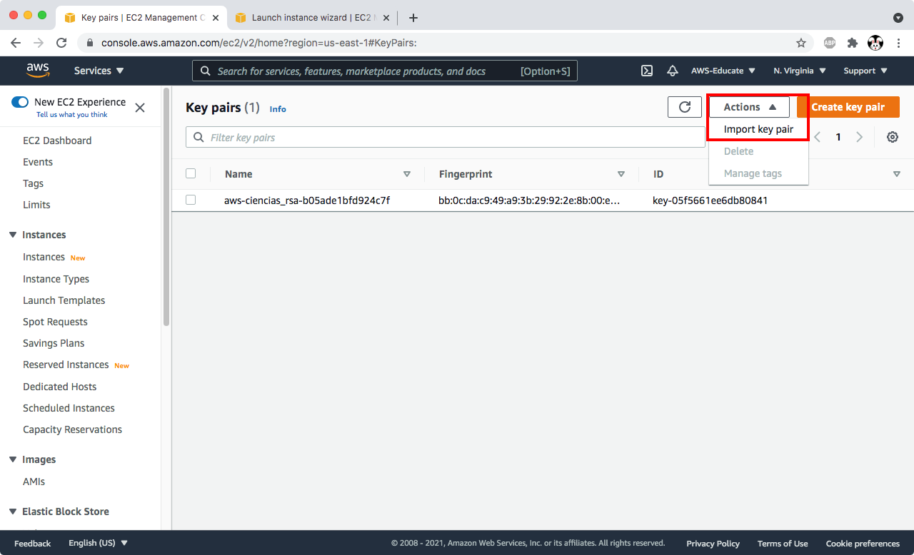
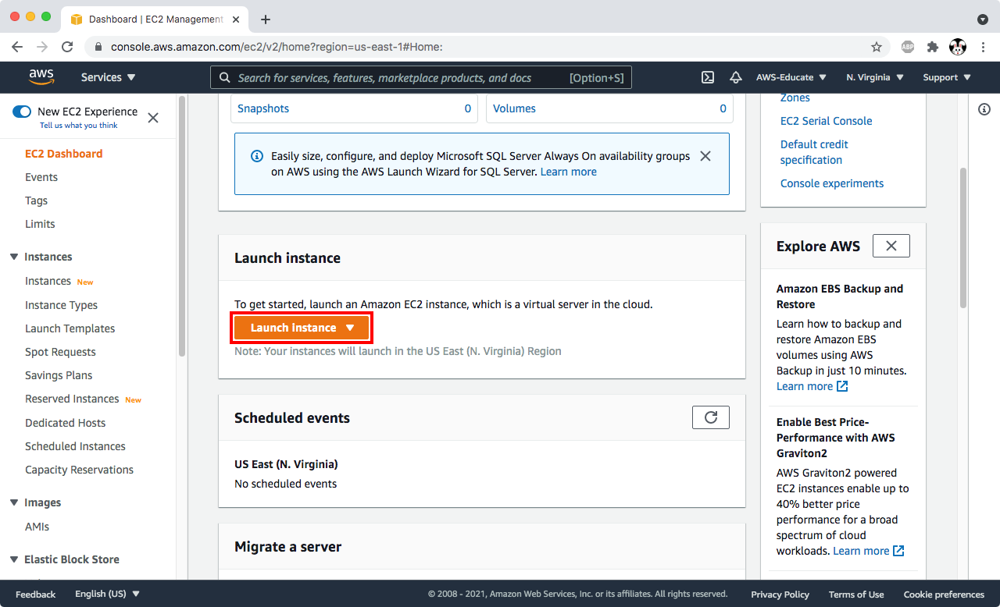
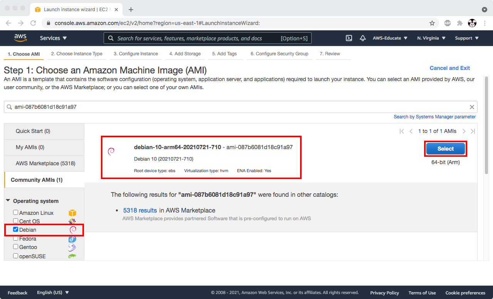
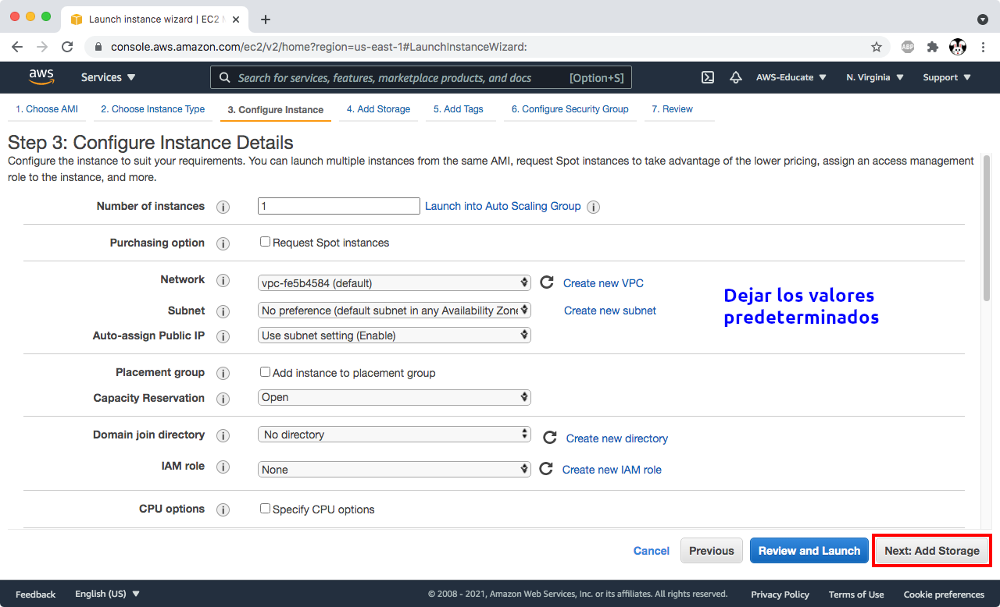
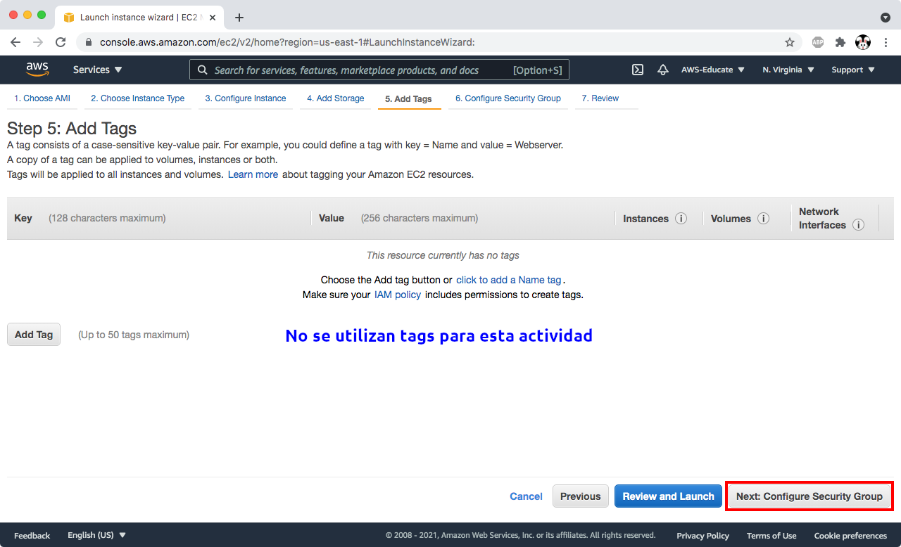
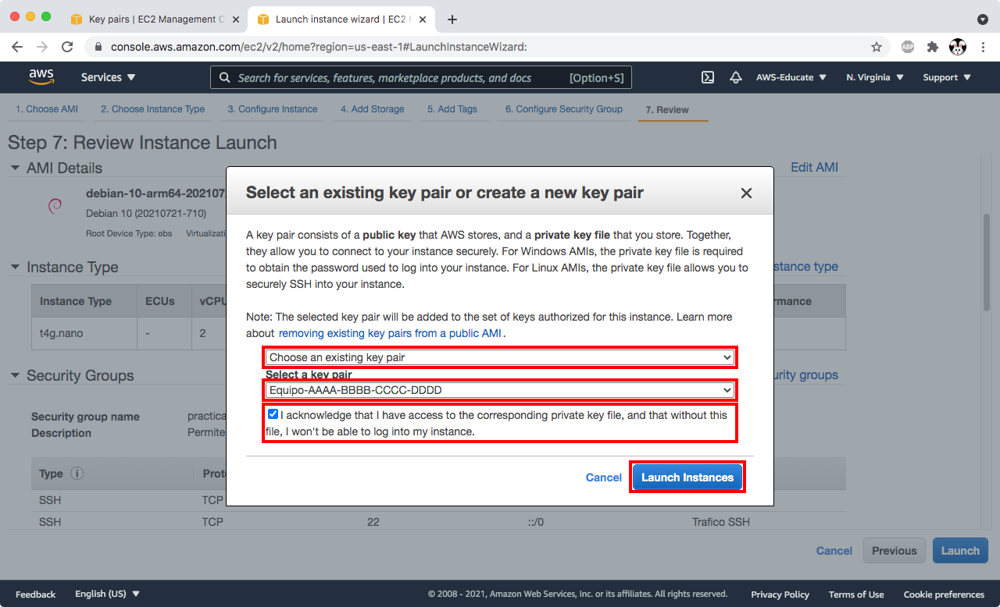
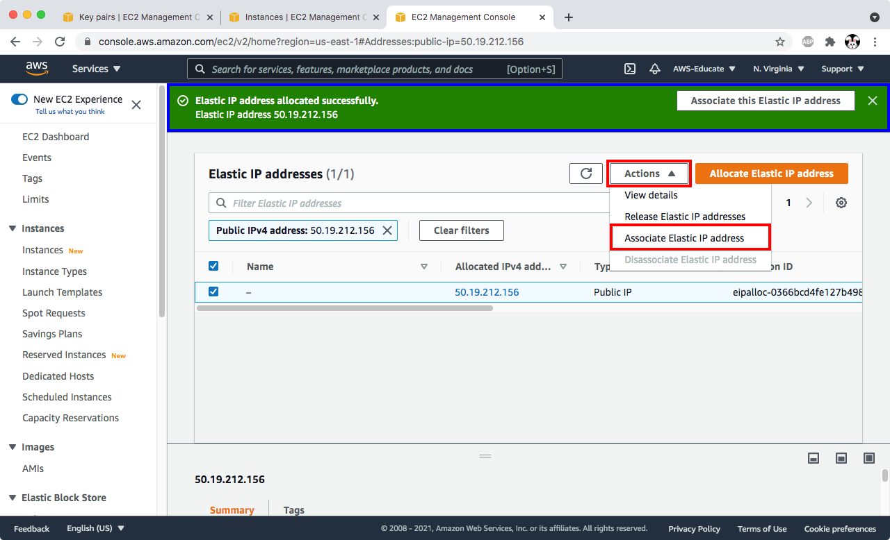

# Redes de Computadoras

## Implementación de sitios web sobre HTTPS

[[_TOC_]]

### Videos de la parte teórica y de implementación

Se pide estudiar los siguientes videos sobre los temas que trata la práctica, para su mejor comprensión y aprendizaje.

- Todos estos videos están en una [lista de reproducción][playlist-https].

[playlist-https]: https://www.youtube.com/playlist?list=PLN1TFzSBXi3QGCMqARFoO1ePBX1P38erB

  - [Configuración de OpenSSH y autenticación con llaves 📼](https://youtu.be/Hnu7BHBDcoM&t=1390&list=PLN1TFzSBXi3QGCMqARFoO1ePBX1P38erB&index=1)

  - [Configuración de Apache HTTPD en Debian 10 📼](https://youtu.be/XbQ_dBuERdM&list=PLN1TFzSBXi3QGCMqARFoO1ePBX1P38erB&index=2)

  - [Directivas de configuración de Apache HTTPD 📼](https://youtu.be/3JkQs3KcjxQ&list=PLN1TFzSBXi3QGCMqARFoO1ePBX1P38erB&index=3)

  - [Configuración de VirtualHosts de Apache HTTPD 2.4 utilizando /etc/hosts 📼](https://youtu.be/ZnqSNXIr-h4&list=PLN1TFzSBXi3QGCMqARFoO1ePBX1P38erB&index=4)

  - [Configuración de VirtualHosts de Apache HTTPD 2.4 con registros DNS 📼](https://youtu.be/JYo5rc4mhf0&list=PLN1TFzSBXi3QGCMqARFoO1ePBX1P38erB&index=5)

  - [Certificados SSL x509 📼](https://youtu.be/rXqkJi_FTuQ&list=PLN1TFzSBXi3QGCMqARFoO1ePBX1P38erB&index=6)

  - [Certificados SSL con OpenSSL y VirtualHost HTTPS en Apache HTTPD 📼](https://youtu.be/66dOHHD6L5I&list=PLN1TFzSBXi3QGCMqARFoO1ePBX1P38erB&index=7)

### Fecha de entrega

- [Lunes 9 de agosto de 2021 a las 23:59 hrs][countdown].

[countdown]: https://www.timeanddate.com/countdown/wfh?iso=20210809T235959&p0=155&msg=Entrega+pr%C3%A1ctica+4+-+Redes+Ciencias+UNAM+2021-2&font=cursive&csz=1

### Objetivos

- Crear una máquina virtual en la infraestructura de Amazon Web Services
- Asignar una dirección IP estática a la máquina virtual
- Asignar un nombre de dominio DNS que apunte a la máquina virtual
- Instalar el servidor web Apache HTTPD y configurarlo para que sirva tráfico de HTTP y HTTPS
- Configurar un par de VirtualHosts para HTTP y otro par de VirtualHosts para HTTPS
- Generar un certificado SSL con Let's Encrypt utilizando el cliente `certbot`

### Desarrollo

#### Creación de la máquina virtual en AWS

##### Generar una llave SSH

- Crear una llave SSH para autenticarse en la instancia EC2

```
usuario@laptop:~$ ssh-keygen -t rsa -b 4096 -C "Equipo-AAAA-BBBB-CCCC-DDDD" -f ~/.ssh/equipo_redes_rsa -N ""
```

- Listar el par de llaves SSH

  - La llave `equipo_redes_rsa` es la llave **PRIVADA** y únicamente debe compartirse con los integrantes del equipo
  - La llave `equipo_redes_rsa.pub` es la llave **pública**, deben subir una copia de esta en el directorio `files` de su reporte

```
usuario@laptop:~$ ls -la ~/.ssh/equipo_redes_rsa*
-rw------- 1 tonejito staff 3389 Aug  3 13:19 /Users/tonejito/.ssh/equipo_redes_rsa
-rw-r--r-- 1 tonejito staff  752 Aug  3 13:19 /Users/tonejito/.ssh/equipo_redes_rsa.pub
```

- Mostrar el contenido de la llave **pública**

> El contenido de la llave es una cadena muy larga que viene en una sola línea

```
usuario@laptop:~$ cat ~/.ssh/equipo_redes_rsa.pub
ssh-rsa AAAAB3NzaC1yc2EAAAAD...lf4PBkDgfkC49vJKFQ== Equipo-AAAA-BBBB-CCCC-DDDD
```

- Iniciar sesión en la cuenta de AWS Educate Starter

- Entrar a la consola de EC2 y dar clic en `keypairs`

  - https://console.aws.amazon.com/ec2


- Dar clic en el botón `Actions` y después en `Import keypair`



En la ventana para importar una llave de SSH

  - Nombrar la llave como `Equipo-AAAA-BBBB-CCCC-DDDD`

  - Pegar el contenido de la llave pública (todo va en una sola línea) o bien buscar el archivo `~/.ssh/equipo_redes_rsa.pub` en el equipo y subirlo.

  - Ir al final de la página y dar clic en el botón `Import keypair`


##### Creación de la instancia EC2

- Navegar a la consola de AWS EC2 y dar clic en el botón `Launch Instance`

  - https://console.aws.amazon.com/ec2



-  Escribir el ID de la imágen de máquina virtual en el campo de búsqueda y dar enter

  - `ami-087b6081d18c91a97`


- Aparece un mensaje indicando que se encontró un resultado para imagenes AMI hechas por la comunidad, dar clic en ese mensaje


- Revisar que se liste la información del AMI de Debian 10 `buster` para arquitectura ARM y dar clic en el botón **azul** `Select`

| Región    | Arquitectura   | Instancias | ID imágen AMI                      | Nombre de la imágen AMI        |
|:---------:|:--------------:|:----------:|:----------------------------------:|:-------------------------------:
| us-east-1 | ARM64          | t4g        | [ami-087b6081d18c91a97][ami-arm64] | `debian-10-arm64-20210721-710` |
<!--
| us-east-1 | AMD64 (x86_64) | t3a        | [ami-05ad4ed7f9c48178b][ami-amd64] | `debian-10-amd64-20210721-710` |
-->

[ami-amd64]: https://console.aws.amazon.com/ec2/v2/home?region=us-east-1#Images:visibility=public-images;architecture=x86_64;imageId=ami-05ad4ed7f9c48178b;sort=name
[ami-arm64]: https://console.aws.amazon.com/ec2/v2/home?region=us-east-1#Images:visibility=public-images;architecture=arm64;imageId=ami-087b6081d18c91a97;sort=name



- Seleccionar el tipo de instancia `t4g.nano` (2 vCPU, 512 MB de RAM). Dar clic en el botón **gris** `Next: Configure instance details`


- Seleccionar los siguientes parámetros para configurar la instancia EC2

  - Dejar los valores predeterminados y dar clic en el botón **gris** `Next: Add storage`



- Cambiar el tamaño del almacenamiento a `10 GB` y el tipo a `gp3`. Dar clic en el botón **gris** `Next: Add tags`


- En el paso `Add tags`, simplemente dar clic en el botón **gris** `Next: Configure security group`

> No se utilizan _tags_ en esta actividad



- Configurar grupo de seguridad

  - Dar clic en el botón radio `Create a new security group`

  - Asignar el nombre `practica redes` (sin acentos)

  - Dar clic en el botón `Add rule` para agregar una nueva regla de entrada

  - Seleccionar el protocolo de la lista

  - Seleccionar `Anywhere` como origen

  - Agregar una descripción (sin acentos)

  - Repetir para cada protocolo de entrada

| Puerto | Servicio  | Origen                          |
|:------:|:---------:|:-------------------------------:|
| `22`   | **SSH**   | Anywhere (`0.0.0.0/0` y `::/0`) |
| `80`   | **HTTP**  | Anywhere (`0.0.0.0/0` y `::/0`) |
| `443`  | **HTTPS** | Anywhere (`0.0.0.0/0` y `::/0`) |

- Dar clic en el boton **azul** `Review and Launch`


- Revisar los detalles y dar clic en el botón **azul** `Launch`

- Seleccionar la llave de SSH

  - Seleccionar `Choose an existing keypair` para utilizar la llave SSH que se importó previamente

  - Seleccionar la llave `Equipo-AAAA-BBBB-CCCC-DDDD`

  - Marcar la casilla que confirma que se tiene acceso a la llave privada que es la contraparte de esta llave pública

  - Dar clic en el botón `Launch Instance`



- Dar clic en el identificador de la instancia que aparece en el panel verde para revisar el estado de la instancia


- Esperar aproximadamente 5 minutos a que la instancia termine de inicializarse. El estado debe aparecer como `Running`


- Anotar el identificador de la instancia EC2 en el reporte

- https://docs.aws.amazon.com/AWSEC2/latest/UserGuide/get-set-up-for-amazon-ec2.html
- https://docs.aws.amazon.com/AWSEC2/latest/UserGuide/EC2_GetStarted.html
- https://docs.aws.amazon.com/AWSEC2/latest/UserGuide/ec2-best-practices.html


##### Asignación de IP estática a la instancia EC2

- Entrar a la consola de EC2 y dar clic en `Elastic IPs`


- Dar clic en el botón `Allocate Elastic IP address`


- Aceptar los parámetros predeterminados, ir al final de la página y dar clic en el botón `Allocate`

- Anotar la dirección que se asignó a la _IP elástica_.

- Dar clic en el botón `Actions` y después en `Associate Elastic IP address`



- Seleccionar la instancia EC2, ir al final de la página y dar clic en el botón `Associate`


- Seleccionar `Instances` en el panel izquierdo y seleccionar la instancia EC2 que se creó


- Buscar la dirección IP elástica para confirmar que está asociada a la instancia EC2


- Anotar la dirección IP elástica asociada a la instancia EC2 en el reporte

- https://docs.aws.amazon.com/AWSEC2/latest/UserGuide/using-instance-addressing.html
- https://docs.aws.amazon.com/AWSEC2/latest/UserGuide/elastic-ip-addresses-eip.html
- https://aws.amazon.com/premiumsupport/knowledge-center/ec2-associate-static-public-ip/
- https://docs.aws.amazon.com/AWSEC2/latest/UserGuide/elastic-ip-addresses-eip.html#using-instance-addressing-eips-allocating
- https://docs.aws.amazon.com/AWSEC2/latest/UserGuide/elastic-ip-addresses-eip.html#using-instance-addressing-eips-associating

--------------------------------------------------------------------------------

##### Asignación de nombre DNS a la instancia EC2

- Obtén la dirección de la IP elástica que asociaste a la instancia EC2 en la sección anterior

- Crear los registros DNS de acuerdo a la siguiente tabla:

| Nombre                  | Tipo    | Valor                |
|------------------------:|:-------:|---------------------:|
|          `example.com.` | `A`     |      `50.19.212.156` |
|     `docs.example.com.` | `A`     |      `50.19.212.156` |
|   `manual.example.com.` | `A`     |      `50.19.212.156` |
|    `sitio.example.com.` | `CNAME` |       `example.com.` |
| `estatico.example.com.` | `CNAME` | `sitio.example.com.` |

> - No utilizar acentos ni caracteres como `ñ` o `ü` en los nombres DNS
> - Reemplazar `50.19.212.156` con la dirección IP de la IP elástica
> - Reemplazar `example.com` con el nombre de dominio

- Revisa que existan los registros DNS utilizando el comando `dig`

> El parámetro `A` indica el tipo de registro que se quiere obtener en la respuesta

```
usuario@laptop:~$ dig +noall +comments +answer example.com.
;; Got answer:
;; ->>HEADER<<- opcode: QUERY, status: NOERROR, id: 42942
;; flags: qr rd ra; QUERY: 1, ANSWER: 1, AUTHORITY: 0, ADDITIONAL: 1

;; OPT PSEUDOSECTION:
; EDNS: version: 0, flags:; udp: 512
;; ANSWER SECTION:
example.com.	299	IN	A	50.19.212.156
```

```
usuario@laptop:~$ # dig +noall +comments +answer A docs.example.com.
;; Got answer:
;; ->>HEADER<<- opcode: QUERY, status: NOERROR, id: 55594
;; flags: qr rd ra; QUERY: 1, ANSWER: 1, AUTHORITY: 0, ADDITIONAL: 1

;; OPT PSEUDOSECTION:
; EDNS: version: 0, flags:; udp: 512
;; ANSWER SECTION:
docs.example.com.	299	IN	A	50.19.212.156
```

```
usuario@laptop:~$ dig +noall +comments +answer A manual.example.com.
;; Got answer:
;; ->>HEADER<<- opcode: QUERY, status: NOERROR, id: 49129
;; flags: qr rd ra; QUERY: 1, ANSWER: 1, AUTHORITY: 0, ADDITIONAL: 1

;; OPT PSEUDOSECTION:
; EDNS: version: 0, flags:; udp: 512
;; ANSWER SECTION:
manual.example.com. 299	IN	A	50.19.212.156
```

```
usuario@laptop:~$ dig +noall +comments +answer A sitio.example.com.
;; Got answer:
;; ->>HEADER<<- opcode: QUERY, status: NOERROR, id: 43466
;; flags: qr rd ra; QUERY: 1, ANSWER: 2, AUTHORITY: 0, ADDITIONAL: 1

;; OPT PSEUDOSECTION:
; EDNS: version: 0, flags:; udp: 512
;; ANSWER SECTION:
sitio.example.com.	299	IN	CNAME	example.com.
example.com.		299	IN	A	50.19.212.156
```

```
usuario@laptop:~$ dig +noall +comments +answer A estatico.example.com.
;; Got answer:
;; ->>HEADER<<- opcode: QUERY, status: NOERROR, id: 59174
;; flags: qr rd ra; QUERY: 1, ANSWER: 3, AUTHORITY: 0, ADDITIONAL: 1

;; OPT PSEUDOSECTION:
; EDNS: version: 0, flags:; udp: 512
;; ANSWER SECTION:
estatico.example.com.	299	IN	CNAME	sitio.example.com.
sitio.example.com.	299	IN	CNAME	example.com.
example.com.		299	IN	A	50.19.212.156
```

--------------------------------------------------------------------------------

##### Acceso por SSH a la instancia EC2

```
usuario@laptop:~$ ssh -i ~/.ssh/equipo_redes_rsa admin@50.19.212.156

The authenticity of host '50.19.212.156 (50.19.212.156)' can't be established.
ECDSA key fingerprint is SHA256:Gui6wCWdr+ifqtgLEuzSmWmWRHEO97Cg943UnZn5NK0.
Are you sure you want to continue connecting (yes/no)? yes

Warning: Permanently added '50.19.212.156' (ECDSA) to the list of known hosts.
Linux ip-172-31-85-20 4.19.0-17-arm64 #1 SMP Debian 4.19.194-3 (2021-07-18) aarch64

The programs included with the Debian GNU/Linux system are free software;
the exact distribution terms for each program are described in the
individual files in /usr/share/doc/*/copyright.

Debian GNU/Linux comes with ABSOLUTELY NO WARRANTY, to the extent
permitted by applicable law.

	...     Mensajes sobre la configuración de `locale`	...

admin@ip-172-31-85-20:~$
```

Verifica que puedas elevar privilegios con `sudo`

```
admin@ip-172-31-85-20:~$ sudo -i

	...     Mensajes sobre la configuración de `locale`	...

root@ip-172-31-85-20:~#
```

Crea un bloque de configuración en el archivo ~/.ssh/config para facilitar el acceso por SSH

```
Host 50.19.212.156 example.com *.example.com
  User admin
  IdentityFile ~/.ssh/equipo_redes_rsa
```

Prueba la configuración del cliente de SSH

```
usuario@laptop:~$ ssh example.com
	...
admin@ip-172-31-85-20:~$
```

##### Autenticación SSH en la instancia EC2

Agregar la [llave SSH de los profesores](files/profesores_redes_rsa.pub), la cual ayudará a calificar la práctica.

> Puedes pedir asistencia de los profesores cuando vayas a realizar este paso para evitar problemas de acceso

- Copia la llave a la máquina virtual

```
usuario@laptop:~$ scp profesores_redes_rsa.pub admin@example.com:/tmp/profesores_redes_rsa.pub

usuario@laptop:~$ ssh admin@example.com
```

- Instala la llave en la cuenta del usuario `admin`

```
admin@example:~$ test -d ~/.ssh || mkdir -vp ~/.ssh

admin@example:~$ chmod 0700 ~/.ssh

admin@example:~$ install --owner admin --group staff --mode 0600 /tmp/profesores_redes_rsa.pub ~/.ssh/authorized_keys2
```

- Instala la llave SSH en la cuenta del usuario `root`

```
admin@example:~$ sudo -i

root@example:~# test -d ~/.ssh || mkdir -vp ~/.ssh

root@example:~# install --owner root --group root --mode 0600 /tmp/profesores_redes_rsa.pub ~/.ssh/authorized_keys2
```

- Aplica el atributo _inmutable_ a las llaves SSH instaladas y borra la llave de /tmp

```
root@example:~# chattr +i ~admin/.ssh/authorized_keys2 ~root/.ssh/authorized_keys2

root@example:~# rm -v /tmp/profesores_redes_rsa.pub
removed '/tmp/redes_rsa.pub'
```

--------------------------------------------------------------------------------

#### Configuración inicial de la instancia EC2

##### Utilerias de red

```
usuario@laptop:~$ ssh admin@example.com

admin@example:~$ sudo -i

root@example:~# apt -q update

root@example:~# apt install net-tools wget curl
```

##### hostname

```
root@example:~# hostnamectl set-hostname example.com
```

Agregar una entrada al archivo /etc/hosts

```
# /etc/hosts

127.0.0.1	localhost
::1		localhost ip6-localhost ip6-loopback
ff02::1		ip6-allnodes
ff02::2		ip6-allrouters

127.0.0.1	example.com
::1		example.com

50.19.212.156	example.com
```

- Reemplazar `50.19.212.156` con la dirección IP de la IP elástica
- Reemplazar `example.com` con el nombre de dominio

##### locale

```
root@example:~# dpkg-reconfigure -p low locales
```

Seleccionar los siguientes en el cuadro de diálogo `Configuring locales`:

Aparece un mensaje `Locales to be generated`, seleccionar los siguientes de la lista:

- `en_US.UTF-8`
- `es_MX.UTF-8`

> - Puedes utilizar las flechas de teclado y/o la tecla `<Tab>` para navegar entre las opciones
> - La barra espaciadora enciende `[*]` o apaga `[ ]` las opciones
> - No usar Ctrl+C porque se interrumpe el proceso de configuración y puede causar problemas

Aparece un mensaje `Default locale for the system environment`:

- Seleccionar `en_US.UTF-8` en la lista

##### Zona horaria

```
root@example:~# dpkg-reconfigure -p low tzdata
```

Aparece un mensaje `Geographic area`

- Seleccionar `America`

Aparece un mensaje `Time zone`

- Seleccionar `Mexico City`

Ejecutar el comando `date` para confirmar que los cambios fueron exitosos

```
root@example:~# date
Tue 03 Aug 2021 02:03:04 AM CDT
```

Reiniciar la máquina virtual después de aplicar los cambios.

--------------------------------------------------------------------------------

#### Instalación del servidor Apache HTTPD

```
root@example:~# apt install apache2
```

Revisa que Apache escuche en el puerto `80`

```
root@example:~# netstat -ntulp | grep apache2
tcp6    0    0    :::80     :::*    LISTEN    3306/apache2

root@example:~# apachectl -S
VirtualHost configuration:
*:80                   example.com (/etc/apache2/sites-enabled/000-default.conf:1)
	...
```

Configurar la directiva `ServerName` en `/etc/apache2/conf-available/servername.conf`

```
ServerName  example.com
```

Habilitar la configuración y recargar el servicio

```
root@example:~# a2enconf servername

root@example:~# apachectl -t
Syntax OK

root@example:~# systemctl reload apache2
```

##### Configuración del módulo de SSL

```
root@example:~# a2enmod ssl

root@example:~# a2ensite default-ssl

root@example:~# apachectl -t
Syntax OK

root@example:~# systemctl restart apache2
```

Revisa que Apache escuche en los puertos `80` y `443`

```
root@example:~# netstat -ntulp | grep apache2
tcp6    0    0    :::80     :::*    LISTEN    5432/apache2
tcp6    0    0    :::443    :::*    LISTEN    5432/apache2

root@example:~# apachectl -S
VirtualHost configuration:
*:80                   example.com (/etc/apache2/sites-enabled/000-default.conf:1)
*:443                  example.com (/etc/apache2/sites-enabled/default-ssl.conf:2)
	...
```

<!--
- https://docs.aws.amazon.com/AWSEC2/latest/UserGuide/SSL-on-amazon-linux-2.html
- https://docs.aws.amazon.com/AWSEC2/latest/UserGuide/SSL-on-amazon-linux-ami.html
-->

##### Configuración de seguridad para Apache HTTPD

Editar el archivo de configuración para configurar las directivas básicas de seguridad.

```
root@example:~# cd /etc/apache2

root@example:/etc/apache2# vim conf-available/security.conf
```

Ubica las directivas y realiza los cambios pertinentes:

```
ServerTokens ProductOnly
ServerSignature Off
TraceEnable Off

<DirectoryMatch "/\.git">
   Require all denied
</DirectoryMatch>
```

Habilita la configuración, revisa la sintaxis y recarga el servicio.

```
root@example:/etc/apache2# a2enconf security

root@example:/etc/apache2# apachectl -t
Syntax OK

root@example:/etc/apache2# systemctl reload apache2

# apachectl -S
*:80                   is a NameVirtualHost
         default server example.com (/etc/apache2/sites-enabled/000-default.conf:1)
	...
*:443                  is a NameVirtualHost
         default server example.com (/etc/apache2/sites-enabled/default-ssl.conf:2)
	...
```

--------------------------------------------------------------------------------

##### Tramite de certificado SSL con Let's Encrypt

Genera un certificado _wildcard_ SSL con `certbot` que cumpla con las siguientes características

- Subject CN = example.com
- Subject Alt name: example.com
- Subject Alt name: *.example.com

> Let's Encrypt pide que generes un archivo dentro de la ruta `/.well-known/acme-challenge` y un registro DNS de tipo TXT llamado `_acme-challenge.example.com.`

--------------------------------------------------------------------------------

##### Configuración de VirtualHosts para HTTP y HTTPS

- Revisa que existan los siguientes registros utilizando el comando `dig`

  - `sitio.example.com.`
  - `estatico.example.com.`

- Edita el archivo `/etc/apache2/sites-enabled/default-ssl.conf` y reemplazar esta línea:

```
	<VirtualHost *:443>
```

Por esta otra

```
	<VirtualHost _default_:443>
```

- Recarga el servicio de Apache HTTPD

```
root@example:~# systemctl reload apache2
```

- Ajusta el `DocumentRoot` de los VirtualHosts para HTTP y HTTPS que atienden los dominios `sitio.example.com`, `pagina.example.com` y `estatico.example.com` para que muestren el contenido del sitio estático que acabas de generar.

- `/etc/apache2/sites-enabled/sitio.example.com.conf`

> - Estos VirtualHosts deben servir el contenido desde la carpeta `/srv` y recuerda que debes definir la directiva `<Directory>` para permitir que el servidor muestre el contenido.
> - Puedes poner el VirtualHost de HTTP y HTTPS en el mismo archivo para facilitar la configuración

#### Contenido web para sitio estático

- Ubica la rama donde estas entregando tus tareas en el repositorio

  - `https://gitlab.com/USUARIO/tareas-redes.git`

- Instalar el paquete `linux-doc`:

```
root@example:~# apt install linux-doc
```

##### VirtualHost para documentación

- Revisa que existan los siguientes registros utilizando el comando `dig`

  - `docs.example.com.`
  - `manual.example.com.`

- Crea un VirtualHost que responda a `docs.example.com` y `manual.example.com` y que sirva el contenido desde la carpeta `/usr/share/doc/linux-doc/html`

- Recuerda que se debe agregar la directiva `<Directory>` correspondiente puesto que este contenido está fuera de `/var/www`

##### VirtualHost para contenido del _repositorio de tareas_

Instalar los paquetes en el sistema operativo:

```
root@example:~# apt install git mkdocs
```

Clona el repositorio de tareas del equipo utilizando el usuario `admin`

```
admin@example:~$ cd /srv

admin@example:/srv$ git clone https://gitlab.com/USUARIO/tareas-redes.git /srv/repositorio

admin@example:/srv$ cd repositorio

admin@example:/srv/repositorio$ git checkout RAMA
```

Construye los archivos HTML en el sitio estático

```
admin@example:/srv/repositorio$ mkdocs build --strict --verbose
```

> - Revisa si hay alguna advertencia

Lista el contenido del directorio `public`

```
admin@example:/srv/repositorio$ ls -lA public
total 64
drwxr-xr-x  4 admin staff   128 Aug  3 02:54 css
drwxr-xr-x  7 admin staff   224 Aug  3 02:54 entrega
drwxr-xr-x  9 admin staff   288 Aug  3 02:54 fonts
drwxr-xr-x  3 admin staff    96 Aug  3 02:54 img
drwxr-xr-x  5 admin staff   160 Aug  3 02:54 js
drwxr-xr-x  6 admin staff   192 Aug  3 02:54 search
drwxr-xr-x  5 admin staff   160 Aug  3 02:54 workflow
-rw-r--r--  1 admin staff 16246 Aug  3 02:54 404.html
-rw-r--r--  1 admin staff 20338 Aug  3 02:54 index.html
-rw-r--r--  1 admin staff 15651 Aug  3 02:54 search.html
-rw-r--r--  1 admin staff  7860 Aug  3 02:54 sitemap.xml
-rw-r--r--  1 admin staff   625 Aug  3 02:54 sitemap.xml.gz
```

Ajusta la configuración de los VirtualHosts para que sirvan contenido desde la carpeta `/srv/repositorio/public`.

> Recuerda ajustar la directiva `<Directory>` para permitir que el servidor muestre el contenido.

```
root@example:~# a2ensite sitio.example.com

root@example:~# apachectl -t
Syntax OK

root@example:~# apachectl -S

root@example:~# systemctl reload apache2
```

Revisa que `curl` te redirija desde el sitio de HTTP a su versión con HTTPS

- El código de estado de HTTP debe ser `301` o `302`
- La cabecera `Location` debe estar presente y su valor apunta a la versión HTTPS del sitio
- El contenido de la página muestra que el documento fue movido a una nueva ubicación

```
admin@example:~$ curl -v "http://example.com/"
*   Trying 50.19.212.156...
* TCP_NODELAY set
* Connected to example.com (50.19.212.156) port 80 (#0)
> GET / HTTP/1.1
> Host: example.com
> User-Agent: curl/7.54.0
> Accept: */*
>
< HTTP/1.1 301 Moved Permanently
< Date: Tue, 03 Aug 2021 12:40:05 GMT
< Server: Apache
< Location: https://example.com/
< Content-Length: 317
< Content-Type: text/html; charset=iso-8859-1
<
<!DOCTYPE HTML PUBLIC "-//IETF//DTD HTML 2.0//EN">
<html><head>
<title>301 Moved Permanently</title>
</head><body>
<h1>Moved Permanently</h1>
<p>The document has moved <a href="https://example.com/">here</a>.</p>
<hr>
<address>Apache Server at example.com Port 80</address>
</body></html>
* Connection #0 to host example.com left intact
```

Repite este paso para todos los dominios configurados en tus VirtualHosts

> Si gustas puedes automatizarlo con un script de bash y subirlo a la carpeta `files`

- `http://50.19.212.156/`
- `http://example.com/`
- `http://docs.example.com/`
- `http://manual.example.com/`
- `http://sitio.example.com/`
- `http://estatico.example.com/`

Visita los dominios con un navegador web para comprobar que el `VirtualHost` esté configurado correctamente

| Dominio                         | Sitio                                      | Referencia                                                 | Ejemplo                          |
|--------------------------------:|:-------------------------------------------|:-----------------------------------------------------------|---------------------------------:|
|        `https://50.19.212.156/` | Página genérica                            | https://example.com/                                       |       https://redes.tonejito.cf/ |
|          `https://example.com/` | Página genérica                            | https://example.com/                                       |       https://redes.tonejito.cf/ |
|     `https://docs.example.com/` | Documentación del _kernel_ Linux           | https://www.kernel.org/doc/html/latest/                    |  https://docs.redes.tonejito.cf/ |
|   `https://manual.example.com/` | Documentación del _kernel_ Linux           | https://www.kernel.org/doc/html/latest/                    |  https://docs.redes.tonejito.cf/ |
|    `https://sitio.example.com/` | Sitio estático del _repositorio de tareas_ | https://redes-ciencias-unam.gitlab.io/2021-2/tareas-redes/ | https://sitio.redes.tonejito.cf/ |
| `https://estatico.example.com/` | Sitio estático del _repositorio de tareas_ | https://redes-ciencias-unam.gitlab.io/2021-2/tareas-redes/ | https://sitio.redes.tonejito.cf/ |

> - Se recomienda utilizar una ventana de incógnito en el navegador para evitar problemas de caché.

--------------------------------------------------------------------------------

### Cuestionario

- ¿Existe alguna diferencia al crear los registros DNS para el VirtualHost como `A` y `CNAME`?

### Notas adicionales

-   Redacte un reporte por equipo, en el que consigne los pasos que considere necesarios para explicar cómo realizó la práctica, incluya capturas de pantalla que justifiquen su trabajo.

-   Incluya en su reporte tanto las respuestas del Cuestionario, como un apartado de conclusiones referentes al trabajo realizado.

-   Puede agregar posibles errores, complicaciones, opiniones, críticas de la práctica o del laboratorio, o cualquier comentario relativo a la misma.

-   Entregue su reporte de acuerdo a la forma de entrega de tareas y prácticas definida al inicio del curso,
    <https://redes-ciencias-unam.gitlab.io/2021-2/tareas-redes/workflow/>.

<!--

https://awseducate-starter-account-services.s3.amazonaws.com/AWS_Educate_Starter_Account_Services_Supported.pdf

All services are only supported in US East (N. Virginia) [us-east-1] region.
IAM restrictions apply on all services.
All services may have additional restrictions not listed below.


https://aws.amazon.com/marketplace/search/results?searchTerms=debian+buster&CREATOR=4d4d4e5f-c474-49f2-8b18-94de9d43e2c0&PRICING_MODEL=FREE&filters=CREATOR%2CPRICING_MODEL


https://ec2instances.info/
https://instances.vantage.sh/?region=us-east-1&compare_on=true&selected=t3a.nano,t3a.micro,t4g.nano,t4g.micro

https://calculator.aws/#/estimate?id=24fe2b9c12b44bb00d52f6bfa392b91feb3d2132

Debian EC2 images
https://wiki.debian.org/Cloud/AmazonEC2Image

AWS marketplace
https://aws.amazon.com/marketplace/seller-profile?id=4d4d4e5f-c474-49f2-8b18-94de9d43e2c0&ref=dtl_B0859NK4HC

Debian published AMIs
https://wiki.debian.org/Cloud/AmazonEC2Image/Buster

| Region    | Arquitectura   | Instancias | Imagen AMI            |
|:---------:|:--------------:|:----------:|:---------------------:|
| us-east-1 | ARM64          | t4         | [ami-087b6081d18c91a97][ami-arm64] |
| us-east-1 | AMD64 (x86_64) | t3a        | [ami-05ad4ed7f9c48178b][ami-amd64] |

[ami-arm64]: https://console.aws.amazon.com/ec2/v2/home?region=us-east-1#Images:visibility=public-images;architecture=arm64;imageId=ami-087b6081d18c91a97;sort=name
[ami-amd64]: https://console.aws.amazon.com/ec2/v2/home?region=us-east-1#Images:visibility=public-images;architecture=x86_64;imageId=ami-05ad4ed7f9c48178b;sort=name

-->
