# Práctica 5

### Fecha de entrega: 25/Mar/19

## Especificaciones

+ Esta práctica puede ser realizada en equipos de a lo más 2 personas.
+ Documentar práctica en un archivo `README.md`.

### 1. Inyección de tramas

Utilizando la biblioteca `libpcap` [[1](http://www.microhowto.info/howto/send_an_arbitrary_ethernet_frame_using_libpcap.html)][[2](http://e-ghost.deusto.es/docs/2005/conferencias/pcap.pdf)] crear un inyector de tramas, es decir, una herramienta que envíe una trama a una dirección MAC específica. Se debe de poder indicar a través de argumentos la interfaz de red a través de la cuál se va a enviar la trama, la dirección MAC destino y la dirección MAC origen. El _payload_ puede ser generado aleatoriamente, o puede siempre ser el mismo. 

#### Ejemplo

Desde una máquina enviamos una trama a la dirección MAC `00:0c:29:a2:5a:77` desde `ba:aa:aa:aa:aa:ad`, a través de la interfaz `vmnet10`:

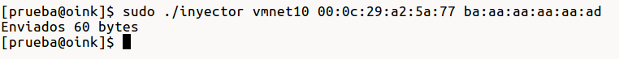 

En el equipo con la MAC `00:0c:29:a2:5a:77` capturamos el tráfico de red, pudiendo observar que se recibió la trama:

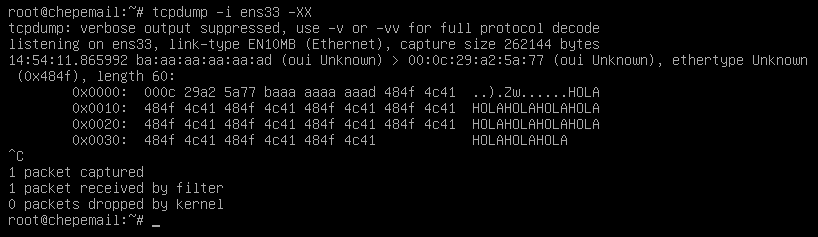 

Documentar ejercicio con ejemplo de ejecución.

### 2. DNS

Seguir los siguientes pasos y documentar procedimiento con capturas de pantalla: 

Registrar un subdominio de `.cf` gratis en la página [`www.freenom.com`](https://www.freenom.com/en/index.html)


Crear una cuenta en [`dns.he.net`](https://dns.he.net/), ir a sección `Add a new domain`

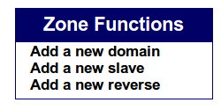

Agregar subdominio registrado anteriormente para crear una nueva zona DNS

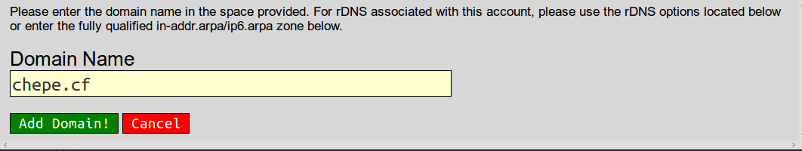

Al entrar a la página de administración de la zona se verá el siguiente mensaje de error, ya que la zona no ha sido delegada a los servidores DNS de `dns.he.net`:

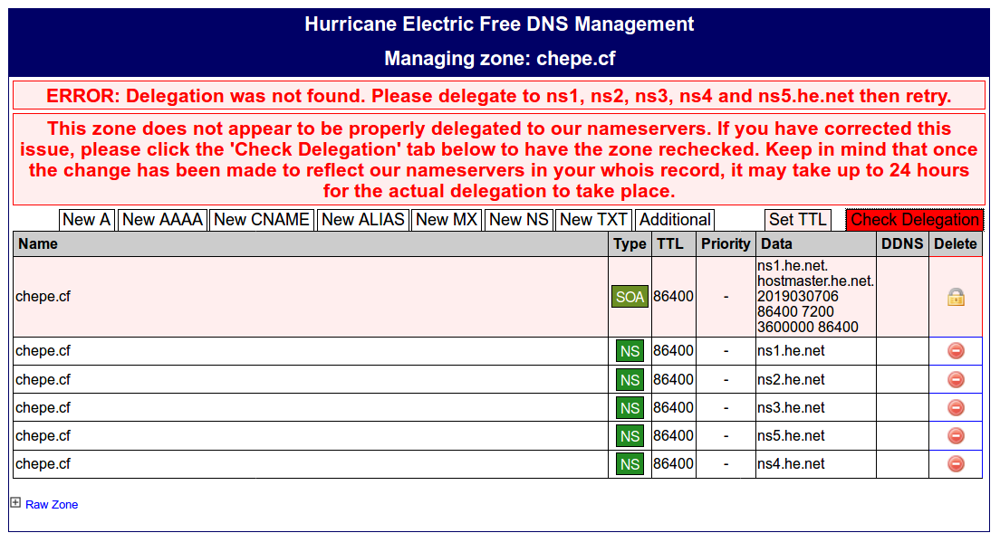

Ir entonces a la página de administración del subdominio registrado en `freenom.com`, ingresar a `Management Tools -> Nameservers`, seleccionar `Use custom nameservers` e ingresar los servidores DNS de `dns.he.net`:


Eventualmente se activará la zona creada (esto puede tardar hasta 2 días):

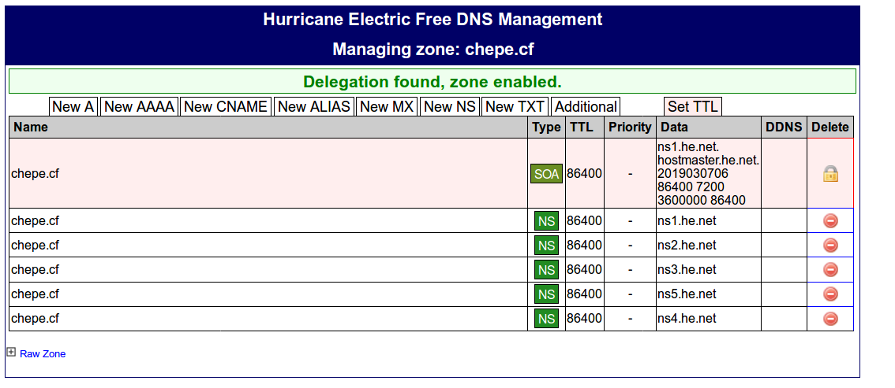

Agregar un nuevo registro de tipo A:

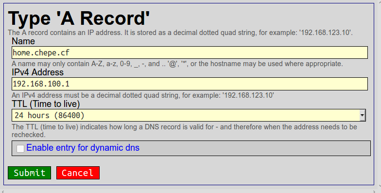

Comprobar con `nslookup` que se puede hacer la resolución de nombre de host a la dirección IP registrada:

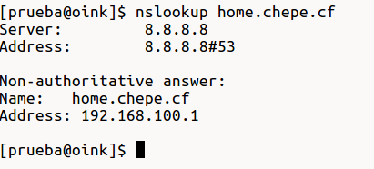

#### Contestar preguntas

+ ¿Qué es un servidor DNS?
+ ¿Para qué se utiliza cada uno de los registros SOA, NS, A, AAAA, PTR, CNAME, MX y TXT?
+ ¿Qué hacen las herramientas `nslookup` y `dig`?

### 3. Packet Tracer

Implementar la siguiente topología en Packet Tracer y documentar procedimiento seguido con capturas de pantalla. Incluir en entrega archivo generado por Packet Tracer.

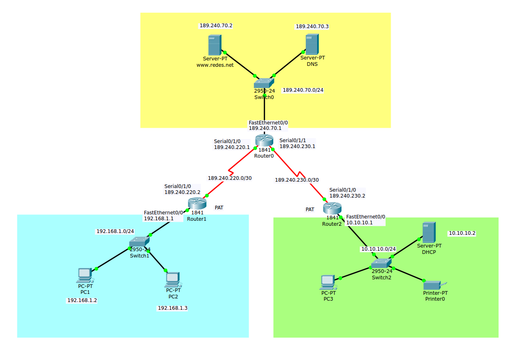

#### Creación de redes

**Red 192.168.1.0/24**

Conectar dos PCs a través de un switch

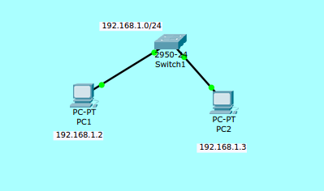

Asignar direcciones IP a PC1 y PC2 de manera estática, junto con un _gateway_ y un servidor DNS.

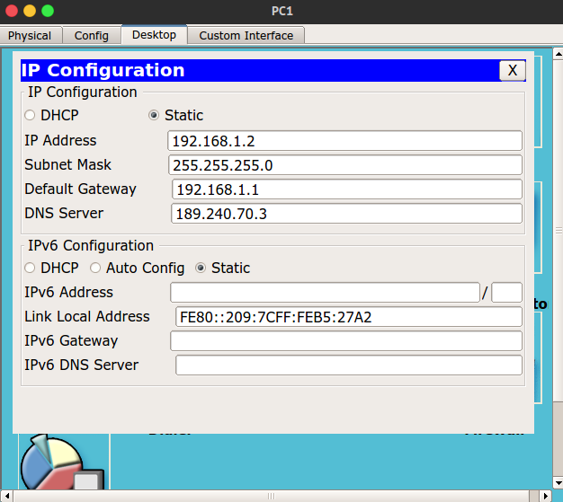

Verificar que ambas PCs puedan comunicarse

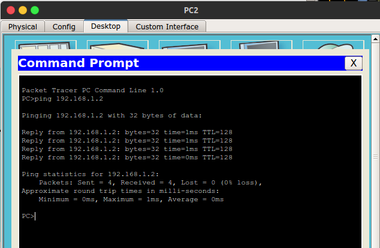

**Red 10.10.10.0/24**

Conectar una PC, una impresora y un servidor a un swicht

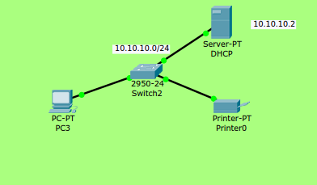

Asignarle una dirección IP estática al servidor

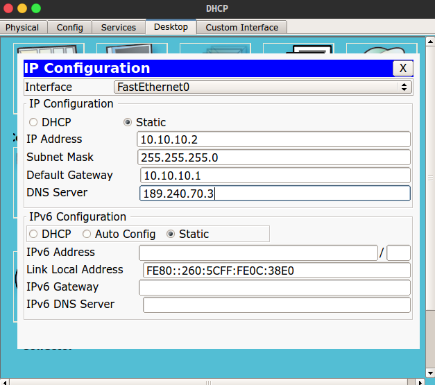

En la configuración del servidor, ir a la pestaña `Services`, desactivar HTTP y HTTPS

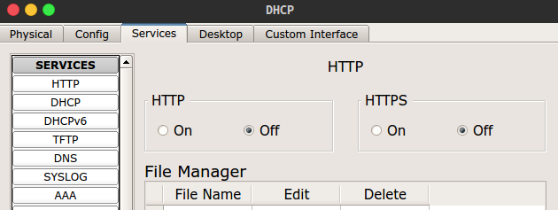

Seleccionar `DHCP`, habilitar servicio, asignar _gateway_, servidor DNS, dirección IP inicial y máscara, guardar configuración

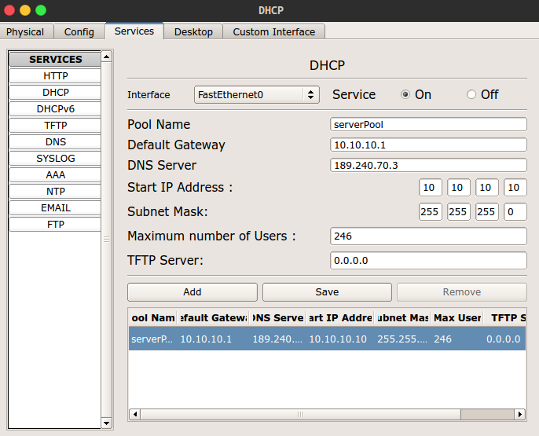

Indicar que se le asigne una dirección IP de manera dinámica a PC3 (a través de DHCP)

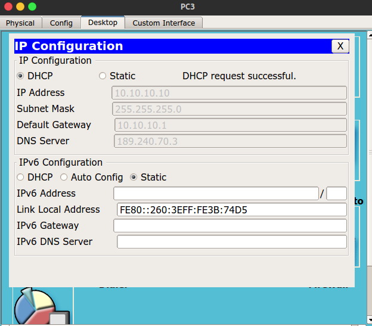

Hacer lo mismo con Printer0

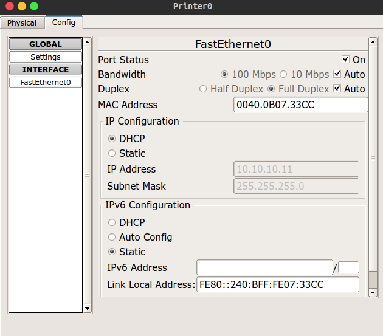

Verificar que PC3 puede comunicarse con Printer0

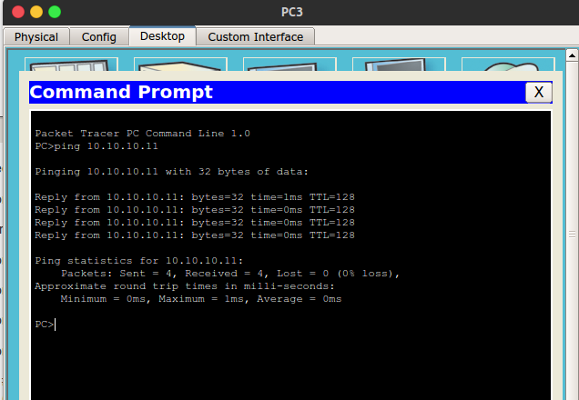

**Red 189.240.70.0/24**

Conectar dos servidores a un switch

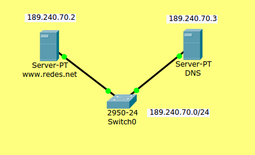

Asignar dirección IP a servidor web `www.redes.net`

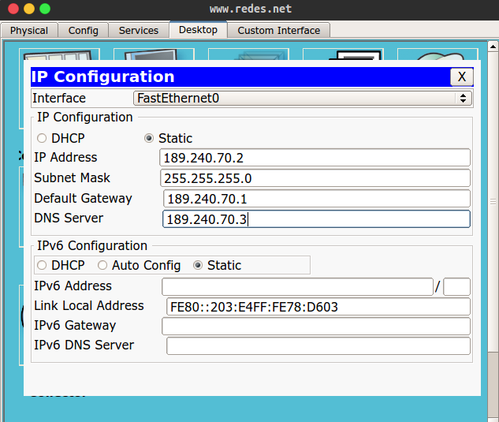

Asignar dirección IP a servidor `DNS`

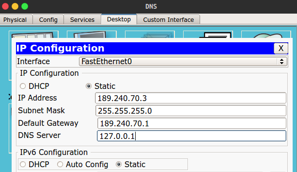

Verificar comunicación entre ambos servidores

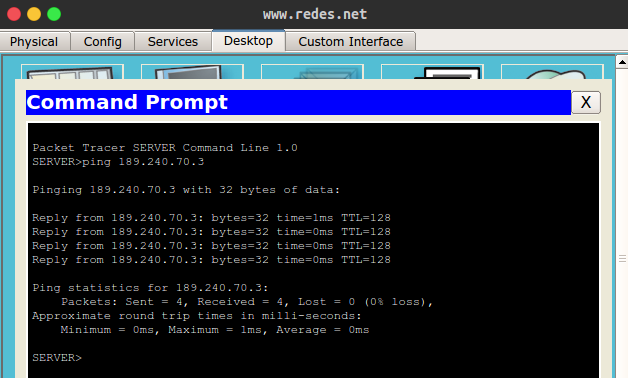

Habilitar servicio de HTTP y HTTPS en `www.redes.net`:

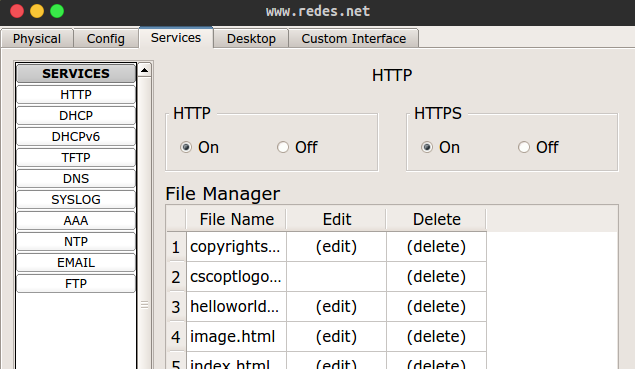

Habilitar servicio DNS en servidor DNS y crear registro de tipo A con los datos del servidor web:

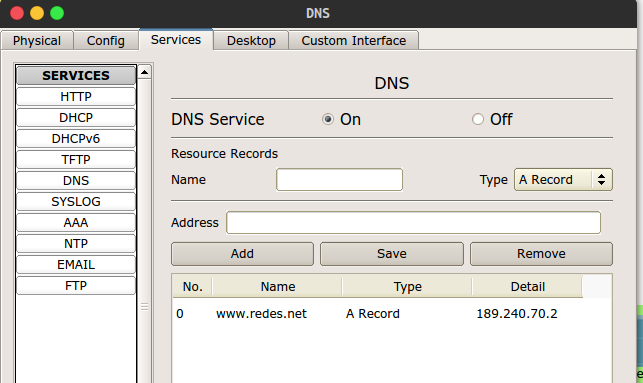

#### Conexión de redes

Conectar las redes `192.168.1.0/24` y `10.10.10.0/24` con la red `189.240.70.0/24` a través de _routers_. Crear tres routers y conectarlos a las redes de la siguiente manera:

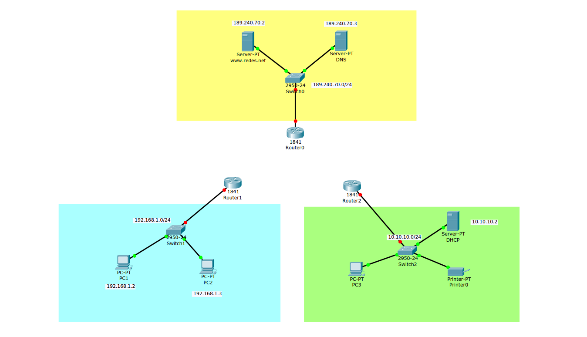

Configurar cada router siguiendo los siguientes pasos:

Apagar router haciendo click en el botón de encendido

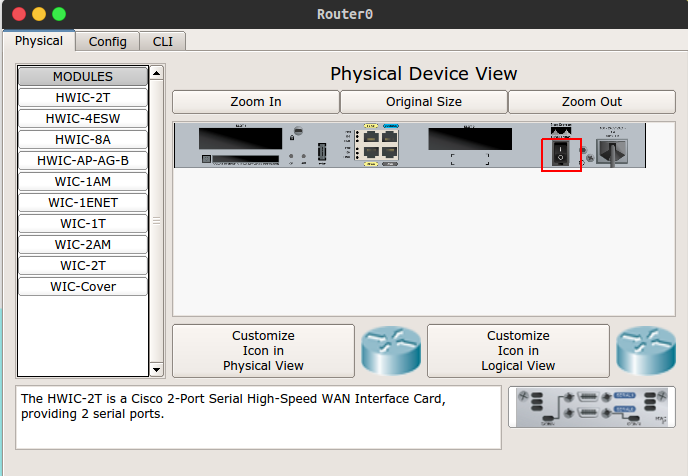

Agregar una tarjeta de red de tipo `HWIC-2T`, arrastrándola a uno de los espacios vaciós en el router, esta tarjeta especializada permire transmitir datos a través de una   `WAN` por medio de puertos seriales. Una vez realizado esto, volver a prender router.

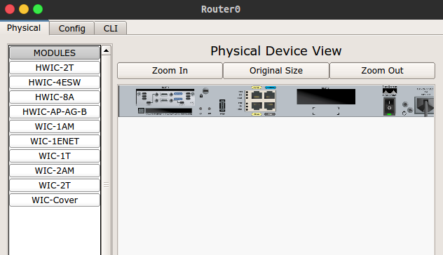

Ingresar a la pestaña `CLI` para ingresar a la línea de comandos, entrar a modo privilegiado:

```
Router>enable
Router#
```

Entrar a la configuración global

```
Router#configure terminal
```

Cambiar _hostname_ de router

```
Router(config)#hostname Router0
Router0(config)#
```

Asignar una contraseña para entrar a modo privilegiado

```
Router0(config)#enable secret <contraseña>
```

Cada vez que se quiera entrar a modo privilegiado con `enable` se pedirá esta contraseña. Para guardar configuración, salir de configuración global y copiar la configuración actual a la configuración de inicialización:

```
Router0(config)#exit
Router0#copy running-config startup-config 
```

Conectar los routers con cables de tipo `Serial DTE` por medio de los puertos seriales de la siguiente manera:

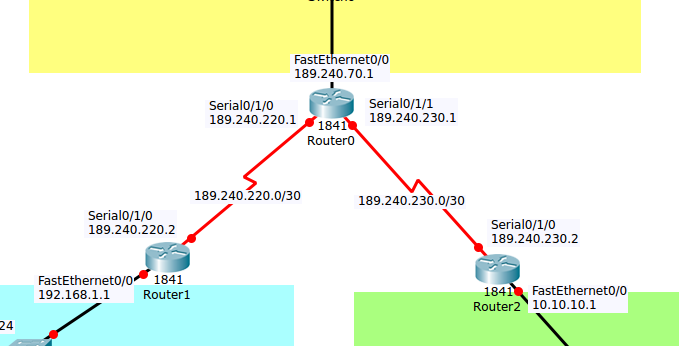

Asignar direcciones IP a interfaces de routers y prenderlas, esto puede hacerse por medio de interfaz gráfica o línea de comandos, se mostrará la configuración de Router0 por línea de comandos:

```
Router0>enable
Password: 
Router0#configure terminal
Enter configuration commands, one per line.  End with CNTL/Z.
Router0(config)#interface FastEthernet0/0
Router0(config-if)#ip address 189.240.70.1 255.255.255.0
Router0(config-if)#no shutdown

Router0(config-if)#
%LINK-5-CHANGED: Interface FastEthernet0/0, changed state to up

%LINEPROTO-5-UPDOWN: Line protocol on Interface FastEthernet0/0, changed state to up

Router0(config-if)#exit
Router0(config)#interface serial0/1/0
Router0(config-if)#ip address 189.240.220.1 255.255.255.252
Router0(config-if)#no shutdown

%LINK-5-CHANGED: Interface Serial0/1/1, changed state to down
Router0(config-if)#exit
Router0(config)#interface serial0/1/1
Router0(config-if)#ip address 189.240.230.1 255.255.255.252
Router0(config-if)#no shutdown
Router0(config-if)#exit
Router0(config)#exit
Router0#
%SYS-5-CONFIG_I: Configured from console by console

Router0#copy running-config startup-config
Destination filename [startup-config]? 
Building configuration...
[OK]
Router0#
```

Se utiliza el comando `interface <interfaz>` para acceder a la configuración de una interfaz, el comando `ip address <ip> <mascara>` para asignar una dirección IP a la interfaz y el comando `no shutdown` para prender la interfaz. 

Verificar configuración de router:

`Router0#show running-config`.

Crear rutas estáticas en Router1 y Router2 para comunicar las redes. Configurar Router1 de la siguiente manera:

```
Router1>enable
Password: 
Router1#configure terminal
Router1(config)#ip route 189.240.70.0 255.255.255.0 serial0/1/0
```
 
 El comando `ip route 189.240.70.0 255.255.255.0 serial0/1/0` indica que se envíe el tráfico dirigido a la red 189.240.70.0/24 por la interfaz serial0/1/0.
 
Repetir para Router2.

#### Configuración de NAT/PAT 

Configurar PAT en Router1:

```
Router1#configure terminal
Router1(config)#access-list 1 permit 192.168.1.0 0.0.0.255
Router1(config)#ip nat inside source list 1 int serial0/1/0 overload
Router1(config)#interface serial0/1/0
Router1(config-if)#ip nat outside
Router1(config-if)#exit
Router1(config)#interface fa0/0
Router1(config-if)#ip nat inside
Router1(config-if)#exit
Router1(config)#exit
Router1#copy running-config startup-config
```

El comando `access-list 1 permit 192.168.1.0 0.0.0.255` crear una lista de acceso con la cual se permite el tráfico de la red 192.168.1.0/24. 

`ip nat inside source list 1 int serial0/1/0 overload` indica que las direcciones IP del tráfico permitido por la lista de acceso creada (la que tiene el identificador 1) sean traducidas por medio de PAT a la dirección IP asignada a la interfaz serial0/1/0.

`ip nat outside` indica que la interfaz se conecta al tráfico externo de NAT.

`ip nat inside` indica que la interfaz se conecta al tráfico interno de NAT.

Repetir lo anterior para Router2, cambiando la red de la lista de acceso.

Verificar que desde el navegador web de PC1 se pueda acceder a `www.redes.net`:
 
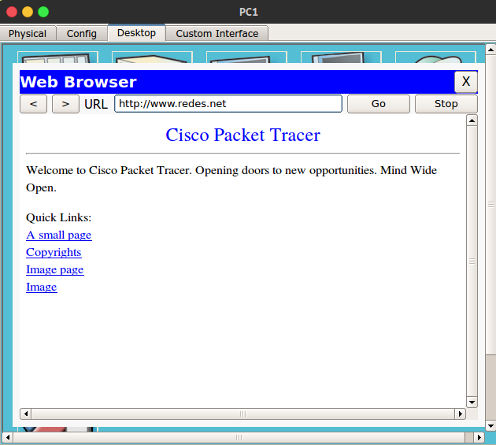

Verificar lo mismo para PC3:

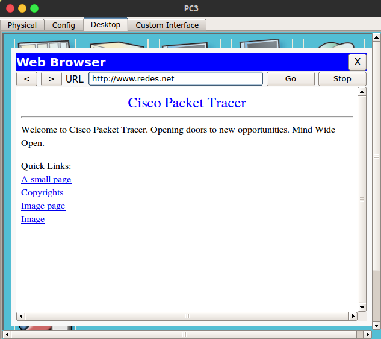

Para ver las estadísticas de NAT, usar el siguiente comando:

```
Router#show ip nat statistics 
Total translations: 1 (0 static, 1 dynamic, 1 extended)
Outside Interfaces: Serial0/1/0
Inside Interfaces: FastEthernet0/0
Hits: 8  Misses: 2
Expired translations: 1
Dynamic mappings:
```

También se puede observar la tabla de traducciones:

```
Router#show ip nat translations 
Pro  Inside global     Inside local       Outside local      Outside global
tcp 189.240.230.2:1025 10.10.10.10:1025   189.240.70.2:80    189.240.70.2:80
```

#### Contestar preguntas

+ ¿Qué diferencia hay entre un switch y un router?
+ ¿Qué tipos de switches hay?
+ ¿Qué es una lista de acceso y para qué se utilizan?
+ Se creó una lista de acceso con el comando `access-list 1 permit 192.168.1.0 0.0.0.255`, la última parte del comando (0.0.0.255) es una _wildcard_, ¿qué es una wildcard  y en qué se diferencia con una máscara de red?
+ ¿Qué diferencia hay entre una dirección IP pública y una privada?
+ ¿Qué diferencia hay entre NAT estática, NAT dinámica y PAT? ¿Cuál es la que se encuentra usualmente en los routers de los hogares?
