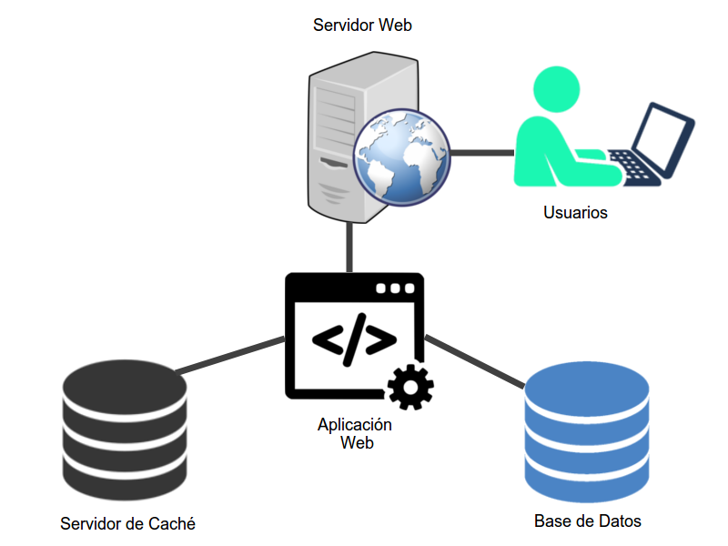

# Práctica 6: Web Stack

### Fecha de entrega: 29/Abr/19

## Especificaciones

+ Esta práctica puede realizarse en equipos de a lo más 3 integrantes.
+ Documentar práctica en un archivo `README.md` con capturas de pantalla de los pasos seguidos y de pruebas de funcionalidad efectuadas. 
+ Adjuntar los principales archivos de configuración de los servicios, así como capturas de tráfico de las pruebas realizadas.

### Objetivo

Implementación de un *Web Stack* con cuatro componentes: Base de Datos, Servidor Web, Aplicación Web y Servidor de Caché.
 
Para esta práctica se debe de implementar el Web Stack de manera local en una sóla máquina, ésta puede tener como sistema operativo un Debían 9, Ubuntu 18.04 LTS o CentOS 7, las versiones de servidor web, PHP, caché y base de datos deben ser las que traigan por defecto en los repositorios. Se deberá escoger una tecnología a instalar para cada uno de los componentes:

#### Aplicación Web

Una aplicación web, la cual debe consistir en un [CMS](https://es.wikipedia.org/wiki/Sistema_de_gesti%C3%B3n_de_contenidos).

**Tecnologías**:
 
+ Drupal
+ Wordpress
+ MediaWiki

#### Servidor Web

El servidor web le permitirá a los usuarios acceder al contenido de la aplicación web.

**Tecnologías**:

+ Apache2
+ nginx
 
#### Base de Datos 

Base de datos que almacene el contenido de la aplicación web. 

**Tecnologías**:

+ MySQL o MariaDB (si se utiliza Wordpress como aplicación web, se recomienda utilizar a MySQL para la base de datos)
+ PostgreSQL

#### Servidor de Caché

Éste almacenará contenido de la aplicación web, para permitir que se le pueda enviar respuestas de manera más rápida a los usuarios.

**Tecnologías**:

+ Memcached
+ Redis

### Diagrama

Se deberá a demás implementar reglas de `iptables` para bloquear todos los puertos del servidor que no sean necesarios para el funcionamiento de los servicios.

### Recomendaciones

Para CentOS es recomendable habilitar el repositorio de `EPEL`

+ [https://fedoraproject.org/wiki/EPEL](https://fedoraproject.org/wiki/EPEL)

### Puntos extra
 
+ Permitir que los usuarios accedan al contenido de la aplicación web únicamente a través de  [`HTTPS`](https://support.google.com/webmasters/answer/6073543?hl=es).
+ Instalar sitios de administración para los servicios (phpMyAdmin, phpPgAdmin, phpMemcachedAdmin, phpRedisAdmin).
+ Instalar `php` desde otro repositorio:
    - `Sury` para Debian y Ubuntu
        - [deb.sury.org](deb.sury.org)
    - `Remi` o `IUS` para CentOS
        - [rpms.remirepo.net](rpms.remirepo.net)
        - [ius.io](ius.io)
+ Instalar `MySQL` o `MariaDB` desde el repositorio oficial:
    - [https://dev.mysql.com/downloads/repo/apt/](https://dev.mysql.com/downloads/repo/apt/)
    - [https://dev.mysql.com/downloads/repo/yum/](https://dev.mysql.com/downloads/repo/yum/)
    - [https://downloads.mariadb.org/mariadb/repositories/](https://downloads.mariadb.org/mariadb/repositories/)
+ Instalar `PostgreSQL` desde el repositorio oficial:
    - [https://wiki.postgresql.org/wiki/Apt](https://wiki.postgresql.org/wiki/Apt)
    - [https://www.postgresql.org/download/linux/redhat/](https://www.postgresql.org/download/linux/redhat/)

### Referencias

+ [https://redis.io/](https://redis.io/)
+ [https://www.drupal.org/docs/8/system-requirements](https://www.drupal.org/docs/8/system-requirements)
+ [https://www.drupal.org/docs/8/system-requirements/database-server](https://www.drupal.org/docs/8/system-requirements/database-server)
+ [https://www.drupal.org/docs/8/system-requirements/web-server](https://www.drupal.org/docs/8/system-requirements/web-server)
+ [https://www.drupal.org/docs/8/system-requirements/php-requirements](https://www.drupal.org/docs/8/system-requirements/php-requirements)
+ [https://www.drupal.org/project/redis](https://www.drupal.org/project/redis)
+ [https://codex.wordpress.org/Installing_WordPress](https://codex.wordpress.org/Installing_WordPress)
