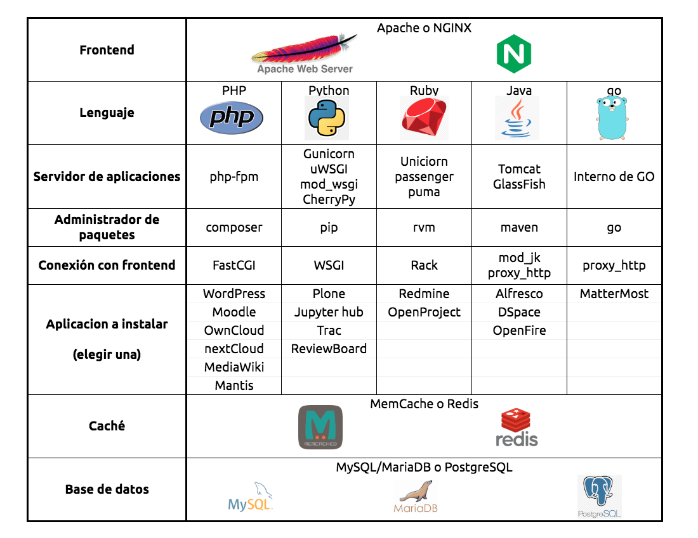
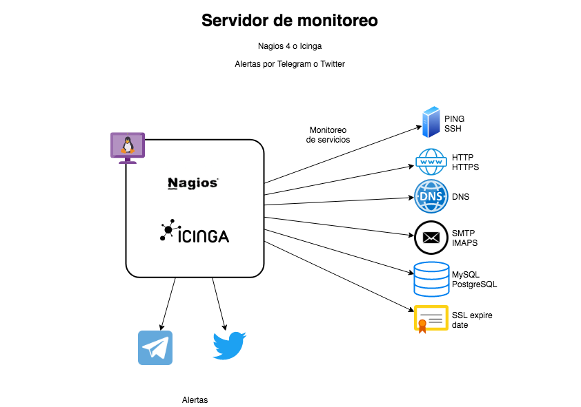

# Redes de Computadoras
# Proyecto final

Este trabajo corresponde al último proyecto que deben entregar para realizar la evaluación del curso de Redes de Computadoras

Cada equipo tendrá que configurar uno de los servicios de red que se describen a continuación

**Tabla de contenido**

  
Expandir / Colapsar

[[_TOC_]]

## Fecha de entrega

- [Miércoles 18 de agosto de 2021 a las 23:59 hrs][countdown]

[countdown]: https://www.timeanddate.com/countdown/wfh?iso=20210818T235959&p0=155&msg=Entrega+proyecto+final+-+Redes+2021-2&ud=1&font=hand&csz=1

--------------------------------------------------------------------------------

## Implementación de un _stack_ web

- Habilitar el soporte de `userdir` donde cada usuario tenga en su directorio home una carpeta llamada `public_html` o `public_tomcat` que sirva para que el usuario suba sus archivos y que estén disponibles en `/~usuario` en el servidor

    - Ej. `/home/andres/public_html` ⇨ `https://example.com/~andres`

- Instalar y configurar una aplicación web simple que se conecte al motor de caché y a la base de datos

  - Elegir una aplicación de la tabla

  - Montar la aplicación elegida en el directorio `/opt`

  - Crear un VirtualHost para que la aplicación responda en los dominios `proyecto.example.com` y `aplicacion.example.com` sobre HTTP y HTTPS

  - No utilizar los VirtualHosts predeterminados para HTTP ni HTTPS

- El sitio debe tener un certificado **wildcard** SSL emitido por Let's Encrypt y se debe utilizar el mismo nombre de dominio que en la [práctica 4][practica-4]

[practica-4]: /public/laboratorio/practica4

- El sitio debe hacer redirección de todas las peticiones HTTP hacía su versión en HTTPS

    - Se pueden usar redirecciones estándar 301 y 302 de HTTP

|                                       |
|:-------------------------------------:|
|  |

--------------------------------------------------------------------------------

## Servidor de monitoreo

- Instalar un servidor de monitoreo mediante el software Nagios o Icinga

  - Crear un VirtualHost para que la aplicación responda en los dominios `proyecto.example.com` y `aplicacion.example.com` sobre HTTP y HTTPS

  - No utilizar los VirtualHosts predeterminados para HTTP ni HTTPS

- Se debe configurar el servidor para llevar a cabo el monitoreo de estado de los siguientes servicios de red:

    - DNS
    - HTTP y HTTPS
    - IMAP
    - SMTP
    - MemCache
    - Redis
    - MySQL
    - PostgreSQL
    - Validez del certificado SSL
    - Expiración del dominio

- Generar alertas en caso de falla y avisos de recuperación de los servicios utilizando scripts guardados en el directorio `/usr/local/bin`

    - Telegram
    - Twitter

- Los elementos que se deberán implementar en este servicio se muestran en el diagrama:

|                                                   |
|:-------------------------------------------------:|
|  |

--------------------------------------------------------------------------------

## Entregables

### General

[carpeta-drive]: https://drive.google.com/drive/folders/1D2tlDRzfSISp39eJKZiosRcnwp-7djMD

- Crear una imágen AMI de la instancia EC2 y compartirla con los profesores

- Ver el siguiente video y emitir un comentario sobre la relación del contenido presentado y los conceptos utilizados en este proyecto

    - [Seguridad en AWS - AWS Public Sector Summit Mexico City 2020 📼](https://youtu.be/d3jnbtaLb24&list=PL2yQDdvlhXf_h40vMoMoh2SBa05geKLDq&index=10&)

- Subir a la [carpeta compartida de Google Drive][carpeta-drive] los siguientes archivos de respaldo que sustentan el trabajo elaborado en el desarrollo del proyecto:

    - Par de llaves SSH con las que se accedió al servidor en un archivo `TAR` (archivos `equipo_redes_rsa` y `equipo_redes_rsa.pub`)

    - Lista de usuarios y contraseñas para acceder a la aplicación web, base de datos y demás, en un archivo de texto llamado `accesos.txt`

    - Certificado y llave privada utilizados en el sitio web

    - Respaldo de configuraciones del servidor en un archivo `TAR` (directorio `/etc`)

    - Respaldo de bitácoras del sistema en un archivo `TAR` (directorio `/var/log`)

### Para los proyectos del _stack_ web

- Subir adicionalmente a la carpeta compartida:

    - Respaldo de la aplicación web en un archivo `TAR` (directorio `/opt`)

    - Respaldo de la base de datos utilizada en formato SQL

        - Puede ser comprimido con gzip, bzip2 o 7zip

### Para el proyecto de monitoreo

- Subir adicionalmente a la carpeta compartida:

    - Respaldo de los archivos de trabajo del sistema de monitoreo en un archivo `TAR`

        - Nagios: directorio `/var/lib/nagios3`

        - Icinga: directorio `/var/lib/icinga2`

    - Respaldo de los _scripts_ utilizados para enviar las alertas por Telegram y Twitter (directorio `/usr/local/bin`)

--------------------------------------------------------------------------------

## Extra

### General

- Implementar **HSTS** en las cabeceras del sitio para forzar a que se pida el contenido del sitio a través de HTTPS

    - Establecer un timeout bajo de entre `60` y `300` segundos

- Implementar la cabecera `X-Robots-Tag` para evitar que los motores de búsqueda indexen el sitio

#### Para los proyectos del _stack_ web

- Proteger la _sección administrativa_ del sitio utilizando autenticación de tipo `digest`

- Automatizar el respaldo de la base de datos en "esquema" y "contenido"

    - Script y configuración de la tarea programada para respaldar la base de datos **diario a media noche**

    - Subir un archivo con el "esquema" de la base de datos (definición de tablas)

    - Subir otro archivo con los datos de todas las tablas

#### Para el proyecto de monitoreo

- Proteger todo el acceso al sitio utilizando autenticación de tipo `digest`, el sistema de monitoreo instala una autenticación de tipo `basic` de manera predeterminada

- Automatizar el respaldo de las bitácoras del servidor y los archivos de trabajo de Nagios o Icinga

    - Script y configuración de la tarea programada para respaldar la base de datos **diario a media noche**

    - Creación de archivo `TAR` con las bitácoras del servidor

    - Creación de archivo `TAR` con los archivos de trabajo de Nagios o Icinga

--------------------------------------------------------------------------------

## Notas adicionales

- No se aceptan instalaciones que provengan de _scripts_ que automaticen el proceso, ni de soluciones todo en uno (_one click install_)

- Redacte un reporte por equipo, en el que consigne los pasos que considere necesarios para explicar cómo realizó el proyecto, incluya capturas de pantalla que justifiquen su trabajo

- Incluya en su reporte un apartado de conclusiones referentes al trabajo realizado

- Puede agregar posibles errores, complicaciones, opiniones, críticas de el proyecto, o cualquier comentario relacionado

- Entregue su reporte de acuerdo a la forma de entrega de tareas y prácticas definida al inicio del curso
    <https://redes-ciencias-unam.gitlab.io/2021-2/tareas-redes/workflow/>
